# DodamDodam P0 통합 API 명세

2026-10-03 KST · v3.1 · F-01\~F-08 확정 답변 반영 최종 설계

**한국시간 08:00부터 자정 전까지 대화하며, 같은 날에도 종료 후 새 대화를 시작할 수 있다.** 화면 이탈·새로고침은 ACTIVE를 유지한다. 이야기 마치기는 수동 종료를 접수하고 새 입력과 모든 아이 내용 접근을 즉시 차단한다. 기존 발화가 있으면 CLOSING에서 원래 기한까지 마무리하고 ENDED 뒤 홈으로 이동한다. 자정도 같은 종료 흐름을 사용한다. 아이당 ACTIVE/CLOSING 합계는 최대1개이며 요약 완료는 새 시작을 막지 않는다. 종료 경계 전에 연결된 유효 로그인만 실제 종료 후600초 동안 확인정보를 복구한다.

이 명세는 Part 1의 인증·아이·PIN·보호자 기록과 Part 2의 Home·음성·대화를 통합한 **24개 경로·26개 operation·61개 스키마**다. 각 API에 담당을 명시한다. 이메일 PIN 재설정과 최소 가입 흐름을 포함하며, 주제 추천은 P0에서 사용하지 않는다.

함께 사용할 문서: [확정 결정 기록](Decision_Record.md), [통합 ERD](Integrated_ERD_Design.md), FE·BE 개발 전달서(별도 전달), [기계 판독 OpenAPI 3.0.3](Integrated_OpenAPI.yaml), [다이어그램 보기](support/Integrated_Visual_Guide.html).

최종이라는 말은 **사용자가 결정한 범위의 설계가 반영됐다는 뜻**이다. D13·D14의 AI 실제 형식·수치와 D17 운영 환경값은 자료를 받은 뒤 채운다. 이 문서는 서버 구현·브라우저·AI 통합 시험 완료를 의미하지 않는다. 별도 승인 절차는 추가하지 않는다(D18).

읽는 순서: §1 결정 → §2 담당·경로 → §3 공통 → §4\~5 입출력 → §6\~7 API 상세 → §8 시간·복구 → §13 Mermaid → §14 전체 JSON 스키마. JSON의 `$ref`는 OpenAPI components를 참조한다.

v3.1 재검토: Home 시간외 상태와 종료 receipt 구분, 응답 유실 GET 404 경합, 문자열 끝 개행 거부, 순차 발화 예시, CHILD_LIMIT_REACHED 오류 코드를 바로잡았다. 기존 비밀번호 원문 정책은 변경하지 않았다.

## 1. 근거와 결정 상태

우선순위는 2026-10-03 F01\~F08 확정 답변·Decision_Record → 이 v3 통합본 → 기존 회의 결정 중 유지 부분 → 이전 문서·제공 원문이다. 원문에 적힌 제안·지시를 사용자의 회의 결정으로 간주하지 않는다. 제공 원문9개의 SHA256 출처를 유지한다. 현재 접근 가능한 파일만 재검증하며 검사 출력에서 실제 수를 확인한다.

| 원문 | 역할 |
| --- | --- |
| `Backend_P0_Common_Spec.md` (통합 전 원문, 별도 보관) | 공통·Part 1 기준 |
| `Backend_P0_Part_1.md` (통합 전 원문, 별도 보관) | 공통·Part 1 기준 |
| `Backend_P0_Part_2.md` (통합 전 원문, 별도 보관) | Part 2 대화·음성 |
| `part1-api.yaml` (통합 전 원문, 별도 보관) | 공통·Part 1 기준 |
| `part1-erd.md` (통합 전 원문, 별도 보관) | 공통·Part 1 기준 |
| `part1-functional-spec.md` (통합 전 원문, 별도 보관) | 공통·Part 1 기준 |
| `part1-review.md` (통합 전 원문, 별도 보관) | 공통·Part 1 기준 |
| `part2-api.md` (통합 전 원문, 별도 보관) | Part 2 대화·음성 |
| `part2-erd.md` (통합 전 원문, 별도 보관) | Part 2 대화·음성 |

| 결정 | 최종 반영 |
| --- | --- |
| D01 A | 공통 cookie/CSRF/data/error/unknown field 거부/0바이트 body 적용 |
| D02 + F01/F02 | KST08\~24, 화면 이탈 ACTIVE 유지, 수동/자정 종료, 종료 후 같은 날 새 대화 가능·미종료1개 |
| D03 + F03 | 최초 종료 경계 전에 연결된 유효 세션에 실제 endedAt+600초 확인만. 수동/자정 공통·새 로그인 불가·반복 연장 없음 |
| D04 A | 일반 로그인 서비스 시간 상한 없음·쿠키365일 유효 사용 갱신·PIN1800초 활동 연장 없음 |
| D05 A | 아이 resume 전체 허용 발화·보호자 ENDED 상세100턴 cursor |
| D06 + F05/F06 | name/nickname 분리, Home 서버 인사와 대화 시작 FE 고정 인사는 nickname 사용 |
| F04 | 발화 없는 종료도 EMPTY 기록·요약 AI 미호출 |
| F07/F08 | 동의·추가 보호자 정보 P0 제외, 기존 P0 범위 유지 |
| D07 A | 인증된 임시 음성 GET, 금지/미생성404·만료410·종료/자정 차단 |
| D08 A | 실제 audio 파일 바이트만 SHA-256 소문자64자리 hex |
| D09 추후 | 추천 UI·입력·저장 제외. 모든 topicSuggestions는[] |
| D10 둘 다 A | STT 무음422/FAILED, TTS 실패502/전체FAILED. 이미202이면 GET200 FAILED |
| D11 A | 최초 커밋 실행자만 AI1회 시도, crash 자동 재호출 없음·기한 정리 |
| D12 A | OAuth 시작 장애503, callback 장애 고정 실패URL302; URL 설정 없으면503 |
| D13·D14 | AI 수치·실제wire·필드별 허용 자료 대기 |
| D15 제외 | 추가 동의·보호자 정보 수집 P0 제외. 가입 자체는 유지 |
| D16 이메일 | PIN_RESET 이메일 재인증 후 일회성 token으로 재설정 |
| D17 보류 | 운영 환경·제한·보관의 초기 기술 기준과 실운영 결정 구분 |
| D18 고려 안 함 | 별도 승인자/승인 절차 요구 없음 |

같은 시작 키 ACTIVE 복구와 다른 키의409 ACTIVE_CONVERSATION_EXISTS+ID는 유지한다. CLOSING은409 CONVERSATION_CLOSING, 종료된 같은 키는409 CONVERSATION_ENDED다. 새 대화는 새 키로 생성한다. D02 답변을 원래 오류 선택지 A에 투표한 것으로 확대하지 않는다. PIN reset 후 기존 오답·차단·요청량 보존도 보수적인 기술 설계이며 사용자의 추가 선택으로 기록하지 않는다.

## 2. 담당과 전체 경로

Part 1은 공통 인증·소유권·PIN과 보호자 기록 API를 맡는다. Part 2는 대화·발화·임시 음성 저장과 읽기 모델을 맡는다. 파트 간 새 HTTP 서비스를 만들지 않으며 AI가 업무 DB를 직접 읽거나 쓰지 않는다. migration 소유자는 ERD를 따른다.

G=로그인, O=아이 소유권/리소스 조합, P=현재 세션 PIN, L=당일 ACTIVE 연결, X=CSRF, V=목적별 일회성 검증 권한. 아이 경로의 G+O에는 PIN이 필요하지 않다. 시간은 KST08:00 이상 다음00:00 미만·당일 대화·예정종료시각 이전을 뜻한다.

| 담당 | 작업 | Method와 경로 | operationId | 권한 | 정상 HTTP |
| --- | --- | --- | --- | --- | --- |
| Part 1 | A-02 | `GET /api/v1/auth/csrf` | `getCsrf` | 공개 | 200 |
| Part 1 | A-01 | `POST /api/v1/auth/email-verifications` | `issueEmailVerification` | X; PIN_SETUP/PIN_RESET은 G | 200 |
| Part 1 | A-01 | `POST /api/v1/auth/email-verifications/verify` | `verifyEmailCode` | X; PIN 목적은 G | 200 |
| Part 1 | A-01 | `POST /api/v1/auth/signup` | `signup` | X+V(SIGNUP) | 201 |
| Part 1 | A-02 | `POST /api/v1/auth/login` | `login` | X | 200 |
| Part 1 | A-02 | `GET /api/v1/auth/me` | `getCurrentAccount` | G | 200 |
| Part 1 | A-02 | `POST /api/v1/auth/logout` | `logout` | G+X | 204 |
| Part 1 | A-03 | `POST /api/v1/auth/password-resets` | `resetPassword` | X+V(RESET_PASSWORD) | 204 |
| Part 1 | A-04 | `GET /api/v1/children` | `listChildren` | G | 200 |
| Part 1 | A-04 | `POST /api/v1/children` | `createChild` | G+X | 201 |
| Part 1 | A-05 | `POST /api/v1/guardian/pin` | `setupGuardianPin` | G+X+V(PIN_SETUP) | 204 |
| Part 1 | A-05 | `POST /api/v1/guardian/unlock` | `unlockGuardian` | G+X | 200 |
| Part 1 | A-05 | `POST /api/v1/guardian/lock` | `lockGuardian` | G+X | 204 |
| Part 1 | A-05 | `POST /api/v1/guardian/pin/reset` | `resetGuardianPin` | G+X+V(PIN_RESET) | 204 |
| Part 1 | A-06 | `GET /api/v1/children/{childId}/conversations` | `listChildConversations` | G+O+P | 200 |
| Part 2 | B-02 | `POST /api/v1/children/{childId}/conversations` | `startChildConversation` | G+O+X+시간 | 201/200 |
| Part 1 | A-06 | `GET /api/v1/children/{childId}/conversations/{conversationId}` | `getChildConversation` | G+O+P | 200 |
| Part 1 | A-02 | `GET /oauth2/authorization/google` | `startGoogleLogin` | 공개·state 저장 | 302 |
| Part 1 | A-02 | `GET /login/oauth2/code/google` | `completeGoogleLogin` | OAuth state/nonce | 302 |
| Part 2 | B-01 | `GET /api/v1/children/{childId}/home` | `getChildHome` | G+O | 200 |
| Part 2 | B-02 | `POST /api/v1/children/{childId}/conversations/{conversationId}/resume` | `resumeChildConversation` | G+O+X+시간 | 200 |
| Part 2 | B-03/B-04/B-05 | `POST /api/v1/children/{childId}/conversations/{conversationId}/turns` | `submitVoiceTurn` | G+O+L+X+시간 | 201/200/202 |
| Part 2 | B-05 | `GET /api/v1/children/{childId}/conversations/{conversationId}/turns/{turnId}` | `getVoiceTurn` | G+O+L+시간 | 200 |
| Part 2 | B-05 | `GET /api/v1/children/{childId}/conversations/{conversationId}/turn-requests/{clientRequestId}` | `getVoiceTurnByRequestId` | G+O+L+시간 | 200 |
| Part 2 | B-02/B-04 | `POST /api/v1/children/{childId}/conversations/{conversationId}/end` | `endChildConversation` | G+O+X+기존 연결/복구 | 200/202 |
| Part 2 | B-03/B-05 | `GET /api/v1/children/{childId}/conversations/{conversationId}/turns/{turnId}/audio` | `getTemporaryTurnAudio` | G+O+L+시간 | 200 |


## 3. 공통 HTTP와 세션 계약

| 항목 | 통합 계약 |
| --- | --- |
| 경로·형식 | `/api/v1`, JSON UTF-8. OAuth 두 경로는 framework 경로. 음성 POST는 multipart |
| 인증 | HttpOnly 세션 쿠키. JSESSIONID·Spring Session JDBC를 공통 기준으로 사용. FE `credentials` 포함, 운영 Secure 및 실제 SameSite/CORS/origin은 배포 환경과 확정 |
| CSRF | 공개 인증을 포함한 모든 POST는 `X-XSRF-TOKEN`. 최초 진입·로그인·로그아웃 후 GET auth/csrf로 재획득. OAuth GET은 state/nonce |
| 성공 | `{ "data": ... }`. 201은 Location, 204는 본문 없음. CSRF 응답·OAuth 302·음성 GET 바이너리만 예외 |
| 오류 | `{ "error": { "code", "message", "requestId", "fields" } }`. fields는 `{field,reason}` 배열, 없으면 `[]`. ACTIVE_CONVERSATION_EXISTS 오류만 activeConversationId 확장 |
| 헤더 | 명세된 모든 응답에 `Cache-Control: no-store`와 `X-Request-ID` 적용(공개 인증·실패·204·302·바이너리 포함). error.requestId는 같은 추적 ID. 429는 초 단위 `Retry-After`(최소 1) |
| ID·시각 | 모든 업무 ID·clientRequestId UUID 문자열. 날짜 YYYY-MM-DD. 시각 YYYY-MM-DDTHH:mm:ss+09:00, DB timestamptz. 외부 시각은 같은 순간을 KST로 변환 |
| NULL | 응답 명세에 있는 null 필드를 생략하지 않음. 요청은 허용한다고 명시한 경우만 null. 현재 요청 DTO에는 null 허용 필드 없음 |
| 추가 필드 | Part 1 요청은 미정의 body 필드 400. Part 2 JSON·multipart도 명세 필드만 허용(D01). 응답은 정해진 DTO만 반환 |
| body 없는 POST | Part 1 logout/lock은 0바이트, 내용이 있으면 400. Part 2 resume/end에도 같은 규칙 적용(D01). Content-Type 없는 0바이트 허용 |
| 전송 제한 | Part 1 JSON 16,384바이트 공유안: 실제 UTF-8 body(공백·escape 포함), 압축 허용 시 해제 후에도 검사. Part 2 음성/JSON 제한은 별도 미정 |
| 정규화 | 이름·검색어·관심사 trim. 이메일 trim+전체 lower(Part 1 공유안). 비밀번호·PIN·코드·token은 trim/숫자변환/절단하지 않음 |
| 재시도 | 조회 재시도와 업무 재실행 구분. 401·CSRF 실패·네트워크 오류 후 POST를 무조건 자동 재실행하지 않음. 음성은 아래 키 복구 계약 사용 |
| 로그 | 비밀번호·PIN·code·token·원본 음성·금지 텍스트·raw session ID·내부 binding 미기록. fields/message에도 원문 복사 금지 |

**오류 우선순위:** 전역 요청량 예약은 진입 단계이며 한도 소진 시 429가 먼저 날 수 있다. 전송 크기/Content-Type → CSRF → 로그인 → 구조 검증 → 소유권·리소스 연결 → 보호자 확인(해당 경로) → 업무 상태. `PIN_SETUP`/`PIN_RESET` 검증은 challenge를 읽어 목적을 확인한 후 조건부 로그인을 강제한다. 타인/잘못된 child–conversation–turn 조합은 404로 상태·텍스트를 숨긴다. 유효한 소유자의 아이 대화에서는 ACTIVE/ENDED 확인 후 연결·중복 키를 판정한다.

### 3.1 내부 함수와 무효화

| 제공자 → 소비자 | 계약 |
| --- | --- |
| Part 1 → 양쪽 | `requireAuthenticatedSession(request)` → accountId, securityContextId. framework session 존재·principal/account/context 일치·미폐기·계정 session_version 일치·유한 expiry가 있을 때만 기한 검사. NULL expiry도 framework·폐기·버전 검사를 생략하지 않음. 저장소 확인 불가 503 |
| Part 1 → Part 2 | `requireChildAccess(accountId, childId)` → 소유 ChildView. 미소유 404 |
| Part 1 → Part 2 | `getChildContext(childId)` → childId/name/nickname/birthDate/interests/characterId/createdAt. 소유권 검사 후만 호출. AI 호칭은 nickname 매핑, 실명 name 자동 전송 금지. 실제 wire 필드명은 D13 대기 |
| Part 1 → 기록 API | `requireGuardianAccess` → until>now, 현재 pin_version 일치. 실패 403 |
| Part 2 → Part 1 | ConversationView·TurnView 읽기 모델. 허용 텍스트만 저장·검색·요약. query 및 조회 DTO는 Part 1, 저장 스키마·인덱스 migration은 Part 2 |

일반 로그인 시간 만료 없음(`expires_at=null`), 쿠키 365일 유효 사용 갱신, 별도 rememberMe 미도입은 **D04 확정 기준**이다. 프레임워크 실제 수명·저장·쿠키 동작은 운영 전 검증한다. NULL expiry도 로그아웃·폐기·계정 버전 검사를 생략하지 못한다. 보호자 권한은 PIN 성공부터 최대 1,800초 확정값이며 활동으로 연장하지 않는다. 유한 로그인 상한이 있으면 그보다 길게 허용하지 않는다. 종료 복구의 유한 TTL은 로그인과 별개다.

| 사건 | 일반 로그인 | 보호자/PIN_SETUP·PIN_RESET | Part 2 연결 |
| --- | --- | --- | --- |
| 새로고침 | 유효 세션 유지 | 각 권한의 서버 기한 검사 | ACTIVE 연결 유지, 미연결은 resume |
| guardian/lock | 유지 | 현재 guardian 해제·setup_generation 증가·현재 미소비 PIN_SETUP/PIN_RESET 폐기 | ACTIVE 연결 유지 |
| 로그아웃·세션 교체·만료 | 이전 문맥 무효 | 이전 권한 무효 | 이전 연결·종료 복구 무효. 새 로그인은 ACTIVE만 resume |
| 비밀번호 reset | 계정 session_version 증가, 모든 이전 세션 무효 | 모든 기존 권한 무효 | 이전 접근 차단. 허용 AI 결과 저장은 완료 가능 |
| PIN reset 성공 후 | 유지하는 원문 계약 | pin_version 증가로 모든 기존 guardian 무효, 승자를 제외한 모든 미소비 PIN_SETUP/PIN_RESET challenge/token은 같은 트랜잭션에서 폐기 | ACTIVE 연결 유지. 이메일 PIN_RESET 권한으로204 성공; 자동 unlock 없음 |

프레임워크 세션 저장과 업무 DB 변경을 하나의 원자적 트랜잭션이라고 가정하지 않는다. DB 기준의 폐기·버전 검사를 모든 요청 및 긴 AI 처리의 **응답 직전**에 다시 적용한다. 확인 불가이면 결과를 노출하지 않는다.

### 3.2 원문 구현 계약의 공통 보완

다음은 새 회의 선택지가 아니라 Part 1 기능 명세(F1)의 보안·동시성 계약을 복원한 것이다. 원문에서 수치 중 D04·D06 확정 범위와 D17 운영 보류 기준을 구분한다.

| 영역 | 반드시 지킬 구현 계약 |
| --- | --- |
| 추적·CORS | X-Request-ID는 서버 생성 UUID이며 error.requestId와 같다. 업무 중복키 clientRequestId와 별개다. 운영 세션 쿠키는 HttpOnly·Secure·Path=/·host-only. credentials=true와 origin `*`를 함께 허용하지 않고, FE에 `Location`, `X-Request-ID`, `Retry-After`를 노출한다. 실제 origin/SameSite만 D-17에서 정한다 |
| 로그인 실패 보상 | 이전 문맥 폐기 후 새 session_security를 등록하고 framework 세션 저장까지 성공한 뒤200. 업무 DB만 성공하고 framework 저장이 실패하면 새 보조 문맥을 폐기하고503. 이전 폐기 권한을 되살려 보상하지 않는다 |
| 보호자 권한 원본 | guardian 시각·PIN 버전·setup generation은 DB session_security가 원본이다. framework에는 인증 principal/색인과 context ID를 두며, 늦게 저장된 serialized HttpSession의 guardian 값으로 DB를 덮어쓰지 않는다 |
| 계정 열거 방지 | 비존재 계정 로그인에도 dummy password hash 비교를 수행한다. 가입된 이메일의 SIGNUP/없는 이메일의 RESET_PASSWORD는 decoy를 저장하고 동일200 구조·크기 및 같은 발송 경로의 일반화 안내를 사용한다. 사용 가능한 번호를 보내지 않으며 decoy 검증은 VERIFICATION_INVALID. 정시간 실행을 보장한다는 의미는 아님 |
| 검증 token | `challengeId.secret`에서 secret 문자열 UTF-8의 SHA-256을 상수 시간 비교한다. token 원문은 DB·URL·query·localStorage·로그에 저장하지 않는다. challengeId만으로 권한을 인정하지 않고 목적·기한·미소비·미폐기 및 PIN_SETUP 계정/context/generation을 검사한다 |
| 최초 PIN 오류 순서 | 기본 권한→구조 검증→기존 PIN→token 판정. 실제 PIN_SETUP을 찾았으면 계정·세션·폐기 판정이 만료·소비보다 우선한다. 둘 다 실패하는 경우 권한 결합 오류403을 먼저 반환한다. token 누락403과 명시적null400을 구분한다 |
| PIN unlock 시각 | 최초 PIN_FAILURE_ACCOUNT row도 account lock 아래 생성한다. 잠금 획득 후 DB `clock_timestamp()`로 차단을 확인하고, 해시 비교 후 유효 세션을 다시 검사한 다음 새 DB 시각으로 성공/오답/guardian 기한을 정한다. 대기 전 Tx 시작 시각으로 기한을 늘리지 않는다 |
| 제한 예약·rollback | API_IP는 별도 커밋; 번호 검증 EMAIL_VERIFY_IP도 challenge 조회 전 별도 커밋. 나머지 키는 정렬해 짧은 Tx로 함께 예약하며 한 키 거부 시 그 단계만 rollback한다. 앞선 IP 예산은 되돌리지 않는다. 모든 예약 뒤 업무 row lock을 잡고 역순 대기를 만들지 않는다 |
| 제한키·재개 | PIN_SETUP/PIN_RESET 각 목적 누적 subject는 accountId+purpose로 세션을 제외하고 cooldown만 accountId+securityContextId+purpose. blocked_until이 미래면 거부; 차단 종료 후에도 유효 window의 예산을 소진했으면 window 종료까지 거부한다. 예산이 남은 유효 window는 기존 count를 이어 사용하고, window와 차단이 모두 끝나면 count=0부터 시작한다. 반복 차단 요청으로 기한을 연장하지 않는다. Retry-After는 응답 생성 시 실제 적용 제한의 최늦은 해제까지 올림한 초, 최소1 |
| Google 식별·경쟁 | 서명·iss·aud·exp·state·nonce와 canonical issuer를 검증한다. 기존 identity의 이메일이 달라도 accounts.email을 자동 변경하지 않는다. 신규 생성 UNIQUE 충돌은 동일(GOOGLE,issuer,subject) 승자만 재조회하고, 다른 identity/같은 email은 ACCOUNT_LINK_REQUIRED; 이메일 자동 연결 금지 |

§6의 해당 operation과 이 표를 함께 구현한다. 아이용 Part 2의 모든 데이터 응답도 전달 직전 유효 세션·소유권·대화 상태·필요한 연결을 재검사하며, 무효화 이후 결과를 노출하지 않는다. 읽기 모델의 `FAILED.errorCode`는 nonnull뿐 아니라 **빈 문자열도 금지**한다. AccountView.email은 정규화된 유효 ASCII 이메일·최대254자다. 모든 비밀번호 경로에서 Unicode 정규화·trim·절단을 금지한다.

### 3.3 PIN_RESET 권한과 오류 경계

이메일 재인증은 로그인한 계정의 **현재 이메일**로만 발급한다. Google-only 계정도 이미 PIN이 있다면 동일 경로를 쓴다. PIN_SETUP과 PIN_RESET은 목적을 분리하고, 계정·현재 securityContext·setup_generation 및 PIN_RESET 발급 당시 pin_version에 결합한다. 기존 setup_* 컬럼명은 두 PIN 목적에 공용으로 쓰며 새 계정 복구 서비스를 만들지 않는다.

잠금 순서는 accounts → session_security → guardian_pins → challenge다. 각 단계에서 정규화된 현재 accounts.email과 email_verifications.email도 비교한다. 최종 token 소비는 PIN hash 변경·pin_version 증가·다른 미소비 PIN 권한 폐기와 같은 Tx다. 소비한 승자는 token_consumed_at만 기록하고 invalidated_at을 함께 넣지 않는다. 전체 업무 실패 시 모두 rollback한다.

최초 PIN_SETUP은 기존 누락403 계약을 유지한다. PIN_RESET의 verificationToken은 required이므로 누락/null400 VALIDATION_FAILED다. 잘못된 목적·해시·만료·소비는400 VERIFICATION_INVALID. 실제 해당 PIN 목적의 계정·문맥·generation·폐기·PIN 버전 결합이 틀리면403이며 만료/소비보다 우선한다. PIN_RESET 발급/최종 소비 시 PIN이 없으면409 PIN_NOT_SET. 재설정 성공은 일반 로그인·당일 대화 연결을 유지하고, 이전 모든 guardian을 버전으로 무효화한다. 기존 오답·차단·요청량은 유지하며 별도로 새 PIN을 확인해야 한다.

lock/logout/세션 교체/password reset/키 교체/cleanup은 PIN_RESET에도 기존 PIN_SETUP과 같은 폐기·참조 규칙을 적용한다. 재발급은 해당 목적의 이전 미소비 번호/token을 폐기한다. 발급·번호 확인·최종 소비는 메일/AI 호출 중 업무 DB 잠금을 유지하지 않는다.


## 4. 요청 객체와 입력 검증

전체 필드 정의는 §14 JSON 스키마에 있다. `required`는 키 존재 여부, `nullable`은 명시적 null 허용이다. 요청에 선언하지 않은 필드는400이며 아래 요청 DTO는 null을 허용하지 않는다. 전송 문자열과 정규화 후 검증을 구분한다. `x-normalized-schema`는 서버가 실행할 검증이며 생성 도구가 자동으로 수행한다고 가정하지 않는다.

이메일은 trim+lower, 이름·애칭·관심사·검색어는 trim하고 내부 공백을 유지한다. 비밀번호·PIN·코드·token은 trim·숫자변환·Unicode 정규화·절단하지 않는다. 새 비밀번호15\~128 코드포인트 기준은 기존 기술 기준이며 로그인 기존 비밀번호에 소급하지 않는다. 아이 이름1\~5, 애칭 nickname1\~20 코드포인트(별도 필수), 성별MALE/FEMALE, 관심사0\~10개·각1\~30, 캐릭터 ASCII ID1\~64 및 서버 카탈로그 검사(D06). 생일은 실제 날짜이며 KST 오늘 이하다.

### 4.1 IssueEmailVerificationRequest

[IssueEmailVerificationRequest](#schema-issueemailverificationrequest) · `application/json`


분기 1:

| 필드 | 필수 | 타입·검증 |
| --- | --- | --- |
| purpose | 예 | type="string"; enum=["SIGNUP", "RESET_PASSWORD"]  |
| email | 예 | type="string"; 정규화 후 type="string"; format="email"; maxLength=254; pattern="^[\\x21-\\x7E]+(?![\\s\\S])" 전송 문자열. 서버가 trim+lower 후 x-normalized-schema의 이메일 형식/254자 제한을 검사한다. |

분기 2: PIN_SETUP/PIN_RESET은 유효 로그인 필수. 서버 현재 계정 이메일 사용; email 생략 가능, 명시적null 불가, 있으면 정규화 후 계정 이메일과 일치해야 한다.

| 필드 | 필수 | 타입·검증 |
| --- | --- | --- |
| purpose | 예 | type="string"; enum=["PIN_SETUP", "PIN_RESET"]  |
| email | 아니오 | type="string"; 정규화 후 type="string"; format="email"; maxLength=254; pattern="^[\\x21-\\x7E]+(?![\\s\\S])" 전송 문자열. 서버가 trim+lower 후 x-normalized-schema의 이메일 형식/254자 제한을 검사한다. |

signup 요청 예시:

<!-- json-example: IssueEmailVerificationRequest -->
```json
{
  "purpose": "SIGNUP",
  "email": "guardian@example.com"
}
```

reset 요청 예시:

<!-- json-example: IssueEmailVerificationRequest -->
```json
{
  "purpose": "RESET_PASSWORD",
  "email": "guardian@example.com"
}
```

pinSetup 요청 예시:

<!-- json-example: IssueEmailVerificationRequest -->
```json
{
  "purpose": "PIN_SETUP"
}
```

pinReset 요청 예시:

<!-- json-example: IssueEmailVerificationRequest -->
```json
{
  "purpose": "PIN_RESET"
}
```

### 4.2 VerifyEmailCodeRequest

[VerifyEmailCodeRequest](#schema-verifyemailcoderequest) · `application/json`


| 필드 | 필수 | 타입·검증 |
| --- | --- | --- |
| challengeId | 예 | type="string"; format="uuid"  |
| code | 예 | type="string"; minLength=6; maxLength=6; pattern="^[0-9]{6}(?![\\s\\S])" B-02.3 원문 입력 기준의 정확히6자리 ASCII 숫자 문자열, 선행0 보존. v3에서 유지한 입력 제약으로 유지. |

normal 요청 예시:

<!-- json-example: VerifyEmailCodeRequest -->
```json
{
  "challengeId": "88888888-8888-4888-8888-888888888888",
  "code": "012345"
}
```

### 4.3 SignupRequest

[SignupRequest](#schema-signuprequest) · `application/json`

P0 가입 요청은 SIGNUP verificationToken과 password 두 필드. 동의·추가 보호자 정보는 D15에 따라 P0 요청/저장에서 제외. 가입 후 별도 로그인.

| 필드 | 필수 | 타입·검증 |
| --- | --- | --- |
| verificationToken | 예 | type="string"; pattern="^[0-9a-fA-F]{8}-[0-9a-fA-F]{4}-[0-9a-fA-F]{4}-[0-9a-fA-F]{4}-[0-9a-fA-F]{12}\\.[A-Za-z0-9_-]{43}(?![\\s\\S])" A-02.1 확정: challengeId(UUID) + 점 + CSPRNG 32바이트 secret의 패딩 없는 Base64url 43자. 서버는 secret 문자열의 UTF-8 바이트에 대한 SHA-256 검증값만 DB에 저장·상수 시간 비교하며 목적·만료·1회 소비를 검사. PIN_SETUP은 계정·세션·generation도 결합. 토큰 원문은 DB·로그에 저장하지 않음. |
| password | 예 | type="string"; minLength=15; maxLength=128 B-01.2 원문 입력 기준의 새 비밀번호15\~128 Unicode 코드포인트. trim/정규화/절단 없음, 최대128은 프로젝트 선택. 유효 Unicode만 허용하며 단독 surrogate 등은400 VALIDATION_FAILED·조용한 대체 없음. UTF-8 최대512바이트는128×4 계산 결과이며 별도 설정값이 아님. 실제 고정 라이브러리 버전 입력 호환성은 A-01.10 검증 항목. v3에서 유지한 입력 제약으로 유지. |

normal 요청 예시:

<!-- json-example: SignupRequest -->
```json
{
  "verificationToken": "88888888-8888-4888-8888-888888888888.AAAAAAAAAAAAAAAAAAAAAAAAAAAAAAAAAAAAAAAAAAA",
  "password": "Example-Password-Only!"
}
```

### 4.4 LoginRequest

[LoginRequest](#schema-loginrequest) · `application/json`

B-05.4 별도 rememberMe 미도입. 요청 필드/체크박스/자동 복원 없음, unknown field로 거부.

| 필드 | 필수 | 타입·검증 |
| --- | --- | --- |
| email | 예 | type="string"; 정규화 후 type="string"; format="email"; maxLength=254; pattern="^[\\x21-\\x7E]+(?![\\s\\S])" 전송 문자열. 서버가 trim+lower 후 x-normalized-schema의 이메일 형식/254자 제한을 검사한다. |
| password | 예 | type="string"; minLength=1 기존 비밀번호 문자열 검증, minLength=1 유지. trim/정규화/절단 금지, 새 생성15\~128자 규칙 소급 적용 없음. Part 1 JSON 본문16KiB(B-02.9 공유안)로 제한. 유효 Unicode 입력만 허용, 단독 surrogate 등은400 VALIDATION_FAILED로 거부·조용한 대체 없음.128/512 생성 상한 소급 없음, 실제 고정 라이브러리 버전 입력 호환성은 A-01.10 검증 항목. |

normal 요청 예시:

<!-- json-example: LoginRequest -->
```json
{
  "email": "guardian@example.com",
  "password": "Example-Password-Only!"
}
```

### 4.5 PasswordResetRequest

[PasswordResetRequest](#schema-passwordresetrequest) · `application/json`


| 필드 | 필수 | 타입·검증 |
| --- | --- | --- |
| verificationToken | 예 | type="string"; pattern="^[0-9a-fA-F]{8}-[0-9a-fA-F]{4}-[0-9a-fA-F]{4}-[0-9a-fA-F]{4}-[0-9a-fA-F]{12}\\.[A-Za-z0-9_-]{43}(?![\\s\\S])" A-02.1 확정: challengeId(UUID) + 점 + CSPRNG 32바이트 secret의 패딩 없는 Base64url 43자. 서버는 secret 문자열의 UTF-8 바이트에 대한 SHA-256 검증값만 DB에 저장·상수 시간 비교하며 목적·만료·1회 소비를 검사. PIN_SETUP은 계정·세션·generation도 결합. 토큰 원문은 DB·로그에 저장하지 않음. |
| newPassword | 예 | type="string"; minLength=15; maxLength=128 B-01.2 원문 입력 기준의 새 비밀번호15\~128 Unicode 코드포인트. trim/정규화/절단 없음, 최대128은 프로젝트 선택. 유효 Unicode만 허용하며 단독 surrogate 등은400 VALIDATION_FAILED·조용한 대체 없음. UTF-8 최대512바이트는128×4 계산 결과이며 별도 설정값이 아님. 실제 고정 라이브러리 버전 입력 호환성은 A-01.10 검증 항목. v3에서 유지한 입력 제약으로 유지. |

normal 요청 예시:

<!-- json-example: PasswordResetRequest -->
```json
{
  "verificationToken": "88888888-8888-4888-8888-888888888888.AAAAAAAAAAAAAAAAAAAAAAAAAAAAAAAAAAAAAAAAAAA",
  "newPassword": "New-Example-Password!"
}
```

### 4.6 CreateChildRequest

[CreateChildRequest](#schema-createchildrequest) · `application/json`

이름 name(보호자용)과 애칭 nickname(아이용)을 별도 필수 입력. name trim 후1\~5, nickname trim 후1\~20 Unicode 코드포인트, 빈 값/null 거부. 관심사 trim, birthDate는 KST 오늘 이하, gender 및 characterId 카탈로그 기준 유지. 별도 애칭 유일성·실명 인증 없음.

| 필드 | 필수 | 타입·검증 |
| --- | --- | --- |
| name | 예 | type="string"; 정규화 후 type="string"; minLength=1; maxLength=5 전송 문자열. trim 후1\~5 Unicode 코드포인트·내부 공백 보존, 빈 이름 거부. B-04.1 D06 입력 기준 확정. |
| birthDate | 예 | type="string"; format="date" 유효 YYYY-MM-DD·KST 오늘 이하, 최저 연령 추가 없음. B-04.1 D06 입력 기준 확정. |
| gender | 예 | type="string"; enum=["MALE", "FEMALE"] MALE/FEMALE 2종만 허용, 미지정값 없음. B-04.1 D06 입력 기준 확정. |
| interests | 아니오 | type="array"; maxItems=10; default=[]; 정규화 후 type="array"; maxItems=10 자유 입력0\~10개·각 trim 후1\~30 Unicode 코드포인트·동일값 중복 거부·순서 보존. 요청 생략 시[]·text[] 유지. B-04.2 D06 입력 기준 확정. |
| characterId | 예 | type="string"; minLength=1; maxLength=64; pattern="^[A-Za-z0-9_-]+(?![\\s\\S])" 영문·숫자·_·-로1\~64자, 지원 목록에 없는 ID400 VALIDATION_FAILED. B-04.3 D06 입력 기준 확정. 실제 목록/기본값/폐기 ID/카탈로그 소유·AI 대응은 J-04 미결, dodam은 예시. |
| nickname | 예 | type="string"; minLength=1; pattern="\\S"; 정규화 후 type="string"; minLength=1; maxLength=20 trim 후1\~20 Unicode 코드포인트. 아이 화면·인사·AI 호칭용 애칭, null/빈 문자열 거부. 유일성/실명 인증 없음. 20자는 통합 기술 기준. |

normal 요청 예시:

<!-- json-example: CreateChildRequest -->
```json
{
  "name": "도담",
  "birthDate": "2020-05-12",
  "gender": "FEMALE",
  "interests": [
    "공룡",
    "그림"
  ],
  "characterId": "dodam",
  "nickname": "도담이"
}
```

### 4.7 GuardianPinSetupRequest

[GuardianPinSetupRequest](#schema-guardianpinsetuprequest) · `application/json`

verificationToken은 업무적으로 필수. 누락을 403 PIN_SETUP_AUTHORIZATION_REQUIRED로 표현하려고 구조 required에서는 제외. 명시적 null은 400.

| 필드 | 필수 | 타입·검증 |
| --- | --- | --- |
| pin | 예 | type="string"; pattern="^[0-9]{4}(?![\\s\\S])" 정확히 ASCII 숫자 4자리 문자열. 0000 포함 앞자리 0 보존. |
| verificationToken | 아니오 | type="string"; pattern="^[0-9a-fA-F]{8}-[0-9a-fA-F]{4}-[0-9a-fA-F]{4}-[0-9a-fA-F]{4}-[0-9a-fA-F]{12}\\.[A-Za-z0-9_-]{43}(?![\\s\\S])" A-02.1 확정: challengeId(UUID) + 점 + CSPRNG 32바이트 secret의 패딩 없는 Base64url 43자. 서버는 secret 문자열의 UTF-8 바이트에 대한 SHA-256 검증값만 DB에 저장·상수 시간 비교하며 목적·만료·1회 소비를 검사. PIN_SETUP은 계정·세션·generation도 결합. 토큰 원문은 DB·로그에 저장하지 않음. |

normal 요청 예시:

<!-- json-example: GuardianPinSetupRequest -->
```json
{
  "pin": "0123",
  "verificationToken": "88888888-8888-4888-8888-888888888888.AAAAAAAAAAAAAAAAAAAAAAAAAAAAAAAAAAAAAAAAAAA"
}
```

### 4.8 GuardianUnlockRequest

[GuardianUnlockRequest](#schema-guardianunlockrequest) · `application/json`


| 필드 | 필수 | 타입·검증 |
| --- | --- | --- |
| pin | 예 | type="string"; pattern="^[0-9]{4}(?![\\s\\S])" 정확히 ASCII 숫자 4자리 문자열. 0000 포함 앞자리 0 보존. |

normal 요청 예시:

<!-- json-example: GuardianUnlockRequest -->
```json
{
  "pin": "0123"
}
```

### 4.9 GuardianPinResetRequest

[GuardianPinResetRequest](#schema-guardianpinresetrequest) · `application/json`

D16 이메일 PIN_RESET 재인증의 일회성 verificationToken과 새PIN. 유효 로그인·동일계정/보안문맥/generation/발급시PIN버전 필수. PIN_SETUP 토큰 재사용 불가.

| 필드 | 필수 | 타입·검증 |
| --- | --- | --- |
| newPin | 예 | type="string"; pattern="^[0-9]{4}(?![\\s\\S])" 정확히 ASCII 숫자 4자리 문자열. 0000 포함 앞자리 0 보존. |
| verificationToken | 예 | type="string"; pattern="^[0-9a-fA-F]{8}-[0-9a-fA-F]{4}-[0-9a-fA-F]{4}-[0-9a-fA-F]{4}-[0-9a-fA-F]{12}\\.[A-Za-z0-9_-]{43}(?![\\s\\S])" A-02.1 확정: challengeId(UUID) + 점 + CSPRNG 32바이트 secret의 패딩 없는 Base64url 43자. 서버는 secret 문자열의 UTF-8 바이트에 대한 SHA-256 검증값만 DB에 저장·상수 시간 비교하며 목적·만료·1회 소비를 검사. PIN_SETUP은 계정·세션·generation도 결합. 토큰 원문은 DB·로그에 저장하지 않음. |

normal 요청 예시:

<!-- json-example: GuardianPinResetRequest -->
```json
{
  "newPin": "0123",
  "verificationToken": "88888888-8888-4888-8888-888888888888.AAAAAAAAAAAAAAAAAAAAAAAAAAAAAAAAAAAAAAAAAAA"
}
```

### 4.10 StartConversationRequest

[StartConversationRequest](#schema-startconversationrequest) · `application/json`

아이별 시작 중복 식별. 같은 키 재전송은 ACTIVE·현재 연결에 한해 기존 시작 정보. ENDED 키 재사용 금지.

| 필드 | 필수 | 타입·검증 |
| --- | --- | --- |
| clientRequestId | 예 | type="string"; format="uuid"  |

### 4.11 VoiceTurnRequest

[VoiceTurnRequest](#schema-voiceturnrequest) · `multipart/form-data`

multipart audio+clientRequestId 두필드만. 실제 audio바이트 SHA-256 소문자hex64; 파일명/boundary/clientRequestId 제외. 실제파일디코딩검사. 의미있는추가처리옵션은P0없음. MIME/codec/용량/시간한도는D13/14대기.

| 필드 | 필수 | 타입·검증 |
| --- | --- | --- |
| clientRequestId | 예 | type="string"; format="uuid" multipart text part. 전송 재시도는 같은 키·같은 파일, 새 녹음은 새 UUID. |
| audio | 예 | type="string"; format="binary" 필수 음성 파일. 텍스트/버튼 발화는 받지 않는다. |

`audio`는 실제 파일 바이너리 파트, `clientRequestId`는 UUID 문자열 파트다. audio를 JSON/Base64 문자열로 바꾸지 않는다. 파일명·boundary·키는 해시에서 제외한다. MIME/codec/크기/길이 수치는 D13·D14 자료 대기다.

## 5. 응답 객체

별도 표시가 없으면 표의 필드는 모두 필수이며 null도 생략하지 않는다. `data` 내부를 설명한다. 공통 객체를 두 파트가 별도로 변형하지 않는다.

### 5.1 Part 1 인증과 프로필

| 객체 | 필드와 타입 | 조건 |
| --- | --- | --- |
| CsrfTokenResponse | headerName:string=`X-XSRF-TOKEN`, parameterName:string=`_csrf`, token:nonempty string | 유일한 인증 JSON wrapper 예외, data 없음 |
| AccountView | accountId:UUID, email:string, childId:UUID/null, hasPin:boolean, guardianUnlockedUntil:KST/null | childId=null이면 아이 등록. 만료/무효 guardian 시각은 null. 별도 hasChild 없음 |
| ChildView | childId:UUID, name:string, nickname:string, birthDate:date, gender:MALE/FEMALE, interests:string[], characterId:string, createdAt:KST | 생성 요청의 정규화 후 제약. interests는 생략 대신 []. 필드 모두 nonnull |
| VerificationIssue | challengeId:UUID, expiresAt:KST | 가입 유무를 드러내지 않는 decoy도 동일 형태 |
| VerificationGrant | verificationToken:string, tokenExpiresAt:KST | token은 `challengeId.secret`; secret=CSPRNG 32바이트를 패딩 없는 Base64url 43자로 표현. 응답 유실 시 재발급 |
| SignupResult | accountId:UUID | 가입 후 별도 로그인 |
| GuardianUnlock | guardianUnlockedUntil:KST | 현재 세션만, 실제 로그인 상한과 PIN 버전 검사 |
| ChildrenList | items:ChildView[] | P0 0\~1개, 빈 목록도 200 |

### 5.2 공유 ConversationView

| 필드 | 타입 | NULL | 의미 |
| --- | --- | --- | --- |
| conversationId | UUID string | 불가 | 대화 ID |
| childId | UUID string | 불가 | 소유 아이 |
| status | ACTIVE / CLOSING / ENDED | 불가 | 대화 상태 |
| startedAt | KST timestamp | 불가 | 날짜 검색 기준 |
| endRequestedAt | KST timestamp | 허용 | ACTIVE null, CLOSING/ENDED는 최초 종료 경계 필수·불변 |
| endReason | MANUAL / MIDNIGHT | 허용 | ACTIVE null, CLOSING/ENDED 필수·최초 사유 불변 |
| endedAt | KST timestamp | 허용 | ACTIVE/CLOSING null, ENDED 실제 완료시각 필수 |
| title | string | 허용 | READY에서만 허용된 제목 |
| topic | string | 허용 | READY에서만 허용된 주제 |
| summary | string | 허용 | READY에서만 허용된 요약 |
| summaryStatus | NOT_STARTED / PENDING / READY / FAILED / EMPTY | 불가 | 아래 상태표 |

### 5.3 공유 TurnView

| 필드 | 타입 | NULL | 의미 |
| --- | --- | --- | --- |
| turnId | UUID string | 불가 | 발화 ID |
| sequence | integer ≥1 | 불가 | 서버 순번, 실패 번호 재사용 없음 |
| status | PROCESSING / SUCCEEDED / FAILED | 불가 | 처리 상태 |
| childText | string | 허용 | 저장·표시 모두 허용된 아이 텍스트 |
| childTextVisibility | VISIBLE / REDACTED / OMITTED | 불가 | 아이 텍스트의 개별 판정 |
| replyText | string | 허용 | 저장·표시 모두 허용된 답변 |
| replyTextVisibility | VISIBLE / REDACTED / OMITTED | 불가 | 답변의 개별 판정 |
| createdAt | KST timestamp | 불가 | 접수 시각 |
| completedAt | KST timestamp | 허용 | PROCESSING null, 완료 시 필수 |
| errorCode | string | 허용 | FAILED는 고정 오류 코드, 나머지 null |

TurnView에는 clientRequestId, audio, topicSuggestions, 내부 위험 신호, 해시·처리 기한을 넣지 않는다. 텍스트 길이 한도는 AI/Part 2와 미정이며 저장 단계에서 검사하고 임의 절단하지 않는다.

### 5.4 보호자와 아이 응답 wrapper

| 객체 | 필드와 타입 | 범위·조건 |
| --- | --- | --- |
| ConversationPage | items:ConversationView[], page:integer≥0, size:integer1\~100, hasNext:boolean | Part 1. D05A: ENDED만 포함. 빈 items 허용 |
| ConversationDetail | conversation:ConversationView, turns:TurnView[], hasNext:boolean, nextAfterSequence:integer≥1/null | Part 1. ENDED만. turns 최대100, sequence ASC. hasNext=true이면 마지막 반환 sequence, false이면 null. 빈 turns면 false/null |
| ChildHome | child:{childId:UUID,name:string,nickname:string,characterId:string}, greeting:string, joinedAt:KST, daysTogether:integer≥1, activeConversationId:UUID/null, menus:{code,status}[], availability:ConversationAvailability | Part 2. TALK은 canEnter에 따라 AVAILABLE/UNAVAILABLE, PLAY/COMING_SOON. 과거 텍스트 없음 |
| StartConversationResult | conversationId:UUID, status:ACTIVE, startedAt:KST, serviceDate:date, scheduledEndAt:KST | Part 2. 최초·동일 키 모두 같은 형태, 과거 발화 없음 |
| ResumeConversationResult | conversationId:UUID, status:ACTIVE, startedAt:KST, serviceDate:date, scheduledEndAt:KST, turns:TurnView[], processingTurnId:UUID/null | Part 2. turns sequence ASC, 없으면 []. PROCESSING 최대1. 음성·주제 제안은 발화 POST 완료/GET wrapper에만 포함하며 resume에는 없음 |
| ChildTurnResult | turn:TurnView, audio:TemporaryAudio/null, topicSuggestions:string[] | Part 2. POST 완료 및 두 GET 공통. 처리 중은 turn PROCESSING, audio=null, topicSuggestions=[] |
| TurnAccepted | turnId:UUID, clientRequestId:UUID, status:PROCESSING, statusUrl:string | Part 2 POST 202. statusUrl은 해당 turn GET 상대 경로 |
| TemporaryAudio | url:string, contentType:string, expiresAt:KST | Part 2. 인증된 audio GET 상대 경로, 별도 음성 허용·수명 내에서만. MIME D13/D14 확정 전 예시는 계약값 아님 |
| EndPendingReceipt | conversationId:UUID, status:CLOSING | Part 2. end202, Retry-After≥1 후 동일 end 재확인. 과거 내용·음성·요약 없음 |
| EndReceipt | conversationId:UUID, status:ENDED, endedAt:KST, summaryStatus:PENDING/READY/FAILED/EMPTY | Part 2. 제목·주제·요약 본문·발화·음성 없음. endedAt 불변, summaryStatus 변경 가능 |

Home의 joinedAt=children.createdAt, daysTogether=KST 오늘 날짜와 등록 날짜 차이+1, greeting=backend 템플릿은 **D06 기준**이다. Home.child는 이름·애칭·캐릭터를 포함하며 아이 표시·Home.greeting은 nickname을 사용한다. 새 대화의 첫 인사는 FE 고정 템플릿 “{nickname}, 오늘 만나서 반가워!”이며 AI/TTS/발화 저장·개수·요약 입력에 포함하지 않는다. 실명 인증을 추가하지 않는다.

`topicSuggestions`는 모든 응답 상태에서 항상 빈 배열[]이다(D09). 저장 컬럼과 추천 UI·입력은 제외한다. 요약의 topic은 별개의 기존 필드이며 유지한다. TTS 장애는 FAILED/audio=null이고 허용 텍스트만 보존한다(D10).

### 5.5 상태와 NULL 조합

| 대상 상태 | 반드시 만족할 조건 |
| --- | --- |
| 대화 ACTIVE | endRequestedAt/endReason/endedAt=null, summaryStatus=NOT_STARTED, title/topic/summary=null |
| 대화 CLOSING | endRequestedAt/endReason 필수, endedAt=null, summaryStatus=NOT_STARTED, title/topic/summary=null |
| 대화 ENDED | endRequestedAt/endReason/endedAt 필수, endedAt≥endRequestedAt≥startedAt, summaryStatus≠NOT_STARTED |
| summary READY | title/topic/summary 모두 저장·표시 허용 nonnull 문자열 |
| summary NOT_STARTED/PENDING/FAILED/EMPTY | title/topic/summary 모두 null |
| turn PROCESSING | completedAt/errorCode/childText/replyText=null, 두 visibility=OMITTED |
| turn SUCCEEDED | completedAt 필수, errorCode=null. 텍스트별 공개 여부 별도 |
| turn FAILED | completedAt와 errorCode 필수. 허용 텍스트 존재 여부는 실패 단계/AI 계약에 따름 |
| visibility VISIBLE | 해당 저장·표시 허용 원문 nonnull |
| visibility REDACTED | AI 계약이 허용한 가공 텍스트만 nonnull, 가공 전 원문 미보관 |
| visibility OMITTED | 해당 텍스트=null. 반대편 허용 텍스트는 유지 가능 |

저장만 허용되거나 허용 정보가 없으면 그 텍스트는 OMITTED/null이다. title/topic/summary도 모두 허용 검사를 통과해야 READY다. 텍스트 허용만으로 음성 허용을 추정하지 않는다. 금지 원문은 DB·검색·요약·AI 이전 문맥·일반 로그에 재보관하지 않는다.

Home availability는 timeZone, serverTime, serviceDate, opensAt, closesAt, canEnter, reason, nextOpensAt의8필드다. serverTime의 KST 날짜가 serviceDate, opensAt은 당일08시, closesAt은 다음날00시다. 00\~08에는 canEnter=false/OUTSIDE_SERVICE_HOURS/nextOpensAt=당일08시다. 운영시간 중 CLOSING(이전 날짜 포함)은 false/CONVERSATION_CLOSING/null이며, 정상 진입은 true/null/null이다. 메뉴는 TALK,PLAY 순서로 각1개만 반환한다. canEnter=false이면 activeConversationId=null이다.

Start/Resume의 serviceDate와 scheduledEndAt은 같은 대화에 불변이다. ConversationView는 endRequestedAt/endReason을 더한11필드이며 serviceDate/scheduledEndAt은 추가하지 않는다. MANUAL 경계는 scheduledEndAt 미만, MIDNIGHT 경계는 scheduledEndAt과 같다. endedAt은 drain 뒤 실제 종료시각으로 경계 이상이며 수동 종료는 자정 이전일 수 있다. 마무리 중 DB/API 상태는 CLOSING이다. 요약 완료는 ENDED나 새 대화 시작의 조건이 아니다.


## 6. Part 1 API 상세

공통 오류·헤더는 §3을 적용한다. 아래 표는 각 경로에 선언된 모든 HTTP 상태다. 예시의 ID·시각은 가상 데이터이며 서로 다른 시나리오는 독립적이다.

<a id="operation-getcsrf"></a>
### 6.1 CSRF 토큰 획득

`GET /api/v1/auth/csrf` · `getCsrf` · **담당 Part 1** · A-02 · 권한 공개

기존 CsrfController 형식 유지. data wrapper 예외. 최초 진입/로그인/로그아웃 뒤 재획득. 인증 쿠키가 아니라 XSRF-TOKEN 쿠키를 갱신할 수 있다.

요청 body: 없음.

| HTTP | 본문·오류 코드 |
| --- | --- |
| 200 | [CsrfTokenResponse](#schema-csrftokenresponse) · 성공.  |
| 429 | RATE_LIMITED · RATE_LIMITED; 발생 조건 및 재시도는 operation 설명과 기능 명세 참조. |

응답 추가 헤더: 429 `Retry-After`: 최소 재시도 대기 초. 실제 남은 차단시간으로 계산.

트랜잭션·재시도: 읽기 전용. 동일 요청 반복 가능.

DB 읽기: ``; 쓰기: ``. 공통 제한 예약과 프레임워크 세션 저장은 별도 공통 처리다.

200 응답 예시 (normal):

<!-- json-example: CsrfTokenResponse -->
```json
{
  "headerName": "X-XSRF-TOKEN",
  "parameterName": "_csrf",
  "token": "opaque-csrf-token"
}
```

<a id="operation-issueemailverification"></a>
### 6.2 목적별 인증번호 발급 및 재발급

`POST /api/v1/auth/email-verifications` · `issueEmailVerification` · **담당 Part 1** · A-01 · 권한 X; PIN_SETUP/PIN_RESET은 G

SIGNUP/RESET_PASSWORD는 email 필수. PIN_SETUP/PIN_RESET은 로그인 계정 이메일 사용. PIN_SETUP은 기존PIN이면409, PIN_RESET은 PIN없으면409. PIN_RESET은 계정/현재securityContext/setup_generation/pin_version_snapshot에 결합하며 PIN unlock 오답 차단 중에도 이메일 재인증 요청 자체는 별도 이메일·IP 제한을 적용해 허용한다. 공개 목적 계정 존재는 decoy+동일200로 숨긴다. 유효한 재발급은 동일범위 기존 미소비 번호/토큰 폐기. 메일 발송 실패·timeout·불명확은 해당 challenge 폐기 후503. 인증번호HMAC키교체는 기존권한폐기. 번호6자리·번호/토큰 각600초·재발급60초 및 요청제한 수치는 D17 운영보류인 기존기술기준을 재사용한다.

| 위치 | 필드 | 필수 | 타입·기본값·검증 |
| --- | --- | --- | --- |
| header | X-XSRF-TOKEN | 예 | type="string"; minLength=1 GET auth/csrf 응답 token. 누락/불일치는 403. |

요청 body: `application/json` [IssueEmailVerificationRequest](#schema-issueemailverificationrequest)

| HTTP | 본문·오류 코드 |
| --- | --- |
| 200 | [VerificationIssueResponse](#schema-verificationissueresponse) · 성공.  |
| 400 | VALIDATION_FAILED · VALIDATION_FAILED; 발생 조건 및 재시도는 operation 설명과 기능 명세 참조. |
| 403 | CSRF_INVALID, PIN_RESET_AUTHORIZATION_REQUIRED, PIN_SETUP_AUTHORIZATION_REQUIRED · CSRF_INVALID / PIN_SETUP_AUTHORIZATION_REQUIRED / PIN_RESET_AUTHORIZATION_REQUIRED |
| 413 | REQUEST_TOO_LARGE · REQUEST_TOO_LARGE; B-02.9 공유안의 모든 Part 1 JSON 본문 최대16384바이트(16KiB), 공백/escape 포함 UTF-8 실제 본문 기준.16384는 크기 검사 통과·16385부터413이며 CSRF/로그인 검사보다 먼저 판정. 기존 기술 기준안·D17 실운영값/검증 보류. |
| 415 | UNSUPPORTED_MEDIA_TYPE · UNSUPPORTED_MEDIA_TYPE; 발생 조건 및 재시도는 operation 설명과 기능 명세 참조. |
| 503 | AUTH_STATE_UNAVAILABLE, EMAIL_DELIVERY_UNAVAILABLE · AUTH_STATE_UNAVAILABLE / EMAIL_DELIVERY_UNAVAILABLE; A-05.3 채택으로 발송 실패/timeout/결과 불명확은 challenge 폐기 후 새 발급 복구. 발생 조건 및 재시도는 operation 설명과 기능 명세 참조. |
| 401 | AUTHENTICATION_REQUIRED · AUTHENTICATION_REQUIRED; 발생 조건 및 재시도는 operation 설명과 기능 명세 참조. |
| 409 | PIN_ALREADY_SET, PIN_NOT_SET · PIN_ALREADY_SET / PIN_NOT_SET |
| 429 | RATE_LIMITED · RATE_LIMITED; 발생 조건 및 재시도는 operation 설명과 기능 명세 참조. |

응답 추가 헤더: 429 `Retry-After`: 최소 재시도 대기 초. 실제 남은 차단시간으로 계산.

트랜잭션·재시도: 계정(로그인 PIN 목적)→session_security→guardian_pins→challenge 순서. 최초 발급도 email+purpose 또는 account+context+purpose advisory lock으로 직렬화. IP/목적별 요청량 사전 예약 후 업무 lock, 커밋 뒤 SMTP 호출(업무 DB lock 없음). 목적별 최신권한·PIN상태·기한 재검사.

DB 읽기: `accounts, guardian_pins, session_security`; 쓰기: `email_verifications, auth_rate_limits`. 공통 제한 예약과 프레임워크 세션 저장은 별도 공통 처리다.

200 응답 예시 (normal):

<!-- json-example: VerificationIssueResponse -->
```json
{
  "data": {
    "challengeId": "88888888-8888-4888-8888-888888888888",
    "expiresAt": "2026-09-30T10:10:00+09:00"
  }
}
```

<a id="operation-verifyemailcode"></a>
### 6.3 인증번호 검증 및 토큰 발급

`POST /api/v1/auth/email-verifications/verify` · `verifyEmailCode` · **담당 Part 1** · A-01 · 권한 X; PIN 목적은 G

purpose는 challenge에서 결정한다. 두 PIN 목적은 현재로그인/계정/문맥/generation을 확인하고 PIN_RESET은 현재pin_version과 발급snapshot도 일치해야 한다. PIN 목적의 실제 challenge 계정·문맥·폐기·generation/version 불일치는403이며 만료/소비보다 우선한다. 코드오답/형식상정상인잘못된토큰·만료/소비는400. 실제오답은 상태를커밋하며 기존기술기준5번째429. 성공 시번호재사용금지+token발급, 응답유실은재발급부터복구. 번호만료와token만료는독립이다.

| 위치 | 필드 | 필수 | 타입·기본값·검증 |
| --- | --- | --- | --- |
| header | X-XSRF-TOKEN | 예 | type="string"; minLength=1 GET auth/csrf 응답 token. 누락/불일치는 403. |

요청 body: `application/json` [VerifyEmailCodeRequest](#schema-verifyemailcoderequest)

| HTTP | 본문·오류 코드 |
| --- | --- |
| 200 | [VerificationGrantResponse](#schema-verificationgrantresponse) · 성공.  |
| 400 | VALIDATION_FAILED, VERIFICATION_INVALID · VALIDATION_FAILED / VERIFICATION_INVALID; 발생 조건 및 재시도는 operation 설명과 기능 명세 참조. |
| 403 | CSRF_INVALID, PIN_RESET_AUTHORIZATION_REQUIRED, PIN_SETUP_AUTHORIZATION_REQUIRED · CSRF_INVALID / PIN_SETUP_AUTHORIZATION_REQUIRED / PIN_RESET_AUTHORIZATION_REQUIRED |
| 413 | REQUEST_TOO_LARGE · REQUEST_TOO_LARGE; B-02.9 공유안의 모든 Part 1 JSON 본문 최대16384바이트(16KiB), 공백/escape 포함 UTF-8 실제 본문 기준.16384는 크기 검사 통과·16385부터413이며 CSRF/로그인 검사보다 먼저 판정. 기존 기술 기준안·D17 실운영값/검증 보류. |
| 415 | UNSUPPORTED_MEDIA_TYPE · UNSUPPORTED_MEDIA_TYPE; 발생 조건 및 재시도는 operation 설명과 기능 명세 참조. |
| 503 | AUTH_STATE_UNAVAILABLE · AUTH_STATE_UNAVAILABLE; 발생 조건 및 재시도는 operation 설명과 기능 명세 참조. |
| 401 | AUTHENTICATION_REQUIRED · AUTHENTICATION_REQUIRED; 발생 조건 및 재시도는 operation 설명과 기능 명세 참조. |
| 409 | PIN_ALREADY_SET, PIN_NOT_SET · PIN_ALREADY_SET / PIN_NOT_SET |
| 429 | RATE_LIMITED · RATE_LIMITED; 발생 조건 및 재시도는 operation 설명과 기능 명세 참조. |

응답 추가 헤더: 429 `Retry-After`: 최소 재시도 대기 초. 실제 남은 차단시간으로 계산.

트랜잭션·재시도: IP 예산은 challenge 조회 전 별도 예약. PIN 목적 accounts→session_security→guardian_pins→challenge 잠금 순서; 상태 최종 재검사 후 token해시/기한 원자 기록. 실제 오답·폐기 상태는400/429응답 때문에 rollback하지 않음.

DB 읽기: `accounts, session_security, guardian_pins`; 쓰기: `email_verifications, auth_rate_limits`. 공통 제한 예약과 프레임워크 세션 저장은 별도 공통 처리다.

200 응답 예시 (normal):

<!-- json-example: VerificationGrantResponse -->
```json
{
  "data": {
    "verificationToken": "88888888-8888-4888-8888-888888888888.AAAAAAAAAAAAAAAAAAAAAAAAAAAAAAAAAAAAAAAAAAA",
    "tokenExpiresAt": "2026-09-30T10:15:00+09:00"
  }
}
```

<a id="operation-signup"></a>
### 6.4 이메일 회원가입

`POST /api/v1/auth/signup` · `signup` · **담당 Part 1** · A-01 · 권한 X+V(SIGNUP)

SIGNUP 토큰에 결합된 이메일로만 계정을 생성한다. 요청은 verificationToken/password 두 필드이며 추가 동의·보호자 정보는 P0 제외(D15). 유효권한 소비와 계정생성을 한 Tx로 처리한다. email중복409, 가입201 후 자동로그인 없이 명시적로그인. 응답유실시로그인으로확인.

| 위치 | 필드 | 필수 | 타입·기본값·검증 |
| --- | --- | --- | --- |
| header | X-XSRF-TOKEN | 예 | type="string"; minLength=1 GET auth/csrf 응답 token. 누락/불일치는 403. |

요청 body: `application/json` [SignupRequest](#schema-signuprequest)

| HTTP | 본문·오류 코드 |
| --- | --- |
| 201 | [SignupResultResponse](#schema-signupresultresponse) · 성공.  |
| 400 | VALIDATION_FAILED, VERIFICATION_INVALID · VALIDATION_FAILED / VERIFICATION_INVALID; 발생 조건 및 재시도는 operation 설명과 기능 명세 참조. |
| 403 | CSRF_INVALID · CSRF_INVALID; 발생 조건 및 재시도는 operation 설명과 기능 명세 참조. |
| 413 | REQUEST_TOO_LARGE · REQUEST_TOO_LARGE; B-02.9 공유안의 모든 Part 1 JSON 본문 최대16384바이트(16KiB), 공백/escape 포함 UTF-8 실제 본문 기준.16384는 크기 검사 통과·16385부터413이며 CSRF/로그인 검사보다 먼저 판정. 기존 기술 기준안·D17 실운영값/검증 보류. |
| 415 | UNSUPPORTED_MEDIA_TYPE · UNSUPPORTED_MEDIA_TYPE; 발생 조건 및 재시도는 operation 설명과 기능 명세 참조. |
| 503 | AUTH_STATE_UNAVAILABLE · AUTH_STATE_UNAVAILABLE; 발생 조건 및 재시도는 operation 설명과 기능 명세 참조. |
| 409 | ACCOUNT_ALREADY_EXISTS · ACCOUNT_ALREADY_EXISTS; 발생 조건 및 재시도는 operation 설명과 기능 명세 참조. |
| 429 | RATE_LIMITED · RATE_LIMITED; 발생 조건 및 재시도는 operation 설명과 기능 명세 참조. |

응답 추가 헤더: 201 `Location`: 생성 리소스 식별 URI. 별도 GET 지원을 의미하지 않는다.; 429 `Retry-After`: 최소 재시도 대기 초. 실제 남은 차단시간으로 계산.

트랜잭션·재시도: accounts 생성과 challenge 검증/소비 원자 커밋; 일반업무실패시소비도rollback.

DB 읽기: `email_verifications`; 쓰기: `accounts, email_verifications, auth_rate_limits`. 공통 제한 예약과 프레임워크 세션 저장은 별도 공통 처리다.

201 응답 예시 (normal):

<!-- json-example: SignupResultResponse -->
```json
{
  "data": {
    "accountId": "11111111-1111-4111-8111-111111111111"
  }
}
```

<a id="operation-login"></a>
### 6.5 이메일 로그인

`POST /api/v1/auth/login` · `login` · **담당 Part 1** · A-02 · 권한 X

없는 email/틀린 password/소셜 전용은 동일 401 LOGIN_FAILED. session fixation 방어로 세션 교체, PIN 확인 복사 없음. reset과 경쟁 시 account session_version 및 password hash 재검사. 새 CSRF 획득 필요. B-05.4 별도 rememberMe 필드/체크박스/자동 복원 미도입. 비밀번호 로그인은 정규화 email10회/IP100회 각900초 고정창(B-02.7 공유안), 처리 예약된 성공/실패 포함·한도번째 처리/다음부터429. 기존 키·예약 단계 유지, Google OAuth는 별도 API_IP 정책. 비존재 계정에도 dummy password hash 비교를 수행하며 요청량에 포함한다.

| 위치 | 필드 | 필수 | 타입·기본값·검증 |
| --- | --- | --- | --- |
| header | X-XSRF-TOKEN | 예 | type="string"; minLength=1 GET auth/csrf 응답 token. 누락/불일치는 403. |

요청 body: `application/json` [LoginRequest](#schema-loginrequest)

| HTTP | 본문·오류 코드 |
| --- | --- |
| 200 | [AccountViewResponse](#schema-accountviewresponse) · 성공.  |
| 400 | VALIDATION_FAILED · VALIDATION_FAILED; 발생 조건 및 재시도는 operation 설명과 기능 명세 참조. |
| 403 | CSRF_INVALID · CSRF_INVALID; 발생 조건 및 재시도는 operation 설명과 기능 명세 참조. |
| 413 | REQUEST_TOO_LARGE · REQUEST_TOO_LARGE; B-02.9 공유안의 모든 Part 1 JSON 본문 최대16384바이트(16KiB), 공백/escape 포함 UTF-8 실제 본문 기준.16384는 크기 검사 통과·16385부터413이며 CSRF/로그인 검사보다 먼저 판정. 기존 기술 기준안·D17 실운영값/검증 보류. |
| 415 | UNSUPPORTED_MEDIA_TYPE · UNSUPPORTED_MEDIA_TYPE; 발생 조건 및 재시도는 operation 설명과 기능 명세 참조. |
| 503 | AUTH_STATE_UNAVAILABLE · AUTH_STATE_UNAVAILABLE; 발생 조건 및 재시도는 operation 설명과 기능 명세 참조. |
| 401 | LOGIN_FAILED · LOGIN_FAILED; 발생 조건 및 재시도는 operation 설명과 기능 명세 참조. |
| 429 | RATE_LIMITED · RATE_LIMITED; 발생 조건 및 재시도는 operation 설명과 기능 명세 참조. |

응답 추가 헤더: 200 `Set-Cookie`: B-05.4 인증된 일반 로그인 JSESSIONID 지속 쿠키365일(Max-Age=31536000), 유효 사용 확인 후 응답 재발급/갱신. cookieMaxAge 설정만으로 갱신되지 않음. HttpOnly; 운영 Secure; Path=/; SameSite는 배포 구성에 맞춤. 로그 금지.; 429 `Retry-After`: 최소 재시도 대기 초. 실제 남은 차단시간으로 계산.

트랜잭션·재시도: 현재 자격 재검사+새 session_security 생성. B-05.1 Spring Session JDBC 저장은 기본 REQUIRES_NEW로 업무 트랜잭션과 자동 원자적이지 않음. 세션 저장 실패503·성공 응답 금지 및 버전/폐기 판정 유지. 이전 session_security 폐기 후 새 문맥 등록. framework 세션 저장까지 성공한 뒤200; DB만 성공하고 저장 실패 시 새 보조 문맥 폐기 후503. 이전 권한 복구 금지.

DB 읽기: `accounts, children, guardian_pins`; 쓰기: `session_security, email_verifications, auth_rate_limits`. 공통 제한 예약과 프레임워크 세션 저장은 별도 공통 처리다.

200 응답 예시 (normal):

<!-- json-example: AccountViewResponse -->
```json
{
  "data": {
    "accountId": "11111111-1111-4111-8111-111111111111",
    "email": "guardian@example.com",
    "childId": null,
    "hasPin": false,
    "guardianUnlockedUntil": null
  }
}
```

<a id="operation-getcurrentaccount"></a>
### 6.6 현재 계정 및 진입 상태

`GET /api/v1/auth/me` · `getCurrentAccount` · **담당 Part 1** · A-02 · 권한 G

로그인 없음/만료는 401. 유효하지 않은 guardianUnlockedUntil은 null. 5xx를 로그아웃으로 간주하지 않는다. 각 업무 API는 별도 권한 재검사.

요청 body: 없음.

| HTTP | 본문·오류 코드 |
| --- | --- |
| 200 | [AccountViewResponse](#schema-accountviewresponse) · 성공.  |
| 401 | AUTHENTICATION_REQUIRED · AUTHENTICATION_REQUIRED; 발생 조건 및 재시도는 operation 설명과 기능 명세 참조. |
| 503 | AUTH_STATE_UNAVAILABLE · AUTH_STATE_UNAVAILABLE; 발생 조건 및 재시도는 operation 설명과 기능 명세 참조. |
| 429 | RATE_LIMITED · RATE_LIMITED; 발생 조건 및 재시도는 operation 설명과 기능 명세 참조. |

응답 추가 헤더: 429 `Retry-After`: 최소 재시도 대기 초. 실제 남은 차단시간으로 계산.

트랜잭션·재시도: 읽기 전용. 동일 요청 반복 가능.

DB 읽기: `accounts, children, guardian_pins, session_security`; 쓰기: ``. 공통 제한 예약과 프레임워크 세션 저장은 별도 공통 처리다.

200 응답 예시 (beforeChild):

<!-- json-example: AccountViewResponse -->
```json
{
  "data": {
    "accountId": "11111111-1111-4111-8111-111111111111",
    "email": "guardian@example.com",
    "childId": null,
    "hasPin": false,
    "guardianUnlockedUntil": null
  }
}
```

나머지 4개 상태 예시는 OpenAPI의 이 operation에 함께 제공한다.

<a id="operation-logout"></a>
### 6.7 로그아웃

`POST /api/v1/auth/logout` · `logout` · **담당 Part 1** · A-02 · 권한 G+X

B-06.2 Part 1 공유안 채택(2026-10-01 KST). POST /api/v1/auth/logout만 진입 경로로 사용하고 기본 /logout 별도 매핑 제거. 기존 CSRF/204·현재 session_security/보호자 확인/PIN_SETUP/PIN_RESET 폐기 뒤 프레임워크 session/쿠키/CSRF 삭제를 유지. 이미 비로그인이면401, DB 무효화 실패는503. 성공 후 CSRF 재획득. 기존 프론트 호출 확인·경로 전환은 J-08 후속, 실제 설정 변경 없음.

| 위치 | 필드 | 필수 | 타입·기본값·검증 |
| --- | --- | --- | --- |
| header | X-XSRF-TOKEN | 예 | type="string"; minLength=1 GET auth/csrf 응답 token. 누락/불일치는 403. |

요청 body: 없음. POST는 실제0바이트.

| HTTP | 본문·오류 코드 |
| --- | --- |
| 204 | 본문 없음 · 성공. 본문 없음. |
| 401 | AUTHENTICATION_REQUIRED · AUTHENTICATION_REQUIRED; 발생 조건 및 재시도는 operation 설명과 기능 명세 참조. |
| 400 | VALIDATION_FAILED · VALIDATION_FAILED; 발생 조건 및 재시도는 operation 설명과 기능 명세 참조. |
| 403 | CSRF_INVALID · CSRF_INVALID; 발생 조건 및 재시도는 operation 설명과 기능 명세 참조. |
| 413 | REQUEST_TOO_LARGE · REQUEST_TOO_LARGE; B-02.9 공유안의 모든 Part 1 JSON 본문 최대16384바이트(16KiB), 공백/escape 포함 UTF-8 실제 본문 기준.16384는 크기 검사 통과·16385부터413이며 CSRF/로그인 검사보다 먼저 판정. 기존 기술 기준안·D17 실운영값/검증 보류. |
| 415 | UNSUPPORTED_MEDIA_TYPE · UNSUPPORTED_MEDIA_TYPE; 발생 조건 및 재시도는 operation 설명과 기능 명세 참조. |
| 503 | AUTH_STATE_UNAVAILABLE · AUTH_STATE_UNAVAILABLE; 발생 조건 및 재시도는 operation 설명과 기능 명세 참조. |
| 429 | RATE_LIMITED · RATE_LIMITED; 발생 조건 및 재시도는 operation 설명과 기능 명세 참조. |

응답 추가 헤더: 204 `Set-Cookie`: 세션 및 CSRF 쿠키를 기존 Path/Domain과 맞춰 만료 처리.; 429 `Retry-After`: 최소 재시도 대기 초. 실제 남은 차단시간으로 계산.

트랜잭션·재시도: 현재 보안 문맥/권한 폐기 커밋. 프레임워크 물리 session 삭제는 이어서 처리.

DB 읽기: `accounts`; 쓰기: `session_security, email_verifications`. 공통 제한 예약과 프레임워크 세션 저장은 별도 공통 처리다.

<a id="operation-resetpassword"></a>
### 6.8 비밀번호 재설정

`POST /api/v1/auth/password-resets` · `resetPassword` · **담당 Part 1** · A-03 · 권한 X+V(RESET_PASSWORD)

RESET_PASSWORD 토큰만. 이전 version 토큰도 거부. 새 해시·token 소비·account session_version 증가·모든 이전 로그인/PIN_SETUP/PIN_RESET 무효화. 204는 재로그인 필요, 자동 로그인 없음. Google-only는 유효 RESET_PASSWORD 토큰 검증 후409 PASSWORD_RESET_NOT_AVAILABLE·Google 안내, 일반 업무 실패 롤백으로 토큰 미소비(B-03.3 공유안·v3에서 유지한 입력·흐름 계약). 새 password 수단·identity 연결·로그인 권한 생성 없음, 접근 상실 복구 별도. 토큰 재사용 400. 응답 유실 시 새 password 로그인으로 확인.

| 위치 | 필드 | 필수 | 타입·기본값·검증 |
| --- | --- | --- | --- |
| header | X-XSRF-TOKEN | 예 | type="string"; minLength=1 GET auth/csrf 응답 token. 누락/불일치는 403. |

요청 body: `application/json` [PasswordResetRequest](#schema-passwordresetrequest)

| HTTP | 본문·오류 코드 |
| --- | --- |
| 204 | 본문 없음 · 성공. 본문 없음. |
| 400 | VALIDATION_FAILED, VERIFICATION_INVALID · VALIDATION_FAILED / VERIFICATION_INVALID; 발생 조건 및 재시도는 operation 설명과 기능 명세 참조. |
| 403 | CSRF_INVALID · CSRF_INVALID; 발생 조건 및 재시도는 operation 설명과 기능 명세 참조. |
| 413 | REQUEST_TOO_LARGE · REQUEST_TOO_LARGE; B-02.9 공유안의 모든 Part 1 JSON 본문 최대16384바이트(16KiB), 공백/escape 포함 UTF-8 실제 본문 기준.16384는 크기 검사 통과·16385부터413이며 CSRF/로그인 검사보다 먼저 판정. 기존 기술 기준안·D17 실운영값/검증 보류. |
| 415 | UNSUPPORTED_MEDIA_TYPE · UNSUPPORTED_MEDIA_TYPE; 발생 조건 및 재시도는 operation 설명과 기능 명세 참조. |
| 503 | AUTH_STATE_UNAVAILABLE · AUTH_STATE_UNAVAILABLE; 발생 조건 및 재시도는 operation 설명과 기능 명세 참조. |
| 409 | PASSWORD_RESET_NOT_AVAILABLE · PASSWORD_RESET_NOT_AVAILABLE; 발생 조건 및 재시도는 operation 설명과 기능 명세 참조. |
| 429 | RATE_LIMITED · RATE_LIMITED; 발생 조건 및 재시도는 operation 설명과 기능 명세 참조. |

응답 추가 헤더: 429 `Retry-After`: 최소 재시도 대기 초. 실제 남은 차단시간으로 계산.

트랜잭션·재시도: 계정+challenge lock; 해시/버전/소비/다른 reset 및 PIN_SETUP/PIN_RESET 폐기 단일 트랜잭션. 물리 세션 삭제 지연은 version 검사로 차단. Google-only409는 일반 업무 실패 롤백으로 토큰 미소비·기존 만료 유지(B-03.3 공유안).

DB 읽기: `accounts, email_verifications`; 쓰기: `accounts, email_verifications, auth_rate_limits`. 공통 제한 예약과 프레임워크 세션 저장은 별도 공통 처리다.

<a id="operation-listchildren"></a>
### 6.9 아이 프로필 목록

`GET /api/v1/children` · `listChildren` · **담당 Part 1** · A-04 · 권한 G

세션 계정 기준 0\~1개. accountId 입력 없음. 빈 결과는 200. PIN 불필요.

요청 body: 없음.

| HTTP | 본문·오류 코드 |
| --- | --- |
| 200 | [ChildrenListResponse](#schema-childrenlistresponse) · 성공.  |
| 401 | AUTHENTICATION_REQUIRED · AUTHENTICATION_REQUIRED; 발생 조건 및 재시도는 operation 설명과 기능 명세 참조. |
| 503 | AUTH_STATE_UNAVAILABLE · AUTH_STATE_UNAVAILABLE; 발생 조건 및 재시도는 operation 설명과 기능 명세 참조. |
| 429 | RATE_LIMITED · RATE_LIMITED; 발생 조건 및 재시도는 operation 설명과 기능 명세 참조. |

응답 추가 헤더: 429 `Retry-After`: 최소 재시도 대기 초. 실제 남은 차단시간으로 계산.

트랜잭션·재시도: 읽기 전용. 동일 요청 반복 가능.

DB 읽기: `children, session_security, accounts`; 쓰기: ``. 공통 제한 예약과 프레임워크 세션 저장은 별도 공통 처리다.

200 응답 예시 (normal):

<!-- json-example: ChildrenListResponse -->
```json
{
  "data": {
    "items": [
      {
        "childId": "22222222-2222-4222-8222-222222222222",
        "name": "도담",
        "birthDate": "2020-05-12",
        "gender": "FEMALE",
        "interests": [
          "공룡",
          "그림"
        ],
        "characterId": "dodam",
        "createdAt": "2026-09-30T10:00:00+09:00",
        "nickname": "도담이"
      }
    ]
  }
}
```

나머지 1개 상태 예시는 OpenAPI의 이 operation에 함께 제공한다.

<a id="operation-createchild"></a>
### 6.10 아이 등록

`POST /api/v1/children` · `createChild` · **담당 Part 1** · A-04 · 권한 G+X

name은 보호자용 이름, nickname은 아이용 호칭으로 별도 필수 입력·저장. 각각 trim 후1\~5/1\~20 Unicode 코드포인트. null/빈 애칭 거부, 별도 유일성·실명 인증 없음. interests trim, birthDate 미래 거부, gender/character 카탈로그 검증. accountId는 세션에서. 아이1명 동시 등록 UNIQUE 충돌409. Location은 식별 URI이며 단건 GET 추가 아님. 응답 유실은 목록 조회.

| 위치 | 필드 | 필수 | 타입·기본값·검증 |
| --- | --- | --- | --- |
| header | X-XSRF-TOKEN | 예 | type="string"; minLength=1 GET auth/csrf 응답 token. 누락/불일치는 403. |

요청 body: `application/json` [CreateChildRequest](#schema-createchildrequest)

| HTTP | 본문·오류 코드 |
| --- | --- |
| 201 | [ChildViewResponse](#schema-childviewresponse) · 성공.  |
| 401 | AUTHENTICATION_REQUIRED · AUTHENTICATION_REQUIRED; 발생 조건 및 재시도는 operation 설명과 기능 명세 참조. |
| 400 | VALIDATION_FAILED · VALIDATION_FAILED; 발생 조건 및 재시도는 operation 설명과 기능 명세 참조. |
| 403 | CSRF_INVALID · CSRF_INVALID; 발생 조건 및 재시도는 operation 설명과 기능 명세 참조. |
| 413 | REQUEST_TOO_LARGE · REQUEST_TOO_LARGE; B-02.9 공유안의 모든 Part 1 JSON 본문 최대16384바이트(16KiB), 공백/escape 포함 UTF-8 실제 본문 기준.16384는 크기 검사 통과·16385부터413이며 CSRF/로그인 검사보다 먼저 판정. 기존 기술 기준안·D17 실운영값/검증 보류. |
| 415 | UNSUPPORTED_MEDIA_TYPE · UNSUPPORTED_MEDIA_TYPE; 발생 조건 및 재시도는 operation 설명과 기능 명세 참조. |
| 503 | AUTH_STATE_UNAVAILABLE · AUTH_STATE_UNAVAILABLE; 발생 조건 및 재시도는 operation 설명과 기능 명세 참조. |
| 409 | CHILD_LIMIT_REACHED · CHILD_LIMIT_REACHED; 발생 조건 및 재시도는 operation 설명과 기능 명세 참조. |
| 429 | RATE_LIMITED · RATE_LIMITED; 발생 조건 및 재시도는 operation 설명과 기능 명세 참조. |

응답 추가 헤더: 201 `Location`: 생성 리소스 식별 URI. 별도 GET 지원을 의미하지 않는다.; 429 `Retry-After`: 최소 재시도 대기 초. 실제 남은 차단시간으로 계산.

트랜잭션·재시도: children insert, UNIQUE(account_id)로 동시 제한.

DB 읽기: `accounts, session_security`; 쓰기: `children`. 공통 제한 예약과 프레임워크 세션 저장은 별도 공통 처리다.

201 응답 예시 (normal):

<!-- json-example: ChildViewResponse -->
```json
{
  "data": {
    "childId": "22222222-2222-4222-8222-222222222222",
    "name": "도담",
    "birthDate": "2020-05-12",
    "gender": "FEMALE",
    "interests": [
      "공룡",
      "그림"
    ],
    "characterId": "dodam",
    "createdAt": "2026-09-30T10:00:00+09:00",
    "nickname": "도담이"
  }
}
```

<a id="operation-setupguardianpin"></a>
### 6.11 최초 보호자 PIN 설정

`POST /api/v1/guardian/pin` · `setupGuardianPin` · **담당 Part 1** · A-05 · 권한 G+X+V(PIN_SETUP)

로그인+PIN 미설정+현재 계정/세션 PIN_SETUP. token 누락은 403, 명시적 null은 400. 기존 PIN 먼저 검사하여 409. 이후 잘못된 목적/해시/만료/소비는 400, PIN_SETUP 계정/세션 불일치·폐기는 403. 설정 뒤 자동 unlock 없음. 기본 권한→구조 검증→기존 PIN→token 판정. 실제 PIN_SETUP의 계정/세션/폐기 검사가 만료/소비보다 우선하여403을 먼저 반환한다.

| 위치 | 필드 | 필수 | 타입·기본값·검증 |
| --- | --- | --- | --- |
| header | X-XSRF-TOKEN | 예 | type="string"; minLength=1 GET auth/csrf 응답 token. 누락/불일치는 403. |

요청 body: `application/json` [GuardianPinSetupRequest](#schema-guardianpinsetuprequest)

| HTTP | 본문·오류 코드 |
| --- | --- |
| 204 | 본문 없음 · 성공. 본문 없음. |
| 401 | AUTHENTICATION_REQUIRED · AUTHENTICATION_REQUIRED; 발생 조건 및 재시도는 operation 설명과 기능 명세 참조. |
| 400 | VALIDATION_FAILED, VERIFICATION_INVALID · VALIDATION_FAILED / VERIFICATION_INVALID; 발생 조건 및 재시도는 operation 설명과 기능 명세 참조. |
| 403 | CSRF_INVALID, PIN_SETUP_AUTHORIZATION_REQUIRED · CSRF_INVALID / PIN_SETUP_AUTHORIZATION_REQUIRED; 발생 조건 및 재시도는 operation 설명과 기능 명세 참조. |
| 413 | REQUEST_TOO_LARGE · REQUEST_TOO_LARGE; B-02.9 공유안의 모든 Part 1 JSON 본문 최대16384바이트(16KiB), 공백/escape 포함 UTF-8 실제 본문 기준.16384는 크기 검사 통과·16385부터413이며 CSRF/로그인 검사보다 먼저 판정. 기존 기술 기준안·D17 실운영값/검증 보류. |
| 415 | UNSUPPORTED_MEDIA_TYPE · UNSUPPORTED_MEDIA_TYPE; 발생 조건 및 재시도는 operation 설명과 기능 명세 참조. |
| 503 | AUTH_STATE_UNAVAILABLE · AUTH_STATE_UNAVAILABLE; 발생 조건 및 재시도는 operation 설명과 기능 명세 참조. |
| 409 | PIN_ALREADY_SET · PIN_ALREADY_SET; 발생 조건 및 재시도는 operation 설명과 기능 명세 참조. |
| 429 | RATE_LIMITED · RATE_LIMITED; 발생 조건 및 재시도는 operation 설명과 기능 명세 참조. |

응답 추가 헤더: 429 `Retry-After`: 최소 재시도 대기 초. 실제 남은 차단시간으로 계산.

트랜잭션·재시도: accounts→session_security→guardian_pins(기존 유무)→challenge 잠금. PIN 생성+승자token 소비+다른 미소비 PIN_SETUP/PIN_RESET 폐기 한 Tx. 소비한 승자에는 invalidated_at을 추가하지 않는다. lock보다 뒤면 generation 재검사 거부.

DB 읽기: `accounts, session_security, email_verifications, guardian_pins`; 쓰기: `guardian_pins, email_verifications, auth_rate_limits`. 공통 제한 예약과 프레임워크 세션 저장은 별도 공통 처리다.

<a id="operation-unlockguardian"></a>
### 6.12 보호자 PIN 확인

`POST /api/v1/guardian/unlock` · `unlockGuardian` · **담당 Part 1** · A-05 · 권한 G+X

현재 세션에만 until 및 PIN version 기록. PIN 없음409. 계정 기준 최근900초의 실제 오답5회이면5번째 판정 시점부터900초 차단하는 Part 1 공유안 채택. 1\~4번째 오답400 PIN_INVALID, 5번째 및 차단 중429 RATE_LIMITED와 Retry-After. 성공은 오답 횟수에 포함하거나 기존 오답을 초기화하지 않음. 새 세션·재로그인·다른 기기도 계정 제한 유지. 집계 구간(t-900초,t]의 하한은 제외. 차단 중에는 올바른 PIN도 비교하지 않으며 재요청으로 차단 연장 없음. 차단 만료와 같은 시각부터 다른 제한이 없으면 재검증 가능. 전체 요청량은 별도 계정20회/IP100회 각900초 고정창의 B-02.8 Part 1 공유안·기존 기술 기준안·D17 실운영값/검증 보류. 성공 포함 사전 예약하고 새 로그인으로 초기화하지 않으며 전체 한도 거부는 실제 오답에 추가하지 않음. 오답 차단만으로 로그인·아이 대화·이미 유효한 guardian 권한·PIN을 변경하지 않음. reset과 직렬화. D04 확정으로 현재 로그인 세션의 PIN 성공부터 최대1800초, guardian_unlocked_until은 성공 시각+1800초. 활동/조회 자동 연장 없음·now>=until 거부·실제 로그인 유효 검사 유지. B-05.2 일반 로그인 expires_at=NULL이어도 guardian1800초 및 실제 로그인 유효 검사 유지, 유한 상한이 있는 문맥에는 기존 상한 제약 적용. 만료 뒤 보호자 API403 GUARDIAN_UNLOCK_REQUIRED/PIN 재확인, 이미 전달한 데이터 숨김은 프론트 요구. 재설정은 PIN_RESET 이메일 재인증으로 제공. 오답 차단은 재설정으로 자동 초기화하지 않는다.

| 위치 | 필드 | 필수 | 타입·기본값·검증 |
| --- | --- | --- | --- |
| header | X-XSRF-TOKEN | 예 | type="string"; minLength=1 GET auth/csrf 응답 token. 누락/불일치는 403. |

요청 body: `application/json` [GuardianUnlockRequest](#schema-guardianunlockrequest)

| HTTP | 본문·오류 코드 |
| --- | --- |
| 200 | [GuardianUnlockResponse](#schema-guardianunlockresponse) · 성공.  |
| 401 | AUTHENTICATION_REQUIRED · AUTHENTICATION_REQUIRED; 발생 조건 및 재시도는 operation 설명과 기능 명세 참조. |
| 400 | PIN_INVALID, VALIDATION_FAILED · VALIDATION_FAILED / PIN_INVALID; 발생 조건 및 재시도는 operation 설명과 기능 명세 참조. |
| 403 | CSRF_INVALID · CSRF_INVALID; 발생 조건 및 재시도는 operation 설명과 기능 명세 참조. |
| 413 | REQUEST_TOO_LARGE · REQUEST_TOO_LARGE; B-02.9 공유안의 모든 Part 1 JSON 본문 최대16384바이트(16KiB), 공백/escape 포함 UTF-8 실제 본문 기준.16384는 크기 검사 통과·16385부터413이며 CSRF/로그인 검사보다 먼저 판정. 기존 기술 기준안·D17 실운영값/검증 보류. |
| 415 | UNSUPPORTED_MEDIA_TYPE · UNSUPPORTED_MEDIA_TYPE; 발생 조건 및 재시도는 operation 설명과 기능 명세 참조. |
| 503 | AUTH_STATE_UNAVAILABLE · AUTH_STATE_UNAVAILABLE; 발생 조건 및 재시도는 operation 설명과 기능 명세 참조. |
| 409 | PIN_NOT_SET · PIN_NOT_SET; 발생 조건 및 재시도는 operation 설명과 기능 명세 참조. |
| 429 | RATE_LIMITED · RATE_LIMITED; 발생 조건 및 재시도는 operation 설명과 기능 명세 참조. |

응답 추가 헤더: 429 `Retry-After`: 최소 재시도 대기 초. 실제 남은 차단시간으로 계산.

트랜잭션·재시도: 전체 요청량 먼저 별도 커밋. 계정/session/PIN/PIN_FAILURE_ACCOUNT lock 뒤 차단 재검사. 성공 권한 또는 오답·차단 상태를 같은 업무 트랜잭션에서 커밋. 400/429 오답 응답 때문에 실패 상태를 rollback하지 않음. 최초 오답 row도 account lock 아래 생성. 잠금 후 DB clock_timestamp로 차단 검사; 해시 비교 뒤 유효 세션 재검사 후 새 DB clock_timestamp로 성공/오답/guardian 기한 판정. 대기 전 Tx 시작 시각 금지.

DB 읽기: `accounts, guardian_pins, session_security, auth_rate_limits`; 쓰기: `session_security, auth_rate_limits`. 공통 제한 예약과 프레임워크 세션 저장은 별도 공통 처리다.

200 응답 예시 (normal):

<!-- json-example: GuardianUnlockResponse -->
```json
{
  "data": {
    "guardianUnlockedUntil": "2026-09-30T15:00:00+09:00"
  }
}
```

<a id="operation-lockguardian"></a>
### 6.13 보호자 잠금 및 아이 모드 전환

`POST /api/v1/guardian/lock` · `lockGuardian` · **담당 Part 1** · A-05 · 권한 G+X

현재 guardian 권한 null, setup generation 증가, 현재 PIN_SETUP/PIN_RESET challenge/token 폐기. 로그인 및 ACTIVE 대화 연결 유지. B-05.3 공유안으로 대시보드 전체 영역 이탈 시 호출하여 보호자 확인 상태만 즉시 해제, PIN 자체 삭제/변경·로그아웃 아님. 내부 이동은 이탈로 보지 않는 해석/직접 URL·앱 종료 감지/실패 UX/공유 탭은 후속 검토. 모든 내부 이동·background 무차별 lock은 미확정이며 PIN_SETUP/PIN_RESET 흐름 영향 검토. 유효 session에서 반복해도 204.

| 위치 | 필드 | 필수 | 타입·기본값·검증 |
| --- | --- | --- | --- |
| header | X-XSRF-TOKEN | 예 | type="string"; minLength=1 GET auth/csrf 응답 token. 누락/불일치는 403. |

요청 body: 없음. POST는 실제0바이트.

| HTTP | 본문·오류 코드 |
| --- | --- |
| 204 | 본문 없음 · 성공. 본문 없음. |
| 401 | AUTHENTICATION_REQUIRED · AUTHENTICATION_REQUIRED; 발생 조건 및 재시도는 operation 설명과 기능 명세 참조. |
| 400 | VALIDATION_FAILED · VALIDATION_FAILED; 발생 조건 및 재시도는 operation 설명과 기능 명세 참조. |
| 403 | CSRF_INVALID · CSRF_INVALID; 발생 조건 및 재시도는 operation 설명과 기능 명세 참조. |
| 413 | REQUEST_TOO_LARGE · REQUEST_TOO_LARGE; B-02.9 공유안의 모든 Part 1 JSON 본문 최대16384바이트(16KiB), 공백/escape 포함 UTF-8 실제 본문 기준.16384는 크기 검사 통과·16385부터413이며 CSRF/로그인 검사보다 먼저 판정. 기존 기술 기준안·D17 실운영값/검증 보류. |
| 415 | UNSUPPORTED_MEDIA_TYPE · UNSUPPORTED_MEDIA_TYPE; 발생 조건 및 재시도는 operation 설명과 기능 명세 참조. |
| 503 | AUTH_STATE_UNAVAILABLE · AUTH_STATE_UNAVAILABLE; 발생 조건 및 재시도는 operation 설명과 기능 명세 참조. |
| 429 | RATE_LIMITED · RATE_LIMITED; 발생 조건 및 재시도는 operation 설명과 기능 명세 참조. |

응답 추가 헤더: 429 `Retry-After`: 최소 재시도 대기 초. 실제 남은 차단시간으로 계산.

트랜잭션·재시도: 계정/session lock; 권한 clear+generation 증가+challenge 폐기를 한 트랜잭션.

DB 읽기: `accounts, session_security`; 쓰기: `session_security, email_verifications`. 공통 제한 예약과 프레임워크 세션 저장은 별도 공통 처리다.

<a id="operation-resetguardianpin"></a>
### 6.14 이메일 재인증으로 보호자 PIN 재설정

`POST /api/v1/guardian/pin/reset` · `resetGuardianPin` · **담당 Part 1** · A-05 · 권한 G+X+V(PIN_RESET)

D16 로그인한 보호자가 PIN_RESET 이메일 번호를 확인해 받은 verificationToken과 newPin을 제출한다. PIN없으면409 PIN_NOT_SET. 다른목적/해시/기한/소비오류400, 실제PIN_RESET의계정/문맥/generation/pin_version/폐기불일치403 PIN_RESET_AUTHORIZATION_REQUIRED. 구조상token누락/null은400. 성공204 후 자동unlock없음;일반로그인과당일ACTIVE연결은유지. PIN오답/차단 및요청량예산은보수적인기술설계로유지(사용자가초기화선택한것아님). 응답유실이면새PIN으로unlock확인하며동일token재실행성공을보장하지않음.

| 위치 | 필드 | 필수 | 타입·기본값·검증 |
| --- | --- | --- | --- |
| header | X-XSRF-TOKEN | 예 | type="string"; minLength=1 GET auth/csrf 응답 token. 누락/불일치는 403. |

요청 body: `application/json` [GuardianPinResetRequest](#schema-guardianpinresetrequest)

| HTTP | 본문·오류 코드 |
| --- | --- |
| 204 | 본문 없음 · PIN 재설정 완료. 자동 PIN unlock 없음. 본문 없음. |
| 401 | AUTHENTICATION_REQUIRED · AUTHENTICATION_REQUIRED; 발생 조건 및 재시도는 operation 설명과 기능 명세 참조. |
| 400 | VALIDATION_FAILED, VERIFICATION_INVALID · VALIDATION_FAILED / VERIFICATION_INVALID |
| 403 | CSRF_INVALID, PIN_RESET_AUTHORIZATION_REQUIRED · CSRF_INVALID / PIN_RESET_AUTHORIZATION_REQUIRED |
| 413 | REQUEST_TOO_LARGE · REQUEST_TOO_LARGE; B-02.9 공유안의 모든 Part 1 JSON 본문 최대16384바이트(16KiB), 공백/escape 포함 UTF-8 실제 본문 기준.16384는 크기 검사 통과·16385부터413이며 CSRF/로그인 검사보다 먼저 판정. 기존 기술 기준안·D17 실운영값/검증 보류. |
| 415 | UNSUPPORTED_MEDIA_TYPE · UNSUPPORTED_MEDIA_TYPE; 발생 조건 및 재시도는 operation 설명과 기능 명세 참조. |
| 503 | AUTH_STATE_UNAVAILABLE · AUTH_STATE_UNAVAILABLE |
| 429 | RATE_LIMITED · RATE_LIMITED; 발생 조건 및 재시도는 operation 설명과 기능 명세 참조. |
| 409 | PIN_NOT_SET · PIN_NOT_SET |

응답 추가 헤더: 429 `Retry-After`: 최소 재시도 대기 초. 실제 남은 차단시간으로 계산.

트랜잭션·재시도: accounts→session_security→guardian_pins→challenge 잠금. current권한최종검사→새PIN hash·pin_version증가·승자token consumed→다른미소비PIN_SETUP/PIN_RESET 폐기를같은업무Tx로커밋. 승자에는 invalidated_at을추가하지않음. 모든기존guardian은버전으로무효. DB설정/해시실패는전부rollback.

DB 읽기: `accounts, guardian_pins, session_security, email_verifications, auth_rate_limits`; 쓰기: `guardian_pins, email_verifications`. 공통 제한 예약과 프레임워크 세션 저장은 별도 공통 처리다.

<a id="operation-listchildconversations"></a>
### 6.15 날짜별 대화 기록 및 키워드 검색

`GET /api/v1/children/{childId}/conversations` · `listChildConversations` · **담당 Part 1** · A-06 · 권한 G+O+P

로그인→아이 소유권→guardian 확인. B-07.1 공유안 채택(2026-10-01 KST), 목록·검색·상세 모두 ENDED만 포함·ACTIVE/CLOSING 제외. startedAt DESC, conversationId DESC. 제목/주제/요약/각 허용 텍스트 부분 일치, EXISTS로 대화 중복 없음. size+1로 hasNext. q/page 검증 실패 400, 타인 아이는 PIN 상태와 무관하게 404. PIN 만료는 403. OFFSET 페이지는 동시 추가 시 snapshot 안정성 보장 없음. D05A: 보호자기록은ENDED만,목록page/size 및상세100턴cursor유지. 수동/자정 CLOSING은 종료 완료 전 제외. 실제 ENDED 이후 요약 완료를 기다리지 않는다. 빈 EMPTY도 기록하며 같은 날 여러 대화는 startedAt+conversationId 정렬을 유지한다. 날짜필터는startedAt의KST날짜(=service_date),endedAt이새벽이어도전날기록에포함.

| 위치 | 필드 | 필수 | 타입·기본값·검증 |
| --- | --- | --- | --- |
| path | childId | 예 | type="string"; format="uuid" 현재 계정 소유 아이, 아니면 404. |
| query | from | 아니오 | type="string"; format="date" KST 시작 날짜 포함, 생략 시 하한 없음. |
| query | to | 아니오 | type="string"; format="date" KST 마지막 날짜 포함, 다음날 00시 미만. from보다 이전이면 400. 다음날00시 경계를 표현할 수 없는 날짜는400 VALIDATION_FAILED. |
| query | q | 아니오 | type="string"; 정규화 후 type="string"; maxLength=100 trim 후 최대 100자. 내부 공백 보존, 빈 값=검색 없음. %, _, !는 리터럴. 영문 대소문자 무시. SQL 바인딩과 별개로 %, _, 선택 escape 문자를 모두 escape하여 리터럴 부분 일치 검색. |
| query | page | 아니오 | type="integer"; minimum=0; default=0 0부터 시작. page*size 오버플로 거부. |
| query | size | 아니오 | type="integer"; minimum=1; maximum=100; default=20 대화 개수. |

요청 body: 없음.

| HTTP | 본문·오류 코드 |
| --- | --- |
| 200 | [ConversationPageResponse](#schema-conversationpageresponse) · 성공.  |
| 401 | AUTHENTICATION_REQUIRED · AUTHENTICATION_REQUIRED; 발생 조건 및 재시도는 operation 설명과 기능 명세 참조. |
| 503 | AUTH_STATE_UNAVAILABLE · AUTH_STATE_UNAVAILABLE; 발생 조건 및 재시도는 operation 설명과 기능 명세 참조. |
| 400 | VALIDATION_FAILED · VALIDATION_FAILED; 발생 조건 및 재시도는 operation 설명과 기능 명세 참조. |
| 403 | GUARDIAN_UNLOCK_REQUIRED · GUARDIAN_UNLOCK_REQUIRED; 발생 조건 및 재시도는 operation 설명과 기능 명세 참조. |
| 404 | RESOURCE_NOT_FOUND · RESOURCE_NOT_FOUND; 발생 조건 및 재시도는 operation 설명과 기능 명세 참조. |
| 429 | RATE_LIMITED · RATE_LIMITED; 발생 조건 및 재시도는 operation 설명과 기능 명세 참조. |

응답 추가 헤더: 429 `Retry-After`: 최소 재시도 대기 초. 실제 남은 차단시간으로 계산.

트랜잭션·재시도: 읽기 전용. 동일 요청 반복 가능.

DB 읽기: `accounts, children, guardian_pins, session_security, conversations, conversation_turns`; 쓰기: ``. 공통 제한 예약과 프레임워크 세션 저장은 별도 공통 처리다.

200 응답 예시 (normal):

<!-- json-example: ConversationPageResponse -->
```json
{
  "data": {
    "items": [
      {
        "conversationId": "33333333-3333-4333-8333-333333333333",
        "childId": "22222222-2222-4222-8222-222222222222",
        "status": "ENDED",
        "startedAt": "2026-09-30T14:00:00+09:00",
        "endedAt": "2026-10-01T00:00:03+09:00",
        "title": "친구와 함께 놀았어요",
        "topic": "친구",
        "summary": "친구와 함께 놀았던 경험을 이야기했어요.",
        "summaryStatus": "READY",
        "endRequestedAt": "2026-10-01T00:00:00+09:00",
        "endReason": "MIDNIGHT"
      }
    ],
    "page": 0,
    "size": 20,
    "hasNext": false
  }
}
```

나머지 4개 상태 예시는 OpenAPI의 이 operation에 함께 제공한다.

<a id="operation-getchildconversation"></a>
### 6.16 대화 상세와 전체 발화 페이지

`GET /api/v1/children/{childId}/conversations/{conversationId}` · `getChildConversation` · **담당 Part 1** · A-06 · 권한 G+O+P

아이 및 대화 연결/소유권→PIN 검사. B-07.1 공유안 ENDED만/ACTIVE/CLOSING 제외, 소유권·PIN 통과 후 대상 밖 상세404. B-07.2 공유안 size1\~100/default100/max100·sequence ASC·size+1, afterSequence 초기0/마지막 반환 sequence 다음부터 이어 읽기. 끝은 hasNext=false/nextAfterSequence=null, 전체 내용 임의 잘림 없음. 비공개 원문/음성 없음·요약 PENDING/FAILED/EMPTY와 visibility 유지. 각 페이지 소유권·PIN 재검사, 만료403.100턴은 D05A의 기본/최대 페이지 크기이며 실제 성능 검증은 별도다. D05A: 보호자기록은ENDED만,목록page/size 및상세100턴cursor유지. 수동/자정 CLOSING은 종료 완료 전 제외. 실제 ENDED 이후 요약 완료를 기다리지 않는다. 빈 EMPTY도 기록하며 같은 날 여러 대화는 startedAt+conversationId 정렬을 유지한다. 날짜필터는startedAt의KST날짜(=service_date),endedAt이새벽이어도전날기록에포함.

| 위치 | 필드 | 필수 | 타입·기본값·검증 |
| --- | --- | --- | --- |
| path | childId | 예 | type="string"; format="uuid" 현재 계정 소유 아이, 아니면 404. |
| path | conversationId | 예 | type="string"; format="uuid" childId에 속한 대화, 조합 불일치 404. |
| query | afterSequence | 아니오 | type="integer"; minimum=0; default=0 B-07.2 공유안 채택. 초기0, 다음 요청은 마지막 반환 sequence를 전달하며 그 번호 초과 발화를 sequence ASC로 조회. |
| query | size | 아니오 | type="integer"; minimum=1; maximum=100; default=100 B-07.2 공유안 채택.1\~100턴·기본/최대100, 이어 읽기로 전체 내용을 임의로 자르지 않음. 실측 전 초기값. |

요청 body: 없음.

| HTTP | 본문·오류 코드 |
| --- | --- |
| 200 | [ConversationDetailResponse](#schema-conversationdetailresponse) · 성공.  |
| 401 | AUTHENTICATION_REQUIRED · AUTHENTICATION_REQUIRED; 발생 조건 및 재시도는 operation 설명과 기능 명세 참조. |
| 503 | AUTH_STATE_UNAVAILABLE · AUTH_STATE_UNAVAILABLE; 발생 조건 및 재시도는 operation 설명과 기능 명세 참조. |
| 400 | VALIDATION_FAILED · VALIDATION_FAILED; 발생 조건 및 재시도는 operation 설명과 기능 명세 참조. |
| 403 | GUARDIAN_UNLOCK_REQUIRED · GUARDIAN_UNLOCK_REQUIRED; 발생 조건 및 재시도는 operation 설명과 기능 명세 참조. |
| 404 | RESOURCE_NOT_FOUND · RESOURCE_NOT_FOUND; 발생 조건 및 재시도는 operation 설명과 기능 명세 참조. |
| 429 | RATE_LIMITED · RATE_LIMITED; 발생 조건 및 재시도는 operation 설명과 기능 명세 참조. |

응답 추가 헤더: 429 `Retry-After`: 최소 재시도 대기 초. 실제 남은 차단시간으로 계산.

트랜잭션·재시도: 읽기 전용. 동일 요청 반복 가능.

DB 읽기: `accounts, children, guardian_pins, session_security, conversations, conversation_turns`; 쓰기: ``. 공통 제한 예약과 프레임워크 세션 저장은 별도 공통 처리다.

200 응답 예시 (normalAndVisibility):

<!-- json-example: ConversationDetailResponse -->
```json
{
  "data": {
    "conversation": {
      "conversationId": "33333333-3333-4333-8333-333333333333",
      "childId": "22222222-2222-4222-8222-222222222222",
      "status": "ENDED",
      "startedAt": "2026-09-30T14:00:00+09:00",
      "endedAt": "2026-10-01T00:00:03+09:00",
      "title": "친구와 함께 놀았어요",
      "topic": "친구",
      "summary": "친구와 함께 놀았던 경험을 이야기했어요.",
      "summaryStatus": "READY",
      "endRequestedAt": "2026-10-01T00:00:00+09:00",
      "endReason": "MIDNIGHT"
    },
    "turns": [
      {
        "turnId": "55555555-5555-4555-8555-555555555555",
        "sequence": 1,
        "status": "SUCCEEDED",
        "childText": "오늘 친구랑 놀았어.",
        "childTextVisibility": "VISIBLE",
        "replyText": "어떤 놀이를 했니?",
        "replyTextVisibility": "VISIBLE",
        "createdAt": "2026-09-30T14:01:00+09:00",
        "completedAt": "2026-09-30T14:01:03+09:00",
        "errorCode": null
      },
      {
        "turnId": "66666666-6666-4666-8666-666666666666",
        "sequence": 2,
        "status": "FAILED",
        "childText": null,
        "childTextVisibility": "OMITTED",
        "replyText": null,
        "replyTextVisibility": "OMITTED",
        "createdAt": "2026-09-30T14:02:00+09:00",
        "completedAt": "2026-09-30T14:02:03+09:00",
        "errorCode": "AI_TIMEOUT"
      },
      {
        "turnId": "77777777-7777-4777-8777-777777777777",
        "sequence": 3,
        "status": "SUCCEEDED",
        "childText": null,
        "childTextVisibility": "OMITTED",
        "replyText": "잠시 쉬었다가 다시 이야기해도 괜찮아.",
        "replyTextVisibility": "VISIBLE",
        "createdAt": "2026-09-30T14:03:00+09:00",
        "completedAt": "2026-09-30T14:03:03+09:00",
        "errorCode": null
      },
      {
        "turnId": "99999999-9999-4999-8999-999999999999",
        "sequence": 4,
        "status": "SUCCEEDED",
        "childText": "친구와 있었던 일을 이야기했어요.",
        "childTextVisibility": "REDACTED",
        "replyText": "어떤 놀이를 했니?",
        "replyTextVisibility": "VISIBLE",
        "createdAt": "2026-09-30T14:04:00+09:00",
        "completedAt": "2026-09-30T14:04:03+09:00",
        "errorCode": null
      }
    ],
    "hasNext": false,
    "nextAfterSequence": null
  }
}
```

나머지 2개 상태 예시는 OpenAPI의 이 operation에 함께 제공한다.

<a id="operation-startgooglelogin"></a>
### 6.17 Google 로그인 시작

`GET /oauth2/authorization/google` · `startGoogleLogin` · **담당 Part 1** · A-02 · 권한 공개·state 저장

Google OAuth/OIDC 로그인 시작. 서버state 저장이 성공한 경우에만302. 저장 불가/정상설정없음503 AUTH_STATE_UNAVAILABLE, 요청량초과429. state/nonce 검증과허용redirect설정을사용한다.

요청 body: 없음.

| HTTP | 본문·오류 코드 |
| --- | --- |
| 302 | 본문 없음 · OAuth 브라우저 리다이렉트. JSON envelope 예외. callback은 성공 또는 실패 고정 허용 URL. |
| 429 | RATE_LIMITED · RATE_LIMITED; 발생 조건 및 재시도는 operation 설명과 기능 명세 참조. |
| 503 | AUTH_STATE_UNAVAILABLE · AUTH_STATE_UNAVAILABLE |

응답 추가 헤더: 302 `Location`: 서버 allowlist URL만 사용. 외부 임의 redirect 금지.; 302 `Set-Cookie`: 필요 시 세션 교체/생성, 운영 HttpOnly·Secure. 비밀값 로그 금지.; 429 `Retry-After`: 최소 재시도 대기 초. 실제 남은 차단시간으로 계산.

트랜잭션·재시도: 프레임워크 임시 OAuth state/nonce 저장. 업무 테이블 쓰기 없음.

DB 읽기: ``; 쓰기: ``. 공통 제한 예약과 프레임워크 세션 저장은 별도 공통 처리다.

<a id="operation-completegooglelogin"></a>
### 6.18 Google 로그인 콜백

`GET /login/oauth2/code/google` · `completeGoogleLogin` · **담당 Part 1** · A-02 · 권한 OAuth state/nonce

Google 서명·iss·aud·exp·state·nonce 및 canonical issuer를검증한다. 기존(GOOGLE,issuer,subject)identity 우선,이메일자동연결/변경금지. 신규는검증된email이필수이며동의·추가보호자정보수집은P0제외. 동일identity생성경쟁만승자재조회하고다른identity동일email은실패화면으로안내한다. 성공로그인세션까지저장한후고정성공URL302. 실패는허용된고정실패URL로302. 사용자취소OAUTH_CANCELLED,검증이메일없음OAUTH_PROFILE_INCOMPLETE,다른identity의동일email은ACCOUNT_LINK_REQUIRED,그외인증/세션저장장애OAUTH_LOGIN_FAILED;URL에비밀값·내부원인금지. allowlist설정자체없음503. 별도미가입정보보완화면없음.

| 위치 | 필드 | 필수 | 타입·기본값·검증 |
| --- | --- | --- | --- |
| query | code | 아니오 | type="string" 성공 콜백에 필수인 authorization code, 로그 금지. |
| query | state | 아니오 | type="string" 프레임워크가 저장한 값과 비교. 성공 콜백 필수. |
| query | error | 아니오 | type="string" 사용자 취소/공급자 오류. 외부 값 그대로 프론트에 전달 금지. |

요청 body: 없음.

| HTTP | 본문·오류 코드 |
| --- | --- |
| 302 | 본문 없음 · OAuth 브라우저 리다이렉트. JSON envelope 예외. callback은 성공 또는 실패 고정 허용 URL. |
| 429 | RATE_LIMITED · RATE_LIMITED; 발생 조건 및 재시도는 operation 설명과 기능 명세 참조. |
| 503 | AUTH_STATE_UNAVAILABLE · AUTH_STATE_UNAVAILABLE |

응답 추가 헤더: 302 `Location`: 서버 allowlist URL만 사용. 외부 임의 redirect 금지.; 302 `Set-Cookie`: 필요 시 세션 교체/생성, 운영 HttpOnly·Secure. 비밀값 로그 금지.; 429 `Retry-After`: 최소 재시도 대기 초. 실제 남은 차단시간으로 계산.

트랜잭션·재시도: accounts+auth_identities 생성 원자성, session_security와framework저장은별도검증. 세션저장실패시새문맥폐기·이전폐기권한복원금지. 성공세션미발급으로실패redirect.

DB 읽기: `accounts, auth_identities`; 쓰기: `accounts, auth_identities, session_security, email_verifications`. 공통 제한 예약과 프레임워크 세션 저장은 별도 공통 처리다.

허용 redirect reason: OAUTH_CANCELLED, OAUTH_LOGIN_FAILED, OAUTH_PROFILE_INCOMPLETE, ACCOUNT_LINK_REQUIRED. 외부 error 원문을 복사하지 않는다. 성공: code와 state. 오류: error와 검증 가능한 state. 누락/불일치 시 성공 금지, 일반화 실패 redirect. 공급자 error는 로그/URL에 그대로 복사하지 않는다.

## 7. Part 2 API 상세

공통 오류·헤더는 §3을 적용한다. 아래 표는 각 경로에 선언된 모든 HTTP 상태다. 예시의 ID·시각은 가상 데이터이며 서로 다른 시나리오는 독립적이다.

<a id="operation-startchildconversation"></a>
### 7.1 대화 시작

`POST /api/v1/children/{childId}/conversations` · `startChildConversation` · **담당 Part 2** · B-02 · 권한 G+O+X+시간

로그인·소유권 후 아이 잠금 아래 서비스 시간08\~24를 먼저 검사하고 기존 시작 키를 확인한다. 기존 키 ENDED는409 CONVERSATION_ENDED, CLOSING은409 CONVERSATION_CLOSING. 기존 키 당일 ACTIVE/현재 연결은200, 미연결은403 CHILD_SESSION_REQUIRED 후 명시 resume. 이전 날짜 ACTIVE는 MIDNIGHT 경계를 고정하고 공통 조정기로 정리; CLOSING이 남으면409, 종료된 같은 키면 CONVERSATION_ENDED. 다른 키로 당일 ACTIVE가 있으면409 ACTIVE_CONVERSATION_EXISTS+ID. CLOSING이 있으면409 CONVERSATION_CLOSING. 이전 날짜 포함 미종료가 없으면 같은 날 ENDED가 있어도 새 clientRequestId로 새 conversationId 생성201. 재전송은 기존 키 유지. serviceDate는 시작 KST 날짜, scheduledEndAt은 다음00시. 화면 이탈은 새 대화 생성 사유가 아니다.

| 위치 | 필드 | 필수 | 타입·기본값·검증 |
| --- | --- | --- | --- |
| path | childId | 예 | type="string"; format="uuid" 필수 UUID. null/형식 오류400. 서버에서 로그인 계정 소유권과 부모-자식 리소스 연결 검사. |
| header | X-XSRF-TOKEN | 예 | type="string"; minLength=1 로그인 쿠키와 함께 모든 POST에 전송. 누락/불일치403 CSRF_INVALID. GET은 변경용 CSRF 검사 없음. |

요청 body: `application/json` [StartConversationRequest](#schema-startconversationrequest)

| HTTP | 본문·오류 코드 |
| --- | --- |
| 400 | VALIDATION_FAILED · VALIDATION_FAILED; 발생 조건 및 재시도는 operation 설명과 기능 명세 참조. |
| 401 | AUTHENTICATION_REQUIRED · AUTHENTICATION_REQUIRED; 발생 조건 및 재시도는 operation 설명과 기능 명세 참조. |
| 404 | RESOURCE_NOT_FOUND · RESOURCE_NOT_FOUND; 발생 조건 및 재시도는 operation 설명과 기능 명세 참조. |
| 429 | RATE_LIMITED · RATE_LIMITED; 발생 조건 및 재시도는 operation 설명과 기능 명세 참조. |
| 503 | AUTH_STATE_UNAVAILABLE · AUTH_STATE_UNAVAILABLE; 발생 조건 및 재시도는 operation 설명과 기능 명세 참조. |
| 403 | CHILD_SESSION_REQUIRED, CSRF_INVALID, SERVICE_HOURS_CLOSED · SERVICE_HOURS_CLOSED / CHILD_SESSION_REQUIRED / CSRF_INVALID |
| 409 | ACTIVE_CONVERSATION_EXISTS, CONVERSATION_CLOSING, CONVERSATION_ENDED · 기존 시작 키 ENDED, 미종료 CLOSING 또는 다른 키 ACTIVE 경합. |
| 415 | UNSUPPORTED_MEDIA_TYPE · UNSUPPORTED_MEDIA_TYPE; 발생 조건 및 재시도는 operation 설명과 기능 명세 참조. |
| 201 | [StartConversationResultResponse](#schema-startconversationresultresponse) · 최초 생성 후201, 과거 발화 없음. |
| 200 | [StartConversationResultResponse](#schema-startconversationresultresponse) · 연결된 ACTIVE의 같은 키 복구200. |
| 413 | REQUEST_TOO_LARGE · REQUEST_TOO_LARGE |

응답 추가 헤더: 429 `Retry-After`: 최소 재시도 대기 초. 실제 남은 차단시간으로 계산.; 201 `Location`: /api/v1/children/{childId}/conversations/{conversationId}

트랜잭션·재시도: children 잠금으로 생성 직렬화. UNIQUE(child_id,client_request_id) 유지, UNIQUE(child_id,service_date) 제거, child_id WHERE status IN (ACTIVE,CLOSING) 부분 UNIQUE. 이전 날짜 미종료 정리 전 신규 생성 금지. 대화와 현재 세션 link 한 Tx. 응답 직전 로그인/시간/상태/연결 재검사. Location은 PIN 기록 조회 권한이 아니다.

DB 기본 업무 읽기: `accounts, session_security, children, conversations, conversation_session_links`; 기본 업무 쓰기: `conversations, conversation_session_links`.

조건부·후속 DB 작업: x-tables-write는 기본 업무 쓰기 목록이며 아래 공통 조정기/후속 worker의 조건부 쓰기는 별도다. 모든 요청의 auth_rate_limits 예산 예약과 SPRING_SESSION/SPRING_SESSION_ATTRIBUTES 프레임워크 저장은 별도 공통 처리이며 단일 업무 Tx와의 원자성을 가정하지 않는다. 기본 생성 Tx는 conversations+conversation_session_links, 생성 전 지난 날짜 미종료 정리는 공통 조정기를 경유한다. 공통 종료·기한 조정기/후속 worker의 조건부 쓰기: conversations(최초 종료 경계·CLOSING/ENDED·요약 상태/결과), conversation_turns(기존 PROCESSING의 만료 FAILED 또는 기한 내 허용 terminal 결과), conversation_session_links(적격 기존 연결의 종료 복구기한), turn_audio_assets(수동 종료 접수/자정/만료의 DELETE_PENDING 및 파일 삭제 확인 후 DELETED). 요청이 이 작업을 필요로 할 때만 실행하며 네 테이블을 매번 같은 Tx로 쓴다는 뜻은 아니다. 요약/AI/파일 삭제는 잠금 밖 후속 작업이고, CLOSING에서 늦게 생성된 음성도 아이에게 노출하지 않고 삭제 대상으로 정리한다.

201 응답 예시 (CREATED):

<!-- json-example: StartConversationResultResponse -->
```json
{
  "data": {
    "conversationId": "33333333-3333-4333-8333-333333333333",
    "status": "ACTIVE",
    "startedAt": "2026-10-02T13:00:00+09:00",
    "serviceDate": "2026-10-02",
    "scheduledEndAt": "2026-10-03T00:00:00+09:00"
  }
}
```

200 응답 예시 (REPLAY):

<!-- json-example: StartConversationResultResponse -->
```json
{
  "data": {
    "conversationId": "33333333-3333-4333-8333-333333333333",
    "status": "ACTIVE",
    "startedAt": "2026-10-02T13:00:00+09:00",
    "serviceDate": "2026-10-02",
    "scheduledEndAt": "2026-10-03T00:00:00+09:00"
  }
}
```

<a id="operation-getchildhome"></a>
### 7.2 아이 홈 조회

`GET /api/v1/children/{childId}/home` · `getChildHome` · **담당 Part 2** · B-01 · 권한 G+O

TALK은 availability.canEnter에 따라 AVAILABLE/UNAVAILABLE, PLAY는 COMING_SOON. TALK,PLAY 순서 각1개. activeConversationId는 접근 가능한 당일 ACTIVE만, CLOSING은 null. 서비스 시간 안 CLOSING이면 false/CONVERSATION_CLOSING, 시간 밖 OUTSIDE_SERVICE_HOURS 우선. 새 closingConversationId 필드 없음. Home은 로그인/소유권 통과 시 시간 밖에도200; 과거 내용·음성 없음. joinedAt=아이 등록 시각, daysTogether=KST 등록일 포함. name/nickname 별도이며 아이 화면과 greeting은 nickname 사용. 새 로그인은 종료 복구권한을 얻지 못하므로 Home 재조회로 현재 진입 가능 상태를 확인한다. 시간 밖에는 종료 완료를 추정하지 않고 시간외 안내 후 opensAt부터 재확인한다.

| 위치 | 필드 | 필수 | 타입·기본값·검증 |
| --- | --- | --- | --- |
| path | childId | 예 | type="string"; format="uuid" 필수 UUID. null/형식 오류400. 서버에서 로그인 계정 소유권과 부모-자식 리소스 연결 검사. |

요청 body: 없음.

| HTTP | 본문·오류 코드 |
| --- | --- |
| 400 | VALIDATION_FAILED · VALIDATION_FAILED; 발생 조건 및 재시도는 operation 설명과 기능 명세 참조. |
| 401 | AUTHENTICATION_REQUIRED · AUTHENTICATION_REQUIRED; 발생 조건 및 재시도는 operation 설명과 기능 명세 참조. |
| 404 | RESOURCE_NOT_FOUND · RESOURCE_NOT_FOUND; 발생 조건 및 재시도는 operation 설명과 기능 명세 참조. |
| 429 | RATE_LIMITED · RATE_LIMITED; 발생 조건 및 재시도는 operation 설명과 기능 명세 참조. |
| 503 | AUTH_STATE_UNAVAILABLE · AUTH_STATE_UNAVAILABLE; 발생 조건 및 재시도는 operation 설명과 기능 명세 참조. |
| 200 | [ChildHomeResponse](#schema-childhomeresponse) · Home 조회 성공. 활성 대화가 없으면 null. |

응답 추가 헤더: 429 `Retry-After`: 최소 재시도 대기 초. 실제 남은 차단시간으로 계산.

트랜잭션·재시도: 조회 시 이전 날짜 미종료 행을 공통 종료 조정기로 정리. 만료 PROCESSING은 조건부 FAILED; 원래 기한 안이면 CLOSING 유지. 배치 지연이 시간 밖 내용 접근을 허용하지 않는다. 응답 시 현재 시간/상태/권한 재검사.

DB 기본 업무 읽기: `accounts, session_security, children, conversations`; 기본 업무 쓰기: ``.

조건부·후속 DB 작업: x-tables-write는 기본 업무 쓰기 목록이며 아래 공통 조정기/후속 worker의 조건부 쓰기는 별도다. 모든 요청의 auth_rate_limits 예산 예약과 SPRING_SESSION/SPRING_SESSION_ATTRIBUTES 프레임워크 저장은 별도 공통 처리이며 단일 업무 Tx와의 원자성을 가정하지 않는다. 기본 Home projection은 읽기 전용이다. 이전 날짜 미종료/기한 만료를 발견했을 때의 조건부 정리는 공통 조정기를 경유하므로 요청 전체가 항상 무쓰기라는 뜻은 아니다. 공통 종료·기한 조정기/후속 worker의 조건부 쓰기: conversations(최초 종료 경계·CLOSING/ENDED·요약 상태/결과), conversation_turns(기존 PROCESSING의 만료 FAILED 또는 기한 내 허용 terminal 결과), conversation_session_links(적격 기존 연결의 종료 복구기한), turn_audio_assets(수동 종료 접수/자정/만료의 DELETE_PENDING 및 파일 삭제 확인 후 DELETED). 요청이 이 작업을 필요로 할 때만 실행하며 네 테이블을 매번 같은 Tx로 쓴다는 뜻은 아니다. 요약/AI/파일 삭제는 잠금 밖 후속 작업이고, CLOSING에서 늦게 생성된 음성도 아이에게 노출하지 않고 삭제 대상으로 정리한다.

200 응답 예시 (NO_ACTIVE):

<!-- json-example: ChildHomeResponse -->
```json
{
  "data": {
    "child": {
      "childId": "22222222-2222-4222-8222-222222222222",
      "name": "도담친구",
      "characterId": "dodam",
      "nickname": "도담이"
    },
    "greeting": "도담이, 오늘도 반가워!",
    "joinedAt": "2026-10-02T09:00:00+09:00",
    "daysTogether": 1,
    "activeConversationId": null,
    "menus": [
      {
        "code": "TALK",
        "status": "AVAILABLE"
      },
      {
        "code": "PLAY",
        "status": "COMING_SOON"
      }
    ],
    "availability": {
      "timeZone": "Asia/Seoul",
      "serverTime": "2026-10-02T13:00:00+09:00",
      "serviceDate": "2026-10-02",
      "opensAt": "2026-10-02T08:00:00+09:00",
      "closesAt": "2026-10-03T00:00:00+09:00",
      "canEnter": true,
      "reason": null,
      "nextOpensAt": null
    }
  }
}
```

나머지 1개 상태 예시는 OpenAPI의 이 operation에 함께 제공한다.

<a id="operation-resumechildconversation"></a>
### 7.3 활성 대화 이어하기

`POST /api/v1/children/{childId}/conversations/{conversationId}/resume` · `resumeChildConversation` · **담당 Part 2** · B-02 · 권한 G+O+X+시간

서비스 시간 안 당일 ACTIVE만 명시 연결하고 전체 허용 발화를 sequence ASC 반환. 화면 이탈·새로고침·재로그인 복원. PROCESSING 중 가능. CLOSING/ENDED는 새 연결과 본문 반환 금지. 페이지화/절단 없음. audio/추천/FE 첫 인사는 발화 목록에 없음. body0바이트. CLOSING은409 CONVERSATION_CLOSING, ENDED409, 시간 밖403의 기존 우선순위 유지. 최초 bound_at 보존.

| 위치 | 필드 | 필수 | 타입·기본값·검증 |
| --- | --- | --- | --- |
| path | childId | 예 | type="string"; format="uuid" 필수 UUID. null/형식 오류400. 서버에서 로그인 계정 소유권과 부모-자식 리소스 연결 검사. |
| path | conversationId | 예 | type="string"; format="uuid" 필수 UUID. null/형식 오류400. 서버에서 로그인 계정 소유권과 부모-자식 리소스 연결 검사. |
| header | X-XSRF-TOKEN | 예 | type="string"; minLength=1 로그인 쿠키와 함께 모든 POST에 전송. 누락/불일치403 CSRF_INVALID. GET은 변경용 CSRF 검사 없음. |

요청 body: 없음. POST는 실제0바이트.

| HTTP | 본문·오류 코드 |
| --- | --- |
| 400 | VALIDATION_FAILED · VALIDATION_FAILED; 발생 조건 및 재시도는 operation 설명과 기능 명세 참조. |
| 401 | AUTHENTICATION_REQUIRED · AUTHENTICATION_REQUIRED; 발생 조건 및 재시도는 operation 설명과 기능 명세 참조. |
| 404 | RESOURCE_NOT_FOUND · RESOURCE_NOT_FOUND; 발생 조건 및 재시도는 operation 설명과 기능 명세 참조. |
| 429 | RATE_LIMITED · RATE_LIMITED; 발생 조건 및 재시도는 operation 설명과 기능 명세 참조. |
| 503 | AUTH_STATE_UNAVAILABLE · AUTH_STATE_UNAVAILABLE; 발생 조건 및 재시도는 operation 설명과 기능 명세 참조. |
| 403 | CHILD_SESSION_REQUIRED, CSRF_INVALID, SERVICE_HOURS_CLOSED · SERVICE_HOURS_CLOSED / CHILD_SESSION_REQUIRED / CSRF_INVALID |
| 409 | CONVERSATION_CLOSING, CONVERSATION_ENDED · CONVERSATION_ENDED / CONVERSATION_CLOSING |
| 200 | [ResumeConversationResultResponse](#schema-resumeconversationresultresponse) · 현재 세션 ACTIVE 연결 후 허용 발화/처리 상태. 빈 배열도200. |

응답 추가 헤더: 429 `Retry-After`: 최소 재시도 대기 초. 실제 남은 차단시간으로 계산.

트랜잭션·재시도: 대화잠금후최신시간·상태검사,linkUPSERT로최초bound_at보존. 응답직전시간/세션/소유권/연결재검사;DB단일snapshot 또는잠금으로turns와processingTurnId일치. CLOSING 전이와 같은 대화 잠금으로 직렬화하여 종료 이후 link 생성 금지.

DB 기본 업무 읽기: `accounts, session_security, children, conversations, conversation_turns, conversation_session_links`; 기본 업무 쓰기: `conversation_session_links`.

조건부·후속 DB 작업: x-tables-write는 기본 업무 쓰기 목록이며 아래 공통 조정기/후속 worker의 조건부 쓰기는 별도다. 모든 요청의 auth_rate_limits 예산 예약과 SPRING_SESSION/SPRING_SESSION_ATTRIBUTES 프레임워크 저장은 별도 공통 처리이며 단일 업무 Tx와의 원자성을 가정하지 않는다. 이 요청의 직접 쓰기는 conversation_session_links의 명시 연결 UPSERT뿐이다. CLOSING/자정은 새 연결 없이 거부한다. 별도 timer/sweep/종료 worker는 conversations, conversation_turns, conversation_session_links, turn_audio_assets를 위 종료·기한·복구·삭제 계약에 따라 변경할 수 있으나 resume이 그 작업을 매번 실행하는 계약은 아니다.

200 응답 예시 (PROCESSING_NEW_SESSION):

<!-- json-example: ResumeConversationResultResponse -->
```json
{
  "data": {
    "conversationId": "33333333-3333-4333-8333-333333333333",
    "status": "ACTIVE",
    "startedAt": "2026-10-02T13:00:00+09:00",
    "turns": [
      {
        "turnId": "55555555-5555-4555-8555-555555555555",
        "sequence": 1,
        "status": "PROCESSING",
        "childText": null,
        "childTextVisibility": "OMITTED",
        "replyText": null,
        "replyTextVisibility": "OMITTED",
        "createdAt": "2026-10-02T13:00:00+09:00",
        "completedAt": null,
        "errorCode": null
      }
    ],
    "processingTurnId": "55555555-5555-4555-8555-555555555555",
    "serviceDate": "2026-10-02",
    "scheduledEndAt": "2026-10-03T00:00:00+09:00"
  }
}
```

나머지 1개 상태 예시는 OpenAPI의 이 operation에 함께 제공한다.

<a id="operation-submitvoiceturn"></a>
### 7.4 음성 발화 전송

`POST /api/v1/children/{childId}/conversations/{conversationId}/turns` · `submitVoiceTurn` · **담당 Part 2** · B-03/B-04/B-05 · 권한 G+O+L+X+시간

당일ACTIVE·08\~24·현재연결·CSRF필수. 대화잠금후최신DB시각이scheduled_end_at미만인때만접수;23:59업로드라도접수판정이00:00이면거부. 기존키+같은해시는PROCESSING202/terminal200,다른해시409,새키만다른PROCESSING409. 신규완전성공201,접수후미완료202. STT무음첫동기422 STT_NO_SPEECH/FAILED,AI또는TTS장애502 AI_UPSTREAM_FAILED/FAILED,전체기한초과504 AI_TIMEOUT/FAILED. 이미202이면GET200의FAILED로확인. TTS실패도허용텍스트만보존/audio=null/topics=[]. 종료 경계 전에 접수한 작업만 CLOSING에서도 원래 deadline까지 허용 결과 저장 가능. 수동 종료와 자정 이후 모든 아이 본문·음성 전달은 차단한다. CLOSING은409 CONVERSATION_CLOSING. 응답 직전 현재 상태/시간/로그인/소유권/연결 재검사; GET·동일 키 재전송도 우회 불가.

| 위치 | 필드 | 필수 | 타입·기본값·검증 |
| --- | --- | --- | --- |
| path | childId | 예 | type="string"; format="uuid" 필수 UUID. null/형식 오류400. 서버에서 로그인 계정 소유권과 부모-자식 리소스 연결 검사. |
| path | conversationId | 예 | type="string"; format="uuid" 필수 UUID. null/형식 오류400. 서버에서 로그인 계정 소유권과 부모-자식 리소스 연결 검사. |
| header | X-XSRF-TOKEN | 예 | type="string"; minLength=1 로그인 쿠키와 함께 모든 POST에 전송. 누락/불일치403 CSRF_INVALID. GET은 변경용 CSRF 검사 없음. |

요청 body: `multipart/form-data` [VoiceTurnRequest](#schema-voiceturnrequest)

| HTTP | 본문·오류 코드 |
| --- | --- |
| 400 | VALIDATION_FAILED · VALIDATION_FAILED; 발생 조건 및 재시도는 operation 설명과 기능 명세 참조. |
| 401 | AUTHENTICATION_REQUIRED · AUTHENTICATION_REQUIRED; 발생 조건 및 재시도는 operation 설명과 기능 명세 참조. |
| 404 | RESOURCE_NOT_FOUND · RESOURCE_NOT_FOUND; 발생 조건 및 재시도는 operation 설명과 기능 명세 참조. |
| 429 | RATE_LIMITED · RATE_LIMITED; 발생 조건 및 재시도는 operation 설명과 기능 명세 참조. |
| 503 | AUTH_STATE_UNAVAILABLE · AUTH_STATE_UNAVAILABLE; 발생 조건 및 재시도는 operation 설명과 기능 명세 참조. |
| 403 | CHILD_SESSION_REQUIRED, CSRF_INVALID, SERVICE_HOURS_CLOSED · SERVICE_HOURS_CLOSED / CHILD_SESSION_REQUIRED / CSRF_INVALID |
| 409 | CONVERSATION_CLOSING, CONVERSATION_ENDED, IDEMPOTENCY_CONFLICT, TURN_IN_PROGRESS · CONVERSATION_ENDED / CONVERSATION_CLOSING / IDEMPOTENCY_CONFLICT / TURN_IN_PROGRESS |
| 413 | AUDIO_TOO_LARGE · 음성 최대 업로드 크기를 넘었습니다. 수치는 D13/D14 미정. |
| 415 | AUDIO_FORMAT_UNSUPPORTED · 미지원/잘못된 음성 형식입니다. MIME/codec와 파일 검증 범위 D13/D14 미정. |
| 502 | AI_UPSTREAM_FAILED · D10A AI/TTS장애. 허용텍스트보존,FAILED/audio=null/topics=[]. |
| 504 | AI_TIMEOUT · AI_TIMEOUT |
| 201 | [SucceededChildTurnResultResponse](#schema-succeededchildturnresultresponse) · 최초 대기 구간 내 완전 성공. audio/wav 및 예시4분은 MIME/TTL 확정 아님. |
| 200 | [TerminalChildTurnResultResponse](#schema-terminalchildturnresultresponse) · 동일 키·같은 해시의 저장 완료결과. 이전 실패도 조회 성공200. |
| 202 | [TurnAcceptedResponse](#schema-turnacceptedresponse) · 신규 접수 또는 동일키 PROCESSING. statusUrl로 조회. |
| 422 | STT_NO_SPEECH · D10A 실제 AI 무음 판정의 최초 동기 오류. 접수된 발화FAILED 저장. 이미202전달후는GET200 FAILED로확인. |

응답 추가 헤더: 429 `Retry-After`: 최소 재시도 대기 초. 실제 남은 차단시간으로 계산.; 201 `Location`: /api/v1/children/{childId}/conversations/{conversationId}/turns/{turnId}

트랜잭션·재시도: 기존키검사→새키만유효음성/PROCESSING충돌→sequence MAX+1·created_at·deadline·PROCESSING커밋→잠금없이AI1회시도→잠금후현재PROCESSING을검사: now<deadline이면허용결과로terminal변경,now>=deadline이면AI_TIMEOUT/FAILED정리. 늦은결과terminal덮어쓰기금지. 최종응답권한검사와저장완료는별개. 이후 CLOSING/자정 대화는 공통 종료 조정기 실행. 수동 end와 동일 conversation 잠금/CAS 사용; end가 먼저면 신규 접수 거부, turn이 먼저면 기존 기한까지 drain. terminal 늦은 callback 덮어쓰기 금지.

DB 기본 업무 읽기: `accounts, session_security, children, conversations, conversation_session_links, conversation_turns, turn_audio_assets`; 기본 업무 쓰기: `conversation_turns, turn_audio_assets`.

조건부·후속 DB 작업: x-tables-write는 기본 업무 쓰기 목록이며 아래 공통 조정기/후속 worker의 조건부 쓰기는 별도다. 모든 요청의 auth_rate_limits 예산 예약과 SPRING_SESSION/SPRING_SESSION_ATTRIBUTES 프레임워크 저장은 별도 공통 처리이며 단일 업무 Tx와의 원자성을 가정하지 않는다. 기본 접수 Tx는 conversation_turns; 허용 결과 Tx는 conversation_turns+turn_audio_assets다. terminal 이후 수동/자정 종료 정리는 공통 조정기를 경유한다. 공통 종료·기한 조정기/후속 worker의 조건부 쓰기: conversations(최초 종료 경계·CLOSING/ENDED·요약 상태/결과), conversation_turns(기존 PROCESSING의 만료 FAILED 또는 기한 내 허용 terminal 결과), conversation_session_links(적격 기존 연결의 종료 복구기한), turn_audio_assets(수동 종료 접수/자정/만료의 DELETE_PENDING 및 파일 삭제 확인 후 DELETED). 요청이 이 작업을 필요로 할 때만 실행하며 네 테이블을 매번 같은 Tx로 쓴다는 뜻은 아니다. 요약/AI/파일 삭제는 잠금 밖 후속 작업이고, CLOSING에서 늦게 생성된 음성도 아이에게 노출하지 않고 삭제 대상으로 정리한다.

201 응답 예시 (COMPLETE_SUCCESS):

<!-- json-example: SucceededChildTurnResultResponse -->
```json
{
  "data": {
    "turn": {
      "turnId": "55555555-5555-4555-8555-555555555555",
      "sequence": 1,
      "status": "SUCCEEDED",
      "childText": "오늘 친구랑 놀았어.",
      "childTextVisibility": "VISIBLE",
      "replyText": "어떤 놀이를 했니?",
      "replyTextVisibility": "VISIBLE",
      "createdAt": "2026-10-02T13:00:00+09:00",
      "completedAt": "2026-10-02T13:00:03+09:00",
      "errorCode": null
    },
    "audio": {
      "url": "/api/v1/children/22222222-2222-4222-8222-222222222222/conversations/33333333-3333-4333-8333-333333333333/turns/55555555-5555-4555-8555-555555555555/audio",
      "contentType": "audio/wav",
      "expiresAt": "2026-10-02T13:04:00+09:00"
    },
    "topicSuggestions": []
  }
}
```

나머지 1개 상태 예시는 OpenAPI의 이 operation에 함께 제공한다.

200 응답 예시 (SUCCEEDED):

<!-- json-example: TerminalChildTurnResultResponse -->
```json
{
  "data": {
    "turn": {
      "turnId": "55555555-5555-4555-8555-555555555555",
      "sequence": 1,
      "status": "SUCCEEDED",
      "childText": "오늘 친구랑 놀았어.",
      "childTextVisibility": "VISIBLE",
      "replyText": "어떤 놀이를 했니?",
      "replyTextVisibility": "VISIBLE",
      "createdAt": "2026-10-02T13:00:00+09:00",
      "completedAt": "2026-10-02T13:00:03+09:00",
      "errorCode": null
    },
    "audio": {
      "url": "/api/v1/children/22222222-2222-4222-8222-222222222222/conversations/33333333-3333-4333-8333-333333333333/turns/55555555-5555-4555-8555-555555555555/audio",
      "contentType": "audio/wav",
      "expiresAt": "2026-10-02T13:04:00+09:00"
    },
    "topicSuggestions": []
  }
}
```

나머지 2개 상태 예시는 OpenAPI의 이 operation에 함께 제공한다.

202 응답 예시 (ACCEPTED):

<!-- json-example: TurnAcceptedResponse -->
```json
{
  "data": {
    "turnId": "55555555-5555-4555-8555-555555555555",
    "clientRequestId": "88888888-8888-4888-8888-888888888888",
    "status": "PROCESSING",
    "statusUrl": "/api/v1/children/22222222-2222-4222-8222-222222222222/conversations/33333333-3333-4333-8333-333333333333/turns/55555555-5555-4555-8555-555555555555"
  }
}
```

<a id="operation-getvoiceturn"></a>
### 7.5 발화 ID로 상태 조회

`GET /api/v1/children/{childId}/conversations/{conversationId}/turns/{turnId}` · `getVoiceTurn` · **담당 Part 2** · B-05 · 권한 G+O+L+시간

turnId로저장된발화상태조회. 응답은PROCESSING/SUCCEEDED/FAILED모두200 ChildTurnResult. 유효로그인→아이소유권/대화/turn조합→ENDED409→서비스시간403→CLOSING 또는 당일/기한409→현재연결403순서. 자정후에도처리중인발화내용은보내지않음. GET은AI재호출하지않음. 응답유실은clientRequestId조회로복구하며404만으로동시POST미접수를단정하지않음. CLOSING은409 CONVERSATION_CLOSING. 응답 직전 현재 상태/시간/로그인/소유권/연결 재검사; GET·동일 키 재전송도 우회 불가.

| 위치 | 필드 | 필수 | 타입·기본값·검증 |
| --- | --- | --- | --- |
| path | childId | 예 | type="string"; format="uuid" 필수 UUID. null/형식 오류400. 서버에서 로그인 계정 소유권과 부모-자식 리소스 연결 검사. |
| path | conversationId | 예 | type="string"; format="uuid" 필수 UUID. null/형식 오류400. 서버에서 로그인 계정 소유권과 부모-자식 리소스 연결 검사. |
| path | turnId | 예 | type="string"; format="uuid" 필수 UUID. null/형식 오류400. 서버에서 로그인 계정 소유권과 부모-자식 리소스 연결 검사. |

요청 body: 없음.

| HTTP | 본문·오류 코드 |
| --- | --- |
| 400 | VALIDATION_FAILED · VALIDATION_FAILED; 발생 조건 및 재시도는 operation 설명과 기능 명세 참조. |
| 401 | AUTHENTICATION_REQUIRED · AUTHENTICATION_REQUIRED; 발생 조건 및 재시도는 operation 설명과 기능 명세 참조. |
| 404 | RESOURCE_NOT_FOUND · RESOURCE_NOT_FOUND; 발생 조건 및 재시도는 operation 설명과 기능 명세 참조. |
| 429 | RATE_LIMITED · RATE_LIMITED; 발생 조건 및 재시도는 operation 설명과 기능 명세 참조. |
| 503 | AUTH_STATE_UNAVAILABLE · AUTH_STATE_UNAVAILABLE; 발생 조건 및 재시도는 operation 설명과 기능 명세 참조. |
| 403 | CHILD_SESSION_REQUIRED, SERVICE_HOURS_CLOSED · SERVICE_HOURS_CLOSED / CHILD_SESSION_REQUIRED |
| 409 | CONVERSATION_CLOSING, CONVERSATION_ENDED · CONVERSATION_ENDED / CONVERSATION_CLOSING |
| 200 | [ChildTurnResultResponse](#schema-childturnresultresponse) · 저장 상태 조회 성공(PROCESSING/SUCCEEDED/FAILED). |

응답 추가 헤더: 429 `Retry-After`: 최소 재시도 대기 초. 실제 남은 차단시간으로 계산.

트랜잭션·재시도: 읽기/최종권한재검사. 기한정리실행은기존PROCESSING 조건부실패만; AI재실행없음. 수동 end와 동일 conversation 잠금/CAS 사용; end가 먼저면 신규 접수 거부, turn이 먼저면 기존 기한까지 drain. terminal 늦은 callback 덮어쓰기 금지.

DB 기본 업무 읽기: `accounts, session_security, children, conversations, conversation_session_links, conversation_turns, turn_audio_assets`; 기본 업무 쓰기: ``.

조건부·후속 DB 작업: x-tables-write는 기본 업무 쓰기 목록이며 아래 공통 조정기/후속 worker의 조건부 쓰기는 별도다. 모든 요청의 auth_rate_limits 예산 예약과 SPRING_SESSION/SPRING_SESSION_ATTRIBUTES 프레임워크 저장은 별도 공통 처리이며 단일 업무 Tx와의 원자성을 가정하지 않는다. 기본 상태 projection은 읽기 전용이다. 발견한 만료 PROCESSING의 조건부 FAILED 및 그 terminal 전이에 따른 종료 정리는 공통 조정기/worker를 경유한다. 공통 종료·기한 조정기/후속 worker의 조건부 쓰기: conversations(최초 종료 경계·CLOSING/ENDED·요약 상태/결과), conversation_turns(기존 PROCESSING의 만료 FAILED 또는 기한 내 허용 terminal 결과), conversation_session_links(적격 기존 연결의 종료 복구기한), turn_audio_assets(수동 종료 접수/자정/만료의 DELETE_PENDING 및 파일 삭제 확인 후 DELETED). 요청이 이 작업을 필요로 할 때만 실행하며 네 테이블을 매번 같은 Tx로 쓴다는 뜻은 아니다. 요약/AI/파일 삭제는 잠금 밖 후속 작업이고, CLOSING에서 늦게 생성된 음성도 아이에게 노출하지 않고 삭제 대상으로 정리한다.

200 응답 예시 (PROCESSING):

<!-- json-example: ChildTurnResultResponse -->
```json
{
  "data": {
    "turn": {
      "turnId": "55555555-5555-4555-8555-555555555555",
      "sequence": 1,
      "status": "PROCESSING",
      "childText": null,
      "childTextVisibility": "OMITTED",
      "replyText": null,
      "replyTextVisibility": "OMITTED",
      "createdAt": "2026-10-02T13:00:00+09:00",
      "completedAt": null,
      "errorCode": null
    },
    "audio": null,
    "topicSuggestions": []
  }
}
```

나머지 4개 상태 예시는 OpenAPI의 이 operation에 함께 제공한다.

<a id="operation-getvoiceturnbyrequestid"></a>
### 7.6 요청 ID로 상태 조회

`GET /api/v1/children/{childId}/conversations/{conversationId}/turn-requests/{clientRequestId}` · `getVoiceTurnByRequestId` · **담당 Part 2** · B-05 · 권한 G+O+L+시간

clientRequestId로저장된발화상태조회. 응답은PROCESSING/SUCCEEDED/FAILED모두200 ChildTurnResult. 유효로그인→아이소유권/대화/turn조합→ENDED409→서비스시간403→CLOSING 또는 당일/기한409→현재연결403순서. 자정후에도처리중인발화내용은보내지않음. GET은AI재호출하지않음. 응답유실은clientRequestId조회로복구하며404만으로동시POST미접수를단정하지않음. CLOSING은409 CONVERSATION_CLOSING. 응답 직전 현재 상태/시간/로그인/소유권/연결 재검사; GET·동일 키 재전송도 우회 불가.

| 위치 | 필드 | 필수 | 타입·기본값·검증 |
| --- | --- | --- | --- |
| path | childId | 예 | type="string"; format="uuid" 필수 UUID. null/형식 오류400. 서버에서 로그인 계정 소유권과 부모-자식 리소스 연결 검사. |
| path | conversationId | 예 | type="string"; format="uuid" 필수 UUID. null/형식 오류400. 서버에서 로그인 계정 소유권과 부모-자식 리소스 연결 검사. |
| path | clientRequestId | 예 | type="string"; format="uuid" 필수 UUID. null/형식 오류400. 서버에서 로그인 계정 소유권과 부모-자식 리소스 연결 검사. |

요청 body: 없음.

| HTTP | 본문·오류 코드 |
| --- | --- |
| 400 | VALIDATION_FAILED · VALIDATION_FAILED; 발생 조건 및 재시도는 operation 설명과 기능 명세 참조. |
| 401 | AUTHENTICATION_REQUIRED · AUTHENTICATION_REQUIRED; 발생 조건 및 재시도는 operation 설명과 기능 명세 참조. |
| 404 | RESOURCE_NOT_FOUND · RESOURCE_NOT_FOUND; 발생 조건 및 재시도는 operation 설명과 기능 명세 참조. |
| 429 | RATE_LIMITED · RATE_LIMITED; 발생 조건 및 재시도는 operation 설명과 기능 명세 참조. |
| 503 | AUTH_STATE_UNAVAILABLE · AUTH_STATE_UNAVAILABLE; 발생 조건 및 재시도는 operation 설명과 기능 명세 참조. |
| 403 | CHILD_SESSION_REQUIRED, SERVICE_HOURS_CLOSED · SERVICE_HOURS_CLOSED / CHILD_SESSION_REQUIRED |
| 409 | CONVERSATION_CLOSING, CONVERSATION_ENDED · CONVERSATION_ENDED / CONVERSATION_CLOSING |
| 200 | [ChildTurnResultResponse](#schema-childturnresultresponse) · 저장 상태 조회 성공(PROCESSING/SUCCEEDED/FAILED). |

응답 추가 헤더: 429 `Retry-After`: 최소 재시도 대기 초. 실제 남은 차단시간으로 계산.

트랜잭션·재시도: 읽기/최종권한재검사. 기한정리실행은기존PROCESSING 조건부실패만; AI재실행없음. 수동 end와 동일 conversation 잠금/CAS 사용; end가 먼저면 신규 접수 거부, turn이 먼저면 기존 기한까지 drain. terminal 늦은 callback 덮어쓰기 금지.

DB 기본 업무 읽기: `accounts, session_security, children, conversations, conversation_session_links, conversation_turns, turn_audio_assets`; 기본 업무 쓰기: ``.

조건부·후속 DB 작업: x-tables-write는 기본 업무 쓰기 목록이며 아래 공통 조정기/후속 worker의 조건부 쓰기는 별도다. 모든 요청의 auth_rate_limits 예산 예약과 SPRING_SESSION/SPRING_SESSION_ATTRIBUTES 프레임워크 저장은 별도 공통 처리이며 단일 업무 Tx와의 원자성을 가정하지 않는다. 기본 상태 projection은 읽기 전용이다. 발견한 만료 PROCESSING의 조건부 FAILED 및 그 terminal 전이에 따른 종료 정리는 공통 조정기/worker를 경유한다. 공통 종료·기한 조정기/후속 worker의 조건부 쓰기: conversations(최초 종료 경계·CLOSING/ENDED·요약 상태/결과), conversation_turns(기존 PROCESSING의 만료 FAILED 또는 기한 내 허용 terminal 결과), conversation_session_links(적격 기존 연결의 종료 복구기한), turn_audio_assets(수동 종료 접수/자정/만료의 DELETE_PENDING 및 파일 삭제 확인 후 DELETED). 요청이 이 작업을 필요로 할 때만 실행하며 네 테이블을 매번 같은 Tx로 쓴다는 뜻은 아니다. 요약/AI/파일 삭제는 잠금 밖 후속 작업이고, CLOSING에서 늦게 생성된 음성도 아이에게 노출하지 않고 삭제 대상으로 정리한다.

200 응답 예시 (PROCESSING):

<!-- json-example: ChildTurnResultResponse -->
```json
{
  "data": {
    "turn": {
      "turnId": "55555555-5555-4555-8555-555555555555",
      "sequence": 1,
      "status": "PROCESSING",
      "childText": null,
      "childTextVisibility": "OMITTED",
      "replyText": null,
      "replyTextVisibility": "OMITTED",
      "createdAt": "2026-10-02T13:00:00+09:00",
      "completedAt": null,
      "errorCode": null
    },
    "audio": null,
    "topicSuggestions": []
  }
}
```

나머지 4개 상태 예시는 OpenAPI의 이 operation에 함께 제공한다.

<a id="operation-endchildconversation"></a>
### 7.7 이야기 마치기 및 종료 결과 재확인

`POST /api/v1/children/{childId}/conversations/{conversationId}/end` · `endChildConversation` · **담당 Part 2** · B-02/B-04 · 권한 G+O+X+기존 연결/복구

body0바이트·CSRF·현재 로그인·아이 소유권·기존 연결 필수, PIN 불필요. ACTIVE에서 수동 종료를 접수하면 잠금 후 DB 시각을 MANUAL/end_requested_at으로 고정하고 즉시 CLOSING으로 새 입력·본문·음성·resume을 차단한다. 자정 이후 처음 관측하면 MIDNIGHT/scheduled_end_at 사용. 이미 CLOSING/ENDED인 경계·사유는 덮어쓰지 않는다. bound_at<end_requested_at인 기존 유효 연결만 확인 가능하며 CLOSING에서 새 연결을 만들지 않는다. 기존 PROCESSING은 원래 deadline까지 drain하고 남으면202 EndPendingReceipt(2필드)+Retry-After>=1. terminal 정리 후 ENDED이면200 EndReceipt(4필드). 별도 poll 경로 없이 같은 end 재확인. ENDED 확인은 실제 endedAt부터600초 미만의 저장된 복구권한만, 새 로그인403·무효 로그인401·기한 equality/초과403. 반복 end는 경계/복구기한 연장·요약 재호출 없음. 시간 밖에도 확인 정보만 예외 허용, 내용·음성·요약 본문 없음.

| 위치 | 필드 | 필수 | 타입·기본값·검증 |
| --- | --- | --- | --- |
| path | childId | 예 | type="string"; format="uuid" 필수 UUID. null/형식 오류400. 서버에서 로그인 계정 소유권과 부모-자식 리소스 연결 검사. |
| path | conversationId | 예 | type="string"; format="uuid" 필수 UUID. null/형식 오류400. 서버에서 로그인 계정 소유권과 부모-자식 리소스 연결 검사. |
| header | X-XSRF-TOKEN | 예 | type="string"; minLength=1 로그인 쿠키와 함께 모든 POST에 전송. 누락/불일치403 CSRF_INVALID. GET은 변경용 CSRF 검사 없음. |

요청 body: 없음. POST는 실제0바이트.

| HTTP | 본문·오류 코드 |
| --- | --- |
| 400 | VALIDATION_FAILED · VALIDATION_FAILED; 발생 조건 및 재시도는 operation 설명과 기능 명세 참조. |
| 401 | AUTHENTICATION_REQUIRED · AUTHENTICATION_REQUIRED; 발생 조건 및 재시도는 operation 설명과 기능 명세 참조. |
| 404 | RESOURCE_NOT_FOUND · RESOURCE_NOT_FOUND; 발생 조건 및 재시도는 operation 설명과 기능 명세 참조. |
| 429 | RATE_LIMITED · RATE_LIMITED; 발생 조건 및 재시도는 operation 설명과 기능 명세 참조. |
| 503 | AUTH_STATE_UNAVAILABLE · AUTH_STATE_UNAVAILABLE; 발생 조건 및 재시도는 operation 설명과 기능 명세 참조. |
| 403 | CHILD_SESSION_REQUIRED, CSRF_INVALID · CSRF_INVALID / CHILD_SESSION_REQUIRED |
| 200 | [EndReceiptResponse](#schema-endreceiptresponse) · 종료 완료 확인. 현재 적격 연결과 실제 endedAt+600초 복구기한 안에서만200; 본문은 네 필드. |
| 202 | [EndPendingReceiptResponse](#schema-endpendingreceiptresponse) · 종료 접수·기존 발화 정리 중. 최소1초 Retry-After 뒤 같은 end 재확인, 내용 없음. |

응답 추가 헤더: 429 `Retry-After`: 최소 재시도 대기 초. 실제 남은 차단시간으로 계산.; 202 `Retry-After`: 동일 end 재확인 전 대기 초, 최소1.

트랜잭션·재시도: end/timer/turn 완료/기동 catch-up/sweep/Home/start 정리는 동일 conversations 잠금/CAS 조정기. ACTIVE→CLOSING 최초 cutoff/reason 고정; 처리 중 발화 없으면 같은 짧은 Tx에서 바로 ENDED 가능. 기존 deadline 만료는 조건부 FAILED. 최초 ENDED에서 실제 ended_at·적격 links의 ended_at+600초·PENDING 또는 EMPTY 원자 기록. 허용 요약 입력 있으면 summary_started_at을 이 최초 ENDED 전이 시각으로 기록하고 최초 커밋 실행자만 잠금 밖 요약1회 시도; 빈 대화 포함 입력 없으면 EMPTY/요약 미호출. 요약 중 새 대화 가능, 결과는 원래 conversationId에만 반영.

DB 기본 업무 읽기: `accounts, session_security, children, conversations, conversation_turns, conversation_session_links`; 기본 업무 쓰기: `conversations, conversation_session_links`.

조건부·후속 DB 작업: x-tables-write는 기본 업무 쓰기 목록이며 아래 공통 조정기/후속 worker의 조건부 쓰기는 별도다. 모든 요청의 auth_rate_limits 예산 예약과 SPRING_SESSION/SPRING_SESSION_ATTRIBUTES 프레임워크 저장은 별도 공통 처리이며 단일 업무 Tx와의 원자성을 가정하지 않는다. 종료 경계/상태와 적격 복구기한은 conversations+conversation_session_links 업무 Tx다. 기존 turn timeout 정리와 음성 DELETE_PENDING 표시는 같은 종료 흐름의 조건부 쓰기이며 아래 공통 조정기/worker 범위에 포함한다. 공통 종료·기한 조정기/후속 worker의 조건부 쓰기: conversations(최초 종료 경계·CLOSING/ENDED·요약 상태/결과), conversation_turns(기존 PROCESSING의 만료 FAILED 또는 기한 내 허용 terminal 결과), conversation_session_links(적격 기존 연결의 종료 복구기한), turn_audio_assets(수동 종료 접수/자정/만료의 DELETE_PENDING 및 파일 삭제 확인 후 DELETED). 요청이 이 작업을 필요로 할 때만 실행하며 네 테이블을 매번 같은 Tx로 쓴다는 뜻은 아니다. 요약/AI/파일 삭제는 잠금 밖 후속 작업이고, CLOSING에서 늦게 생성된 음성도 아이에게 노출하지 않고 삭제 대상으로 정리한다.

200 응답 예시 (COMMITTED_PENDING):

<!-- json-example: EndReceiptResponse -->
```json
{
  "data": {
    "conversationId": "33333333-3333-4333-8333-333333333333",
    "status": "ENDED",
    "endedAt": "2026-10-03T00:00:03+09:00",
    "summaryStatus": "PENDING"
  }
}
```

나머지 4개 상태 예시는 OpenAPI의 이 operation에 함께 제공한다.

202 응답 예시 (pending):

<!-- json-example: EndPendingReceiptResponse -->
```json
{
  "data": {
    "conversationId": "33333333-3333-4333-8333-333333333333",
    "status": "CLOSING"
  }
}
```

<a id="operation-gettemporaryturnaudio"></a>
### 7.8 임시 응답 음성 재접근

`GET /api/v1/children/{childId}/conversations/{conversationId}/turns/{turnId}/audio` · `getTemporaryTurnAudio` · **담당 Part 2** · B-03/B-05 · 권한 G+O+L+시간

D07 인증된임시음성GET. 로그인/소유권/리소스조합후ENDED409,시간외403 SERVICE_HOURS_CLOSED,CLOSING 또는 어제/자정 경계409 CONVERSATION_CLOSING,미연결403. 별도음성허용·AVAILABLE·now<expiresAt만200 binary/no-store/X-Request-ID. 금지·미생성404,기존자산만료410 AUDIO_EXPIRED. 물리삭제지연에도재생거부;AI/TTS재생성없음. 텍스트허용으로음성허용추론금지;실제MIME/codec/최대크기/TTL은D13/14대기. CLOSING은409 CONVERSATION_CLOSING. 응답 직전 현재 상태/시간/로그인/소유권/연결 재검사; GET·동일 키 재전송도 우회 불가.

| 위치 | 필드 | 필수 | 타입·기본값·검증 |
| --- | --- | --- | --- |
| path | childId | 예 | type="string"; format="uuid" 필수 UUID. null/형식 오류400. 서버에서 로그인 계정 소유권과 부모-자식 리소스 연결 검사. |
| path | conversationId | 예 | type="string"; format="uuid" 필수 UUID. null/형식 오류400. 서버에서 로그인 계정 소유권과 부모-자식 리소스 연결 검사. |
| path | turnId | 예 | type="string"; format="uuid" 필수 UUID. null/형식 오류400. 서버에서 로그인 계정 소유권과 부모-자식 리소스 연결 검사. |

요청 body: 없음.

| HTTP | 본문·오류 코드 |
| --- | --- |
| 400 | VALIDATION_FAILED · VALIDATION_FAILED; 발생 조건 및 재시도는 operation 설명과 기능 명세 참조. |
| 401 | AUTHENTICATION_REQUIRED · AUTHENTICATION_REQUIRED; 발생 조건 및 재시도는 operation 설명과 기능 명세 참조. |
| 404 | RESOURCE_NOT_FOUND · RESOURCE_NOT_FOUND; 발생 조건 및 재시도는 operation 설명과 기능 명세 참조. |
| 429 | RATE_LIMITED · RATE_LIMITED; 발생 조건 및 재시도는 operation 설명과 기능 명세 참조. |
| 503 | AUTH_STATE_UNAVAILABLE · AUTH_STATE_UNAVAILABLE; 발생 조건 및 재시도는 operation 설명과 기능 명세 참조. |
| 403 | CHILD_SESSION_REQUIRED, SERVICE_HOURS_CLOSED · SERVICE_HOURS_CLOSED / CHILD_SESSION_REQUIRED |
| 409 | CONVERSATION_CLOSING, CONVERSATION_ENDED · CONVERSATION_ENDED / CONVERSATION_CLOSING |
| 410 | AUDIO_EXPIRED · AUDIO_EXPIRED |
| 200 | audio/* · 허용된 임시 바이너리 음성. audio/*는 미정 MIME을 나타내는 초안 와일드카드이며 확정 후 실제 지원 MIME으로 교체. no-store/X-Request-ID. |

응답 추가 헤더: 429 `Retry-After`: 최소 재시도 대기 초. 실제 남은 차단시간으로 계산.

트랜잭션·재시도: 메타데이터권한검사와파일전달직전현재시간/로그인/연결/수명재검사. 이미전달한바이트는회수불가하므로FE도자정타이머로재생중단·Blob/화면데이터정리. 수동 end와 동일 conversation 잠금/CAS 사용; end가 먼저면 신규 접수 거부, turn이 먼저면 기존 기한까지 drain. terminal 늦은 callback 덮어쓰기 금지.

DB 기본 업무 읽기: `accounts, session_security, children, conversations, conversation_session_links, conversation_turns, turn_audio_assets`; 기본 업무 쓰기: ``.

조건부·후속 DB 작업: x-tables-write는 기본 업무 쓰기 목록이며 아래 공통 조정기/후속 worker의 조건부 쓰기는 별도다. 모든 요청의 auth_rate_limits 예산 예약과 SPRING_SESSION/SPRING_SESSION_ATTRIBUTES 프레임워크 저장은 별도 공통 처리이며 단일 업무 Tx와의 원자성을 가정하지 않는다. 기본 음성 GET의 권한/메타데이터 검사와 파일 전달은 읽기 전용이다. 만료/수동 종료/자정 정리 worker는 turn_audio_assets에 DELETE_PENDING을 기록하고 실제 파일 삭제 확인 후 DELETED로 갱신한다. 파일 삭제와 DB 변경은 원자적이지 않으며 물리 정리 지연과 무관하게 접근을 먼저 거부한다. GET으로 AI/TTS를 재실행하지 않는다.

## 8. 수동·자정 종료와 같은 날 재시작 규칙

### 8.1 시간 판정과 상태별 접근

잠금 후 DB 현재시각을 기준으로 한다. 클라이언트/AI 시각이나 오래된 Tx 시작시각으로 경계를 늘리지 않는다. 아이 데이터 경로는 로그인 → 리소스/소유권 → ENDED409 → 이용시간403 → CLOSING/당일·예정종료 경계409 → 현재 연결403 순서다. 타인·잘못된 조합은404, POST의 CSRF/구조 검사는 공통 우선순위를 따른다. start는 서비스 시간부터 검사하며 end는 확인정보에 한해 시간 밖 예외다.

| 조건 | Home | start/resume/turn/audio | end | 보호자 기록 |
| --- | --- | --- | --- | --- |
| 당일08\~24 ACTIVE | canEnter=true, 접근 가능한 activeConversationId | 권한·연결 충족 시 허용 | 기존 연결에서 수동 종료 접수, 202 또는 바로200 | ACTIVE 제외 |
| 서비스 시간 안 CLOSING | false/CONVERSATION_CLOSING, activeConversationId=null | 409 CONVERSATION_CLOSING, 새 연결·내용 금지 | 경계 전 기존 유효 연결만202·Retry-After≥1, 완료하면200 | CLOSING 제외 |
| 00\~08 미종료 | false/OUTSIDE_SERVICE_HOURS 우선, ID=null | 403 SERVICE_HOURS_CLOSED, 자정 경계 고정·정리 | 적격 기존 연결만202 또는200 | ENDED 전 제외 |
| ENDED | 다른 접근 가능한 ACTIVE만 ID 반환, 없으면null | 해당 대화409 CONVERSATION_ENDED; 서비스 시간 안 새 키 start는 새 대화 가능 | 적격 기존 연결+실제 endedAt+600초 미만만200 | PIN 확인 후 조회, EMPTY 포함 |
| 무효 로그인/저장소 확인 불가 | 401/503 | 401/503 | 401/503 | 401/503 |

08:00은 포함, 자정은 제외한다. 23:59 업로드라도 잠금 후 접수 판정이00:00이면 거부한다. FE는 이야기 마치기 접수 및 자정에 입력·마이크·재생을 멈추고 Blob/화면 본문을 정리한다. 이미 전달한 바이트는 서버가 회수하지 못한다. 화면 이탈 자체는 종료나 기록 삭제가 아니다.

### 8.2 생성·재진입·시작 키

`UNIQUE(child_id,service_date)`를 제거하고 `UNIQUE(child_id,client_request_id)`를 유지한다. `child_id WHERE status IN ('ACTIVE','CLOSING')` 부분 UNIQUE로 아이당 미종료1개를 보장한다. 아이 잠금 아래 이전 날짜 미종료도 먼저 정리한다. 기한 안 발화가 남으면 CLOSING으로 새 시작을 막고 원래 기한을 단축하지 않는다.

서비스 시간 안 같은 키·당일 ACTIVE·현재 연결은200, 미연결은403 후 명시 resume. 같은 키 CLOSING은409 CONVERSATION_CLOSING, ENDED는409 CONVERSATION_ENDED이며 새로운 행을 만들지 않는다. 다른 키 ACTIVE는409 ACTIVE_CONVERSATION_EXISTS+ID, CLOSING은409 CONVERSATION_CLOSING. 미종료가 없으면 당일 ENDED·요약 PENDING 여부와 무관하게 새 키로 새 ID를201 생성한다. 재전송은 기존 키, 새 대화는 새 키다.

resume은 당일 ACTIVE에서만 유효 로그인과 소유권을 확인해 새 문맥도 연결하며 최초 bound_at을 유지한다. PROCESSING 중에도 전체 허용 turns를 sequence ASC 복원한다. CLOSING에서는 새 연결·resume·본문을 금지한다. 새 로그인은 이전 종료 복구권한을 얻지 못하며 Home 재조회로 현재 진입 가능 상태를 확인한다. 시간 밖에는 종료 완료를 추정하지 않고 시간외 안내 후 opensAt부터 재확인한다. Home에 closingConversationId는 추가하지 않는다.

### 8.3 종료 접수·기존 발화 정리·요약

1. 음성 접수와 수동 end는 동일 conversation 잠금/CAS로 직렬화한다. turn 접수가 먼저면 created_at·sequence·원래 deadline을 커밋하고 drain 대상이 된다. end가 먼저면 CLOSING으로 이후 접수와 모든 아이 내용·음성·resume을 차단한다. 같은 키/파일 재전송도 상태 게이트를 우회하지 못한다.
2. 최초 수동 종료는 잠금 후 DB 현재시각을 `end_requested_at`, MANUAL을 `end_reason`으로 기록한다. DB 현재시각이 scheduled_end_at 이상이면 MIDNIGHT/scheduled_end_at을 쓴다. 최초 경계·사유는 중복 end나 자정 도달로 변경하지 않는다. ACTIVE 종료 필드는 null, CLOSING은 경계/사유 필수·ended_at null이다.
3. 접수 커밋 실행자만 잠금 밖 AI1회 시도. CLOSING에서도 기존 발화의 허용 결과만 원래 deadline까지 저장한다. `now<deadline`인 PROCESSING만 성공 가능하며 equality부터 조건부 AI_TIMEOUT/FAILED다. 늦은 callback은 terminal을 덮어쓰지 않는다. 응답 직전에 시간·로그인·소유권·상태·연결을 재검사하고 저장 허용과 내용 전달 허용을 분리한다.
4. 수동 end, 자정 timer, 기동 catch-up, sweep, turn 완료, Home/start 정리는 같은 종료 조정기를 사용한다. ACTIVE→CLOSING→ENDED이며 처리 중 발화가 없으면 짧은 Tx에서 곧바로 ENDED 가능하다. 기한 안 PROCESSING이 남으면 end202 EndPendingReceipt+Retry-After≥1을 반환한다. 별도 polling 경로 없이 같은 end를 재확인한다.
5. 최초 ENDED Tx만 실제 ended_at, 적격 연결의 ended_at+600초, PENDING/EMPTY를 확정한다. `ended_at>=end_requested_at>=started_at`, MANUAL 경계<scheduled_end_at, MIDNIGHT 경계=scheduled_end_at이다. 빈 대화나 허용 요약 입력이 없으면 EMPTY 기록으로 남기고 요약 AI를 호출하지 않는다. 입력이 있으면 이 ENDED 전이 때 summary_started_at을 기록하고 최초 커밋 실행자만 잠금 밖 요약1회 시도한다.
6. 요약은 PENDING이고 `now<summary deadline`일 때만 READY. 실패/기한 초과는 FAILED, crash 재실행 없음. 이전 요약 처리 중 새 대화를 시작할 수 있으며 결과는 원래 conversationId에만 저장한다. 보호자 목록·상세는 ENDED만, 빈 EMPTY도 포함하고 startedAt DESC/ID DESC를 유지한다. AI 외부 호출의 정확히1회 실행 보장은 아니다.

### 8.4 종료 확인 복구와 음성

최초 종료 경계보다 이른 `bound_at<end_requested_at`의 기존 유효 문맥만 CLOSING 확인과 ENDED 복구 대상이다. 수동/자정 종료 모두 적용한다. 로그인 무효화가 항상 우선하며 현재 소유권·securityContextId·연결을 매번 확인한다. 여러 기존 세션을 허용하고 첫 확인 세션1개로 제한하지 않는다. 새 로그인·새 연결에는 권한을 주지 않는다.

CLOSING 확인은202의 conversationId/status 두 필드만이다. ENDED 확인은200의 conversationId/status/endedAt/summaryStatus 네 필드만이다. 발화·과거 내용·음성·요약 본문을 보내지 않는다. 기간은 **실제 ended_at+600초**이며 `now>=end_recovery_until`부터403, 무효 로그인401. 재요청·쿠키 갱신·재접속·요약 완료·설정 변경으로 경계나 저장 기한을 늘리지 않는다.

임시 음성 GET은 별도 음성 허용·당일ACTIVE·서비스 시간·현재 연결·AVAILABLE·만료 전을 모두 만족해야 한다. CLOSING409/시간 밖403이 자산 판정보다 우선한다. 금지/미생성404, 기존 자산 만료410이며 삭제 지연에도 논리 접근은 거부한다. AI/TTS 재생성·영구 음성 URL·보호자 다시 듣기·Range/206은 추가하지 않는다.

## 9. 오류와 FE 복구

오류 envelope는 closed ApiError다. ACTIVE_CONVERSATION_EXISTS만 별도 closed schema로 activeConversationId를 추가한다. 일반 ApiError에 임의 필드를 넣지 않는다. requestId는 서버 추적 UUID이며 clientRequestId와 다르다. 메시지/fields에 민감 원문을 복사하지 않는다.

| 상태·코드 | 처리 |
| --- | --- |
|400 VALIDATION_FAILED / VERIFICATION_INVALID | 입력·purpose·token 상태를 바로잡음. 구조 오류와 일회성 권한 실패 구분 |
|401 AUTHENTICATION_REQUIRED | 로그인 복귀. 이전 변경 요청을 무조건 재실행하지 않음 |
|403 CSRF_INVALID | 토큰 재획득 후 사용자가 의도한 업무의 현재 상태부터 확인 |
|403 PIN_SETUP_AUTHORIZATION_REQUIRED / PIN_RESET_AUTHORIZATION_REQUIRED | 해당 목적의 현재 세션 이메일 발급부터 재인증 |
|403 GUARDIAN_UNLOCK_REQUIRED | 현재 세션 PIN 확인. 다른 세션 성공을 복사하지 않음 |
|403 CHILD_SESSION_REQUIRED | 당일08\~24 ACTIVE만 명시 resume. ENDED는 새 세션 복구 불가 |
|403 SERVICE_HOURS_CLOSED | 아이 입력/내용/음성 차단·Home 이용시간 표시 |
|404 RESOURCE_NOT_FOUND | 부재·타인·리소스 조합 오류를 구분 노출하지 않음 |
|409 ACTIVE_CONVERSATION_EXISTS | activeConversationId로 당일 resume |
|409 CONVERSATION_ENDED | 해당 종료 대화의 내용 복원·같은 시작 키 재사용 불가. 서비스 시간 안 새 키로 새 대화 가능 |
|409 CONVERSATION_CLOSING | 입력·본문·음성 차단, 새 시작 대기. 기존 적격 연결은 동일 end 재확인, 새 로그인은 Home 재조회 |
|202 EndPendingReceipt | Retry-After≥1 후 동일 end를 재확인. 완료200 뒤 홈으로 이동, 본문 복원 없음 |
|409 TURN_IN_PROGRESS | 새 발화 키 접수와 기존 PROCESSING 충돌. 이미 접수된 키 유지 |
|409 IDEMPOTENCY_CONFLICT | 같은 키에 다른 파일. 기존 요청 복구 또는 새 녹음에 새 키 |
|409 PIN_ALREADY_SET / PIN_NOT_SET / CHILD_LIMIT_REACHED / ACCOUNT_ALREADY_EXISTS | 실제 계정 상태에 맞는 설정·로그인·목록 흐름 사용 |
|409 PASSWORD_RESET_NOT_AVAILABLE | Google-only는 Google 로그인 안내, 새 password credential 자동 생성 없음 |
|410 AUDIO_EXPIRED | 재생 불가 안내. 재생성 요청 없음 |
|413 REQUEST_TOO_LARGE / AUDIO_TOO_LARGE | 해당 크기 기준에 맞춘 입력·새 녹음. 업로드 한도 D13 대기 |
|415 UNSUPPORTED_MEDIA_TYPE / AUDIO_FORMAT_UNSUPPORTED | 요청 Content-Type과 실제 디코딩 가능한 형식 확인 |
|422 STT_NO_SPEECH | 이미 FAILED 저장된 최초 동기 결과. 다시 녹음하면 새 키 |
|429 RATE_LIMITED | Retry-After 이후 재시도. 폐기된 challenge는 대기로 살아나지 않음 |
|502 AI_UPSTREAM_FAILED /504 AI_TIMEOUT | 접수 turn은FAILED. TTS실패도audio=null·허용텍스트만. 같은 키는 저장된 결과 |
|503 AUTH_STATE_UNAVAILABLE / EMAIL_DELIVERY_UNAVAILABLE | 보안 상태 확인/메일 전달 장애. 권한 우회 없이 복구 안내 |

발화 접수202이면 나중에 HTTP를422/502/504로 바꾸지 않는다. 이용시간·권한 안의 결과 GET200에서 turn.status=FAILED와 errorCode를 읽는다. response를 잃은 FE는 clientRequestId로 상태를 확인하되404만으로 아직 진행 중인 POST의 미접수를 단정하지 않는다. 실제 endpoint별 허용 오류 목록은 §6\~7/OpenAPI가 기준이다.


## 10. 수치와 미정 계약

공통의 목록 page=0/size=20/max100/q≤100을 유지한다. 아래 표에서 D04·D06·D03·D05로 표시한 값은 확정했다. 나머지 인증/운영 공유안은 D17에 따라 **초기 기술 기준**으로 유지하며 실운영 확정과 구분한다. 필요한 값이 비어 있으면 무제한·0으로 대체하지 않고 해당 기능 운영 설정을 완료한다.

| 설정 | 값·기산점 | 원문 상태·주체 |
| --- | --- | --- |
| EMAIL_CODE_LENGTH | 6자리 ASCII 숫자 | Part 1 B-02.3 공유안 |
| EMAIL_CODE_TTL / VERIFICATION_TOKEN_TTL | 각각600초, 발급/검증 성공 시각부터; now≥expiry 거부 | Part 1 B-02.3 공유안 |
| EMAIL_RESEND_INTERVAL | 이전 발급부터60초, 정확히60초부터 다른 조건 충족 시 허용 | Part 1 B-02.3 공유안 |
| EMAIL_SEND_SUBJECT / IP | 5회/20회, 각900초 고정창, IP는 모든 목적 합산 | Part 1 B-02.5 공유안 |
| EMAIL_VERIFY_SUBJECT / IP | 10회/100회, 각900초 고정창, IP는 challenge 조회 전 예약 | Part 1 B-02.6 공유안 |
| EMAIL_CODE_MAX_ATTEMPTS | 실제 오답5회,1\~4회400,5회 폐기 커밋+429; 기다려도 challenge 복구 없음 | Part 1 B-02.4 공유안 |
| LOGIN_EMAIL / IP | 10회/100회, 각900초 고정창, 성공/실패 사전 예약 | Part 1 B-02.7 공유안, Google에는 별도 전역 제한 |
| PIN_UNLOCK_ACCOUNT / IP | 20회/100회, 각900초 고정창, 성공 포함 | Part 1 B-02.8 공유안 |
| PIN_FAILURE_LIMIT/WINDOW/BLOCK_TTL | 최근900초 실제 오답5회,5번째 판정부터900초 차단; 집계 (t-900초,t] | Part 1 B-02.2 공유안, 성공/재로그인 초기화 없음 |
| API_IP_LIMIT / WINDOW | 300회/60초 고정창, Part1/Part2/OAuth/auth-me/polling/재시도 합산 | Part 1 B-08.2 초기 공유안, FE 호출량·공유 IP·운영 실측 대기 |
| PART1_JSON_MAX_BYTES | 16,384바이트 통과·16,385부터413 REQUEST_TOO_LARGE | Part 1 B-02.9 공유안, 음성 제한과 별개 |
| 일반 로그인 / JSESSIONID | 서비스 idle/absolute 없음, DB expiry=null; 쿠키365일=31,536,000초 유효 사용 갱신 | D04 확정, 실제 framework 검증 필요 |
| GUARDIAN_UNLOCK_TTL | PIN 성공부터 최대1,800초, 조회/활동 연장 없음 | D04 확정, 대시보드 이탈 lock |
| END_RECOVERY_TTL | 실제 종료 커밋의 ended_at부터600초; equality 거부 | F03 확정·수동/자정 동일·기존 저장기한 재계산 없음 |
| PASSWORD_MIN/MAX_LENGTH | 새 생성15\~128 Unicode 코드포인트, 로그인 소급 없음 | Part 1 B-01.2 공유안 |
| name / nickname / gender / interests / characterId | name1\~5·nickname1\~20 trim 후 코드포인트 / MALE,FEMALE / 0\~10개 각1\~30 / ASCII ID1\~64+카탈로그 | F06 별도 입력 확정·nickname20자는 통합 기술 기준, 나머지 D06 유지 |
| 보호자 상세 size | 기본/최대100턴, afterSequence 기본0 | D05A 확정; 실제 성능 시험 별도 |
| CHALLENGE_RETENTION / RATE_LIMIT_RETENTION / SESSION_SECURITY_RETENTION | 권한·효력 종료 후 추가 보관0초, 공통 정리 주기600초 | Part 1 B-08.3\~.5 공유안.0초는 정리 후보 시점, 즉시 삭제/삭제 SLA 아님 |
| SMTP connect/read/write timeout | 양의 유한 수치 미정 | Part 1/메일 운영 측정 필요 |
| READ_MODEL_TEXT_MAX_LENGTH | 문자열별 실제 한도 미정, 임의 절단 없음 | Part 2/AI·Part 1 |


D13·D14 자료 대기: TURN_PROCESSING_TIMEOUT, SUMMARY_PROCESSING_TIMEOUT, TEMP_AUDIO_TTL, 동기 대기시간, 음성 MIME/codec/sample rate/채널/길이/바이트, AI 문맥·텍스트·요약 한도, 실제 AI 오류 매핑, 임시 음성 만료 메타데이터 보관. 시간값은 양의 유한 값으로 확정하며 미정은0/무제한이 아니다. STT/TTS의 FE-facing 상태는 D10으로 이미 확정했고, AI 제공자 wire를 그 상태에 매핑하는 자료만 남았다. 원본 음성·영구 텍스트·AI 문맥의 보관기간은 인증 자료0초/600초 정책과 별개다.

## 11. AI 자료와 구현 후 인수 기준

Part 2가 AI 팀의 실제 endpoint/auth·정상/오류 schema·필드별 저장/표시 허용·음성 별도 허용·시간/용량 자료를 받아 매핑한다. requestId(추적), conversationId, turnId(논리 작업), locale, 최소 아이 문맥과 허용된 이전 텍스트만 연계한다. ChildContext는 nickname을 포함하며 AI 호칭은 nickname을 매핑하고 실명 name을 자동 전송하지 않는다. 실제 wire 필드명은 D13에 따른다. FE 고정 시작 인사는 AI·TTS·발화 저장/개수·요약 입력에 넣지 않는다. AI 내부 위험 신호를 FE DTO에 그대로 넣지 않는다. 허용 여부 누락은 비노출이며 성공 mock을 실제 AI 계약 확정으로 취급하지 않는다.

구현 후 시험은 FE·BE 전달서 §6(별도 전달)의 시간 경계·두 탭 동시 생성·동일 날짜 재시작·화면 이탈/재로그인·수동/자정 접수 경쟁·다중 세션 복구·PIN reset 경합·100턴 pagination·음성404/410·실제 브라우저/AI·세션 저장 장애를 따른다. 특히 로그인/PIN 무효화와 수동 종료/자정이 AI 대기 도중 발생해도 결과를 전달하지 않는지 확인한다. DB 제약과 문서 검증만으로 애플리케이션 동시성·보안 필터를 검증했다고 주장하지 않는다.

## 12. 스키마 관리와 검증 기록

OpenAPI3.0.3의61개 Schema Object와 §14 JSON 정의는 같은 계약이다. nullable/oneOf/allOf·닫힌 객체·서버 정규화 검사를 함께 적용한다. 26개 operation의 담당·업무·입출력·오류·읽기/쓰기·Tx를 명시하며 실제 배포 주소는 미정이다.

스키마 밖에서도 로그인·소유권·PIN·시각, 상태/경계/사유 조합, sequence 정렬·cursor·processingTurnId·Home 메뉴/availability·URL/turnId 일치가 필수다. 검증 스크립트는 수동 종료·drain·기한 불변·늦은 callback·미종료1개·내용 차단·600초 equality·새 로그인·EMPTY·첫 인사 제외를 문서 fixture로 검사한다. 실제 서버 잠금·HTTP·AI 호출 구현 시험은 아니다.

### 12.1 실행 기록과 재실행

v3 OpenAPI 구조·예시·정상/거부·서비스 의미·정규화·종료 trace 검사는 `support/validate_contract.py --api-only`로 실행했다. 문서/DB 사전·DTO·도식까지 포함한 최종 수치는 전체 검증 출력과 [변경 기록](Decision_Record.md)을 확인한다. 과거 v2 결과를 v3 통과 기록으로 재사용하지 않는다. 원문9개 중 현재 접근 가능한3개 SHA256을 검증했으며 나머지6개와 원문 Part1 schema 대조는 경로 부재로 미실행이다.

재실행: [문서·스키마 검사](support/validate_contract.py), [DDL 검사](support/validate_erd.sql), [검증 및 도식 안내](README.md). PyYAML/openapi-spec-validator/openapi-schema-validator 및 Playwright/Chrome/Mermaid는 검증 환경용이며 제품 의존성을 추가하지 않는다.

```sh
python support/validate_contract.py --api-only
python support/validate_contract.py
```

Mermaid를 바꾸면 렌더 후 manifest의 원문 해시도 확인한다. 실제 서버/운영 DB 이관·다중 인스턴스·세션 저장·FE 녹음/재생·AI 허용/오류·파일 삭제·부하·운영 배포는 별도 검증이다. D13/D14 AI 형식·필드별 허용·수치와 D17 운영값은 자료를 받은 뒤 관련 schema/config/경계 예제를 함께 갱신한다.

## 13. 통합 API 다이어그램

Part 1과 Part 2를 연결하는 13개 Mermaid 다이어그램이다. OpenAPI3.0.3(문서 v3.1.0)의 담당, 권한, 대화 시작·종료, AI 처리, 종료 복구 흐름을 설명한다. 마지막 표는 26개 API 동작을 각 도식에 연결한다.

공통 전제: 요청 구조, 요청 제한, 로그인, 소유권 검사를 통과해야 업무를 처리한다. 아이용 내용과 음성을 전달하기 직전에도 현재 시간, 세션, 대화 상태와 연결을 다시 확인한다. 도식은 필드별 required/null 규칙이나 오류 스키마를 대신하지 않는다. FE 적용과 남은 AI·운영 연동 사항은 FE·BE 인계서(별도 전달)를 함께 확인한다.

### 13.1. 담당과 데이터 경계

<!-- diagram: api-integrated-ownership -->
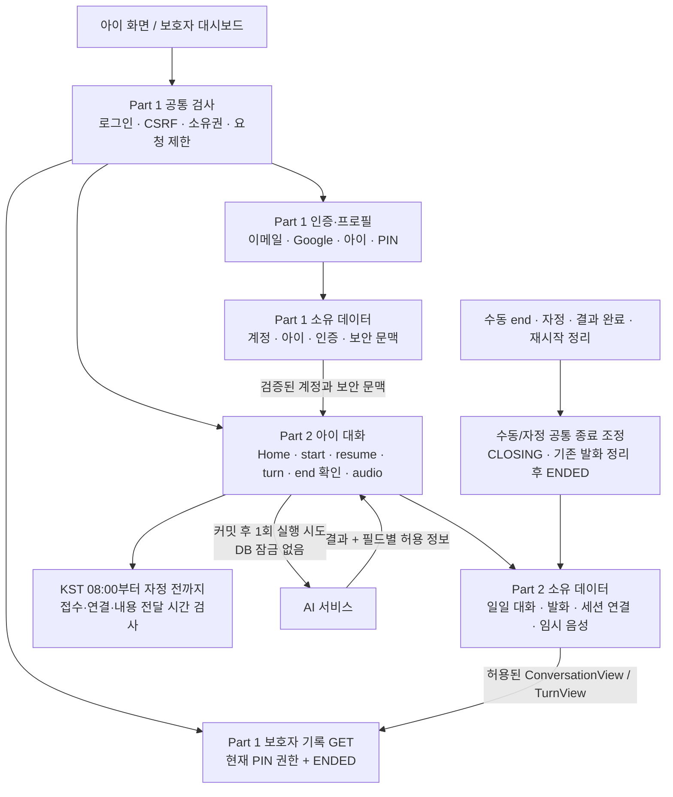

같은 conversations 경로도 GET은 Part 1 보호자 기록, POST는 Part 2 아이 대화 시작이다. 아이 대화에는 보호자 PIN을 요구하지 않는다. 파트 간 새 HTTP 서비스를 추가하지 않으며 AI가 backend DB를 직접 읽고 쓰지 않는다. 화면 이탈은 대화 종료나 기록 삭제가 아니다.

연결: API §2, §3.1, ERD 담당표 · FE·BE 인계서(별도 전달).

### 13.2. 요청 검사와 공통 오류 우선순위

<!-- diagram: api-integrated-request-checks -->
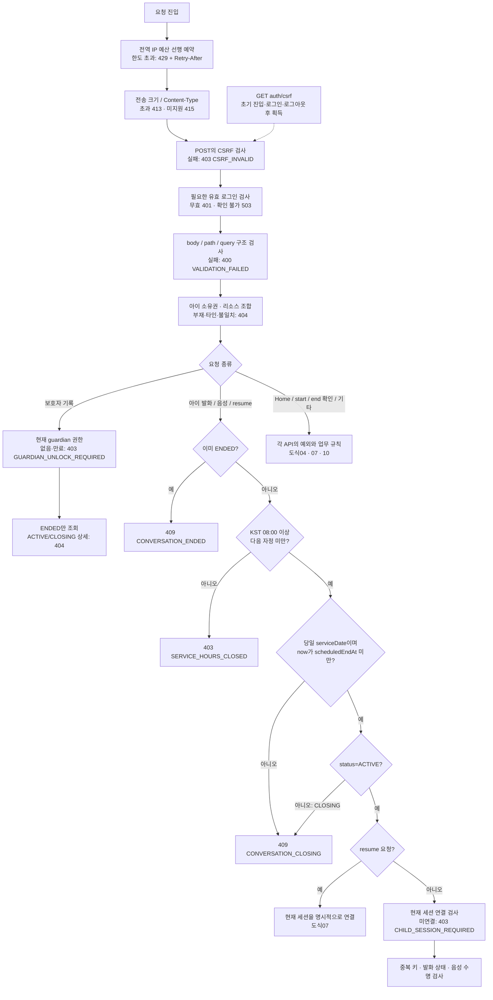

아이 내용 접근의 업무 검사 순서는 **ENDED 409 → 이용 시간 외 403 → CLOSING 또는 지난 일자409 → 미연결 403**이다. 다음 날 08시가 되어도 전날 대화가 다시 열리지 않는다. Home과 보호자 기록은 대화 이용 시간 제한 대상이 아니며, POST/end는 내용 없는 수동 종료·종료 확인에 한해 시간 외 예외를 적용한다. start의 기존 키와 새 키 분기는 도식07을 따른다.

이메일 인증의 PIN_SETUP/PIN_RESET은 입력 목적 또는 challenge를 식별한 뒤 유효 로그인을 강제한다. 타인 리소스의 상태를 먼저 검사해 409로 노출하지 않는다. 별도 인증 예산도 업무 전에 예약하며 앞서 커밋한 IP 예산을 후속 실패로 되돌리지 않는다.

연결: API §3, §3.2, §6.1, §8, §9 · FE·BE 인계서(별도 전달).

### 13.3. 이메일 번호 확인과 일회성 업무 권한

<!-- diagram: api-integrated-email-verification -->
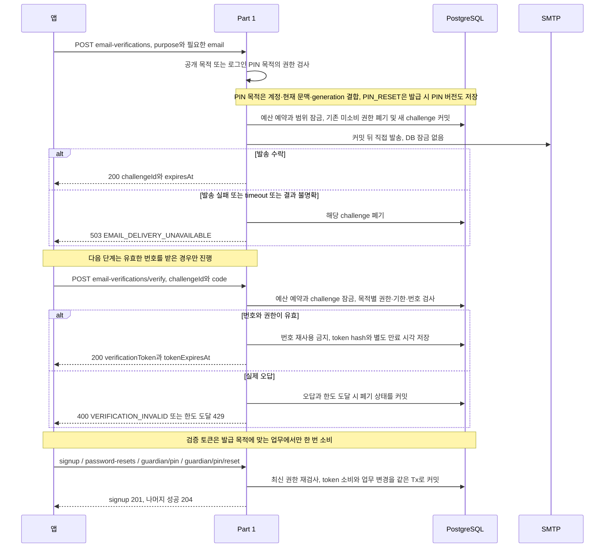

SIGNUP/RESET_PASSWORD는 공개 목적이고 PIN_SETUP/PIN_RESET은 유효 로그인이 필요하다. 두 PIN 목적은 현재 계정·securityContextId·setup_generation에 결합하며 PIN_RESET은 현재 pin_version이 발급 snapshot과 일치해야 한다. 실제 PIN challenge의 계정·문맥·폐기·generation/version 오류는 403이며 만료·소비 오류보다 먼저 판정한다. 목적·번호·토큰 검증 실패는 계약에 따라 400이다.

가입의 추가 동의·보호자 정보 수집은 P0에서 제외한다. signup 201은 자동 로그인을 포함하지 않는다. 번호/토큰 각 600초, 재발급 60초, 실제 오답 5회는 기존 기술 기준을 재사용하며 D-17 운영 검증은 남아 있다. 공개 목적 decoy는 사용 가능한 번호나 토큰을 만들지 않는다. 토큰 원문을 URL, query, localStorage, 일반 로그에 넣지 않는다.

연결: API §4.1\~4.3, §6.2\~6.4, §6.8, §6.11, §6.14 · FE·BE 인계서(별도 전달).

### 13.4. 로그인·프로필·아이 홈 진입과 로그아웃

<!-- diagram: api-integrated-login-entry -->
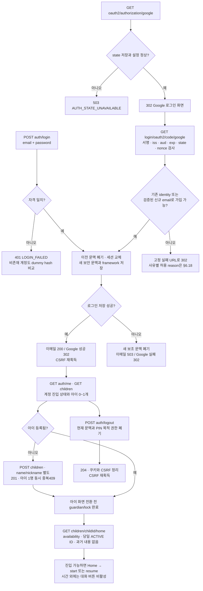

일반 로그인에는 서비스 차원의 idle/absolute 상한을 두지 않고, 쿠키는 365일로 유효한 사용 시 갱신한다. 이 설정이 logout·세션 폐기·비밀번호 변경을 무시하는 뜻은 아니다. 유효한 framework 세션과 DB 보안 문맥이 모두 필요하며 DB 행만으로 로그인을 복원하지 않는다.

Google 기존 identity는 이메일이 달라도 같은 identity로 식별하며 계정 이메일을 자동 변경하거나 이메일만으로 다른 identity에 연결하지 않는다. 신규 가입은 검증된 email을 요구하고, 추가 동의·보호자 정보 및 별도 가입 정보 보완 화면은 P0에 넣지 않는다. OAuth 콜백의 인증·계정·세션 저장 실패는 허용된 고정 실패 URL로 302이며, 허용 URL 설정 자체가 없으면 503이다. URL에는 토큰이나 내부 오류 원인을 넣지 않는다.

연결: API §6.1, §6.5\~6.10, §6.17\~6.18, §7.1 · FE·BE 인계서(별도 전달).

### 13.5. PIN 설정·확인·잠금과 이메일 재설정

<!-- diagram: api-integrated-guardian-access -->
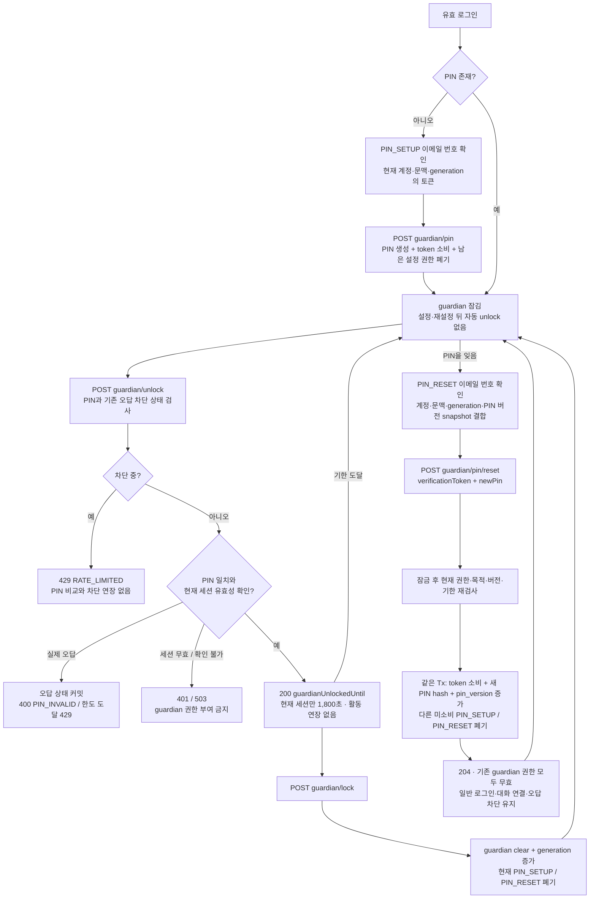

PIN_RESET은 PIN_SETUP 토큰으로 대신할 수 없다. PIN이 없으면 409 PIN_NOT_SET, 토큰 누락/null은 400이다. 실제 PIN_RESET의 계정·문맥·generation·PIN 버전·폐기 불일치는 403 PIN_RESET_AUTHORIZATION_REQUIRED, 그 밖의 목적·해시·기한·소비 검증 실패는 400이다. 성공 토큰은 consumed로 남기고 같은 토큰에 폐기 상태를 덧붙이지 않는다. hash 저장이나 DB 변경 실패 시 전체 업무를 롤백한다.

PIN 재설정은 일반 로그인과 당일 대화 연결을 유지하며 자동 unlock을 하지 않는다. 오답 차단과 요청 예산도 유지하는 기술 기준을 적용한다. 오답 차단 중에도 PIN_RESET 이메일 인증은 별도 이메일/IP 제한 안에서 가능하다. 응답 유실 시 새 PIN으로 unlock을 확인하되 남아 있는 차단을 준수한다. guardian/lock은 현재 PIN 목적 권한도 폐기하므로 재인증 화면에서 무조건 호출하지 않는다.

연결: API §3.1\~3.2, §6.11\~6.14 · FE·BE 인계서(별도 전달).

### 13.6. 비밀번호 재설정과 모든 이전 로그인 무효화

<!-- diagram: api-integrated-password-reset -->
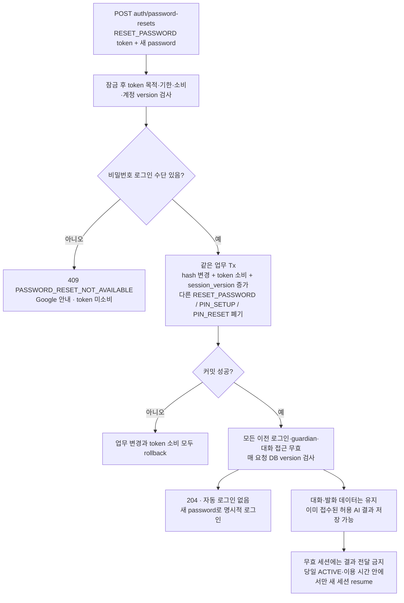

본인 확인 전에 계정 존재나 Google-only 여부를 구분해 알려주지 않는다. 물리 세션 삭제가 늦어져도 DB version 검사로 이전 접근을 거부한다. 비밀번호 재설정은 저장된 대화를 삭제하지 않지만, 새 로그인으로 전날 대화나 종료 복구 권한을 얻을 수는 없다. PIN 재설정이 일반 로그인을 유지하는 규칙과 구분한다.

연결: API §6.8, §3.1, §8.1 · FE·BE 인계서(별도 전달).

### 13.7. 새 대화 시작과 화면 재진입 복원

<!-- diagram: api-integrated-start-resume -->
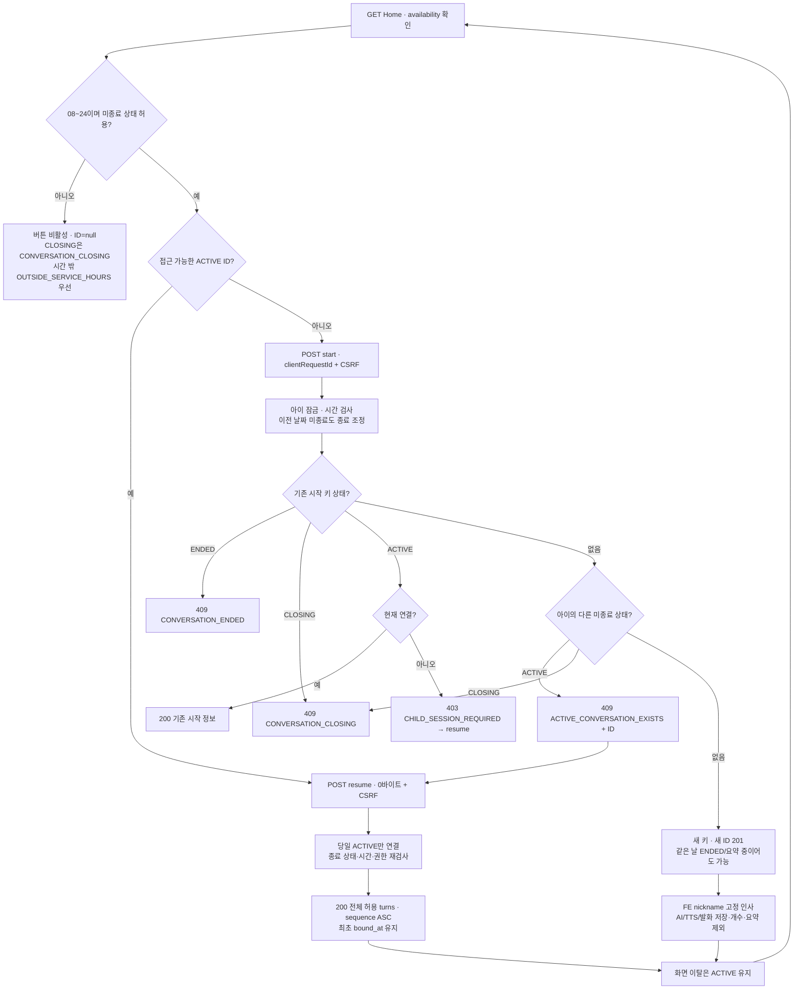

대화는 KST08\~24 동안 같은 날 여러 번 가능하며 ACTIVE/CLOSING은 아이당 하나다. ENDED 키 재전송은409, 새 대화는 새 키다. serviceDate/scheduledEndAt은 대화별 불변이고, 이전 날짜 미종료도 정리 전 새 시작을 막는다. ACTIVE는 새 유효 세션도 resume할 수 있으나 CLOSING은 새 연결·내용이 없다. 응답 직전 상태·시간·권한을 재검사한다.

연결: API §7.1\~7.3, §8 · FE·BE 인계서(별도 전달).

### 13.8. 음성 발화 접수와 동기·비동기 결과

<!-- diagram: api-integrated-voice-async -->
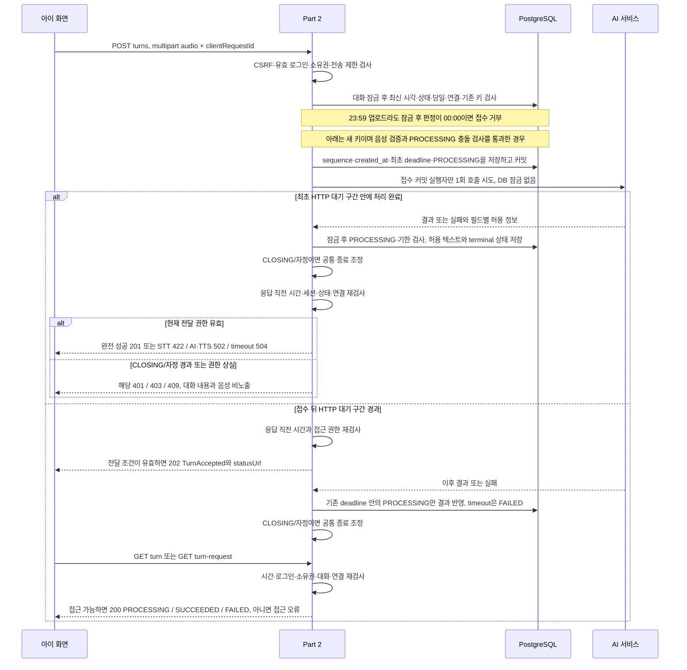

| 결과 | 저장 상태 | 아직 응답하지 않은 최초 POST | 이미 202를 보낸 뒤 |
| --- | --- | --- | --- |
| 정상 완료 | SUCCEEDED, errorCode=null | 201 ChildTurnResult | 접근 가능한 상태 GET은 200 SUCCEEDED |
| STT 무음·인식할 말 없음 | FAILED, STT_NO_SPEECH | 422 ApiError | 접근 가능한 상태 GET은 200 FAILED |
| AI 또는 TTS 실패 | FAILED, AI_UPSTREAM_FAILED | 502 ApiError | 접근 가능한 상태 GET은 200 FAILED |
| 전체 처리 기한 초과 | FAILED, AI_TIMEOUT | 504 ApiError | 접근 가능한 상태 GET은 200 FAILED |

TTS 실패에서도 저장·표시가 모두 허용된 childText/replyText는 보존하며 audio=null, topicSuggestions=[]이다. 최초 오류 응답에는 ApiError만 넣고 보존 텍스트는 허용 시간의 상태 GET으로 읽는다. 파일 손상·미지원 415와 용량 초과 413을 STT 무음으로 바꾸지 않는다.

이미 보낸 202를 나중에 422/502/504로 바꾸지 않는다. 종료 경계 전 접수 작업은 최초 deadline까지 저장할 수 있지만 CLOSING/자정 뒤 아이에게 내용을 전달하지 않는다. 성공은 `now < deadline`인 PROCESSING에만 반영하고 늦은 결과가 terminal 상태를 덮어쓰지 못한다. 접수 커밋 뒤 호출 전 중단되면 기한 후 FAILED로 정리하며 자동 재호출하지 않는다. MIME·대기시간·deadline 수치는 D-13/D-14 연동 대기다.

연결: API §7.4\~7.6, §8.1 · FE·BE 인계서(별도 전달).

### 13.9. 발화 중복 키와 응답 유실 복구

<!-- diagram: api-integrated-idempotency-recovery -->
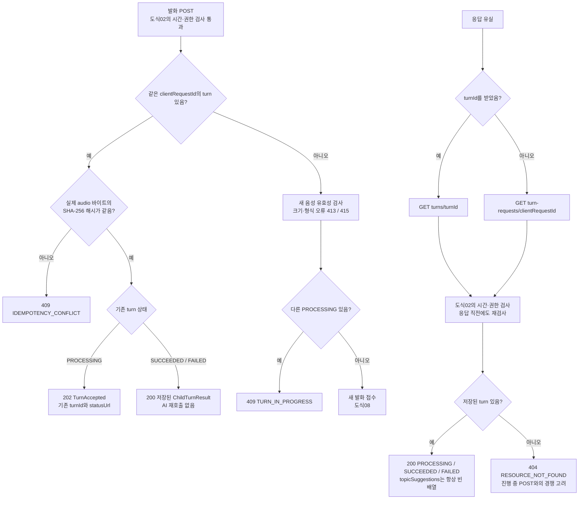

기존 키/해시를 새 PROCESSING 충돌보다 먼저 검사한다. 해시는 실제 파일 바이트의 SHA-256을 소문자 64자리 hex로 저장하며 multipart boundary, 파일명, clientRequestId를 제외한다. Content-Type만 믿지 않고 실제 파일을 디코딩해 검사한다. 전송량 제한은 중복 요청에도 적용한다.

동일 업로드 재시도에는 같은 키와 같은 파일을 보존하고 다시 녹음한 발화는 새 키를 쓴다. requestId는 서버 추적 ID이며 복구 키는 clientRequestId다. GET 404만으로 진행 중인 POST가 미접수라고 단정하지 않는다. 기존 결과도 CLOSING 또는 자정 이후 시간·상태 검사를 우회해 읽을 수 없다.

연결: API §7.4\~7.6, §8, §9 · FE·BE 인계서(별도 전달).

### 13.10. 수동·자정 종료와 기존 세션의 종료 확인

<!-- diagram: api-integrated-end-recovery -->
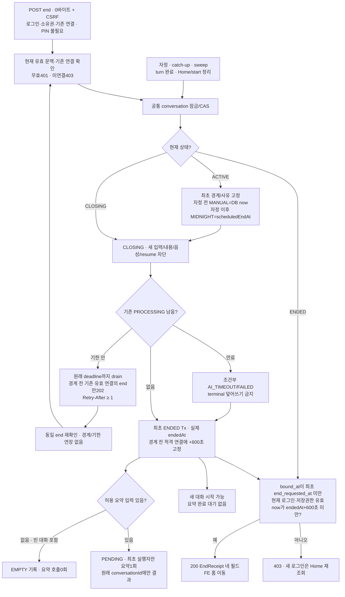

수동/자정 종료 최초 경계에서 CLOSING으로 입력·내용·음성을 차단한다. endedAt은 기존 발화 정리 후 실제 시각이며 경계보다 늦을 수 있다. 최초 endRequestedAt/endReason은 재요청과 자정 도달로 바꾸지 않는다. 처리 중 발화가 없으면 바로 ENDED로 확정할 수 있다.

복구 대상은 `bound_at<end_requested_at`의 기존 유효 연결이며 CLOSING202와 ENDED200 확인정보만 제공한다. 로그인 무효401, 미적격/새 로그인/기한 equality403. 반복 요청은 경계·복구기한 연장 또는 요약 재호출을 하지 않는다. 새 로그인은 Home 재조회로 현재 진입 가능 상태를 확인한다. 시간 밖에는 종료 완료를 추정하지 않고 시간외 안내 후 opensAt부터 재확인한다. 요약 crash 후 PENDING 재실행은 없고 기한 후 FAILED로 정리한다.

연결: API §7.7, §8, §8.1 · FE·BE 인계서(별도 전달).

### 13.11. 임시 응답 음성의 시간·권한·수명 검사

<!-- diagram: api-integrated-temporary-audio -->
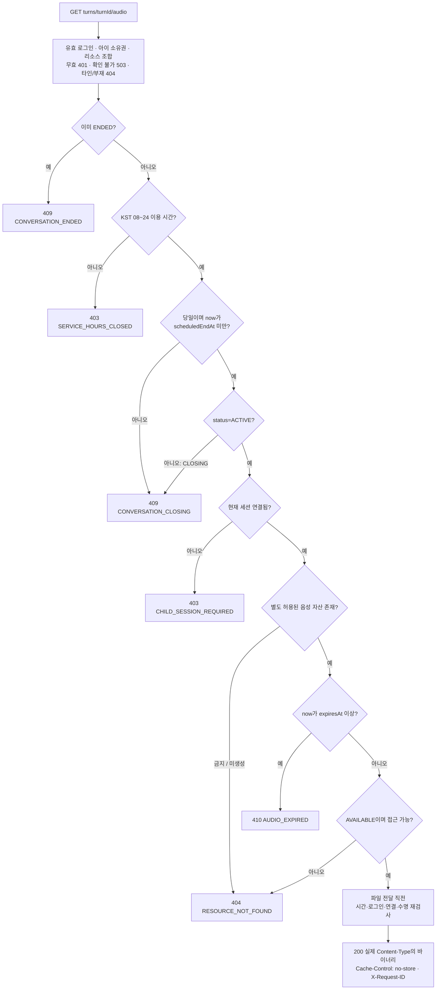

텍스트 허용만으로 음성 허용을 추정하지 않는다. 파일 삭제가 늦어도 자정·대화 종료·세션 무효·음성 만료부터 접근을 거부한다. 이미 전달한 바이트를 회수할 수는 없으므로 FE도 수동 종료 접수 및 자정에 재생을 중단하고 Blob과 화면의 대화 데이터를 정리한다. 화면 정리가 서버 기록 삭제를 뜻하지는 않는다.

만료 음성을 위해 AI/TTS를 재호출하지 않는다. 보호자 기록과 EndReceipt에는 음성 URL이 없다. 구체 MIME·codec·최대 크기·TEMP_AUDIO_TTL·410 판정용 메타데이터 수명은 D-13/D-14 및 운영 연동 사항이며 Range/206 지원을 추가로 약속하지 않는다.

연결: API §7.8, §8, §5.4 · FE·BE 인계서(별도 전달).

### 13.12. 텍스트·요약·음성의 개별 공개 허용

<!-- diagram: api-integrated-visibility -->
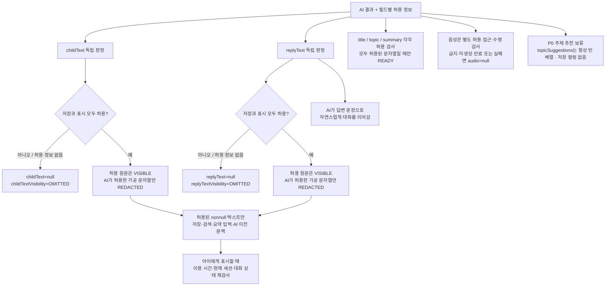

한쪽이 OMITTED여도 반대쪽 허용 텍스트는 유지한다. PROCESSING은 두 텍스트·completedAt·errorCode가 null이고 두 visibility는 OMITTED다. TTS 실패의 FAILED에도 허용된 텍스트가 남으며 보호자 검색·요약 입력에서 실패 상태만으로 제외하지 않는다. 금지 원문과 허용 정보가 없는 텍스트를 DB·로그·검색·요약·이전 AI 문맥에 남기지 않는다.

주제 추천 보류는 ConversationView의 요약용 topic을 없애는 결정이 아니다. title/topic/summary는 허용 입력으로 생성하고 출력도 각각 검사한다. audio와 topicSuggestions는 발화 POST/GET의 wrapper 필드이며 공유 TurnView에 넣지 않는다. resume은 TurnView 전체만 반환하고 보호자 기록에는 audio·추천을 추가하지 않는다. AI wire와 문자열 한도는 D-13/D-14 연동 대기다.

연결: API §5.2\~5.5, §7.4\~7.8, §11 · FE·BE 인계서(별도 전달).

### 13.13. 보호자 목록 검색과 전체 발화 이어 읽기

<!-- diagram: api-integrated-record-pagination -->
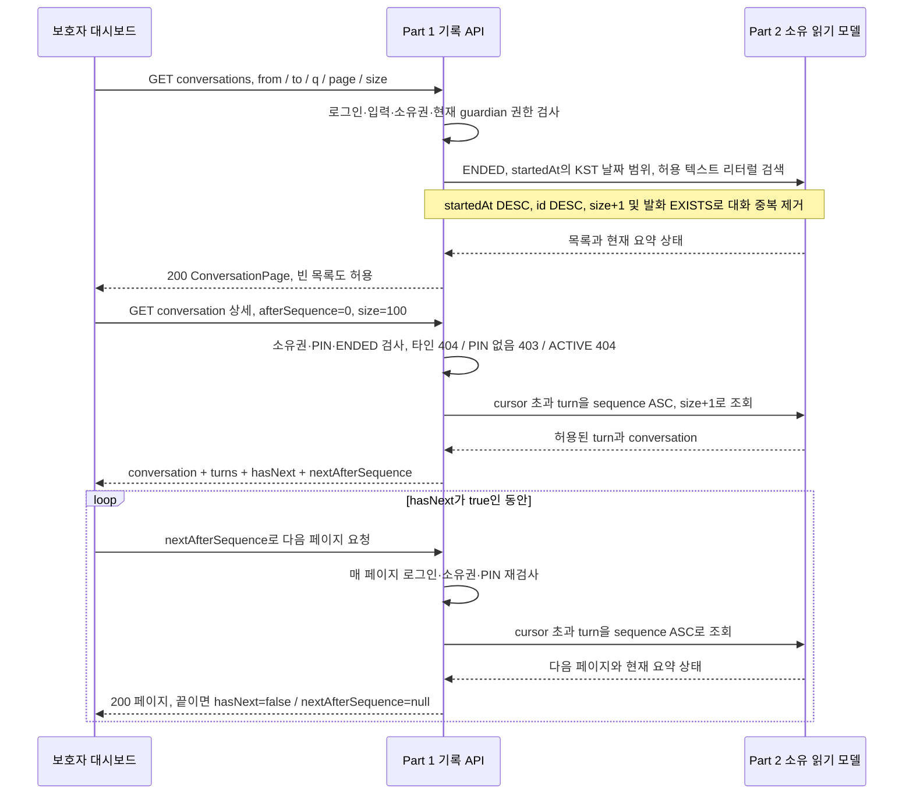

보호자 기록은 ENDED만 대상으로 하며 아이 대화의 00\~08 제한은 적용하지 않는다. 수동/자정 경계 후 기존 발화가 처리 중이면 CLOSING이므로 목록에서 제외한다. 빈 대화도 EMPTY 기록으로 남긴다. 종료가 끝났다면 요약 PENDING/FAILED/EMPTY도 기록 조회를 막지 않는다. 날짜는 startedAt의 KST 날짜, 즉 serviceDate를 기준으로 하므로 새벽에 종료된 대화도 전날 기록에 속한다.

목록은 기본 page=0, size=20, 최대 100개다. 상세는 기본·최대 100턴을 cursor로 이어 읽으며 sequence의 빈 번호를 건너뛴다. q는 trim 후 최대 100자이고 `%`, `_`, escape 문자도 리터럴로 검색한다. 잘못된 날짜 범위나 page×size overflow는 400이다. 빈 상세 페이지는 hasNext=false, nextAfterSequence=null이다. 종료 발화는 불변이지만 요약은 페이지 사이에 완료될 수 있다. 비공개 내용의 일치 개수·스니펫·음성을 반환하지 않는다.

연결: API §6.15\~6.16, §5.4\~5.5, §8 · FE·BE 인계서(별도 전달).

### 13.14. 26개 API 동작과 도식 매핑

각 operation의 실제 처리 또는 응답 복구가 나타난 주 도식과 보조 도식이다. 기존 operationId 26개를 유지하며 경로는 OAuth를 제외하고 `/api/v1`부터 표기한다.

| 담당 | operationId | Method / 경로 | 주 도식 | 보조 도식 |
| --- | --- | --- | --- | --- |
| Part 1 | getCsrf | GET /api/v1/auth/csrf | 02 요청 검사 | 04 로그인 진입 |
| Part 1 | issueEmailVerification | POST /api/v1/auth/email-verifications | 03 이메일 검증 | 05 PIN |
| Part 1 | verifyEmailCode | POST /api/v1/auth/email-verifications/verify | 03 이메일 검증 | 05 PIN |
| Part 1 | signup | POST /api/v1/auth/signup | 03 이메일 검증 | 04 로그인 진입 |
| Part 1 | login | POST /api/v1/auth/login | 04 로그인 진입 | 06 비밀번호 재설정 |
| Part 1 | getCurrentAccount | GET /api/v1/auth/me | 04 로그인 진입 | 05 PIN |
| Part 1 | logout | POST /api/v1/auth/logout | 04 로그인 진입 | 08 응답 직전 권한 |
| Part 1 | resetPassword | POST /api/v1/auth/password-resets | 06 비밀번호 재설정 | 03 이메일 검증 |
| Part 1 | listChildren | GET /api/v1/children | 04 로그인 진입 | 01 담당 |
| Part 1 | createChild | POST /api/v1/children | 04 로그인 진입 | 01 담당 |
| Part 1 | setupGuardianPin | POST /api/v1/guardian/pin | 05 PIN | 03 이메일 검증 |
| Part 1 | unlockGuardian | POST /api/v1/guardian/unlock | 05 PIN | 13 보호자 기록 |
| Part 1 | lockGuardian | POST /api/v1/guardian/lock | 05 PIN | 04 로그인 진입 |
| Part 1 | resetGuardianPin | POST /api/v1/guardian/pin/reset | 05 이메일 PIN 재설정 | 03 이메일 검증 |
| Part 1 | listChildConversations | GET /api/v1/children/{childId}/conversations | 13 보호자 기록 | 12 공개 허용 |
| Part 1 | getChildConversation | GET /api/v1/children/{childId}/conversations/{conversationId} | 13 보호자 기록 | 12 공개 허용 |
| Part 1 | startGoogleLogin | GET /oauth2/authorization/google | 04 로그인 진입 | 02 요청 검사 |
| Part 1 | completeGoogleLogin | GET /login/oauth2/code/google | 04 로그인 진입 | 02 요청 검사 |
| Part 2 | getChildHome | GET /api/v1/children/{childId}/home | 07 대화 시작·종료·복원 | 04 로그인 진입 |
| Part 2 | startChildConversation | POST /api/v1/children/{childId}/conversations | 07 대화 시작·종료·복원 | 02 시간·권한 검사 |
| Part 2 | resumeChildConversation | POST /api/v1/children/{childId}/conversations/{conversationId}/resume | 07 대화 시작·종료·복원 | 12 공개 허용 |
| Part 2 | submitVoiceTurn | POST /api/v1/children/{childId}/conversations/{conversationId}/turns | 08 음성 비동기 | 09 중복·복구, 12 공개 허용 |
| Part 2 | getVoiceTurn | GET /api/v1/children/{childId}/conversations/{conversationId}/turns/{turnId} | 09 중복·복구 | 08 음성 비동기, 12 공개 허용 |
| Part 2 | getVoiceTurnByRequestId | GET /api/v1/children/{childId}/conversations/{conversationId}/turn-requests/{clientRequestId} | 09 중복·복구 | 08 음성 비동기, 12 공개 허용 |
| Part 2 | endChildConversation | POST /api/v1/children/{childId}/conversations/{conversationId}/end | 10 수동/자정 종료·복구 | 02 시간 외 예외 |
| Part 2 | getTemporaryTurnAudio | GET /api/v1/children/{childId}/conversations/{conversationId}/turns/{turnId}/audio | 11 임시 음성 | 02 시간·권한 검사, 12 공개 허용 |

반영 범위: 수동/자정 종료·CLOSING·같은 날 새 대화·미종료1개, FE 고정 첫 인사·이름/애칭 분리·빈 EMPTY 기록, 기존 세션들의 종료 후 600초 확인, 전체 resume, 보호자 100턴 cursor, 이메일 PIN 재설정, OAuth 실패 처리, STT/TTS 실패 매핑, 빈 주제 추천 배열을 최종 계약으로 적용했다. D-13/D-14의 AI 실제 연동·수치와 D-17 운영 조건은 남아 있으며 도식 작성이 서버 구현이나 통합 시험 완료를 의미하지 않는다.


<a id="integrated-json-schemas"></a>
## 14. 전체 스키마의 JSON 정의

61개 OpenAPI3.0.3 Schema Object다. 요청·응답 예시와 구분하며 같은 OpenAPI components의 `$ref`를 사용한다. required/null/상태/닫힌 객체 및 서버 정규화 제약을 함께 적용한다.

<a id="schema-apierror"></a>
### 14.1 ApiError

<!-- json-schema: ApiError -->
```json
{
  "type": "object",
  "properties": {
    "error": {
      "type": "object",
      "properties": {
        "code": {
          "type": "string"
        },
        "message": {
          "type": "string"
        },
        "requestId": {
          "type": "string",
          "format": "uuid",
          "description": "서버 생성 UUID; X-Request-ID와 동일, clientRequestId와 별개."
        },
        "fields": {
          "type": "array",
          "items": {
            "type": "object",
            "properties": {
              "field": {
                "type": "string"
              },
              "reason": {
                "type": "string"
              }
            },
            "required": [
              "field",
              "reason"
            ],
            "additionalProperties": false
          }
        }
      },
      "required": [
        "code",
        "message",
        "requestId",
        "fields"
      ],
      "additionalProperties": false
    }
  },
  "required": [
    "error"
  ],
  "additionalProperties": false,
  "x-owner": "Part 1"
}
```

<a id="schema-csrftokenresponse"></a>
### 14.2 CsrfTokenResponse

<!-- json-schema: CsrfTokenResponse -->
```json
{
  "type": "object",
  "properties": {
    "headerName": {
      "type": "string",
      "enum": [
        "X-XSRF-TOKEN"
      ]
    },
    "parameterName": {
      "type": "string",
      "enum": [
        "_csrf"
      ]
    },
    "token": {
      "type": "string",
      "minLength": 1
    }
  },
  "required": [
    "headerName",
    "parameterName",
    "token"
  ],
  "additionalProperties": false,
  "x-owner": "Part 1"
}
```

<a id="schema-accountview"></a>
### 14.3 AccountView

<!-- json-schema: AccountView -->
```json
{
  "type": "object",
  "properties": {
    "accountId": {
      "type": "string",
      "format": "uuid"
    },
    "email": {
      "type": "string",
      "format": "email",
      "maxLength": 254,
      "pattern": "^[\\x21-\\x7E]+(?![\\s\\S])",
      "description": "B-01.1 원문 입력 기준: trim+전체 소문자·유효 ASCII 이메일·최대254자, Gmail 점/+suffix 보존. RFC 로컬 파트 예외와 달리 서비스 식별 정책. v3에서 유지한 입력 제약으로 유지."
    },
    "childId": {
      "type": "string",
      "format": "uuid",
      "nullable": true
    },
    "hasPin": {
      "type": "boolean"
    },
    "guardianUnlockedUntil": {
      "type": "string",
      "format": "date-time",
      "pattern": "^\\d{4}-\\d{2}-\\d{2}T\\d{2}:\\d{2}:\\d{2}\\+09:00(?![\\s\\S])",
      "description": "D04 확정 PIN 성공 시각+1800초, 현재 세션 최대30분·활동/조회 연장 없음. now>=until 거부 및 실제 로그인 유효 검사 유지. KST +09:00·초 정밀도, 실제 세션 저장·만료 동작은 구현 후 시험한다.",
      "nullable": true
    }
  },
  "required": [
    "accountId",
    "email",
    "childId",
    "hasPin",
    "guardianUnlockedUntil"
  ],
  "additionalProperties": false,
  "x-owner": "Part 1"
}
```

<a id="schema-childview"></a>
### 14.4 ChildView

<!-- json-schema: ChildView -->
```json
{
  "description": "name은 보호자용 이름, nickname은 아이용 호칭으로 별도 저장. 기존 name trim 후1~5 및 생일/성별/관심사/캐릭터 기준 유지. migration은 nullable nickname→name 복사 backfill→검증→NOT NULL; 이름 임의 절단/성별 임의 지정 금지.",
  "type": "object",
  "properties": {
    "childId": {
      "type": "string",
      "format": "uuid"
    },
    "name": {
      "type": "string",
      "minLength": 1,
      "maxLength": 5,
      "description": "trim 후1~5 Unicode 코드포인트·내부 공백 보존. B-04.1 D06 입력 기준 확정."
    },
    "birthDate": {
      "type": "string",
      "format": "date",
      "description": "유효 YYYY-MM-DD·KST 오늘 이하, 최저 연령 추가 없음. B-04.1 D06 입력 기준 확정."
    },
    "gender": {
      "type": "string",
      "description": "MALE/FEMALE 2종만 허용, 미지정값 없음. B-04.1 D06 입력 기준 확정.",
      "enum": [
        "MALE",
        "FEMALE"
      ]
    },
    "interests": {
      "type": "array",
      "description": "자유 입력0~10개·각 trim 후1~30 Unicode 코드포인트·동일값 중복 거부·순서 보존. 요청 생략 시[]·text[] 유지. B-04.2 D06 입력 기준 확정.",
      "items": {
        "type": "string",
        "minLength": 1,
        "maxLength": 30
      },
      "maxItems": 10,
      "uniqueItems": true
    },
    "characterId": {
      "type": "string",
      "description": "영문·숫자·_·-로1~64자, 지원 목록에 없는 ID400 VALIDATION_FAILED. B-04.3 D06 입력 기준 확정. 실제 목록/기본값/폐기 ID/카탈로그 소유·AI 대응은 J-04 미결, dodam은 예시.",
      "minLength": 1,
      "maxLength": 64,
      "pattern": "^[A-Za-z0-9_-]+(?![\\s\\S])"
    },
    "createdAt": {
      "type": "string",
      "format": "date-time",
      "pattern": "^\\d{4}-\\d{2}-\\d{2}T\\d{2}:\\d{2}:\\d{2}\\+09:00(?![\\s\\S])",
      "description": "KST 오프셋 +09:00. 초 정밀도."
    },
    "nickname": {
      "type": "string",
      "minLength": 1,
      "maxLength": 20,
      "description": "trim 후1~20 Unicode 코드포인트. 아이 화면·인사·AI 호칭용 애칭, null/빈 문자열 거부. 유일성/실명 인증 없음. 20자는 통합 기술 기준."
    }
  },
  "required": [
    "childId",
    "name",
    "birthDate",
    "gender",
    "interests",
    "characterId",
    "createdAt",
    "nickname"
  ],
  "additionalProperties": false,
  "x-owner": "Part 1"
}
```

<a id="schema-conversationview"></a>
### 14.5 ConversationView

<!-- json-schema: ConversationView -->
```json
{
  "type": "object",
  "properties": {
    "conversationId": {
      "type": "string",
      "format": "uuid"
    },
    "childId": {
      "type": "string",
      "format": "uuid"
    },
    "status": {
      "type": "string",
      "enum": [
        "ACTIVE",
        "CLOSING",
        "ENDED"
      ]
    },
    "startedAt": {
      "type": "string",
      "format": "date-time",
      "pattern": "^\\d{4}-\\d{2}-\\d{2}T\\d{2}:\\d{2}:\\d{2}\\+09:00(?![\\s\\S])",
      "description": "KST 오프셋 +09:00. 초 정밀도."
    },
    "endedAt": {
      "type": "string",
      "format": "date-time",
      "pattern": "^\\d{4}-\\d{2}-\\d{2}T\\d{2}:\\d{2}:\\d{2}\\+09:00(?![\\s\\S])",
      "description": "KST 오프셋 +09:00. 초 정밀도.",
      "nullable": true
    },
    "title": {
      "type": "string",
      "nullable": true,
      "x-policy": "READ_MODEL_TEXT_MAX_LENGTH: Part 2와 합의 필요, 임의 절단 금지"
    },
    "topic": {
      "type": "string",
      "nullable": true,
      "x-policy": "READ_MODEL_TEXT_MAX_LENGTH: Part 2와 합의 필요, 임의 절단 금지"
    },
    "summary": {
      "type": "string",
      "nullable": true,
      "x-policy": "READ_MODEL_TEXT_MAX_LENGTH: Part 2와 합의 필요, 임의 절단 금지"
    },
    "summaryStatus": {
      "type": "string",
      "enum": [
        "NOT_STARTED",
        "PENDING",
        "READY",
        "FAILED",
        "EMPTY"
      ]
    },
    "endRequestedAt": {
      "type": "string",
      "format": "date-time",
      "pattern": "^\\d{4}-\\d{2}-\\d{2}T\\d{2}:\\d{2}:\\d{2}\\+09:00(?![\\s\\S])",
      "description": "최초 종료 경계. MANUAL은 DB 현재시각, MIDNIGHT는 scheduledEndAt. 중복 end/자정 도달로 변경하지 않음.",
      "nullable": true
    },
    "endReason": {
      "type": "string",
      "nullable": true,
      "enum": [
        null,
        "MANUAL",
        "MIDNIGHT"
      ]
    }
  },
  "required": [
    "conversationId",
    "childId",
    "status",
    "startedAt",
    "endedAt",
    "title",
    "topic",
    "summary",
    "summaryStatus",
    "endRequestedAt",
    "endReason"
  ],
  "additionalProperties": false,
  "description": "공통11필드. ACTIVE는 endRequestedAt/endReason/endedAt=null, CLOSING은 종료경계/사유 필수·endedAt=null, ENDED는 모두 필수. ACTIVE/CLOSING의 summaryStatus=NOT_STARTED. ENDED의 endedAt>=endRequestedAt>=startedAt; MANUAL 경계<scheduledEndAt, MIDNIGHT 경계=scheduledEndAt. READY만 title/topic/summary 모두 허용 문자열, 다른 요약 상태는 null. 보호자 목록·상세는 ENDED만, CLOSING/ACTIVE 제외. 같은 날 여러 ENDED 및 빈 EMPTY 기록 허용.",
  "allOf": [
    {
      "oneOf": [
        {
          "properties": {
            "status": {
              "enum": [
                "ACTIVE"
              ]
            },
            "endedAt": {
              "type": "string",
              "nullable": true,
              "enum": [
                null
              ]
            },
            "summaryStatus": {
              "enum": [
                "NOT_STARTED"
              ]
            },
            "endRequestedAt": {
              "type": "string",
              "nullable": true,
              "enum": [
                null
              ]
            },
            "endReason": {
              "type": "string",
              "nullable": true,
              "enum": [
                null
              ]
            }
          }
        },
        {
          "properties": {
            "status": {
              "enum": [
                "CLOSING"
              ]
            },
            "endedAt": {
              "type": "string",
              "nullable": true,
              "enum": [
                null
              ]
            },
            "endRequestedAt": {
              "type": "string",
              "format": "date-time",
              "pattern": "^\\d{4}-\\d{2}-\\d{2}T\\d{2}:\\d{2}:\\d{2}\\+09:00(?![\\s\\S])",
              "description": "KST 오프셋 +09:00. 초 정밀도."
            },
            "endReason": {
              "type": "string",
              "enum": [
                "MANUAL",
                "MIDNIGHT"
              ]
            },
            "summaryStatus": {
              "enum": [
                "NOT_STARTED"
              ]
            }
          }
        },
        {
          "properties": {
            "status": {
              "enum": [
                "ENDED"
              ]
            },
            "endedAt": {
              "type": "string",
              "format": "date-time",
              "pattern": "^\\d{4}-\\d{2}-\\d{2}T\\d{2}:\\d{2}:\\d{2}\\+09:00(?![\\s\\S])",
              "description": "KST 오프셋 +09:00. 초 정밀도."
            },
            "summaryStatus": {
              "enum": [
                "PENDING",
                "READY",
                "FAILED",
                "EMPTY"
              ]
            },
            "endRequestedAt": {
              "type": "string",
              "format": "date-time",
              "pattern": "^\\d{4}-\\d{2}-\\d{2}T\\d{2}:\\d{2}:\\d{2}\\+09:00(?![\\s\\S])",
              "description": "KST 오프셋 +09:00. 초 정밀도."
            },
            "endReason": {
              "type": "string",
              "enum": [
                "MANUAL",
                "MIDNIGHT"
              ]
            }
          }
        }
      ]
    },
    {
      "oneOf": [
        {
          "properties": {
            "summaryStatus": {
              "enum": [
                "READY"
              ]
            },
            "title": {
              "type": "string"
            },
            "topic": {
              "type": "string"
            },
            "summary": {
              "type": "string"
            }
          }
        },
        {
          "properties": {
            "summaryStatus": {
              "enum": [
                "NOT_STARTED",
                "PENDING",
                "FAILED",
                "EMPTY"
              ]
            },
            "title": {
              "type": "string",
              "nullable": true,
              "enum": [
                null
              ]
            },
            "topic": {
              "type": "string",
              "nullable": true,
              "enum": [
                null
              ]
            },
            "summary": {
              "type": "string",
              "nullable": true,
              "enum": [
                null
              ]
            }
          }
        }
      ]
    }
  ],
  "x-owner": "Shared: Part 2 storage / Part 1 guardian read"
}
```

<a id="schema-turnview"></a>
### 14.6 TurnView

<!-- json-schema: TurnView -->
```json
{
  "type": "object",
  "properties": {
    "turnId": {
      "type": "string",
      "format": "uuid"
    },
    "sequence": {
      "type": "integer",
      "minimum": 1
    },
    "status": {
      "type": "string",
      "enum": [
        "PROCESSING",
        "SUCCEEDED",
        "FAILED"
      ]
    },
    "childText": {
      "type": "string",
      "nullable": true,
      "x-policy": "READ_MODEL_TEXT_MAX_LENGTH: Part 2와 합의 필요, 임의 절단 금지"
    },
    "childTextVisibility": {
      "type": "string",
      "enum": [
        "VISIBLE",
        "REDACTED",
        "OMITTED"
      ]
    },
    "replyText": {
      "type": "string",
      "nullable": true,
      "x-policy": "READ_MODEL_TEXT_MAX_LENGTH: Part 2와 합의 필요, 임의 절단 금지"
    },
    "replyTextVisibility": {
      "type": "string",
      "enum": [
        "VISIBLE",
        "REDACTED",
        "OMITTED"
      ]
    },
    "createdAt": {
      "type": "string",
      "format": "date-time",
      "pattern": "^\\d{4}-\\d{2}-\\d{2}T\\d{2}:\\d{2}:\\d{2}\\+09:00(?![\\s\\S])",
      "description": "KST 오프셋 +09:00. 초 정밀도."
    },
    "completedAt": {
      "type": "string",
      "format": "date-time",
      "pattern": "^\\d{4}-\\d{2}-\\d{2}T\\d{2}:\\d{2}:\\d{2}\\+09:00(?![\\s\\S])",
      "description": "KST 오프셋 +09:00. 초 정밀도.",
      "nullable": true
    },
    "errorCode": {
      "type": "string",
      "nullable": true
    }
  },
  "required": [
    "turnId",
    "sequence",
    "status",
    "childText",
    "childTextVisibility",
    "replyText",
    "replyTextVisibility",
    "createdAt",
    "completedAt",
    "errorCode"
  ],
  "additionalProperties": false,
  "description": "각 텍스트: OMITTED=null, VISIBLE/REDACTED=nonnull. PROCESSING은 완료시각/오류/텍스트 null 및 OMITTED. SUCCEEDED는 완료시각 필수, 오류 null. FAILED는 완료시각과 오류 필수. clientRequestId/음성/내부 위험 신호 제외.",
  "allOf": [
    {
      "oneOf": [
        {
          "properties": {
            "childTextVisibility": {
              "enum": [
                "OMITTED"
              ]
            },
            "childText": {
              "type": "string",
              "nullable": true,
              "enum": [
                null
              ]
            }
          }
        },
        {
          "properties": {
            "childTextVisibility": {
              "enum": [
                "VISIBLE",
                "REDACTED"
              ]
            },
            "childText": {
              "type": "string"
            }
          }
        }
      ]
    },
    {
      "oneOf": [
        {
          "properties": {
            "replyTextVisibility": {
              "enum": [
                "OMITTED"
              ]
            },
            "replyText": {
              "type": "string",
              "nullable": true,
              "enum": [
                null
              ]
            }
          }
        },
        {
          "properties": {
            "replyTextVisibility": {
              "enum": [
                "VISIBLE",
                "REDACTED"
              ]
            },
            "replyText": {
              "type": "string"
            }
          }
        }
      ]
    },
    {
      "oneOf": [
        {
          "properties": {
            "status": {
              "enum": [
                "PROCESSING"
              ]
            },
            "completedAt": {
              "type": "string",
              "nullable": true,
              "enum": [
                null
              ]
            },
            "errorCode": {
              "type": "string",
              "nullable": true,
              "enum": [
                null
              ]
            },
            "childText": {
              "type": "string",
              "nullable": true,
              "enum": [
                null
              ]
            },
            "replyText": {
              "type": "string",
              "nullable": true,
              "enum": [
                null
              ]
            },
            "childTextVisibility": {
              "enum": [
                "OMITTED"
              ]
            },
            "replyTextVisibility": {
              "enum": [
                "OMITTED"
              ]
            }
          }
        },
        {
          "properties": {
            "status": {
              "enum": [
                "SUCCEEDED"
              ]
            },
            "completedAt": {
              "type": "string",
              "format": "date-time",
              "pattern": "^\\d{4}-\\d{2}-\\d{2}T\\d{2}:\\d{2}:\\d{2}\\+09:00(?![\\s\\S])",
              "description": "KST 오프셋 +09:00. 초 정밀도."
            },
            "errorCode": {
              "type": "string",
              "nullable": true,
              "enum": [
                null
              ]
            }
          }
        },
        {
          "properties": {
            "status": {
              "enum": [
                "FAILED"
              ]
            },
            "completedAt": {
              "type": "string",
              "format": "date-time",
              "pattern": "^\\d{4}-\\d{2}-\\d{2}T\\d{2}:\\d{2}:\\d{2}\\+09:00(?![\\s\\S])",
              "description": "KST 오프셋 +09:00. 초 정밀도."
            },
            "errorCode": {
              "type": "string",
              "minLength": 1
            }
          }
        }
      ]
    }
  ],
  "x-owner": "Shared: Part 2 storage / Part 1 guardian read"
}
```

<a id="schema-verificationissue"></a>
### 14.7 VerificationIssue

<!-- json-schema: VerificationIssue -->
```json
{
  "type": "object",
  "properties": {
    "challengeId": {
      "type": "string",
      "format": "uuid"
    },
    "expiresAt": {
      "type": "string",
      "format": "date-time",
      "pattern": "^\\d{4}-\\d{2}-\\d{2}T\\d{2}:\\d{2}:\\d{2}\\+09:00(?![\\s\\S])",
      "description": "B-02.3 원문 입력 기준으로 발급 시각+600초, now>=expiry 거부. 발송 지연/재요청으로 임의 연장 없음. KST 오프셋 +09:00, 초 정밀도. 운영 세부값은 D17 보류."
    }
  },
  "required": [
    "challengeId",
    "expiresAt"
  ],
  "additionalProperties": false,
  "x-owner": "Part 1"
}
```

<a id="schema-verificationgrant"></a>
### 14.8 VerificationGrant

<!-- json-schema: VerificationGrant -->
```json
{
  "type": "object",
  "properties": {
    "verificationToken": {
      "type": "string",
      "writeOnly": false,
      "pattern": "^[0-9a-fA-F]{8}-[0-9a-fA-F]{4}-[0-9a-fA-F]{4}-[0-9a-fA-F]{4}-[0-9a-fA-F]{12}\\.[A-Za-z0-9_-]{43}(?![\\s\\S])",
      "description": "challengeId.secret 형태의 일회성 권한. PIN_SETUP/PIN_RESET은 로그인 계정·보안 문맥·generation에 결합하고 PIN_RESET은 발급 시 pin_version에도 결합. 원문token을 URL·로그·DB에 저장하지 않는다.",
      "readOnly": true
    },
    "tokenExpiresAt": {
      "type": "string",
      "format": "date-time",
      "pattern": "^\\d{4}-\\d{2}-\\d{2}T\\d{2}:\\d{2}:\\d{2}\\+09:00(?![\\s\\S])",
      "description": "B-02.3 원문 입력 기준으로 검증 성공 시각+600초, now>=expiry 거부. 번호 만료와 별도이며 소비/조회로 연장하지 않음. KST 오프셋 +09:00, 초 정밀도. 운영 세부값은 D17 보류."
    }
  },
  "required": [
    "verificationToken",
    "tokenExpiresAt"
  ],
  "additionalProperties": false,
  "x-owner": "Part 1"
}
```

<a id="schema-signupresult"></a>
### 14.9 SignupResult

<!-- json-schema: SignupResult -->
```json
{
  "type": "object",
  "properties": {
    "accountId": {
      "type": "string",
      "format": "uuid"
    }
  },
  "required": [
    "accountId"
  ],
  "additionalProperties": false,
  "x-owner": "Part 1"
}
```

<a id="schema-guardianunlock"></a>
### 14.10 GuardianUnlock

<!-- json-schema: GuardianUnlock -->
```json
{
  "type": "object",
  "properties": {
    "guardianUnlockedUntil": {
      "type": "string",
      "format": "date-time",
      "pattern": "^\\d{4}-\\d{2}-\\d{2}T\\d{2}:\\d{2}:\\d{2}\\+09:00(?![\\s\\S])",
      "description": "D04 확정 PIN 성공 시각+1800초, 현재 세션 최대30분·활동/조회 연장 없음. now>=until 거부 및 실제 로그인 유효 검사 유지. KST +09:00·초 정밀도, 실제 세션 저장·만료 동작은 구현 후 시험한다."
    }
  },
  "required": [
    "guardianUnlockedUntil"
  ],
  "additionalProperties": false,
  "x-owner": "Part 1"
}
```

<a id="schema-childrenlist"></a>
### 14.11 ChildrenList

<!-- json-schema: ChildrenList -->
```json
{
  "type": "object",
  "properties": {
    "items": {
      "type": "array",
      "items": {
        "$ref": "#/components/schemas/ChildView"
      },
      "maxItems": 1
    }
  },
  "required": [
    "items"
  ],
  "additionalProperties": false,
  "x-owner": "Part 1"
}
```

<a id="schema-conversationpage"></a>
### 14.12 ConversationPage

<!-- json-schema: ConversationPage -->
```json
{
  "type": "object",
  "properties": {
    "items": {
      "type": "array",
      "items": {
        "allOf": [
          {
            "$ref": "#/components/schemas/ConversationView"
          },
          {
            "properties": {
              "status": {
                "enum": [
                  "ENDED"
                ]
              }
            }
          }
        ]
      }
    },
    "page": {
      "type": "integer",
      "minimum": 0
    },
    "size": {
      "type": "integer",
      "minimum": 1,
      "maximum": 100
    },
    "hasNext": {
      "type": "boolean"
    }
  },
  "required": [
    "items",
    "page",
    "size",
    "hasNext"
  ],
  "additionalProperties": false,
  "x-owner": "Part 1"
}
```

<a id="schema-conversationdetail"></a>
### 14.13 ConversationDetail

<!-- json-schema: ConversationDetail -->
```json
{
  "type": "object",
  "properties": {
    "conversation": {
      "allOf": [
        {
          "$ref": "#/components/schemas/ConversationView"
        },
        {
          "properties": {
            "status": {
              "enum": [
                "ENDED"
              ]
            }
          }
        }
      ]
    },
    "turns": {
      "type": "array",
      "items": {
        "$ref": "#/components/schemas/TurnView"
      },
      "maxItems": 100
    },
    "hasNext": {
      "type": "boolean"
    },
    "nextAfterSequence": {
      "type": "integer",
      "minimum": 1,
      "nullable": true
    }
  },
  "required": [
    "conversation",
    "turns",
    "hasNext",
    "nextAfterSequence"
  ],
  "additionalProperties": false,
  "description": "D05A 보호자 ENDED 상세. sequence ASC, afterSequence 초과, 기본/최대100턴. hasNext=true이면 nextAfterSequence는 마지막 반환sequence, false이면null. 권한은 매페이지 재검사.",
  "allOf": [
    {
      "oneOf": [
        {
          "properties": {
            "hasNext": {
              "enum": [
                true
              ]
            },
            "nextAfterSequence": {
              "type": "integer",
              "minimum": 1
            },
            "turns": {
              "type": "array",
              "minItems": 1,
              "items": {
                "$ref": "#/components/schemas/TurnView"
              }
            }
          }
        },
        {
          "properties": {
            "hasNext": {
              "enum": [
                false
              ]
            },
            "nextAfterSequence": {
              "type": "integer",
              "nullable": true,
              "enum": [
                null
              ]
            }
          }
        }
      ]
    }
  ],
  "x-owner": "Part 1"
}
```

<a id="schema-issueemailverificationrequest"></a>
### 14.14 IssueEmailVerificationRequest

<!-- json-schema: IssueEmailVerificationRequest -->
```json
{
  "oneOf": [
    {
      "type": "object",
      "properties": {
        "purpose": {
          "type": "string",
          "enum": [
            "SIGNUP",
            "RESET_PASSWORD"
          ]
        },
        "email": {
          "type": "string",
          "description": "전송 문자열. 서버가 trim+lower 후 x-normalized-schema의 이메일 형식/254자 제한을 검사한다.",
          "x-normalization": "trim-and-lower-before-validation",
          "x-normalized-schema": {
            "type": "string",
            "format": "email",
            "maxLength": 254,
            "pattern": "^[\\x21-\\x7E]+(?![\\s\\S])",
            "description": "B-01.1 원문 입력 기준: trim+전체 소문자·유효 ASCII 이메일·최대254자, Gmail 점/+suffix 보존. RFC 로컬 파트 예외와 달리 서비스 식별 정책. v3에서 유지한 입력 제약으로 유지."
          }
        }
      },
      "required": [
        "purpose",
        "email"
      ],
      "additionalProperties": false
    },
    {
      "type": "object",
      "properties": {
        "purpose": {
          "type": "string",
          "enum": [
            "PIN_SETUP",
            "PIN_RESET"
          ]
        },
        "email": {
          "type": "string",
          "description": "전송 문자열. 서버가 trim+lower 후 x-normalized-schema의 이메일 형식/254자 제한을 검사한다.",
          "x-normalization": "trim-and-lower-before-validation",
          "x-normalized-schema": {
            "type": "string",
            "format": "email",
            "maxLength": 254,
            "pattern": "^[\\x21-\\x7E]+(?![\\s\\S])",
            "description": "B-01.1 원문 입력 기준: trim+전체 소문자·유효 ASCII 이메일·최대254자, Gmail 점/+suffix 보존. RFC 로컬 파트 예외와 달리 서비스 식별 정책. v3에서 유지한 입력 제약으로 유지."
          }
        }
      },
      "required": [
        "purpose"
      ],
      "additionalProperties": false,
      "description": "PIN_SETUP/PIN_RESET은 유효 로그인 필수. 서버 현재 계정 이메일 사용; email 생략 가능, 명시적null 불가, 있으면 정규화 후 계정 이메일과 일치해야 한다."
    }
  ],
  "x-owner": "Part 1"
}
```

<a id="schema-verifyemailcoderequest"></a>
### 14.15 VerifyEmailCodeRequest

<!-- json-schema: VerifyEmailCodeRequest -->
```json
{
  "type": "object",
  "properties": {
    "challengeId": {
      "type": "string",
      "format": "uuid"
    },
    "code": {
      "type": "string",
      "pattern": "^[0-9]{6}(?![\\s\\S])",
      "minLength": 6,
      "maxLength": 6,
      "writeOnly": true,
      "description": "B-02.3 원문 입력 기준의 정확히6자리 ASCII 숫자 문자열, 선행0 보존. v3에서 유지한 입력 제약으로 유지.",
      "x-policy": "EMAIL_CODE_LENGTH=6, B-02.3 Part 1 공유안·기존 기술 기준안·D17 실운영값/검증 보류"
    }
  },
  "required": [
    "challengeId",
    "code"
  ],
  "additionalProperties": false,
  "x-owner": "Part 1"
}
```

<a id="schema-signuprequest"></a>
### 14.16 SignupRequest

<!-- json-schema: SignupRequest -->
```json
{
  "type": "object",
  "properties": {
    "verificationToken": {
      "type": "string",
      "writeOnly": true,
      "pattern": "^[0-9a-fA-F]{8}-[0-9a-fA-F]{4}-[0-9a-fA-F]{4}-[0-9a-fA-F]{4}-[0-9a-fA-F]{12}\\.[A-Za-z0-9_-]{43}(?![\\s\\S])",
      "description": "A-02.1 확정: challengeId(UUID) + 점 + CSPRNG 32바이트 secret의 패딩 없는 Base64url 43자. 서버는 secret 문자열의 UTF-8 바이트에 대한 SHA-256 검증값만 DB에 저장·상수 시간 비교하며 목적·만료·1회 소비를 검사. PIN_SETUP은 계정·세션·generation도 결합. 토큰 원문은 DB·로그에 저장하지 않음."
    },
    "password": {
      "type": "string",
      "writeOnly": true,
      "minLength": 15,
      "maxLength": 128,
      "description": "B-01.2 원문 입력 기준의 새 비밀번호15~128 Unicode 코드포인트. trim/정규화/절단 없음, 최대128은 프로젝트 선택. 유효 Unicode만 허용하며 단독 surrogate 등은400 VALIDATION_FAILED·조용한 대체 없음. UTF-8 최대512바이트는128×4 계산 결과이며 별도 설정값이 아님. 실제 고정 라이브러리 버전 입력 호환성은 A-01.10 검증 항목. v3에서 유지한 입력 제약으로 유지.",
      "x-policy": [
        "PASSWORD_MIN_LENGTH=15(새 비밀번호 생성, B-01.2 공유안)",
        "PASSWORD_MAX_LENGTH=128(새 비밀번호 생성, B-01.2 공유안)"
      ]
    }
  },
  "required": [
    "verificationToken",
    "password"
  ],
  "additionalProperties": false,
  "description": "P0 가입 요청은 SIGNUP verificationToken과 password 두 필드. 동의·추가 보호자 정보는 D15에 따라 P0 요청/저장에서 제외. 가입 후 별도 로그인.",
  "x-owner": "Part 1"
}
```

<a id="schema-loginrequest"></a>
### 14.17 LoginRequest

<!-- json-schema: LoginRequest -->
```json
{
  "type": "object",
  "properties": {
    "email": {
      "type": "string",
      "description": "전송 문자열. 서버가 trim+lower 후 x-normalized-schema의 이메일 형식/254자 제한을 검사한다.",
      "x-normalization": "trim-and-lower-before-validation",
      "x-normalized-schema": {
        "type": "string",
        "format": "email",
        "maxLength": 254,
        "pattern": "^[\\x21-\\x7E]+(?![\\s\\S])",
        "description": "B-01.1 원문 입력 기준: trim+전체 소문자·유효 ASCII 이메일·최대254자, Gmail 점/+suffix 보존. RFC 로컬 파트 예외와 달리 서비스 식별 정책. v3에서 유지한 입력 제약으로 유지."
      }
    },
    "password": {
      "type": "string",
      "writeOnly": true,
      "minLength": 1,
      "description": "기존 비밀번호 문자열 검증, minLength=1 유지. trim/정규화/절단 금지, 새 생성15~128자 규칙 소급 적용 없음. Part 1 JSON 본문16KiB(B-02.9 공유안)로 제한. 유효 Unicode 입력만 허용, 단독 surrogate 등은400 VALIDATION_FAILED로 거부·조용한 대체 없음.128/512 생성 상한 소급 없음, 실제 고정 라이브러리 버전 입력 호환성은 A-01.10 검증 항목.",
      "x-policy": [
        "PART1_JSON_MAX_BYTES"
      ]
    }
  },
  "required": [
    "email",
    "password"
  ],
  "additionalProperties": false,
  "description": "B-05.4 별도 rememberMe 미도입. 요청 필드/체크박스/자동 복원 없음, unknown field로 거부.",
  "x-owner": "Part 1"
}
```

<a id="schema-passwordresetrequest"></a>
### 14.18 PasswordResetRequest

<!-- json-schema: PasswordResetRequest -->
```json
{
  "type": "object",
  "properties": {
    "verificationToken": {
      "type": "string",
      "writeOnly": true,
      "pattern": "^[0-9a-fA-F]{8}-[0-9a-fA-F]{4}-[0-9a-fA-F]{4}-[0-9a-fA-F]{4}-[0-9a-fA-F]{12}\\.[A-Za-z0-9_-]{43}(?![\\s\\S])",
      "description": "A-02.1 확정: challengeId(UUID) + 점 + CSPRNG 32바이트 secret의 패딩 없는 Base64url 43자. 서버는 secret 문자열의 UTF-8 바이트에 대한 SHA-256 검증값만 DB에 저장·상수 시간 비교하며 목적·만료·1회 소비를 검사. PIN_SETUP은 계정·세션·generation도 결합. 토큰 원문은 DB·로그에 저장하지 않음."
    },
    "newPassword": {
      "type": "string",
      "writeOnly": true,
      "minLength": 15,
      "maxLength": 128,
      "description": "B-01.2 원문 입력 기준의 새 비밀번호15~128 Unicode 코드포인트. trim/정규화/절단 없음, 최대128은 프로젝트 선택. 유효 Unicode만 허용하며 단독 surrogate 등은400 VALIDATION_FAILED·조용한 대체 없음. UTF-8 최대512바이트는128×4 계산 결과이며 별도 설정값이 아님. 실제 고정 라이브러리 버전 입력 호환성은 A-01.10 검증 항목. v3에서 유지한 입력 제약으로 유지.",
      "x-policy": [
        "PASSWORD_MIN_LENGTH=15(새 비밀번호 생성, B-01.2 공유안)",
        "PASSWORD_MAX_LENGTH=128(새 비밀번호 생성, B-01.2 공유안)"
      ]
    }
  },
  "required": [
    "verificationToken",
    "newPassword"
  ],
  "additionalProperties": false,
  "x-owner": "Part 1"
}
```

<a id="schema-guardianpinsetuprequest"></a>
### 14.19 GuardianPinSetupRequest

<!-- json-schema: GuardianPinSetupRequest -->
```json
{
  "type": "object",
  "properties": {
    "pin": {
      "type": "string",
      "pattern": "^[0-9]{4}(?![\\s\\S])",
      "writeOnly": true,
      "description": "정확히 ASCII 숫자 4자리 문자열. 0000 포함 앞자리 0 보존."
    },
    "verificationToken": {
      "type": "string",
      "writeOnly": true,
      "pattern": "^[0-9a-fA-F]{8}-[0-9a-fA-F]{4}-[0-9a-fA-F]{4}-[0-9a-fA-F]{4}-[0-9a-fA-F]{12}\\.[A-Za-z0-9_-]{43}(?![\\s\\S])",
      "description": "A-02.1 확정: challengeId(UUID) + 점 + CSPRNG 32바이트 secret의 패딩 없는 Base64url 43자. 서버는 secret 문자열의 UTF-8 바이트에 대한 SHA-256 검증값만 DB에 저장·상수 시간 비교하며 목적·만료·1회 소비를 검사. PIN_SETUP은 계정·세션·generation도 결합. 토큰 원문은 DB·로그에 저장하지 않음."
    }
  },
  "required": [
    "pin"
  ],
  "additionalProperties": false,
  "description": "verificationToken은 업무적으로 필수. 누락을 403 PIN_SETUP_AUTHORIZATION_REQUIRED로 표현하려고 구조 required에서는 제외. 명시적 null은 400.",
  "x-owner": "Part 1"
}
```

<a id="schema-guardianunlockrequest"></a>
### 14.20 GuardianUnlockRequest

<!-- json-schema: GuardianUnlockRequest -->
```json
{
  "type": "object",
  "properties": {
    "pin": {
      "type": "string",
      "pattern": "^[0-9]{4}(?![\\s\\S])",
      "writeOnly": true,
      "description": "정확히 ASCII 숫자 4자리 문자열. 0000 포함 앞자리 0 보존."
    }
  },
  "required": [
    "pin"
  ],
  "additionalProperties": false,
  "x-owner": "Part 1"
}
```

<a id="schema-createchildrequest"></a>
### 14.21 CreateChildRequest

<!-- json-schema: CreateChildRequest -->
```json
{
  "type": "object",
  "properties": {
    "name": {
      "type": "string",
      "description": "전송 문자열. trim 후1~5 Unicode 코드포인트·내부 공백 보존, 빈 이름 거부. B-04.1 D06 입력 기준 확정.",
      "x-normalization": "trim-before-validation",
      "x-normalized-schema": {
        "type": "string",
        "minLength": 1,
        "maxLength": 5
      }
    },
    "birthDate": {
      "type": "string",
      "format": "date",
      "description": "유효 YYYY-MM-DD·KST 오늘 이하, 최저 연령 추가 없음. B-04.1 D06 입력 기준 확정."
    },
    "gender": {
      "type": "string",
      "description": "MALE/FEMALE 2종만 허용, 미지정값 없음. B-04.1 D06 입력 기준 확정.",
      "enum": [
        "MALE",
        "FEMALE"
      ]
    },
    "interests": {
      "type": "array",
      "description": "자유 입력0~10개·각 trim 후1~30 Unicode 코드포인트·동일값 중복 거부·순서 보존. 요청 생략 시[]·text[] 유지. B-04.2 D06 입력 기준 확정.",
      "items": {
        "type": "string",
        "description": "각 원소 trim 후 1~30자. trim 결과 기준 중복을 거부한다.",
        "x-normalization": "trim-before-validation",
        "x-normalized-schema": {
          "type": "string",
          "minLength": 1,
          "maxLength": 30
        }
      },
      "maxItems": 10,
      "uniqueItems": true,
      "default": [],
      "x-normalized-schema": {
        "type": "array",
        "items": {
          "type": "string",
          "minLength": 1,
          "maxLength": 30
        },
        "maxItems": 10,
        "uniqueItems": true
      },
      "x-normalization": "trim-each-item-then-check-duplicates"
    },
    "characterId": {
      "type": "string",
      "description": "영문·숫자·_·-로1~64자, 지원 목록에 없는 ID400 VALIDATION_FAILED. B-04.3 D06 입력 기준 확정. 실제 목록/기본값/폐기 ID/카탈로그 소유·AI 대응은 J-04 미결, dodam은 예시.",
      "minLength": 1,
      "maxLength": 64,
      "pattern": "^[A-Za-z0-9_-]+(?![\\s\\S])"
    },
    "nickname": {
      "type": "string",
      "minLength": 1,
      "pattern": "\\S",
      "description": "trim 후1~20 Unicode 코드포인트. 아이 화면·인사·AI 호칭용 애칭, null/빈 문자열 거부. 유일성/실명 인증 없음. 20자는 통합 기술 기준.",
      "x-normalization": "trim-before-validation",
      "x-normalized-schema": {
        "type": "string",
        "minLength": 1,
        "maxLength": 20
      }
    }
  },
  "required": [
    "name",
    "birthDate",
    "gender",
    "characterId",
    "nickname"
  ],
  "additionalProperties": false,
  "description": "이름 name(보호자용)과 애칭 nickname(아이용)을 별도 필수 입력. name trim 후1~5, nickname trim 후1~20 Unicode 코드포인트, 빈 값/null 거부. 관심사 trim, birthDate는 KST 오늘 이하, gender 및 characterId 카탈로그 기준 유지. 별도 애칭 유일성·실명 인증 없음.",
  "x-owner": "Part 1"
}
```

<a id="schema-accountviewresponse"></a>
### 14.22 AccountViewResponse

<!-- json-schema: AccountViewResponse -->
```json
{
  "type": "object",
  "properties": {
    "data": {
      "$ref": "#/components/schemas/AccountView"
    }
  },
  "required": [
    "data"
  ],
  "additionalProperties": false,
  "x-owner": "Part 1"
}
```

<a id="schema-childviewresponse"></a>
### 14.23 ChildViewResponse

<!-- json-schema: ChildViewResponse -->
```json
{
  "type": "object",
  "properties": {
    "data": {
      "$ref": "#/components/schemas/ChildView"
    }
  },
  "required": [
    "data"
  ],
  "additionalProperties": false,
  "x-owner": "Part 1"
}
```

<a id="schema-verificationissueresponse"></a>
### 14.24 VerificationIssueResponse

<!-- json-schema: VerificationIssueResponse -->
```json
{
  "type": "object",
  "properties": {
    "data": {
      "$ref": "#/components/schemas/VerificationIssue"
    }
  },
  "required": [
    "data"
  ],
  "additionalProperties": false,
  "x-owner": "Part 1"
}
```

<a id="schema-verificationgrantresponse"></a>
### 14.25 VerificationGrantResponse

<!-- json-schema: VerificationGrantResponse -->
```json
{
  "type": "object",
  "properties": {
    "data": {
      "$ref": "#/components/schemas/VerificationGrant"
    }
  },
  "required": [
    "data"
  ],
  "additionalProperties": false,
  "x-owner": "Part 1"
}
```

<a id="schema-signupresultresponse"></a>
### 14.26 SignupResultResponse

<!-- json-schema: SignupResultResponse -->
```json
{
  "type": "object",
  "properties": {
    "data": {
      "$ref": "#/components/schemas/SignupResult"
    }
  },
  "required": [
    "data"
  ],
  "additionalProperties": false,
  "x-owner": "Part 1"
}
```

<a id="schema-guardianunlockresponse"></a>
### 14.27 GuardianUnlockResponse

<!-- json-schema: GuardianUnlockResponse -->
```json
{
  "type": "object",
  "properties": {
    "data": {
      "$ref": "#/components/schemas/GuardianUnlock"
    }
  },
  "required": [
    "data"
  ],
  "additionalProperties": false,
  "x-owner": "Part 1"
}
```

<a id="schema-childrenlistresponse"></a>
### 14.28 ChildrenListResponse

<!-- json-schema: ChildrenListResponse -->
```json
{
  "type": "object",
  "properties": {
    "data": {
      "$ref": "#/components/schemas/ChildrenList"
    }
  },
  "required": [
    "data"
  ],
  "additionalProperties": false,
  "x-owner": "Part 1"
}
```

<a id="schema-conversationpageresponse"></a>
### 14.29 ConversationPageResponse

<!-- json-schema: ConversationPageResponse -->
```json
{
  "type": "object",
  "properties": {
    "data": {
      "$ref": "#/components/schemas/ConversationPage"
    }
  },
  "required": [
    "data"
  ],
  "additionalProperties": false,
  "x-owner": "Part 1"
}
```

<a id="schema-conversationdetailresponse"></a>
### 14.30 ConversationDetailResponse

<!-- json-schema: ConversationDetailResponse -->
```json
{
  "type": "object",
  "properties": {
    "data": {
      "$ref": "#/components/schemas/ConversationDetail"
    }
  },
  "required": [
    "data"
  ],
  "additionalProperties": false,
  "x-owner": "Part 1"
}
```

<a id="schema-startconversationrequest"></a>
### 14.31 StartConversationRequest

<!-- json-schema: StartConversationRequest -->
```json
{
  "type": "object",
  "properties": {
    "clientRequestId": {
      "type": "string",
      "format": "uuid"
    }
  },
  "required": [
    "clientRequestId"
  ],
  "additionalProperties": false,
  "description": "아이별 시작 중복 식별. 같은 키 재전송은 ACTIVE·현재 연결에 한해 기존 시작 정보. ENDED 키 재사용 금지.",
  "x-owner": "Part 2"
}
```

<a id="schema-voiceturnrequest"></a>
### 14.32 VoiceTurnRequest

<!-- json-schema: VoiceTurnRequest -->
```json
{
  "type": "object",
  "properties": {
    "clientRequestId": {
      "type": "string",
      "format": "uuid",
      "description": "multipart text part. 전송 재시도는 같은 키·같은 파일, 새 녹음은 새 UUID."
    },
    "audio": {
      "type": "string",
      "format": "binary",
      "description": "필수 음성 파일. 텍스트/버튼 발화는 받지 않는다."
    }
  },
  "required": [
    "clientRequestId",
    "audio"
  ],
  "additionalProperties": false,
  "x-owner": "Part 2",
  "description": "multipart audio+clientRequestId 두필드만. 실제 audio바이트 SHA-256 소문자hex64; 파일명/boundary/clientRequestId 제외. 실제파일디코딩검사. 의미있는추가처리옵션은P0없음. MIME/codec/용량/시간한도는D13/14대기."
}
```

<a id="schema-childhome"></a>
### 14.33 ChildHome

<!-- json-schema: ChildHome -->
```json
{
  "type": "object",
  "properties": {
    "child": {
      "type": "object",
      "properties": {
        "childId": {
          "type": "string",
          "format": "uuid"
        },
        "name": {
          "type": "string"
        },
        "characterId": {
          "type": "string"
        },
        "nickname": {
          "type": "string",
          "minLength": 1,
          "maxLength": 20,
          "description": "trim 후1~20 Unicode 코드포인트. 아이 화면·인사·AI 호칭용 애칭, null/빈 문자열 거부. 유일성/실명 인증 없음. 20자는 통합 기술 기준."
        }
      },
      "required": [
        "childId",
        "name",
        "characterId",
        "nickname"
      ],
      "additionalProperties": false
    },
    "greeting": {
      "type": "string",
      "description": "서버 고정 nickname 템플릿. 대화 시작의 FE 고정 첫 인사와 구분하며 AI 생성/TTS가 아니다."
    },
    "joinedAt": {
      "type": "string",
      "format": "date-time",
      "pattern": "^\\d{4}-\\d{2}-\\d{2}T\\d{2}:\\d{2}:\\d{2}\\+09:00(?![\\s\\S])",
      "description": "공통 KST(+09:00), 초 정밀도."
    },
    "daysTogether": {
      "type": "integer",
      "minimum": 1
    },
    "activeConversationId": {
      "type": "string",
      "format": "uuid",
      "nullable": true
    },
    "menus": {
      "type": "array",
      "items": {
        "oneOf": [
          {
            "type": "object",
            "properties": {
              "code": {
                "type": "string",
                "enum": [
                  "TALK"
                ]
              },
              "status": {
                "type": "string",
                "enum": [
                  "AVAILABLE",
                  "UNAVAILABLE"
                ]
              }
            },
            "required": [
              "code",
              "status"
            ],
            "additionalProperties": false
          },
          {
            "type": "object",
            "properties": {
              "code": {
                "type": "string",
                "enum": [
                  "PLAY"
                ]
              },
              "status": {
                "type": "string",
                "enum": [
                  "COMING_SOON"
                ]
              }
            },
            "required": [
              "code",
              "status"
            ],
            "additionalProperties": false
          }
        ]
      },
      "minItems": 2,
      "maxItems": 2
    },
    "availability": {
      "$ref": "#/components/schemas/ConversationAvailability"
    }
  },
  "required": [
    "child",
    "greeting",
    "joinedAt",
    "daysTogether",
    "activeConversationId",
    "menus",
    "availability"
  ],
  "additionalProperties": false,
  "x-owner": "Part 2",
  "description": "TALK은 availability.canEnter에 따라 AVAILABLE/UNAVAILABLE, PLAY는 COMING_SOON. TALK,PLAY 순서 각1개. activeConversationId는 접근 가능한 당일 ACTIVE만, CLOSING은 null. 서비스 시간 안 CLOSING이면 false/CONVERSATION_CLOSING, 시간 밖 OUTSIDE_SERVICE_HOURS 우선. 새 closingConversationId 필드 없음. Home은 로그인/소유권 통과 시 시간 밖에도200; 과거 내용·음성 없음. joinedAt=아이 등록 시각, daysTogether=KST 등록일 포함. name/nickname 별도이며 아이 화면과 greeting은 nickname 사용."
}
```

<a id="schema-startconversationresult"></a>
### 14.34 StartConversationResult

<!-- json-schema: StartConversationResult -->
```json
{
  "type": "object",
  "properties": {
    "conversationId": {
      "type": "string",
      "format": "uuid"
    },
    "status": {
      "type": "string",
      "enum": [
        "ACTIVE"
      ]
    },
    "startedAt": {
      "type": "string",
      "format": "date-time",
      "pattern": "^\\d{4}-\\d{2}-\\d{2}T\\d{2}:\\d{2}:\\d{2}\\+09:00(?![\\s\\S])",
      "description": "공통 KST(+09:00), 초 정밀도."
    },
    "serviceDate": {
      "type": "string",
      "format": "date"
    },
    "scheduledEndAt": {
      "type": "string",
      "format": "date-time",
      "pattern": "^\\d{4}-\\d{2}-\\d{2}T\\d{2}:\\d{2}:\\d{2}\\+09:00(?![\\s\\S])",
      "description": "공통 KST(+09:00), 초 정밀도."
    }
  },
  "required": [
    "conversationId",
    "status",
    "startedAt",
    "serviceDate",
    "scheduledEndAt"
  ],
  "additionalProperties": false,
  "x-owner": "Part 2",
  "description": "새 대화 시작 정보. 같은 날 ENDED 이후 새 키로 새 대화 가능. serviceDate는 시작 KST 날짜, scheduledEndAt은 다음00시로 불변. 동일 키 ACTIVE는 기존 정보, CLOSING은409, ENDED는409 CONVERSATION_ENDED. 새 대화 첫 인사는 FE nickname 고정 문구로 AI/TTS/발화 저장·개수·요약에서 제외."
}
```

<a id="schema-p2processingturn"></a>
### 14.35 P2ProcessingTurn

<!-- json-schema: P2ProcessingTurn -->
```json
{
  "allOf": [
    {
      "$ref": "#/components/schemas/TurnView"
    },
    {
      "properties": {
        "status": {
          "type": "string",
          "enum": [
            "PROCESSING"
          ]
        }
      }
    }
  ],
  "description": "Part1 공통 TurnView의 폐쇄객체·필드별 visibility/NULL·완료시각/errorCode oneOf를 그대로 재사용한다.",
  "x-owner": "Part 2"
}
```

<a id="schema-p2succeededturn"></a>
### 14.36 P2SucceededTurn

<!-- json-schema: P2SucceededTurn -->
```json
{
  "allOf": [
    {
      "$ref": "#/components/schemas/TurnView"
    },
    {
      "properties": {
        "status": {
          "type": "string",
          "enum": [
            "SUCCEEDED"
          ]
        }
      }
    }
  ],
  "description": "Part1 공통 TurnView의 폐쇄객체·필드별 visibility/NULL·완료시각/errorCode oneOf를 그대로 재사용한다.",
  "x-owner": "Part 2"
}
```

<a id="schema-p2failedturn"></a>
### 14.37 P2FailedTurn

<!-- json-schema: P2FailedTurn -->
```json
{
  "allOf": [
    {
      "$ref": "#/components/schemas/TurnView"
    },
    {
      "properties": {
        "status": {
          "type": "string",
          "enum": [
            "FAILED"
          ]
        }
      }
    }
  ],
  "description": "Part1 공통 TurnView의 폐쇄객체·필드별 visibility/NULL·완료시각/errorCode oneOf를 그대로 재사용한다.",
  "x-owner": "Part 2"
}
```

<a id="schema-p2terminalturn"></a>
### 14.38 P2TerminalTurn

<!-- json-schema: P2TerminalTurn -->
```json
{
  "oneOf": [
    {
      "$ref": "#/components/schemas/P2SucceededTurn"
    },
    {
      "$ref": "#/components/schemas/P2FailedTurn"
    }
  ],
  "x-owner": "Part 2"
}
```

<a id="schema-resumeconversationresult"></a>
### 14.39 ResumeConversationResult

<!-- json-schema: ResumeConversationResult -->
```json
{
  "type": "object",
  "properties": {
    "conversationId": {
      "type": "string",
      "format": "uuid"
    },
    "status": {
      "type": "string",
      "enum": [
        "ACTIVE"
      ]
    },
    "startedAt": {
      "type": "string",
      "format": "date-time",
      "pattern": "^\\d{4}-\\d{2}-\\d{2}T\\d{2}:\\d{2}:\\d{2}\\+09:00(?![\\s\\S])",
      "description": "공통 KST(+09:00), 초 정밀도."
    },
    "turns": {
      "type": "array",
      "items": {
        "$ref": "#/components/schemas/TurnView"
      }
    },
    "processingTurnId": {
      "type": "string",
      "format": "uuid",
      "nullable": true
    },
    "serviceDate": {
      "type": "string",
      "format": "date"
    },
    "scheduledEndAt": {
      "type": "string",
      "format": "date-time",
      "pattern": "^\\d{4}-\\d{2}-\\d{2}T\\d{2}:\\d{2}:\\d{2}\\+09:00(?![\\s\\S])",
      "description": "공통 KST(+09:00), 초 정밀도."
    }
  },
  "required": [
    "conversationId",
    "status",
    "startedAt",
    "turns",
    "processingTurnId",
    "serviceDate",
    "scheduledEndAt"
  ],
  "additionalProperties": false,
  "allOf": [
    {
      "oneOf": [
        {
          "properties": {
            "processingTurnId": {
              "type": "string",
              "format": "uuid",
              "nullable": true,
              "enum": [
                null
              ]
            },
            "turns": {
              "type": "array",
              "items": {
                "$ref": "#/components/schemas/P2TerminalTurn"
              }
            }
          }
        },
        {
          "properties": {
            "processingTurnId": {
              "type": "string",
              "format": "uuid"
            }
          }
        }
      ]
    }
  ],
  "description": "서비스 시간 안 당일 ACTIVE만 명시 연결하고 전체 허용 발화를 sequence ASC 반환. 화면 이탈·새로고침·재로그인 복원. PROCESSING 중 가능. CLOSING/ENDED는 새 연결과 본문 반환 금지. 페이지화/절단 없음. audio/추천/FE 첫 인사는 발화 목록에 없음.",
  "x-service-invariants": [
    "turnId/sequence고유,sequence오름차순,PROCESSING최대1,processingTurnId와실제turn일치",
    "now<scheduledEndAt, 당일 serviceDate, status=ACTIVE. 응답 직전 시간/유효 로그인/소유권/상태/연결 재검사. 수동 종료 또는 자정 이후 내용 노출 금지."
  ],
  "x-owner": "Part 2"
}
```

<a id="schema-temporaryaudio"></a>
### 14.40 TemporaryAudio

<!-- json-schema: TemporaryAudio -->
```json
{
  "type": "object",
  "properties": {
    "url": {
      "type": "string",
      "description": "인증된 상대 GET /api/v1/children/{childId}/conversations/{conversationId}/turns/{turnId}/audio. 공개 영구 URL 아님.",
      "pattern": "^/api/v1/children/[0-9a-fA-F]{8}-[0-9a-fA-F]{4}-[0-9a-fA-F]{4}-[0-9a-fA-F]{4}-[0-9a-fA-F]{12}/conversations/[0-9a-fA-F]{8}-[0-9a-fA-F]{4}-[0-9a-fA-F]{4}-[0-9a-fA-F]{4}-[0-9a-fA-F]{12}/turns/[0-9a-fA-F]{8}-[0-9a-fA-F]{4}-[0-9a-fA-F]{4}-[0-9a-fA-F]{4}-[0-9a-fA-F]{12}/audio(?![\\s\\S])"
    },
    "contentType": {
      "type": "string",
      "description": "합의할 실제 음성 MIME. 예시 audio/wav는 확정값 아님.",
      "minLength": 1,
      "pattern": "^audio/[^\\s]+(?:[ \\t]*;[^\\r\\n]*)?(?![\\s\\S])"
    },
    "expiresAt": {
      "type": "string",
      "format": "date-time",
      "pattern": "^\\d{4}-\\d{2}-\\d{2}T\\d{2}:\\d{2}:\\d{2}\\+09:00(?![\\s\\S])",
      "description": "공통 KST(+09:00), 초 정밀도."
    }
  },
  "required": [
    "url",
    "contentType",
    "expiresAt"
  ],
  "additionalProperties": false,
  "description": "별도 음성 허용·당일 ACTIVE·08~24·현재 연결·AVAILABLE·now<expiresAt에서만 제공. CLOSING 또는 자정 이후 drain 결과도 아이에게 URL/바이너리 전달 금지. 금지/미생성/만료는 JSON audio=null. MIME/TTL은 D13/D14 대기.",
  "x-owner": "Part 2"
}
```

<a id="schema-p2temporaryaudioornull"></a>
### 14.41 P2TemporaryAudioOrNull

<!-- json-schema: P2TemporaryAudioOrNull -->
```json
{
  "oneOf": [
    {
      "$ref": "#/components/schemas/TemporaryAudio"
    },
    {
      "type": "object",
      "nullable": true,
      "enum": [
        null
      ]
    }
  ],
  "x-owner": "Part 2"
}
```

<a id="schema-processingchildturnresult"></a>
### 14.42 ProcessingChildTurnResult

<!-- json-schema: ProcessingChildTurnResult -->
```json
{
  "type": "object",
  "properties": {
    "turn": {
      "$ref": "#/components/schemas/P2ProcessingTurn"
    },
    "audio": {
      "type": "object",
      "nullable": true,
      "enum": [
        null
      ]
    },
    "topicSuggestions": {
      "type": "array",
      "items": {
        "type": "string"
      },
      "description": "D09: P0 주제추천미지원, 항상빈배열[]. DB저장없음. AI자체대화진행과FE추천선택UI는별개.",
      "maxItems": 0
    }
  },
  "required": [
    "turn",
    "audio",
    "topicSuggestions"
  ],
  "additionalProperties": false,
  "x-owner": "Part 2"
}
```

<a id="schema-succeededchildturnresult"></a>
### 14.43 SucceededChildTurnResult

<!-- json-schema: SucceededChildTurnResult -->
```json
{
  "type": "object",
  "properties": {
    "turn": {
      "$ref": "#/components/schemas/P2SucceededTurn"
    },
    "audio": {
      "$ref": "#/components/schemas/P2TemporaryAudioOrNull"
    },
    "topicSuggestions": {
      "type": "array",
      "items": {
        "type": "string"
      },
      "description": "D09: P0 주제추천미지원, 항상빈배열[]. DB저장없음. AI자체대화진행과FE추천선택UI는별개.",
      "maxItems": 0
    }
  },
  "required": [
    "turn",
    "audio",
    "topicSuggestions"
  ],
  "additionalProperties": false,
  "x-owner": "Part 2",
  "description": "처리성공. 음성금지/미생성/만료는audio=null가능하나TTS실제장애는FAILED로분류(D10A)."
}
```

<a id="schema-failedchildturnresult"></a>
### 14.44 FailedChildTurnResult

<!-- json-schema: FailedChildTurnResult -->
```json
{
  "type": "object",
  "properties": {
    "turn": {
      "$ref": "#/components/schemas/P2FailedTurn"
    },
    "audio": {
      "type": "object",
      "nullable": true,
      "enum": [
        null
      ],
      "description": "D10: 실패결과는음성미제공. TTS실패시허용된텍스트만보존."
    },
    "topicSuggestions": {
      "type": "array",
      "items": {
        "type": "string"
      },
      "description": "D09: P0 주제추천미지원, 항상빈배열[]. DB저장없음. AI자체대화진행과FE추천선택UI는별개.",
      "maxItems": 0
    }
  },
  "required": [
    "turn",
    "audio",
    "topicSuggestions"
  ],
  "additionalProperties": false,
  "x-owner": "Part 2",
  "description": "STT무음STT_NO_SPEECH,AI/TTS장애AI_UPSTREAM_FAILED,기한초과AI_TIMEOUT 등실패. 허용텍스트는실패단계에따라보존, audio=null,topicSuggestions=[]."
}
```

<a id="schema-childturnresult"></a>
### 14.45 ChildTurnResult

<!-- json-schema: ChildTurnResult -->
```json
{
  "oneOf": [
    {
      "$ref": "#/components/schemas/ProcessingChildTurnResult"
    },
    {
      "$ref": "#/components/schemas/SucceededChildTurnResult"
    },
    {
      "$ref": "#/components/schemas/FailedChildTurnResult"
    }
  ],
  "x-owner": "Part 2"
}
```

<a id="schema-terminalchildturnresult"></a>
### 14.46 TerminalChildTurnResult

<!-- json-schema: TerminalChildTurnResult -->
```json
{
  "oneOf": [
    {
      "$ref": "#/components/schemas/SucceededChildTurnResult"
    },
    {
      "$ref": "#/components/schemas/FailedChildTurnResult"
    }
  ],
  "x-owner": "Part 2"
}
```

<a id="schema-turnaccepted"></a>
### 14.47 TurnAccepted

<!-- json-schema: TurnAccepted -->
```json
{
  "type": "object",
  "properties": {
    "turnId": {
      "type": "string",
      "format": "uuid"
    },
    "clientRequestId": {
      "type": "string",
      "format": "uuid"
    },
    "status": {
      "type": "string",
      "enum": [
        "PROCESSING"
      ]
    },
    "statusUrl": {
      "type": "string",
      "description": "현재 turnId의 인증된 상태 GET 상대 경로. POST 응답에서만202; 같은 PROCESSING을 GET하면200 ChildTurnResult.",
      "pattern": "^/api/v1/children/[0-9a-fA-F]{8}-[0-9a-fA-F]{4}-[0-9a-fA-F]{4}-[0-9a-fA-F]{4}-[0-9a-fA-F]{12}/conversations/[0-9a-fA-F]{8}-[0-9a-fA-F]{4}-[0-9a-fA-F]{4}-[0-9a-fA-F]{4}-[0-9a-fA-F]{12}/turns/[0-9a-fA-F]{8}-[0-9a-fA-F]{4}-[0-9a-fA-F]{4}-[0-9a-fA-F]{4}-[0-9a-fA-F]{12}(?![\\s\\S])"
    }
  },
  "required": [
    "turnId",
    "clientRequestId",
    "status",
    "statusUrl"
  ],
  "additionalProperties": false,
  "x-owner": "Part 2"
}
```

<a id="schema-endreceipt"></a>
### 14.48 EndReceipt

<!-- json-schema: EndReceipt -->
```json
{
  "type": "object",
  "properties": {
    "conversationId": {
      "type": "string",
      "format": "uuid"
    },
    "status": {
      "type": "string",
      "enum": [
        "ENDED"
      ]
    },
    "endedAt": {
      "type": "string",
      "format": "date-time",
      "pattern": "^\\d{4}-\\d{2}-\\d{2}T\\d{2}:\\d{2}:\\d{2}\\+09:00(?![\\s\\S])",
      "description": "공통 KST(+09:00), 초 정밀도."
    },
    "summaryStatus": {
      "type": "string",
      "enum": [
        "PENDING",
        "READY",
        "FAILED",
        "EMPTY"
      ]
    }
  },
  "required": [
    "conversationId",
    "status",
    "endedAt",
    "summaryStatus"
  ],
  "additionalProperties": false,
  "description": "수동/자정 종료 완료 확인4필드. endRequestedAt 이전 bound_at<end_requested_at인 기존 유효 세션 연결에만 실제 endedAt+600초 복구권한을 기록. 현재 로그인·소유권·연결을 항상 재검사. 새 로그인/새 연결 복구 불가, now>=기한 거부, 반복 요청 연장 없음. endedAt은 drain 뒤 실제 종료시각이며 소급 없음. summaryStatus만 후속 변경 가능. 과거 내용·음성·요약 본문 없음.",
  "x-owner": "Part 2"
}
```

<a id="schema-childhomeresponse"></a>
### 14.49 ChildHomeResponse

<!-- json-schema: ChildHomeResponse -->
```json
{
  "type": "object",
  "properties": {
    "data": {
      "$ref": "#/components/schemas/ChildHome"
    }
  },
  "required": [
    "data"
  ],
  "additionalProperties": false,
  "x-owner": "Part 2"
}
```

<a id="schema-startconversationresultresponse"></a>
### 14.50 StartConversationResultResponse

<!-- json-schema: StartConversationResultResponse -->
```json
{
  "type": "object",
  "properties": {
    "data": {
      "$ref": "#/components/schemas/StartConversationResult"
    }
  },
  "required": [
    "data"
  ],
  "additionalProperties": false,
  "x-owner": "Part 2"
}
```

<a id="schema-resumeconversationresultresponse"></a>
### 14.51 ResumeConversationResultResponse

<!-- json-schema: ResumeConversationResultResponse -->
```json
{
  "type": "object",
  "properties": {
    "data": {
      "$ref": "#/components/schemas/ResumeConversationResult"
    }
  },
  "required": [
    "data"
  ],
  "additionalProperties": false,
  "x-owner": "Part 2"
}
```

<a id="schema-childturnresultresponse"></a>
### 14.52 ChildTurnResultResponse

<!-- json-schema: ChildTurnResultResponse -->
```json
{
  "type": "object",
  "properties": {
    "data": {
      "$ref": "#/components/schemas/ChildTurnResult"
    }
  },
  "required": [
    "data"
  ],
  "additionalProperties": false,
  "x-owner": "Part 2"
}
```

<a id="schema-terminalchildturnresultresponse"></a>
### 14.53 TerminalChildTurnResultResponse

<!-- json-schema: TerminalChildTurnResultResponse -->
```json
{
  "type": "object",
  "properties": {
    "data": {
      "$ref": "#/components/schemas/TerminalChildTurnResult"
    }
  },
  "required": [
    "data"
  ],
  "additionalProperties": false,
  "x-owner": "Part 2"
}
```

<a id="schema-succeededchildturnresultresponse"></a>
### 14.54 SucceededChildTurnResultResponse

<!-- json-schema: SucceededChildTurnResultResponse -->
```json
{
  "type": "object",
  "properties": {
    "data": {
      "$ref": "#/components/schemas/SucceededChildTurnResult"
    }
  },
  "required": [
    "data"
  ],
  "additionalProperties": false,
  "x-owner": "Part 2"
}
```

<a id="schema-turnacceptedresponse"></a>
### 14.55 TurnAcceptedResponse

<!-- json-schema: TurnAcceptedResponse -->
```json
{
  "type": "object",
  "properties": {
    "data": {
      "$ref": "#/components/schemas/TurnAccepted"
    }
  },
  "required": [
    "data"
  ],
  "additionalProperties": false,
  "x-owner": "Part 2"
}
```

<a id="schema-endreceiptresponse"></a>
### 14.56 EndReceiptResponse

<!-- json-schema: EndReceiptResponse -->
```json
{
  "type": "object",
  "properties": {
    "data": {
      "$ref": "#/components/schemas/EndReceipt"
    }
  },
  "required": [
    "data"
  ],
  "additionalProperties": false,
  "x-owner": "Part 2"
}
```

<a id="schema-guardianpinresetrequest"></a>
### 14.57 GuardianPinResetRequest

<!-- json-schema: GuardianPinResetRequest -->
```json
{
  "type": "object",
  "properties": {
    "newPin": {
      "type": "string",
      "pattern": "^[0-9]{4}(?![\\s\\S])",
      "writeOnly": true,
      "description": "정확히 ASCII 숫자 4자리 문자열. 0000 포함 앞자리 0 보존."
    },
    "verificationToken": {
      "type": "string",
      "writeOnly": true,
      "pattern": "^[0-9a-fA-F]{8}-[0-9a-fA-F]{4}-[0-9a-fA-F]{4}-[0-9a-fA-F]{4}-[0-9a-fA-F]{12}\\.[A-Za-z0-9_-]{43}(?![\\s\\S])",
      "description": "A-02.1 확정: challengeId(UUID) + 점 + CSPRNG 32바이트 secret의 패딩 없는 Base64url 43자. 서버는 secret 문자열의 UTF-8 바이트에 대한 SHA-256 검증값만 DB에 저장·상수 시간 비교하며 목적·만료·1회 소비를 검사. PIN_SETUP은 계정·세션·generation도 결합. 토큰 원문은 DB·로그에 저장하지 않음."
    }
  },
  "required": [
    "newPin",
    "verificationToken"
  ],
  "additionalProperties": false,
  "description": "D16 이메일 PIN_RESET 재인증의 일회성 verificationToken과 새PIN. 유효 로그인·동일계정/보안문맥/generation/발급시PIN버전 필수. PIN_SETUP 토큰 재사용 불가.",
  "x-owner": "Part 1"
}
```

<a id="schema-activeconversationexistserror"></a>
### 14.58 ActiveConversationExistsError

<!-- json-schema: ActiveConversationExistsError -->
```json
{
  "type": "object",
  "properties": {
    "error": {
      "type": "object",
      "properties": {
        "code": {
          "type": "string",
          "enum": [
            "ACTIVE_CONVERSATION_EXISTS"
          ]
        },
        "message": {
          "type": "string"
        },
        "requestId": {
          "type": "string",
          "format": "uuid"
        },
        "fields": {
          "type": "array",
          "items": {
            "type": "object",
            "properties": {
              "field": {
                "type": "string"
              },
              "reason": {
                "type": "string"
              }
            },
            "required": [
              "field",
              "reason"
            ],
            "additionalProperties": false
          }
        },
        "activeConversationId": {
          "type": "string",
          "format": "uuid"
        }
      },
      "required": [
        "code",
        "message",
        "requestId",
        "fields",
        "activeConversationId"
      ],
      "additionalProperties": false
    }
  },
  "required": [
    "error"
  ],
  "additionalProperties": false,
  "description": "기존통합의시작경합응답유지. 다른키로당일ACTIVE가이미존재하면409+activeConversationId. 이ID만으로권한을주지않고명시resume한다. D02의회의답변은이용시간변경이므로오류선택A투표로해석하지않음.",
  "x-owner": "Part 2"
}
```

<a id="schema-conversationavailability"></a>
### 14.59 ConversationAvailability

<!-- json-schema: ConversationAvailability -->
```json
{
  "type": "object",
  "properties": {
    "timeZone": {
      "type": "string",
      "enum": [
        "Asia/Seoul"
      ]
    },
    "serverTime": {
      "type": "string",
      "format": "date-time",
      "pattern": "^\\d{4}-\\d{2}-\\d{2}T\\d{2}:\\d{2}:\\d{2}\\+09:00(?![\\s\\S])",
      "description": "공통 KST(+09:00), 초 정밀도."
    },
    "serviceDate": {
      "type": "string",
      "format": "date"
    },
    "opensAt": {
      "type": "string",
      "format": "date-time",
      "pattern": "^\\d{4}-\\d{2}-\\d{2}T\\d{2}:\\d{2}:\\d{2}\\+09:00(?![\\s\\S])",
      "description": "공통 KST(+09:00), 초 정밀도."
    },
    "closesAt": {
      "type": "string",
      "format": "date-time",
      "pattern": "^\\d{4}-\\d{2}-\\d{2}T\\d{2}:\\d{2}:\\d{2}\\+09:00(?![\\s\\S])",
      "description": "공통 KST(+09:00), 초 정밀도."
    },
    "canEnter": {
      "type": "boolean"
    },
    "reason": {
      "type": "string",
      "nullable": true,
      "enum": [
        null,
        "OUTSIDE_SERVICE_HOURS",
        "CONVERSATION_CLOSING"
      ]
    },
    "nextOpensAt": {
      "type": "string",
      "format": "date-time",
      "pattern": "^\\d{4}-\\d{2}-\\d{2}T\\d{2}:\\d{2}:\\d{2}\\+09:00(?![\\s\\S])",
      "description": "공통 KST(+09:00), 초 정밀도.",
      "nullable": true
    }
  },
  "required": [
    "timeZone",
    "serverTime",
    "serviceDate",
    "opensAt",
    "closesAt",
    "canEnter",
    "reason",
    "nextOpensAt"
  ],
  "additionalProperties": false,
  "description": "Home 시간표: serviceDate=serverTime의 KST 날짜, opensAt=당일08시, closesAt=다음00시. 00~08에는 canEnter=false, reason=OUTSIDE_SERVICE_HOURS, nextOpensAt=당일08시가 우선. 서비스 시간 안 CLOSING(이전 날짜 포함)이면 false/CONVERSATION_CLOSING/null. 진입 가능은 true/null/null. FE 시계만으로 권한을 허용하지 않는다.",
  "x-owner": "Part 2",
  "allOf": [
    {
      "oneOf": [
        {
          "properties": {
            "canEnter": {
              "enum": [
                true
              ]
            },
            "reason": {
              "nullable": true,
              "enum": [
                null
              ]
            },
            "nextOpensAt": {
              "nullable": true,
              "enum": [
                null
              ]
            }
          }
        },
        {
          "properties": {
            "canEnter": {
              "enum": [
                false
              ]
            },
            "reason": {
              "enum": [
                "OUTSIDE_SERVICE_HOURS"
              ]
            },
            "nextOpensAt": {
              "type": "string",
              "nullable": false
            }
          }
        },
        {
          "properties": {
            "canEnter": {
              "enum": [
                false
              ]
            },
            "reason": {
              "enum": [
                "CONVERSATION_CLOSING"
              ]
            },
            "nextOpensAt": {
              "nullable": true,
              "enum": [
                null
              ]
            }
          }
        }
      ]
    }
  ]
}
```

<a id="schema-endpendingreceipt"></a>
### 14.60 EndPendingReceipt

<!-- json-schema: EndPendingReceipt -->
```json
{
  "type": "object",
  "properties": {
    "conversationId": {
      "type": "string",
      "format": "uuid"
    },
    "status": {
      "type": "string",
      "enum": [
        "CLOSING"
      ]
    }
  },
  "required": [
    "conversationId",
    "status"
  ],
  "additionalProperties": false,
  "description": "종료 접수 후 기존 발화 정리 중인202의 확인정보2필드. Retry-After(1 이상) 후 동일 end를 재확인한다. 종료 경계 이전의 기존 유효 연결만 허용, 내용/음성/요약 없음.",
  "x-owner": "Part 2"
}
```

<a id="schema-endpendingreceiptresponse"></a>
### 14.61 EndPendingReceiptResponse

<!-- json-schema: EndPendingReceiptResponse -->
```json
{
  "type": "object",
  "properties": {
    "data": {
      "$ref": "#/components/schemas/EndPendingReceipt"
    }
  },
  "required": [
    "data"
  ],
  "additionalProperties": false,
  "x-owner": "Part 2"
}
```
