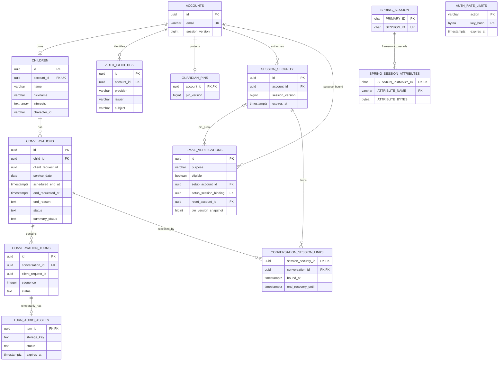
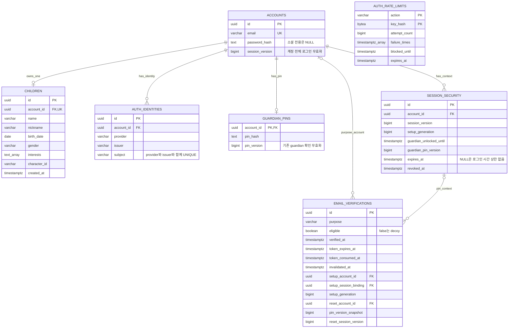
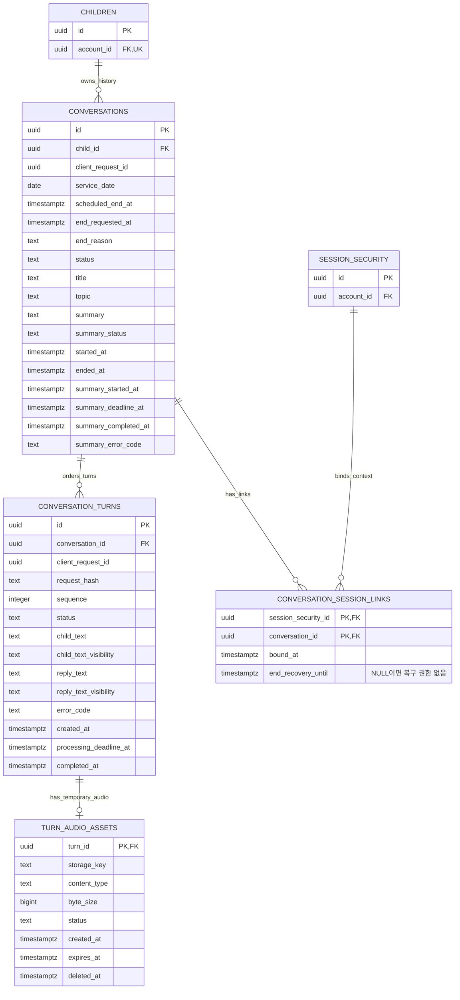
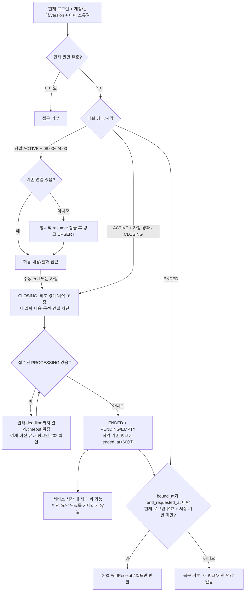
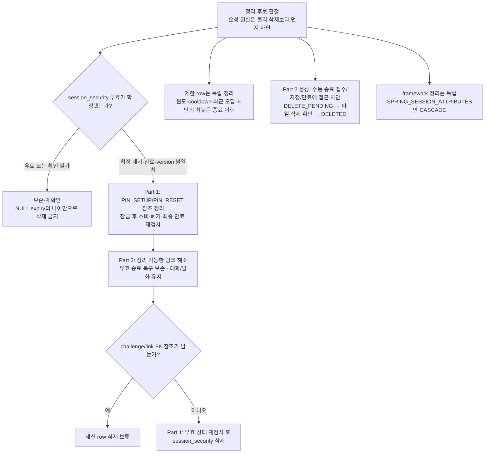
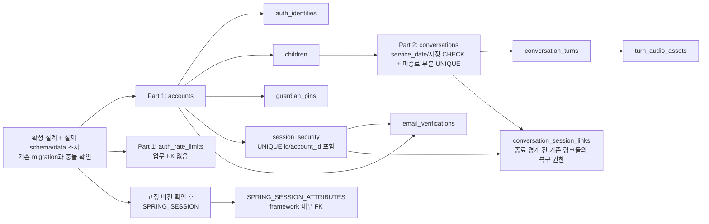

# DodamDodam 통합 ERD 설계서

2026-10-03 · v3.1 · P0 최종 통합 설계 · PostgreSQL 물리 모델 · 사용자 확정 결정 반영

이 문서는 두 파트의 제공 설계에 사용자 확정 결정을 반영한 최종 데이터 사전이다. **운영에 적용된 migration은 아니다.** 수동·자정 종료·당일 새 대화·기존 연결의 종료 복구·이메일 PIN 재설정·주제추천 제외를 API와 같은 기준으로 명시한다. 원문 기록, 사용자 확정 정책, 정책을 구현하기 위한 기술 설계, AI 응답 대기와 운영 연기를 구분한다. API 계약은 [통합 API 명세](Integrated_API_Spec.md), 담당별 작업과 남은 외부 확인은 FE·BE 인계서(별도 전달)를 따른다. 확정 근거는 [결정 기록](Decision_Record.md)이며 현재 DDL의 검증 범위와 결과는 §12.3에 기록한다.

빠른 보기: [ERD 다이어그램](#2-관계도와-공통-물리-규칙), [테이블 스키마 JSON](#integrated-db-schema-json). DB 읽기 결과와 공개 응답 JSON 매핑은 §13을 참고한다.

## 1. 출처·결정 상태·소유권

### 1.1 출처

| 약칭 | 제공 파일 | 문서에 기록된 기준 |
| --- | --- | --- |
| P0 | `Backend_P0_Common_Spec.md` (통합 전 원문, 별도 보관) | 공통 API 명세 v0.4, 2026-09-24. 제품 P0 범위와 기술 초안을 구분 |
| P1-ERD | `part1-erd.md` (통합 전 원문, 별도 보관) | Part 1 ERD v1.2, 2026-10-01. 업무 5개·보안 보조 2개 및 공유안 |
| P1-F | `part1-functional-spec.md` (통합 전 원문, 별도 보관) | Part 1 기능·처리·트랜잭션·제한 계약 |
| P1-API | `part1-api.yaml` (통합 전 원문, 별도 보관) | Part 1 공통 DTO의 required/nullable/상태별 schema |
| P1-G | `part1-api-guide.md` (통합 전 원문, 별도 보관) | 시각화 구성 참고. 최종 정책은 본 문서의 사용자 확정 결정이 우선 |
| P2-ERD | `part2-erd.md` (통합 전 원문, 별도 보관) | Part 2 ERD 초안, 2026-10-02. 업무 4개 |
| P2-API | `part2-api.md` (통합 전 원문, 별도 보관) | Part 2 API·공유 읽기 모델·복구 계약 |

각 절의 ‘근거’는 위 파일과 해당 절을 가리킨다. Spring Session 4.1.1 공식 스키마는 §6의 고정 버전 원문과 대조했다. 그 밖의 원문 외부 링크·변경 이력이나 실제 프로젝트 라이브러리 설정을 새로 검증한 것으로 간주하지 않는다.

### 1.2 상태 읽는 법

| 상태 | 이 문서에서의 의미 |
| --- | --- |
| 사용자 확정 | 이번 의사결정에서 확정한 P0 동작. 08–24시 이용·수동/자정 종료·기존 연결 복구·이름/애칭 분리·로그인/PIN·프로필·전체 이어 읽기·음성/hash·실패 응답·PIN 재설정 등 |
| 원문 채택 / 기술 기준 | 기존 보안·DB 구조 또는 확정 동작을 구현하기 위한 보수적인 기술 설계. 구현 완료나 사용자가 세부 알고리즘까지 선택했다는 뜻은 아님 |
| AI 응답 대기 | 입력/출력 스키마·저장/표시 허용·최대 길이·음성 MIME/용량·TTL·처리 timeout의 외부 확인. 임의 숫자로 대체하지 않음 |
| P0 제외 / 보류 | 추천 UI·추천 저장, 가입 동의 및 추가 보호자 정보, 별도 승인 체계를 이번 P0에 추가하지 않음. 기존 보안·소유권·입력 검사는 유지 |
| 운영 설계 연기 | 실제 배포/프레임워크/백업·보관·정리 운영과 부하 검증. 즉시 권한 무효화·기한 준수 등의 제품 동작을 미루는 의미가 아님 |

원문의 “Part 1 공유안”·“Part 2 초안”은 출처 상태다. 현재 정책은 §11의 분류로 갱신하며 이미 확정된 결정을 다시 승인 대기로 돌리지 않는다.

### 1.3 13개 테이블과 변경 책임

| 구분 | 소유 테이블 | 쓰기·migration 책임 |
| --- | --- | --- |
| Part 1 업무 5개 | `accounts`, `auth_identities`, `children`, `guardian_pins`, `email_verifications` | Part 1 |
| Part 1 보안 보조 2개 | `session_security`, `auth_rate_limits` | Part 1 |
| Part 2 업무 4개 | `conversations`, `conversation_turns`, `conversation_session_links`, `turn_audio_assets` | Part 2. 기록용 인덱스도 Part 2가 작성하고 Part 1과 검토 |
| 프레임워크 2개 | `SPRING_SESSION`, `SPRING_SESSION_ATTRIBUTES` | Spring Session 스키마 소유, Part 1/배포 담당이 실제 고정 버전·설정 검증 |

P0는 이메일·Google, 아이1명 등록/조회, 음성 대화, PIN 보호 기록이다(F-08). Kakao·다자녀·프로필 수정/삭제·선택지/문자 입력·사진·놀이·보상·꾸미기·감정 분석·알림·리포트 내보내기는 제외한다.

단일 backend·PostgreSQL을 전제로 내부 함수와 합의된 읽기 모델을 사용한다. Part 2는 계정·아이 테이블을 복제하지 않고, Part 1은 대화 테이블을 별도로 생성하지 않는다. 관심사/캐릭터 마스터, Home 전용 테이블, 장기 음성, rememberMe, 메일 Outbox, 동의·별도 PIN 재설정 proof 테이블은 추가하지 않는다.

**근거:** P0 §설계 책임과 데이터 경계·§파트 간 데이터·의존성 계약; P1-ERD §1·§8.2; P2-ERD §1.

## 2. 관계도와 공통 물리 규칙

### 2.1 전체 소유권·관계

<!-- diagram: erd-integrated-ownership -->


도식은 관계와 주요 키만 보여준다. `text_array`는 PostgreSQL `text[]` 표기이며 전체 열·복합키 묶음·부분 UNIQUE·NULL·CHECK는 아래 사전이 기준이다. 이메일 검증의 선택 FK는 목적별 조건을 따른다. PIN_SETUP/PIN_RESET은 `(setup_session_binding, setup_account_id)` 복합 FK로 같은 계정의 세션임을 보장한다.

### 2.2 공통 물리 규칙

| 규칙 | 통합 기준 |
| --- | --- |
| 표기 | NN=NOT NULL, N=NULL 허용. ‘앱 생성’은 SQL DEFAULT가 아닌 서버 생성. ‘없음’은 DB 기본값 없음. 생성 시 지정값도 SQL DEFAULT와 구분 |
| ID·시각 | 업무 PK는 서버 생성 UUID, 중복 식별자는 요청 UUID. 업무 시각은 `timestamptz`, 생년월일은 `date`. API는 같은 순간을 KST(+09:00)로 직렬화 |
| 열거형 | Part 1은 `varchar + CHECK`가 원문 채택 사항. Part 2는 `text + CHECK`를 유지하며 억지로 한 타입으로 바꾸지 않음 |
| FK·삭제 | 모든 업무 FK는 `ON DELETE RESTRICT`, PK 변경 금지. 프레임워크 속성 FK만 CASCADE 예외. 계정/아이 삭제·대화 CASCADE 정책 추가 없음 |
| 검사 경계 | 필수·유일성·상태/NULL 일관성은 DB, 정규화·개별 길이·카탈로그·현재 시각/권한·교차 테이블 상태는 서비스에서 추가 검사 |
| 현재 시각 | 요청 시 논리 만료를 먼저 적용. `now >= deadline`이면 거부/시간 초과 대상. 현재 시각에 의존하는 영구 CHECK를 만들지 않음 |
| 유한 시각·날짜 | 업무 시각 및 생년월일의 nonnull 값은 유한값으로 저장. §12 DDL의 `isfinite` 검사는 기존 유한 TTL/유효 날짜 계약을 구체화한다. 무상한 일반 로그인은 NULL로만 표현하며 PostgreSQL infinity를 종료 복구 등에 사용하지 않음 |
| 변경 불가 필드 | PK·소유 FK·중복 키·sequence·최초 연결/생성 시각의 불변성은 서비스 UPDATE 허용 목록으로 보장. FK만으로 참조 없는 PK의 변경까지 금지된다고 보지 않음 |
| 보안 저장 | 원문 비밀번호·PIN·인증번호·토큰·native 세션 ID·금지 텍스트를 업무 로그/대체 컬럼에 보관하지 않음 |
| 프레임워크 예외 | Spring Session의 `CHAR`, epoch ms `BIGINT`, `BYTEA`는 제공 원문의 참고 스키마. 업무 타입 규칙으로 일괄 변환하지 않음 |

**근거:** P1-ERD §2·§5·§8.2; P2-ERD §2–3; P0 §최소 ERD 관계 제안·§공통 요청 처리·응답 상세.


### 2.3 Part 1 상세 — 계정·아이·인증·PIN

계정과 PIN은 계정 단위, guardian/PIN_SETUP/PIN_RESET 권한은 현재 session_security 단위다. 아래는 이 차이를 읽기 위한 핵심 열이며, 전체 열·NULL·제약은 §3–4와 §12 DDL을 따른다. hash 이름은 저장 구조 설명이고 원문 자격값을 뜻하지 않는다. AUTH_RATE_LIMITS는 계정 생성 전 범위도 처리하므로 계정 FK가 없다.

<!-- diagram: erd-part1-account-auth-pin -->


EMAIL_VERIFICATIONS의 선택 관계는 목적에 맞을 때만 연결된다. 특히 PIN_SETUP/PIN_RESET은 `(setup_session_binding, setup_account_id)` 복합 FK로 동일 계정을 보장하고, guardian/lock은 현재 세션의 generation 증가와 두 PIN 목적 권한 폐기를 함께 수행한다. 도식만으로 token1회 소비·최신 version·만료·동시성 검사가 구현된 것은 아니다.

### 2.4 Part 2 상세 — 대화·발화·연결·임시 음성

CHILDREN과 SESSION_SECURITY는 Part 1 참조점이고 나머지 네 테이블은 Part 2가 소유한다. 대화는 service_date와 scheduled_end_at을 보관하며 ACTIVE → CLOSING → ENDED 상태 및 최초 종료 경계 end_requested_at/end_reason을 명시적으로 저장한다. 주제추천 컬럼은 없고 기존 API의 topicSuggestions는 항상 []다. Mermaid의 PK/FK만으로 부분 UNIQUE나 공개 허용 검사가 모두 표현되지는 않는다.

<!-- diagram: erd-part2-conversation-turn-audio -->


DB는 아이당 ACTIVE/CLOSING 합계 최대1개, 대화당 PROCESSING 최대1개, `(conversation_id, sequence)`/중복 요청 키 UNIQUE를 보장한다. `(child_id,service_date)` UNIQUE는 제거해 같은 날 ENDED 뒤 새 대화를 허용한다. 종료 복구는 수동·자정 종료 경계 전에 연결된 적격 기존 세션 여러 개에 부여하므로 링크의 복구 기한에 부분 UNIQUE를 두지 않는다. 세션 계정=아이 계정·복구 자격·모든 발화 terminal 후 종료·허용 결과/기한 내 반영은 서비스 트랜잭션 책임이다.

**시각화 근거:** P1-G §1·§6–9와 P1-ERD §1의 요약/상세 분리 방식; 데이터 계약은 본 문서 §3–6·§8·§12 및 P2-ERD §2–5.

## 3. Part 1 업무 테이블

### 3.1 accounts

| 컬럼 | 타입 | NULL | 기본값 | 키·의미 |
| --- | --- | --- | --- | --- |
| id | uuid | NN | 앱 생성 | PK |
| email | varchar(254) | NN | 없음 | UNIQUE, canonical ASCII 이메일 |
| password_hash | text | N | NULL | Argon2id 인코딩 문자열, 소셜 전용 계정은 NULL |
| session_version | bigint | NN | 0 | 로그인 무효화 버전, 비밀번호 재설정 시 증가 |
| created_at | timestamptz | NN | CURRENT_TIMESTAMP | 생성 시각 |
| updated_at | timestamptz | NN | CURRENT_TIMESTAMP | 실제 변경마다 서비스가 갱신 |

**제약·인덱스:** PK(id), UNIQUE(email); CHECK `session_version >= 0`, `email=lower(btrim(email)) AND char_length(email)>0`, `password_hash IS NULL OR char_length(password_hash)>0`. 이메일 문법은 서비스 검사. session_version 별도 인덱스 없음.

이메일 trim+소문자·ASCII·최대254자·Gmail 점/+suffix 보존, 새 비밀번호 15–128 Unicode 코드포인트·trim/정규화/절단 없음은 **기존 기술 기준**이다. 로그인에 생성용 길이 상한을 소급 적용하지 않는다. Argon2id와 초기 파라미터(19 MiB, 반복2, 병렬성1), 공통 Spring Security encoder 사용은 **Part 1 원문에 채택으로 기록**되어 있으며 실제 고정 버전·부하 검증은 별도다. 이메일 가입은 password_hash 필수, Google 신규 계정은 검증된 identity와 함께 저장한다. ‘비밀번호 또는 identity가 최소 하나’는 교차 테이블 조건으로 서비스 트랜잭션에서 보장한다. 가입 동의와 추가 보호자 정보 수집은 P0 제외다. 동의 누락으로 가입을 차단하거나 동의 API·필수 가입 단계·완료 boolean·테이블을 추가하지 않는다(D-15/F-07). 법적 보호자 확인을 완료했다고 표시하지 않는다.

**근거:** P1-ERD §3; P1-F §5.1·§5.4·§6.

### 3.2 auth_identities

| 컬럼 | 타입 | NULL | 기본값 | 키·의미 |
| --- | --- | --- | --- | --- |
| id | uuid | NN | 앱 생성 | PK |
| account_id | uuid | NN | 없음 | FK accounts(id), RESTRICT |
| provider | varchar(20) | NN | 없음 | GOOGLE |
| issuer | varchar(255) | NN | 없음 | 검증 후 canonical Google issuer |
| subject | varchar(255) | NN | 없음 | opaque sub, 대소문자 변환 금지 |
| created_at | timestamptz | NN | CURRENT_TIMESTAMP | 연결 생성 |

**제약·인덱스:** CHECK `provider IN ('GOOGLE')`; UNIQUE(provider, issuer, subject); 인덱스(account_id). 계정별 provider UNIQUE는 추가하지 않는다. 이메일만으로 identity를 연결하지 않는다. Google 전체 프로필·access/refresh token 저장 없음. Google-only 계정의 비밀번호 재설정 거부/토큰 미소비 정책은 기존 기술 기준이며 별도 비밀번호 수단을 자동 생성하지 않는다.

**근거:** P1-ERD §4; P1-F §6.2–6.3.

### 3.3 children

| 컬럼 | 타입 | NULL | 기본값 | 키·의미 |
| --- | --- | --- | --- | --- |
| id | uuid | NN | 앱 생성 | PK |
| account_id | uuid | NN | 없음 | FK accounts(id), UNIQUE, RESTRICT |
| name | varchar(5) | NN | 없음 | 보호자용 이름, trim 후 1–5 Unicode 코드포인트 |
| nickname | varchar(20) | NN | 없음 | 필수 애칭, trim 후 1–20 Unicode 코드포인트; 아이 화면·인사·AI 호칭 |
| birth_date | date | NN | 없음 | KST 오늘 이하의 유효 날짜 |
| gender | varchar(20) | NN | 없음 | MALE / FEMALE |
| interests | text[] | NN | '{}' | 순서를 보존하는 자유 입력 목록 |
| character_id | varchar(64) | NN | 없음 | 허용 카탈로그의 ASCII ID |
| created_at | timestamptz | NN | CURRENT_TIMESTAMP | Part 2 홈 joinedAt 기준 |

**제약·인덱스:** PK(id), UNIQUE(account_id). CHECK `char_length(name) BETWEEN 1 AND 5 AND name=btrim(name)`, `char_length(nickname) BETWEEN 1 AND 20 AND nickname=btrim(nickname)`, `gender IN ('MALE','FEMALE')`, `cardinality(interests) BETWEEN 0 AND 10`, 1차원·NULL 원소 없음(§12 DDL의 CASE 보호), `character_id ~ '^[A-Za-z0-9_-]{1,64}$'`.

이름·성별·관심사·캐릭터 ID 제한은 **사용자 확정 D-06**, 이름과 애칭의 분리·별도 입력/저장은 **사용자 확정 F-06**이다. 신규 nickname은 필수이며 trim 후 1–20 Unicode 코드포인트는 통합 기술 기준이다. null/빈 문자열을 거부하고 유일성·실명 인증은 추가하지 않는다. 서비스는 Unicode 입력을 trim한 뒤 코드포인트로 검사하며 DB의 btrim 검사만으로 모든 Unicode 공백 정규화가 보장된다고 보지 않는다. ChildView/CreateChildRequest/Home.child/내부 ChildContext에 nickname을 포함한다. 아이 화면·서버 Home.greeting·FE 고정 첫 인사는 nickname을 사용한다. AI에는 nickname을 호칭으로 매핑하며 실명 name을 자동 전송하지 않는다. 실제 AI 필드명은 D13 대기다. 관심사는 각 trim 후 1–30 코드포인트, 동일값 중복 거부·순서 보존을 서비스에서 검사한다. 다차원 배열에는 array_position을 호출하지 않도록 CASE로 분기해 CHECK 위반으로 거부하며 빈 배열은 허용한다. birth_date 미래 여부는 동적 CHECK가 아닌 서비스 검사이며 최저 연령을 만들지 않는다. 실제 캐릭터 카탈로그·기본값·폐기 ID 처리는 미정. Home은 children와 대화 행에서 아이 최소 프로필·인사·joinedAt/daysTogether·메뉴 및 당일 이용 가능 대화 ID를 읽으며 전용 테이블이 없다. 밤에도 Home은 읽을 수 있지만 TALK는 비활성이고 CLOSING ID를 activeConversationId에 반환하지 않는다. 시간 안의 CLOSING은 activeConversationId=null, canEnter=false/reason=CONVERSATION_CLOSING이고 시간 밖은 OUTSIDE_SERVICE_HOURS가 우선이다. ENDED 존재만으로 새 진입을 막지 않는다. 관심사 M:N 테이블·캐릭터 테이블은 현재 추가하지 않는다. 기존 긴 이름·UNSPECIFIED 등의 데이터 존재를 검증하지 않았으며, 이관 시 임의 절단·성별 지정 금지. Part 2는 이 행에서 ChildContext를 읽고 대화 행에 아이 정보를 복제하지 않는다.

**근거:** P1-ERD §6·§8.3; P1-F §7; P0 §파트 간 데이터·의존성 계약.

### 3.4 guardian_pins

| 컬럼 | 타입 | NULL | 기본값 | 키·의미 |
| --- | --- | --- | --- | --- |
| account_id | uuid | NN | 없음 | PK이자 FK accounts(id), RESTRICT |
| pin_hash | text | NN | 없음 | 비어 있지 않은 Argon2id 인코딩 문자열 |
| pin_version | bigint | NN | 1 | 성공한 PIN 재설정마다 증가 |
| created_at | timestamptz | NN | CURRENT_TIMESTAMP | 최초 설정 |
| updated_at | timestamptz | NN | CURRENT_TIMESTAMP | 최근 변경 |

**제약·인덱스:** PK(account_id); CHECK `pin_version>=1`, `char_length(pin_hash)>0`. 추가 인덱스 없음. 4자리 ASCII 숫자 PIN은 입력 경계에서 검사하며 선행0을 보존한다. Argon2id·무작위 salt·별도 pepper 없음은 **Part 1 원문에 채택으로 기록**. 초기 파라미터는 비밀번호와 같으며 실측 대기다.

보호자 확인 권한은 이 테이블에 boolean으로 저장하지 않고 session_security에 둔다. 최초 생성 성공은 unlock을 대신하지 않는다. 오답 차단만으로 pin_hash 삭제/pin_version 증가를 수행하지 않는다. PIN 재설정은 현재 로그인에서 이메일을 재인증한 PIN_RESET proof를 1회 소비한다(D-16). 성공 시 pin_version 증가와 모든 세션의 guardian/PIN 목적 권한 무효화를 같은 업무 Tx로 처리하고 일반 로그인·대화 연결은 유지한다. 기존 오답·차단·요청량 집계를 초기화하지 않는 처리는 우회 방지를 위한 보수적인 기술 설계이며 사용자가 직접 선택한 항목으로 표시하지 않는다.

**근거:** P1-ERD §7; P1-F §8; P0 §최초 PIN 설정 권한 초안.

### 3.5 email_verifications

| 컬럼 | 타입 | NULL | 기본값 | 키·의미 |
| --- | --- | --- | --- | --- |
| id | uuid | NN | 앱 생성 | PK, 공개 challengeId |
| email | varchar(254) | NN | 없음 | accounts와 같은 정규화 정책 |
| purpose | varchar(20) | NN | 없음 | SIGNUP / RESET_PASSWORD / PIN_SETUP / PIN_RESET |
| eligible | boolean | NN | 없음 | false=계정 존재 노출 방지 decoy, 성공 불가 |
| code_hash | bytea | NN | 없음 | HMAC-SHA-256, 32바이트 |
| expires_at | timestamptz | NN | 없음 | 발급 DB 시각+EMAIL_CODE_TTL |
| attempt_count | integer | NN | 0 | 해당 challenge의 실제 오답 횟수 |
| verified_at | timestamptz | N | NULL | 번호 검증 성공 시각, 번호 재사용 금지 |
| token_hash | bytea | N | NULL | secret 문자열 UTF-8 바이트의 SHA-256, 32바이트 |
| token_expires_at | timestamptz | N | NULL | 검증 성공 시각+VERIFICATION_TOKEN_TTL |
| token_consumed_at | timestamptz | N | NULL | 토큰 소비와 업무 변경 커밋 시각 |
| invalidated_at | timestamptz | N | NULL | 재발급·lock·세션 무효·발송 실패/불명확·키 교체 폐기 |
| setup_account_id | uuid | N | NULL | PIN_SETUP/PIN_RESET FK accounts(id), RESTRICT |
| setup_session_binding | uuid | N | NULL | PIN_SETUP/PIN_RESET FK session_security(id), RESTRICT |
| setup_generation | bigint | N | NULL | 두 PIN 목적 발급 시 세션 generation 스냅샷 |
| pin_version_snapshot | bigint | N | NULL | PIN_RESET만 현재 guardian_pins.pin_version 스냅샷, 1 이상 |
| reset_account_id | uuid | N | NULL | eligible RESET_PASSWORD만 FK accounts(id), RESTRICT |
| reset_session_version | bigint | N | NULL | 재설정 발급 당시 계정 version |
| created_at | timestamptz | NN | CURRENT_TIMESTAMP | 서비스는 발급 잠금 후 읽은 DB 시각을 명시 |

`reset_account_id/reset_session_version`은 기존 비밀번호 재설정 기술 기준이다. 신규 SIGNUP·decoy는 존재하지 않는 계정 FK를 요구하지 않는다. PIN_SETUP/PIN_RESET은 decoy를 허용하지 않으며 이메일·계정·현재 securityContext를 서버가 결정한다. setup_* 세 컬럼의 기존 이름을 유지하여 두 PIN 목적에 재사용하고, PIN_RESET의 기존 PIN 버전만 pin_version_snapshot에 추가한다. PIN_RESET 별도 테이블은 없다. 번호/토큰 TTL·재발급 간격·요청량/오답 제한은 기존 이메일 인증 기준을 재사용하는 기술 설계이며 새 사용자 선택값으로 표현하지 않는다.

**필수 CHECK:**

```sql
CHECK (purpose IN ('SIGNUP', 'RESET_PASSWORD', 'PIN_SETUP', 'PIN_RESET')),
CHECK (email = lower(btrim(email)) AND char_length(email) > 0),
CHECK (attempt_count >= 0 AND expires_at > created_at),
CHECK (octet_length(code_hash) = 32),
CHECK (token_hash IS NULL OR octet_length(token_hash) = 32),
CHECK (
  (verified_at IS NULL AND token_hash IS NULL AND token_expires_at IS NULL)
  OR
  (verified_at IS NOT NULL AND token_hash IS NOT NULL
   AND token_expires_at IS NOT NULL AND token_expires_at > verified_at)
),
CHECK (token_consumed_at IS NULL OR
       (verified_at IS NOT NULL AND token_consumed_at >= verified_at)),
CHECK (token_consumed_at IS NULL OR invalidated_at IS NULL),
CHECK (invalidated_at IS NULL OR invalidated_at >= created_at),
CHECK (verified_at IS NULL OR verified_at >= created_at),
CHECK (eligible OR verified_at IS NULL),
CHECK (
  (purpose IN ('PIN_SETUP','PIN_RESET') AND eligible
   AND setup_account_id IS NOT NULL AND setup_session_binding IS NOT NULL
   AND setup_generation IS NOT NULL AND setup_generation >= 0)
  OR
  (purpose NOT IN ('PIN_SETUP','PIN_RESET') AND setup_account_id IS NULL
   AND setup_session_binding IS NULL AND setup_generation IS NULL)
),
CHECK (
  (purpose = 'PIN_RESET' AND pin_version_snapshot IS NOT NULL AND pin_version_snapshot >= 1)
  OR (purpose <> 'PIN_RESET' AND pin_version_snapshot IS NULL)
),
CHECK (
  (purpose = 'RESET_PASSWORD' AND eligible AND reset_account_id IS NOT NULL
   AND reset_session_version IS NOT NULL AND reset_session_version >= 0)
  OR
  ((purpose <> 'RESET_PASSWORD' OR NOT eligible)
   AND reset_account_id IS NULL AND reset_session_version IS NULL)
)
```

**FK·인덱스:** 개별 FK 외에 `(setup_session_binding,setup_account_id) → session_security(id,account_id)` 복합 FK(RESTRICT)를 둔다. 독립 FK 두 개만으로는 다른 계정 세션과의 잘못된 결합을 막지 못한다.

| 인덱스 | 조건·용도 |
| --- | --- |
| PK(id) | challengeId로 단일 조회 |
| (email,purpose,created_at DESC) | 공개 목적 발급·재발급 범위 |
| (setup_account_id,setup_session_binding) | WHERE purpose IN ('PIN_SETUP','PIN_RESET') AND token_consumed_at IS NULL AND invalidated_at IS NULL |
| (reset_account_id) | WHERE purpose='RESET_PASSWORD' AND token_consumed_at IS NULL AND invalidated_at IS NULL |
| (created_at) | 정리 후보 조회. 실제 권한 만료 조건은 잠금 후 재검사 |

token_hash 인덱스는 없다. 토큰은 `challengeId.secret`, secret은 CSPRNG 32바이트를 padding 없는 Base64url 43자로 인코딩하며 원문을 DB에 저장하지 않는다. challengeId로 조회한 뒤 해시를 상수 시간 비교하고 purpose·eligible·기한·소비·폐기·계정/세션/version/generation을 검사한다. 번호 성공은 1회이며 검증 성공 후 번호 만료와 토큰 만료를 별도로 판정한다. PIN_RESET 발급·검증·소비는 현재 로그인/계정/securityContext/setup_generation/현재 accounts.email/최신 pin_version 결합을 재검사한다. Google-only도 같은 현재 계정 이메일로 재인증할 수 있으며 비밀번호 수단을 만들지 않는다. 기존 PIN 입력이나 guardian unlock은 요구하지 않는다. 기존 PIN이 없는 계정은 PIN_SETUP을 사용한다. PIN reset 성공은 토큰 소비·PIN hash 갱신·pin_version 증가·모든 guardian 확인과 남은 두 PIN 목적 권한 폐기를 원자적으로 커밋하며 자동 unlock하지 않는다.

번호 HMAC 키는 CSPRNG 32바이트, 이메일 인증 전용으로 요청 제한 키와 분리한다. 접근 제한 파일/Compose secrets, 개발·테스트와 운영 분리, 환경 내 인스턴스 간 동일 키 유지는 **Part 1 원문에 채택으로 기록**되어 있다. 키 교체는 발급/검증/소비 작업 정리 후 미소비·미폐기 행만 폐기한다. 이미 소비한 행에 invalidated_at을 추가하지 않으며 요청 제한·세션·대화 상태는 초기화하지 않는다. 키 버전 테이블을 추가하지 않는다.

**근거:** P1-ERD §5; P1-F §5.1.1–5.3·§8.1·§11; P0 §최초 PIN 설정 권한 초안.

## 4. Part 1 보안 보조 테이블

### 4.1 session_security

| 컬럼 | 타입 | NULL | 기본값 | 키·의미 |
| --- | --- | --- | --- | --- |
| id | uuid | NN | 앱 생성 | PK, 프레임워크 세션 내부 securityContextId |
| account_id | uuid | NN | 없음 | FK accounts(id), RESTRICT |
| session_version | bigint | NN | 없음 | 로그인 시 accounts.session_version 스냅샷 |
| setup_generation | bigint | NN | 0 | 두 PIN 목적 폐기 generation, guardian/lock 때 증가 |
| guardian_unlocked_until | timestamptz | N | NULL | 현재 세션의 보호자 확인 기한 |
| guardian_pin_version | bigint | N | NULL | 확인에 사용한 guardian_pins.pin_version |
| created_at | timestamptz | NN | CURRENT_TIMESTAMP | 보안 문맥 생성 |
| expires_at | timestamptz | N | 없음 | NULL=일반 로그인 시간 상한 없음, 사용자 확정 D-04 |
| revoked_at | timestamptz | N | NULL | 확정 세션 폐기 시각 |

**제약·인덱스:** PK(id), UNIQUE(id,account_id), 인덱스(account_id), 인덱스(expires_at). CHECK `session_version>=0`, `setup_generation>=0`; guardian 두 필드는 함께 NULL 또는 함께 nonnull이며 nonnull version>=1; `expires_at IS NULL OR expires_at>created_at`; `revoked_at IS NULL OR revoked_at>=created_at`; `expires_at IS NULL OR guardian_unlocked_until<=expires_at`.

로그인은 **프레임워크 세션 유효 + principal.accountId 일치 + securityContextId 일치 + 미폐기 + (expires_at이 NULL이거나 현재 시각이 유한 expires_at 미만) + 계정 session_version 일치**를 모두 요구한다. row나 ID만으로 로그인하지 않는다. guardian 권한은 guardian_unlocked_until>현재 시각과 현재 PIN version 일치를 추가로 요구한다. 보안 DB 확인 불가는 접근 허용이나 ‘행 없음’으로 해석하지 않고 503으로 닫는다. P0에서는 이 권한 read를 캐시하지 않으며 이전 캐시로 즉시 무효화를 우회하지 않는다.

일반 로그인 expires_at=NULL, 별도 rememberMe 없음, JSESSIONID 365일 보관·유효 사용 후 갱신, 보호자 확인 최대1800초는 **사용자 확정 D-04**다. 실제 프레임워크/쿠키 구현 검증은 별도다. NULL 로그인 기한은 보호자 확인이나 종료 복구의 유한 기한을 없애지 않는다. 쿠키 갱신은 새 context·guardian/PIN_SETUP/PIN_RESET·종료 복구 권한을 생성하거나 연장하지 않는다. 익명/OAuth 임시 세션은 기존 유한 수명을 유지한다.

lock은 guardian 두 필드를 NULL로, setup_generation을 증가시키고 현재 PIN_SETUP/PIN_RESET을 폐기한다. PIN reset은 pin_version으로 모든 기존 guardian 권한을 무효화하고 소비한 현재 proof를 제외한 모든 미소비 PIN_SETUP/PIN_RESET challenge/token을 같은 업무 트랜잭션에서 폐기한다. 로그인·기존 대화 연결은 유지한다. CLOSING/ENDED의 내용 차단과 종료 확인 기한은 그대로 적용한다. 비밀번호 reset은 계정 session_version 증가와 남은 RESET_PASSWORD/PIN_SETUP/PIN_RESET 권한 폐기로 모든 기존 로그인/연결 접근을 무효화한다. 로그아웃/세션 교체는 이전 문맥을 폐기한다. 프레임워크 삭제가 지연되어도 버전·폐기 검사를 우회하지 않는다. 유효 문맥을 나이만으로 청소하지 않으며 orphan row로 세션을 복원하지 않는다.

**근거:** P1-ERD §8; P1-F §6·§8·§10.1·§11; P0 §세션·권한 무효화 초안.

### 4.2 auth_rate_limits

| 컬럼 | 타입 | NULL | 기본값 | 키·의미 |
| --- | --- | --- | --- | --- |
| action | varchar(40) | NN | 없음 | 복합 PK 일부, 아래 고정 action |
| key_hash | bytea | NN | 없음 | 복합 PK 일부, 전용 HMAC-SHA-256 32바이트 |
| window_started_at | timestamptz | NN | 없음 | 고정창 시작; PIN 오답은 가장 오래된 잔여 오답, 없으면 판정 시각 |
| attempt_count | bigint | NN | 0 | 예약 요청 수; PIN 오답은 배열 원소 수 |
| failure_times | timestamptz[] | N | NULL | PIN_FAILURE_ACCOUNT만 1차원 오답 시각 배열 |
| blocked_until | timestamptz | N | NULL | 예산·재발급 cooldown·PIN 차단 기한 |
| expires_at | timestamptz | NN | 없음 | 모든 해당 제한의 효력이 끝난 뒤 청소 가능한 시각 |

**제약·인덱스:** PK(action,key_hash), 인덱스(expires_at). CHECK `octet_length(key_hash)=32`, `attempt_count>=0`, `expires_at>window_started_at`, `blocked_until IS NULL OR expires_at>=blocked_until`, 아래 목적별 배열 검사. 계정 생성 전 이메일/IP도 다루므로 accounts FK 없음.

```sql
CHECK (
  (action = 'PIN_FAILURE_ACCOUNT'
   AND failure_times IS NOT NULL
   AND cardinality(failure_times) BETWEEN 0 AND 5
   AND CASE WHEN coalesce(array_ndims(failure_times), 1) = 1
            THEN array_position(failure_times, NULL) IS NULL ELSE false END
   AND attempt_count = cardinality(failure_times))
  OR (action <> 'PIN_FAILURE_ACCOUNT' AND failure_times IS NULL)
)
```

고정창·성공 포함 사전 예약·별도 커밋과 key_hash 방식은 **Part 1 원문에 채택으로 기록**. 아래 수치는 **기존 Part 1 기술 기준값**이며 운영 부하 검증은 연기 상태다(D-17). HMAC 입력은 action+정규화 범위이며 원문 이메일/IP/account 식별값은 이 테이블에 저장하지 않는다. 전용 키는 이메일 인증 키와 분리하며, 교체해도 활성 차단·사용한 예산을 초기화하지 않는다.

| action | 누적 범위 | 기존 기술 기준 수치·의미 |
| --- | --- | --- |
| API_IP | 신뢰한 실제 클라이언트 IP | 300회/60초, 양 파트·OAuth·조회·polling·재시도 합산 |
| EMAIL_SEND_SUBJECT | 공개 email+purpose / PIN_SETUP/PIN_RESET accountId+purpose | 5회/900초, decoy 포함 |
| EMAIL_SEND_IP | IP, 모든 purpose 합산 | 20회/900초 |
| EMAIL_RESEND | 공개 email+purpose / PIN_SETUP/PIN_RESET accountId+securityContextId+purpose | 이전 발급 후 60초부터 재발급 |
| EMAIL_VERIFY_SUBJECT | 공개 email+purpose / PIN_SETUP/PIN_RESET accountId+purpose | 10회/900초, 새 세션/재발급으로 초기화 금지 |
| EMAIL_VERIFY_IP | IP, 모든 purpose 합산 | 100회/900초, challenge 조회 전 존재하지 않는 ID도 예약 |
| LOGIN_EMAIL | 정규화 email | 10회/900초, 계정 없음 포함 |
| LOGIN_IP | IP | 100회/900초, Google OAuth에는 적용 안 함 |
| PIN_UNLOCK_ACCOUNT | accountId | 20회/900초, 성공 포함 |
| PIN_UNLOCK_IP | IP | 100회/900초, 전체 요청량 거부는 실제 오답에 추가 안 함 |
| PIN_FAILURE_ACCOUNT | accountId | 최근900초 실제 오답5회 → 5번째 판정 시각부터900초 차단 |

API_IP부터 별도 예약·커밋하고 번호 검증은 EMAIL_VERIFY_IP도 조회 전에 별도 예약·커밋한다. 이후 같은 단계의 업무 제한 키를 정렬해 짧은 트랜잭션에서 함께 예약한다. 해당 단계가 거부되면 그 단계만 롤백하며 이미 커밋한 선행 예산은 유지한다. 업무 row lock을 얻은 채 선행 제한 트랜잭션을 역순으로 기다리지 않는다. 한도번째 요청은 처리하고 다음부터429; 성공/업무 실패/재발급/로그아웃으로 예약을 되돌리지 않는다. blocked_until이 미래면 거부한다. 차단이 해제되어도 유효한 윈도의 예산이 소진됐으면 윈도 끝까지 거부하고, 예산이 남았다면 기존 count로 계속 처리한다. 요청량 윈도와 차단이 모두 끝난 경우에만 새 count=0으로 시작한다. 차단 중 요청으로 기한을 연장하지 않는다. 신뢰되지 않은 전달 헤더를 실제 IP로 사용하지 않는다.

유효한 action 목록·HMAC 입력 직렬화, 오답 배열 각 시각의 유한성·순서는 서비스에서 검사한다. PIN 오답은 요청량 고정창과 별개다. 계정 잠금 후 DB 판정 시각 t의 `(t-900초,t]`만 남기고 같은 시각의 다른 오답도 별개 원소로 보존한다. 차단 중 해시 비교·차단 연장 없음. 성공은 오답을 추가하거나 초기화하지 않는다. `now=blocked_until`부터 이 차단은 종료하되 다른 요청량 제한은 유지한다. PIN reset 후에도 오답·차단·요청량 집계는 유지한다. 이는 반복 재설정으로 차단을 우회하지 못하게 하는 보수적인 기술 설계다. challenge 자체의 실제 이메일 오답은 별도 attempt_count에 저장하며 5번째 오답은 폐기를 커밋한 뒤429, 이후 기다려도 해당 challenge는 복원하지 않는다.

Retry-After는 모든 적용 제한 중 가장 늦은 재시도 시각까지 올림 초, 최소1이다. 고정창 경계 집중·공유 IP·알려진 이메일 예산 소진·프록시 신뢰·부하는 운영 검증 대상이며 300회/60초는 실측으로 확정된 최적값이 아니다.

**근거:** P1-ERD §9; P1-F §12.1–12.2.

## 5. Part 2 업무 테이블

이 절은 사용자 확정 동작을 반영한 Part 2 최종 통합 물리 모델이다. 날짜/자동 종료/복구의 제품 정책과 이를 구현할 DB·트랜잭션 제약을 구분한다. 별도 표기가 없는 컬럼에 SQL DEFAULT를 두지 않고 서비스가 명시적으로 입력한다.

### 5.1 conversations

| 컬럼 | 타입 | NULL | SQL 기본값 | 키·생성값·의미 |
| --- | --- | --- | --- | --- |
| id | uuid | NN | 없음 | PK, 서버 생성 |
| child_id | uuid | NN | 없음 | FK children(id), RESTRICT |
| client_request_id | uuid | NN | 없음 | 시작 중복 식별자 |
| service_date | date | NN | 없음 | 대화가 시작한 KST 날짜; 아이와 일별 UNIQUE 없음 |
| scheduled_end_at | timestamptz | NN | 없음 | service_date의 다음날 KST 00:00, 생성 후 불변 |
| status | text | NN | 없음 | ACTIVE / CLOSING / ENDED, 생성 시 ACTIVE |
| end_requested_at | timestamptz | N | 없음 | 최초 종료 경계; MANUAL은 잠금 후 DB 시각, MIDNIGHT는 scheduled_end_at |
| end_reason | text | N | 없음 | MANUAL / MIDNIGHT, 최초 경계와 함께 고정 |
| title | text | N | 없음 | 허용된 제목, 길이 미정 |
| topic | text | N | 없음 | 허용된 주제, 길이 미정 |
| summary | text | N | 없음 | 허용된 요약, 길이 미정 |
| summary_status | text | NN | 없음 | NOT_STARTED / PENDING / READY / FAILED / EMPTY, 생성 시 NOT_STARTED |
| started_at | timestamptz | NN | 없음 | 생성 시 DB 시각 |
| ended_at | timestamptz | N | 없음 | 수동/자정 종료 후 모든 발화 terminal을 확인한 종료 Tx의 DB 판정 시각; 물리 commit timestamp 조회값이 아님 |
| summary_started_at | timestamptz | N | 없음 | 요약 접수 시각 |
| summary_deadline_at | timestamptz | N | 없음 | summary_started_at+SUMMARY_PROCESSING_TIMEOUT |
| summary_completed_at | timestamptz | N | 없음 | READY/FAILED 확정 시각 |
| summary_error_code | text | N | 없음 | FAILED 내부 고정 코드, AI 원문 오류 금지 |

**제약·인덱스:** PK(id), UNIQUE(child_id,client_request_id); UNIQUE(child_id) WHERE status IN ('ACTIVE','CLOSING'); 일별 UNIQUE 없음; 인덱스(child_id,started_at DESC,id DESC); 인덱스(summary_deadline_at) WHERE summary_status='PENDING'. enum은 위 목록으로 CHECK한다. 같은 시작 키가 ENDED에 있으면 새 대화로 재사용하지 않는다. service_date는 유한한 날짜이며 `scheduled_end_at = ((service_date + 1)::timestamp AT TIME ZONE 'Asia/Seoul')`, `started_at >= ((service_date + time '08:00') AT TIME ZONE 'Asia/Seoul') AND started_at < scheduled_end_at`을 CHECK한다.

| 상태 | 필수 CHECK·교차 규칙 |
| --- | --- |
| ACTIVE | end_requested_at/end_reason/ended_at NULL, summary_status=NOT_STARTED, 요약 시각/오류 및 title/topic/summary 모두 NULL |
| CLOSING | end_requested_at/end_reason nonnull, ended_at NULL, summary_status=NOT_STARTED, 요약 시각/오류 및 세 텍스트 NULL |
| ENDED | end_requested_at/end_reason/ended_at nonnull, ended_at>=end_requested_at>=started_at, summary_status는 PENDING/READY/FAILED/EMPTY |
| 종료 경계 | MANUAL이면 started_at<=end_requested_at<scheduled_end_at, MIDNIGHT이면 end_requested_at=scheduled_end_at. 중복 end/자정 관측은 최초 경계·사유를 변경하지 않음 |
| PENDING | summary_started_at/deadline nonnull, completed/error NULL, 세 텍스트 NULL |
| READY | 시작/기한/완료 nonnull, error NULL, title/topic/summary 모두 nonnull 허용 문자열; summary_completed_at<summary_deadline_at |
| FAILED | 시작/기한/완료/error nonnull, 오류 코드 길이1 이상, 세 텍스트 NULL |
| EMPTY | 요약 시각/오류/세 텍스트 모두 NULL. 발화가 없거나 요약 입력으로 쓸 허용 nonnull 텍스트 없음은 서비스가 검사. 행을 ENDED 기록으로 유지하며 요약 AI 호출 없음 |
| 요약 시각 | nonnull이면 deadline>summary_started_at, completed>=summary_started_at |

PENDING 결과는 잠금 후 DB 판정 시각<deadline일 때만 반영하고 그 시각을 summary_completed_at으로 기록한다. 기한 경계부터 FAILED 대상이다. 성공 완료 시각<deadline CHECK를 추가해 저장값도 같은 계약을 따른다. 최초 ENDED 전이 커밋 실행자(timer/요청 시 정리 공통)가 PENDING 요약의 실행을 한 번 시도한다(D-11). 커밋과 외부 호출 사이 장애가 가능하므로 정확히 한 번 실행을 보장하지 않는다. 실패/불명확 결과를 무조건 재호출하지 않고 deadline 경계부터 FAILED로 정리한다. READY에 필요한 필드가 누락되거나 저장/표시가 금지되면 임의 텍스트로 채우지 않는다. FAILED 뒤 늦은 결과 덮어쓰기 없음. 요약 상태가 바뀌어도 이미 ENDED인 발화 추가·terminal 결과 덮어쓰기는 허용하지 않는다.

**대화 수명:** 아이 대화 접근은 KST 08:00 이상 다음날 00:00 미만이다. 화면 이탈은 종료가 아니며 당일 ACTIVE의 허용 기록을 유지한다. 이야기 마치기는 종료를 요청하고 홈으로 이동한다. 새 시작 키로 같은 날 다시 시작하면 새 ID를 생성하되, 기존 CLOSING이 ENDED가 될 때까지는 `409 CONVERSATION_CLOSING`으로 막는다. 요약 PENDING/READY/FAILED/EMPTY 여부는 새 대화를 막지 않는다. 같은 시작 키의 ENDED 재전송은 `409 CONVERSATION_ENDED`이며 새 행을 만들지 않는다.

수동 end와 발화 접수는 같은 conversation row 잠금으로 직렬화한다. 잠금 후 DB 시각이 scheduled_end_at 미만인 최초 end는 MANUAL/end_requested_at=그 DB 시각, 자정 이후 처음 관측한 종료는 MIDNIGHT/end_requested_at=scheduled_end_at을 저장한다. 기존 CLOSING의 경계와 사유는 재요청·자정·작업 재시작으로 덮어쓰지 않는다. 접수가 먼저면 기존 PROCESSING을 원래 processing_deadline_at까지 drain하고, end가 먼저면 새 발화를 거부한다. CLOSING에는 신규 입력·아이용 본문/음성/resume·새 연결을 차단한다. 기존 허용 결과의 DB 저장은 기한 내 계속 가능하며 늦은 callback은 terminal을 덮어쓰지 않는다.

모든 발화가 terminal이거나 발화가 없으면 같은 짧은 종료 Tx에서 ENDED와 요약 PENDING/EMPTY를 확정한다. 처리 중 발화가 없으면 외부에서 CLOSING이 관측되기 전에 곧바로 ENDED가 될 수 있다. 요약이 먼저 끝나기를 기다리지 않으며 이전 대화의 결과는 원래 conversationId에만 저장한다. FE의 첫 인사는 고정 템플릿으로 표시하고 AI·TTS 호출, conversation_turns 행, 발화 수, 요약 입력에 포함하지 않는다. 예시는 "{nickname}, 오늘 만나서 반가워!"다.

자정 타이머, `ACTIVE AND scheduled_end_at<=now` 재시작/주기 정리, 저장된 CLOSING 재확인, 처리 결과·timeout 확정, start 선행 정리는 같은 잠금/종료 전이를 사용한다. 지난 날짜의 미종료 행도 ENDED로 정리되기 전에는 새 대화를 만들지 않는다. 처리기한이 남으면 `CONVERSATION_CLOSING`을 반환한다. service_date와 scheduled_end_at은 불변이며 클라이언트가 보내지 않는다. 신규 turn.created_at은 잠금 후 DB 시각이고 ACTIVE 및 자정 이전 조건을 서비스가 보장한다. 조회·장시간 요청은 응답 전달 직전 상태/권한/자정을 재검사한다. 요약 재시도·별도 브로커/작업 테이블은 추가하지 않고 정확한 정리 주기는 D17 운영 설계로 남긴다.

**근거:** P2-ERD §3 conversations·§4–5; P2-API §4 ConversationView·§9; P1-ERD §10.

### 5.2 conversation_turns

| 컬럼 | 타입 | NULL | SQL 기본값 | 키·생성값·의미 |
| --- | --- | --- | --- | --- |
| id | uuid | NN | 없음 | PK, 서버 생성 |
| conversation_id | uuid | NN | 없음 | FK conversations(id), RESTRICT |
| client_request_id | uuid | NN | 없음 | 발화 중복 식별 |
| request_hash | text | NN | 없음 | 원본 audio 파트 실제 바이트만 SHA-256, 소문자 hex64(D-08 A) |
| sequence | integer | NN | 없음 | 서버 순번, 1 이상, 실패해도 재사용 금지 |
| status | text | NN | 없음 | PROCESSING / SUCCEEDED / FAILED, 생성 시 PROCESSING |
| child_text | text | N | 없음 | 저장·표시가 모두 허용된 아이 텍스트 |
| child_text_visibility | text | NN | 없음 | VISIBLE / REDACTED / OMITTED, 생성 시 OMITTED |
| reply_text | text | N | 없음 | 저장·표시가 모두 허용된 답변 텍스트 |
| reply_text_visibility | text | NN | 없음 | VISIBLE / REDACTED / OMITTED, 생성 시 OMITTED |
| error_code | text | N | 없음 | FAILED 고정 오류 코드 |
| created_at | timestamptz | NN | 없음 | 접수 DB 시각 |
| processing_deadline_at | timestamptz | NN | 없음 | created_at+TURN_PROCESSING_TIMEOUT |
| completed_at | timestamptz | N | 없음 | 성공/실패 확정 시각 |

**제약·인덱스:** PK(id), UNIQUE(conversation_id,client_request_id), UNIQUE(conversation_id,sequence); UNIQUE(conversation_id) WHERE status='PROCESSING'; 인덱스(processing_deadline_at) WHERE status='PROCESSING'. CHECK request_hash 소문자 hex64, sequence>=1, deadline>created_at, completed_at IS NULL OR completed_at>=created_at 및 enum 목록. 복합 UNIQUE가 대화별 순번 조회 인덱스 역할을 하므로 같은 인덱스를 중복 생성하지 않는다.

| 조건 | 필수 CHECK·허용 규칙 |
| --- | --- |
| PROCESSING | completed_at/error_code/두 텍스트 NULL, 두 visibility=OMITTED |
| SUCCEEDED | completed_at nonnull, error_code NULL, completed_at<processing_deadline_at |
| FAILED | completed_at/error_code nonnull, 오류 코드 길이1 이상. 허용 텍스트는 개별 필드 계약을 따름 |
| 각 텍스트 | `(visibility='OMITTED' AND text IS NULL) OR (visibility IN ('VISIBLE','REDACTED') AND text IS NOT NULL)`를 두 필드에 각각 적용 |
| 공개 정보 누락/금지 | 저장 또는 표시 중 하나라도 금지/불명확이면 해당 텍스트 NULL·OMITTED. REDACTED는 허용된 가공 문자열만 저장 |

**주제추천은 P0 보류(D-09):** topic_suggestions 컬럼·추천 UI·별도 추천 저장은 두지 않는다. 기존 아이용 응답의 topicSuggestions는 최초/중복 POST·GET 모두 항상 `[]`다. AI가 허용된 replyText로 자연스럽게 대화를 이어간다.

topicSuggestions·audio·request_hash·clientRequestId·처리기한·위험 신호는 **보호자 TurnView에 넣지 않는다**. STT 무음은 `422 STT_NO_SPEECH`+FAILED, TTS 실패는 `502 AI_UPSTREAM_FAILED`+FAILED이며 이미 허용된 텍스트는 각 visibility 계약에 따라 보존한다(D-10). 이미 202로 접수된 경우에도 아직 당일 이용 시간·현재 권한이 유효할 때만 GET은 `200`+FAILED 저장 결과를 반환한다. CLOSING/ENDED 또는 자정 뒤에는 저장 성공/실패와 무관하게 아이용 내용 GET을 차단한다. CLOSING은 409 CONVERSATION_CLOSING이며 시간 밖 차단 우선순위는 API 계약을 따른다. 최초422/502 ApiError 안에 보존 텍스트나 성공 data를 혼합하지 않는다. TTS 실패의 audio는 null이며 topicSuggestions는 []다. 새 상태·별도 TTS 오류 컬럼은 추가하지 않는다.

완료 시각은 AI가 전달한 임의 시각이 아니라 결과 반영 잠금 후 읽은 DB 판정 시각이다. 성공은 그 시각이 deadline 미만이어야 하며 FAILED는 기한과 같거나 지난 시각에 기록될 수 있다. P1-API TurnView의 errorCode minLength=1과 맞춰 빈 실패 코드도 거부한다.

sequence는 대화 row lock 아래 MAX(sequence)+1로 부여한다. 같은 키/같은 해시는 기존 PROCESSING 또는 완료 결과를 반환하고 AI를 재호출하지 않는다. 같은 키/다른 해시는409. 해시는 원본 audio 파트의 실제 바이트만 SHA-256으로 계산해 소문자 hex64로 저장한다(D-08 A). 파일명·multipart boundary·clientRequestId·MIME 등 메타데이터는 해시 입력에서 제외한다. 디코딩/재인코딩한 오디오가 아니라 수신한 원본 바이트를 사용한다. 늦은 AI 결과는 terminal 상태를 덮어쓰지 않는다.

**근거:** P2-ERD §3 conversation_turns·§4–6; P2-API §2.4–2.6·§4 TurnView·§8–9; P0 §공통 응답 객체·§공유 TurnView 작성 예시. D-09에 따라 원문 응답 필드만 빈 배열로 유지하고 저장 컬럼은 제외한다.

### 5.3 conversation_session_links

Part 2의 불투명 연결 식별자를 Part 1 session_security UUID와 명시적으로 연결한다. migration 소유자는 Part 2다. 종료 복구는 수동·자정 종료 경계 전에 연결된 모든 적격 기존 세션에 동일하게 부여하며 종료 요청 승자 하나로 제한하지 않는다.

| Part 2 원문 | 통합 물리명 | 해석 |
| --- | --- | --- |
| session_binding text | session_security_id uuid | session_security(id) FK. native 세션 ID가 아님 |
| linked_at | bound_at | 최초 연결 시각 |
| end_recovery_expires_at | end_recovery_until | 적격 기존 연결의 고정된 종료 복구 기한 |

| 컬럼 | 타입 | NULL | SQL 기본값 | 키·의미 |
| --- | --- | --- | --- | --- |
| session_security_id | uuid | NN | 없음 | 복합 PK 일부, FK session_security(id), RESTRICT |
| conversation_id | uuid | NN | 없음 | 복합 PK 일부, FK conversations(id), RESTRICT |
| bound_at | timestamptz | NN | 없음 | 시작/resume 최초 연결 시각, 반복 resume 시 유지 |
| end_recovery_until | timestamptz | N | 없음 | NULL=복구 권한 없음; 적격 기존 연결이면 ended_at+600초 |

**키·인덱스:** PK(session_security_id,conversation_id), 인덱스(conversation_id). PK가 세션 조회를 지원하므로 별도 단일 세션 인덱스는 추가하지 않는다. **기존 종료 승자용 부분 UNIQUE는 삭제한다.** bound_at과 nonnull end_recovery_until은 유한 시각이어야 한다. 현재 권한·같은 계정·종료 상태·600초 산식·bound_at < end_requested_at은 교차 테이블 조건이므로 서비스가 검사한다.

한 세션은 시간에 따라 여러 대화, 한 대화는 여러 유효 세션과 연결되는 M:N이다. 시작/resume은 허용 시간·당일 ACTIVE·아이 소유권을 검사하고 링크를 생성/UPSERT한다. `bound_at`은 최초값을 보존한다. CLOSING/ENDED 또는 자정 뒤에는 해당 대화에 새 링크를 만들지 않는다.

종료 Tx는 대화를 잠그고 모든 발화 terminal을 확인한 뒤 ENDED+PENDING/EMPTY와, `bound_at < end_requested_at`인 적격 기존 연결들의 `end_recovery_until = ended_at + interval '600 seconds'`를 함께 기록한다. 경계와 같은 시각에 연결된 문맥은 제외한다. 적격성에는 계정 소유권과 미폐기·version/유한 만료 등 기존 보안 문맥 조건이 포함된다. 복구 필드 저장 실패는 전체 종료 업무 Tx를 롤백한다. Spring Session 저장은 별도다. ended_at은 종료 Tx에서 잠금 후 읽은 DB 시각이며 물리 commit timestamp 기능을 요구하지 않는다.

`POST /conversations/{id}/end`는 body 0바이트, CSRF·로그인·소유권·기존 연결 검사 후 수동 종료 또는 종료 확인을 처리한다. PIN은 불필요하다. CLOSING의 경계 이전 유효 연결에는 `202 EndPendingReceipt {conversationId,status:"CLOSING"}`와 Retry-After(1 이상)를 반환하며 같은 end로 재확인한다. ENDED에서는 현재 로그인·framework 세션·account/context/version·미폐기·소유권·기존 링크와 `now < end_recovery_until`을 재검사해 `200 EndReceipt`만 반환한다. 재요청은 원래 발화 deadline·종료 경계·복구 기한을 늘리지 않는다.

EndReceipt는 conversationId/status/endedAt/summaryStatus의4필드만 반환한다. summaryStatus는 후속 요약 결과에 따라 바뀔 수 있으며 고정 snapshot을 저장하지 않는다. 확인 응답에는 과거 내용·음성·요약 본문이 없다. 600초는 실제 ended_at부터 계산하며 수동·자정 종료에 똑같이 적용한다. 로그아웃/비밀번호 reset/세션 교체로 문맥이 무효가 되면 즉시 거부한다. 새 로그인·새 context·쿠키 갱신·삭제된 링크 재생성으로 복구 권한을 만들거나 연장하지 않는다. 새 로그인은 Home 재조회로 종료 완료와 진입 가능 여부를 확인한다. PIN lock/reset은 일반 로그인과 대화 연결을 유지한다. 새 로그인의 resume은 당일 ACTIVE·08:00–24:00일 때만 가능하다.

<!-- diagram: erd-session-conversation-recovery -->


**근거:** 사용자 확정 F-01\~F-05 및 [결정 기록](Decision_Record.md); P1-ERD §8.1과 P2-ERD §3–6의 연결 구조. 기존 자정 전용·종료 승자 하나 규칙을 대체한다.

### 5.4 turn_audio_assets

| 컬럼 | 타입 | NULL | SQL 기본값 | 키·의미 |
| --- | --- | --- | --- | --- |
| turn_id | uuid | NN | 없음 | PK이자 FK conversation_turns(id), RESTRICT, 발화당 최대1개 |
| storage_key | text | NN | 없음 | 비공개 파일 위치 식별자, 외부 DTO/로그 노출 금지 |
| content_type | text | NN | 없음 | AI/FE가 합의할 지원 MIME |
| byte_size | bigint | NN | 없음 | 양수, 최대값 미정 |
| status | text | NN | 없음 | AVAILABLE / DELETE_PENDING / DELETED |
| created_at | timestamptz | NN | 없음 | 임시 파일 생성 시각 |
| expires_at | timestamptz | NN | 없음 | 생성+TEMP_AUDIO_TTL, 수치 미정 |
| deleted_at | timestamptz | N | 없음 | DELETED일 때만 nonnull |

**제약·인덱스:** PK(turn_id); 인덱스(status,expires_at). CHECK byte_size>0, expires_at>created_at, status 허용 목록, `(status='DELETED' AND deleted_at IS NOT NULL) OR (status IN ('AVAILABLE','DELETE_PENDING') AND deleted_at IS NULL)`. 저장 키 UNIQUE와 추가 수치 제한은 원문에 없어 확정하지 않는다.

인증된 GET 임시 참조 전달 방식과 소멸 시410은 **사용자 확정 D-07 A**다. 구체 MIME·용량·저장 TTL·AI 음성 허용은 D-13/D-14 응답 대기다. 텍스트 허용을 음성 허용으로 추정하지 않는다. 허용 최종 결과와 음성 메타데이터는 같은 업무 결과 트랜잭션에 저장하지만 파일 저장소까지 DB와 원자적이지 않다. 파일 선작성 뒤 DB 실패/늦은 AI 결과는 제거하고 실패·재시작은 고아 파일 스캔으로 정리한다. 파일 키에 개인정보·원문을 넣지 않는다.

GET은 로그인·소유권·리소스 결합·당일 ACTIVE·KST 08:00–24:00·현재 세션 연결·별도 음성 허용·AVAILABLE·기한을 모두 검사한다. 자정/종료/기한 만료/세션 무효 뒤에는 파일 삭제 지연과 무관하게 접근을 막는다. 수동 종료 접수·자정 또는 만료 시 DELETE_PENDING, 실제 삭제 확인 후 DELETED; 실패하면 재시도한다. 현재 권한/날짜/상태 검사를 통과한 임시 음성이 미생성·금지면404, 기한 만료/소멸이면410이며 CLOSING은409 CONVERSATION_CLOSING, ENDED 접근은409다. 응답 직전에도 현재 상태·권한을 재검사한다. 삭제된 음성을 위해 AI/TTS를 재호출하지 않는다. 입력 원본의 장기 저장·보호자 다시 듣기는 포함하지 않는다. 메타데이터 자체의 삭제 시점은 미정이다.

**근거:** P2-ERD §3 turn_audio_assets·§4–6; P2-API §2.8·§8–9.

## 6. Spring Session 참고 테이블

아래는 P1-ERD §8.2의 참고 모델을 [Spring Session 4.1.1 공식 PostgreSQL 스키마](https://raw.githubusercontent.com/spring-projects/spring-session/4.1.1/spring-session-jdbc/src/main/resources/org/springframework/session/jdbc/schema-postgresql.sql)와 이전 검토에서 2026-10-02에 대조한 기록이다. 컬럼·PK/FK·인덱스·속성 CASCADE가 일치한다. **이 확인은 실제 프로젝트가 4.1.1을 채택했거나 세션 저장/만료/정리가 동작한다는 검증이 아니다.** 실제 고정 버전의 원문과 설정을 배포 전에 다시 확인한다(운영 설계 D-17). 모든 컬럼에 SQL DEFAULT는 없다. 공식 DDL처럼 식별자를 따옴표 없이 사용하므로 PostgreSQL catalog에서는 소문자로 저장된다.

### 6.1 SPRING_SESSION

| 컬럼 | 타입 | NULL | 기본값 | 키·의미 |
| --- | --- | --- | --- | --- |
| PRIMARY_ID | CHAR(36) | NN | 없음 | PK SPRING_SESSION_PK, 내부 식별자 |
| SESSION_ID | CHAR(36) | NN | 없음 | UNIQUE SPRING_SESSION_IX1, native 세션 ID |
| CREATION_TIME | BIGINT | NN | 없음 | epoch ms |
| LAST_ACCESS_TIME | BIGINT | NN | 없음 | epoch ms |
| MAX_INACTIVE_INTERVAL | INT | NN | 없음 | 초 |
| EXPIRY_TIME | BIGINT | NN | 없음 | epoch ms, NN 유지 |
| PRINCIPAL_NAME | VARCHAR(100) | N | 없음 | 인증 시 accountId UUID 문자열, 미인증 NULL |

**인덱스:** PK(PRIMARY_ID), UNIQUE(SESSION_ID), SPRING_SESSION_IX2(EXPIRY_TIME), SPRING_SESSION_IX3(PRINCIPAL_NAME). 제공 원문에 별도 CHECK 없음. 최대254자 이메일을 100자 PRINCIPAL_NAME에 넣지 않고 검증된 accountId UUID 문자열로 색인값을 통일하는 것이 Part 1 설계다. 이메일/Google 양쪽 흐름과 고정 버전의 색인 처리 검증이 필요하며 이 색인은 권한 증명이 아니다.

### 6.2 SPRING_SESSION_ATTRIBUTES

| 컬럼 | 타입 | NULL | 기본값 | 키·의미 |
| --- | --- | --- | --- | --- |
| SESSION_PRIMARY_ID | CHAR(36) | NN | 없음 | 복합 PK 일부, FK SPRING_SESSION(PRIMARY_ID) |
| ATTRIBUTE_NAME | VARCHAR(200) | NN | 없음 | 복합 PK 일부 |
| ATTRIBUTE_BYTES | BYTEA | NN | 없음 | 프레임워크 속성 |

**제약·인덱스:** PK(SESSION_PRIMARY_ID,ATTRIBUTE_NAME), FK ON DELETE CASCADE. 제공 원문에 추가 인덱스/CHECK 없음. CASCADE는 프레임워크 내부 속성 관계에만 적용한다.

session_security와 SPRING_SESSION 사이에는 DB FK·동일 PK를 추가하지 않는다. 프레임워크 속성의 securityContextId로 업무 문맥을 찾되 독립적으로 유효성을 검사한다. **제공 설계의 독립(REQUIRES_NEW) 세션 저장은 업무 변경과 자동으로 원자 커밋되지 않는다.** session_security.expires_at의 nullable 정책을 native EXPIRY_TIME nullable 변경으로 옮기지 않는다. 로그인 무상한 정책의 실제 inactive interval·삭제 query·쿠키 갱신·장애 보정은 구현 검증 대상이다.

**근거:** P1-ERD §8·§8.2; P1-F §6.1·§10.1.

## 7. 읽기 모델·검색·공개 경계

| 항목 | 통합 기준과 상태 |
| --- | --- |
| 생산·소비 | Part 2가 ConversationView/TurnView를 생산, Part 1은 소유권·PIN 확인 뒤 보호자 기록으로 읽음 |
| 기록 범위 | **사용자 확정 D-05:** 목록·검색·상세 모두 ENDED만. ACTIVE/CLOSING 상세는 소유권·PIN 검사 뒤404 |
| 목록 | started_at DESC,id DESC; page=0,size=20,max100; KST `[from 00:00,to 다음날 00:00)` |
| 상세 | **사용자 확정 D-05:** afterSequence 초기0, size 기본100·1–100; sequence>cursor ASC, size+1로 hasNext 판정 |
| 전체 내용 | nextAfterSequence는 마지막 반환 sequence, 마지막은 NULL/hasNext=false. 번호 공백 허용, 임의 최대턴 잘림 금지, 페이지마다 권한 재검사 |
| 검색 | q trim 후 최대100자; title/topic/summary와 허용 child_text/reply_text만 대소문자 무시 부분 일치. `%`·`_`·선택한 escape 문자를 명시적으로 escape하고 bind parameter로 전달; 바인딩만으로 LIKE 와일드카드를 무효화하지 않음 |
| 중복 결과 | 발화 검색은 EXISTS로 대화당1건. 검색 조건에서 OMITTED·금지 원문 제외 |
| 인덱스 | children/account PK·UNIQUE, conversations(child_id,started_at DESC,id DESC), turns(conversation_id,sequence)로 시작. `%부분일치%`가 B-tree로 직접 가속된다고 가정하지 않음 |
| 확장 | 실제 실행계획·데이터로 필요가 확인되면 Part 2가 허용 텍스트에 pg_trgm 검토. 별도 검색 서버·숨겨진 원문 컬럼 없음 |

TurnView에는 turnId/sequence/status/childText/childTextVisibility/replyText/replyTextVisibility/createdAt/completedAt/errorCode만 제공한다. 아이 전용 topicSuggestions·audio와 내부 request_hash·처리기한·세션 식별자는 제외한다. FAILED 발화도 허용된 텍스트가 있으면 필드별 계약에 따라 남긴다. TTS 실패 시 허용 텍스트 보존은 D-10 확정이며 허용되지 않은 원문을 남기지 않는다. 요약에는 허용된 비null 텍스트만 전달하며 모두 없으면 EMPTY. summary READY 이전/실패/EMPTY에서 세 요약 텍스트는 NULL이다.

종료 후 요약 상태 갱신은 가능하지만 발화 순번·terminal 결과는 안정적이어야 상세 이어 읽기가 성립한다. 대화는 수동 종료 접수 또는 자정에 내용 접근을 차단하고 기존 처리 완료 후 ENDED가 된다. 당일 허용 시간의 resume은 같은 대화의 허용된 이전 발화 전체를 sequence ASC로 반환하고 processingTurnId를 함께 제공한다. 아이 resume에는 페이지/cursor를 추가하지 않으며 보호자 상세의100턴 cursor와 구분한다. 보호자 기록은 ENDED-only이므로 수동/자정 종료의 CLOSING 대화는 종료 커밋 전까지 나타나지 않는다.

**근거:** P1-ERD §10; P1-F §9·§10.1; P2-ERD §4·§6; P2-API §4–5·§8; P0 §공유 TurnView 작성 예시.

## 8. 트랜잭션·경쟁·장애 복구

### 8.1 잠금·커밋 원칙

Part 1 READ COMMITTED+필요 행 잠금+잠금 후 최신 권한/버전/만료/소비 재검사+조건부 갱신은 **Part 1 원문에 채택으로 기록**되어 있다. Part 2 전체 격리 수준을 이 결정으로 확정하지 않는다. DB UNIQUE/FK/CHECK는 사전 조회의 대체물이 아니라 동시성의 마지막 제약이며 위반은 API 계약의 오류로 변환한다.

Part 1 잠금 순서는 필요한 경우 `accounts → session_security → guardian_pins → email_verifications → PIN_FAILURE_ACCOUNT`이며 같은 종류의 여러 row는 ID 순이다. 발급 범위 advisory lock·같은 단계의 제한 키는 정렬해 먼저 획득하고, 요청량 예약은 업무 전에 별도 커밋한다. 공개 목적 발급 범위는 email+purpose, PIN_SETUP/PIN_RESET은 accountId+securityContextId+purpose; 최초 row가 없어도 `pg_advisory_xact_lock`으로 직렬화한다. 허용 재발급의 이전 미소비/미폐기 권한 폐기와 새 challenge 생성은 같은 Tx다.

**교차 파트 잠금 확장 — 기술 설계:** 동기 사용자 변경은 필요한 Part 1 권한 row를 먼저 잠그고, 이후 children → conversations → conversation_turns/links/audio 순으로 내려간다. Part 1 삭제/폐기 경로와 Part 2 결과·정리 경로가 반대 순서로 기다리지 않도록 SQL 단위로 확인한다. AI 결과 저장처럼 권한을 새로 부여하지 않는 작업은 대화 잠금으로 업무 상태를 확정한 뒤 DB 잠금을 해제하고 응답 전달 권한을 별도로 재검사한다. 실제 잠금 범위·deadlock 재시도 정책·권한 판정 시점은 양 파트가 구현할 SQL로 확인한다. 별도의 정책 승인 체계를 새로 만들지 않는다(D-18).

### 8.2 업무별 경계

| 처리 | 같은 업무 DB 트랜잭션에서 보장할 것 | 별도 처리·실패 의미 |
| --- | --- | --- |
| 인증번호 발급 | 범위 잠금·기존 상태/간격 재검사·이전 미소비 권한 폐기·새 challenge | 메일은 커밋 뒤 외부 호출. 발송 실패/timeout/결과 불명확이면 challenge 폐기 후503. 메일 Outbox 없음 |
| 번호 검증 | 번호1회 성공·verified_at·토큰 검증값/기한 또는 실제 오답 누적/폐기 | 실제 오답 상태는 커밋 후 오류 응답. 오류 변환 예외로 롤백 금지 |
| 가입 | SIGNUP 토큰 소비+account 생성, 이메일 UNIQUE | 업무 실패는 토큰도 롤백. 자동 로그인하지 않는 기존 기술 기준 |
| 비밀번호 reset | RESET 토큰 소비+hash+account session_version 증가+권한 폐기 | 프레임워크 세션 삭제는 후속. 모든 경로의 DB 버전 검사 보장 없이는 성공 응답 금지 |
| 아이 등록 | children 생성, account_id UNIQUE | 동시 최대1명. 응답 유실은 재조회 |
| PIN 설정 | 계정/현재 세션/generation/미설정 재검사+token 소비+PIN 생성+남은 두 PIN 목적 권한 폐기 | lock/폐기가 먼저면 거부. 성공이 unlock을 대신하지 않음 |
| PIN unlock | 현재 hash/version/세션/오답 차단 검사+현재 세션 guardian 권한 또는 실제 오답 저장 | 오답/차단은 커밋 후400/429. 요청량 예약은 별도 이미 커밋됨 |
| PIN lock/reset·logout | lock=현재 guardian clear+generation+두 PIN 목적 권한 폐기; reset=PIN_RESET proof 소비+hash/pin_version+모든 guardian/PIN 목적 권한 무효; logout=문맥/두 PIN 목적 권한 폐기 | reset은 현재 계정/context/generation/pin_version 재검사. lock/reset은 일반 로그인·대화 유지, 기존 오답/차단 보존은 기술 설계 |
| 대화 시작 | 아이 잠금·KST 시간 검사·지난 날짜 미종료 정리·같은 시작 키/아이 미종료 확인·필요 시 대화+링크 생성 | 시작 키 UNIQUE·ACTIVE/CLOSING 부분 UNIQUE. 기존 ACTIVE는 ACTIVE_CONVERSATION_EXISTS, CLOSING은 CONVERSATION_CLOSING. 당일 ENDED 후 새 키로 생성 가능; 같은 ENDED 키는 CONVERSATION_ENDED |
| resume | 대화 잠금·당일 ACTIVE/허용 시간/소유권 재검사·현재 링크 UPSERT | 반복은 최초 bound_at 유지. CLOSING/ENDED와 자정 뒤에는 생성 불가. 같은 대화의 허용 발화 전체 sequence ASC + processingTurnId, 아이 cursor 없음 |
| 발화 접수 | end와 같은 대화 잠금·당일 ACTIVE/허용 시간/연결·기존 키/해시 확인·새 키 PROCESSING 확인·sequence/deadline/row 생성 | 종료가 먼저면 새 접수 거부, 접수가 먼저면 원래 deadline 유지. 권한/상태 확인 후 기존 키 검사를 새 PROCESSING 충돌보다 먼저 수행 |
| AI 호출 | 새 발화 접수 커밋 실행자가 외부 호출1회 시도 | DB Tx/잠금 밖. 중복 POST/GET/복구는 기존 AI 재실행 없음. 실패/응답 유실/재시작으로 무조건 재호출하지 않음 |
| 결과 확정 | 대화 잠금·PROCESSING·기한 내 검사·허용 텍스트/상태/음성 메타데이터; topicSuggestions는[] | 파일 선작성은 별도, DB 실패/늦은 결과 파일 정리. 세션 만료 뒤에도 허용 저장 가능, 이전 세션에 전달 금지 |
| 수동/자정 종료 | 대화 잠금·최초 end_requested_at/end_reason 고정·CLOSING·기존 작업 drain·모든 발화 terminal이면 ENDED+경계 전 적격 링크의600초 복구+PENDING/EMPTY | timer/end/start/결과 정리는 같은 전이. 처리 중은202, 완료는200. 요약 완료는 새 대화의 선행 조건이 아님. 복구 저장 실패는 종료도 롤백 |
| 요약 | 영속 PENDING 접수. 성공은 기한 내 PENDING만 READY; 실패 또는 기한 경계부터 FAILED | 외부 AI 호출은 밖. 허용 발화는 요약 실패에도 유지. 최초 종료 전이 커밋 실행자가1회 실행 시도(D-11). exactly-once 보장 없음 |
| 재시작 복구 | 기한 지난 PROCESSING/PENDING만 조건부 FAILED | 기한 내 불명확 외부 호출은 무조건 재호출하지 않고 기한까지 대기. terminal 덮어쓰기 없음 |

요청량 사전 예약, 실제 이메일/PIN 오답·차단은 일반 업무 rollback으로 되돌리지 않는다. 반대로 토큰 소비와 일반 업무 변경은 함께 성공/롤백한다. 메일·AI·파일·프레임워크 세션은 업무 DB와 한 원자 커밋으로 묶이지 않는다. 응답 직전 세션·리소스 상태를 재검사하되 이미 전송된 응답을 소급 회수할 수 있다고 약속하지 않는다.

**근거:** P1-F §5.2–5.3·§11·§12.1–12.2; P1-ERD §8.1; P2-ERD §5; P2-API §9; P0 §중복 요청·동시성·복구 공통 계약. 교차 파트 전체 잠금 순서 확장은 구현 검증이 필요한 기술 설계.

## 9. 수명·정리 순서

### 9.1 수치의 현재 상태

| 대상 | 값·기산점 | 결정 상태 |
| --- | --- | --- |
| 이메일 번호 | 6자리 ASCII, 발급 시각부터600초 | 기존 Part 1 기술 기준 |
| 검증 토큰 | verified_at부터600초 | 기존 Part 1 기술 기준, 번호 만료와 별개 |
| 재발급 간격 | 이전 발급부터60초 | 기존 Part 1 기술 기준 |
| 일반 로그인 상한 | expires_at=NULL | 사용자 확정 D-04, 프레임워크 검증 별도 |
| 보호자 확인 | PIN 성공부터 최대1800초, 유한 로그인 상한도 준수 | 사용자 확정 D-04 |
| 대화 | KST 08:00–24:00, 수동 종료 접수 또는 다음날00:00 차단 | 사용자 확정, 접수된 PROCESSING은 기존 deadline 유지; ENDED 후 같은날 새 ID 가능 |
| 종료 복구 | ended_at부터600초, bound_at < end_requested_at인 적격 기존 연결 | 사용자 확정, 현재 로그인 필수·새 로그인/연장 불가 |
| AI 발화·요약 | TURN_PROCESSING_TIMEOUT / SUMMARY_PROCESSING_TIMEOUT | 양의 유한값, 숫자 미정 |
| 임시 음성 | TEMP_AUDIO_TTL | 양의 유한값, 숫자·허용 저장 계약 미정 |
| 인증 자료 추가 보관 | CHALLENGE_RETENTION/RATE_LIMIT_RETENTION/SESSION_SECURITY_RETENTION=0초 | 기존 Part 1 기술 기준, 운영 설계 D-17 연기 |
| 위 인증 정리 주기 | 600초 | 기존 Part 1 기준. Part 2 파일/링크 주기로 자동 전용하지 않음 |
| 계정·아이·대화·허용 텍스트·음성 메타데이터 | 미정 | 운영 설계 D-17 연기, 임의 삭제 없음 |

0초 추가 보관은 권한 TTL=0이나 매 요청 즉시 삭제/SLA가 아니다. 소비·폐기·최종 만료 뒤 별도 작업의 정리 후보가 된다는 뜻이다. 사용자 확정 수명과 실측 전 운영 기술값을 구분한다. 운영 연기가 논리 만료·자정 차단을 늦추지는 않는다.

### 9.2 FK와 권한을 보존하는 정리 절차

1. **요청 권한부터 거부한다.** 폐기/version 불일치/유한 만료/대화 종료/음성 기한은 실제 파일·row 삭제보다 먼저 적용한다. 프레임워크 조회 장애를 세션 부존재로 단정하지 않는다.
2. **challenge를 잠그고 최종 권한을 재검사한다.** 미검증은 expires_at, 검증된 미소비·미폐기는 token_expires_at으로 판단한다. 번호 만료만으로 아직 유효한 토큰을 지우지 않는다. 소비 완료 행에는 invalidated_at을 다시 쓰지 않는다. 무효 세션의 PIN_SETUP/PIN_RESET 참조를 정리하되 요청 제한 row는 건드리지 않는다.
3. **Part 2가 무효 링크를 정리한다.** 세션의 확정 폐기/만료/version 불일치 링크는 ACTIVE/CLOSING 대화가 있어도 정리할 수 있지만 대화·발화는 유지한다. ENDED 적격 기존 연결의 유효 복구 기간에는 링크를 보존한다. 만료된 복구/일반 종료 링크는 합의된 보관 정책에 따라 삭제하며, 삭제된 기존 복구 권한은 재생성하지 않는다.
4. **Part 1이 session_security를 정리한다.** 무효 여부와 최신 상태를 잠금 후 재확인하고 challenge·링크 FK가 모두 해소된 뒤 삭제한다. 참조가 남으면 미룬다. 시각이 없던 version 불일치는 무효 재확인·폐기 표시 시각을 후보 기산점으로 삼는다. 버전 일치·미폐기·NULL expiry 유효 문맥은 나이로 삭제하지 않는다.
5. **제한 row는 별도로 정리한다.** 요청창·재발급 cooldown·최근 PIN 오답 집계·차단 중 적용되는 최늦은 종료보다 먼저 삭제하지 않는다. 활성 예산 초기화나 추가 보관으로 차단 연장 금지.
6. **음성 파일은 Part 2 작업이 정리한다.** 수동 종료 접수/자정/만료에 접근을 먼저 막고 DELETE_PENDING을 기록한다. 파일 삭제 확인 뒤 DELETED, 실패 재시도와 재시작 미정리/고아 파일 스캔. 메타데이터 삭제는 별도 보관 합의 후 수행한다.
7. **프레임워크 세션 정리는 독립한다.** native 세션 삭제 때 속성만 CASCADE. 업무 row나 대화/발화를 연쇄 삭제하지 않으며 framework row가 없다고 유효성 확인 없이 orphan 삭제·로그인 복원을 하지 않는다.

위 번호는 자료 수명과 책임의 순서이며 하나의 긴 트랜잭션에서 child 참조를 잠근 뒤 parent를 역순 잠그라는 뜻이 아니다. 각 정리 단계는 짧은 Tx로 수행하고, 같은 Tx에 여러 종류의 잠금이 필요하면 §8.1의 계정/세션 선행 순서를 지킨다. challenge/link lock을 유지한 채 session lock을 뒤늦게 요구하지 않는다(교차 파트 구현 검사).


<!-- diagram: erd-cleanup-reference-order -->


이 그림의 화살표는 참조 해소 순서다. 하나의 트랜잭션에서 역순 잠금을 잡으라는 의미가 아니며, 앞서 설명한 짧은 Tx와 §8.1 잠금 순서를 그대로 적용한다. 음성 삭제 실패/고아 파일 처리는 재시도하며 메타데이터 보관 정책은 미정이다.


이 순서는 실제 배치 코드가 검증되었다는 뜻이 아니다. cleanup 담당·선점·주기·장애 재시도·키 교체의 실제 운영 설계는 D-17로 연기한다. 세션 청소를 ACTIVE 자동 종료로 사용하지 않는다.

**근거:** P1-ERD §5·§8–9; P1-F §10.1·§12; P2-ERD §3 연결/음성·§5–6; P0 §세션·권한 무효화 초안.

## 10. migration 순서와 구현 검증 범위

### 10.1 구현 의존 순서

| 순서 | 담당·작업 | 선행 조건 |
| --- | --- | --- |
| 0 | 양 파트: 실제 schema/데이터/고정 라이브러리 버전 조사, 확정 설계와 기존 데이터 차이 확인 | 기존 migration 적용 상태·중복 키·NULL·enum/길이 위반은 현재 미조사 |
| 1 | Part 1: accounts | email 정규화 충돌·hash/버전 데이터 검토 |
| 2 | Part 1: auth_identities, children, guardian_pins, session_security 및 UNIQUE(id,account_id) | accounts 생성, 기존 아이 제약 위반 처리 합의 |
| 3 | Part 1: email_verifications와 목적별/복합 FK | accounts·session_security 선행, decoy/verified/token 조건 검증 |
| 4 | Part 1: auth_rate_limits | 업무 FK 없음. 활성 제한 보존·키 운영 방식 확정 |
| 5 | Part 2: conversations | children 선행, ACTIVE/CLOSING·시작 키·종료 경계·요약 상태 제약 |
| 6 | Part 2: conversation_turns | conversations 선행; 주제추천 컬럼 없음 |
| 7 | Part 2: conversation_session_links | session_security와 conversations 선행, UUID 매핑·복구 링크 다건 허용 |
| 8 | Part 2: turn_audio_assets | conversation_turns 선행, 허용 음성·TTL 계약 |
| 별도 | Part 1/배포: SPRING_SESSION → SPRING_SESSION_ATTRIBUTES | 실제 고정 버전 스키마·세션 설정 검증, 업무 Tx와 독립 |


<!-- diagram: erd-migration-dependency-order -->


화살표는 FK 선행 의존성이다. Part 1/Part 2가 같은 테이블을 중복 생성하거나 framework 테이블을 업무 Tx에 합친다는 의미가 아니다. PIN_RESET은 email_verifications를 확장하고 추천·동의용 신규 테이블은 추가하지 않는다.


이는 설계 의존 순서이며 기존 운영 테이블을 재생성하라는 지시가 아니다. 이미 구현된 session_binding text가 있다면 원본 식별자와 session_security.id의 검증 가능한 매핑부터 필요하다. 임의 UUID cast·새 ID 부여로 권한을 이어 붙이지 않는다. 실데이터 전환은 추가/검증/이관/제약 적용 순서를 별도 migration 계획으로 확정한다. 같은 테이블을 두 파트 migration에서 중복 생성하지 않는다.

### 10.2 v2.0 → v3.1 데이터 이관 초안

이 절은 기존 v2.0 스키마의 조사·검증 후 작성할 migration 초안이며 운영 DB에서 실행하지 않았다. 요청/worker 쓰기를 중단한 유지보수 구간에서 아래 작업을 한 트랜잭션으로 수행한다. 실제 제약/인덱스 이름이 다르면 catalog로 확인해 수정하며 존재 여부를 무시해 스키마 차이를 숨기지 않는다. 이관 전 백업·복구·배포 순서는 D17 운영 책임이다.

1. nickname을 nullable로 추가하고 기존 name을 그대로 복사한다. 기존 이름이 v2 길이/trim 전제를 위반하면 중단·분류하며 절단/임의 애칭 생성은 하지 않는다. 검증 후 NOT NULL로 전환하고 신규 API에는 필수 입력을 적용한다.
2. end_requested_at/end_reason을 nullable로 추가한다. 기존 ENDED가 자정 이후 종료라는 v2 전제를 검증한 뒤 MIDNIGHT/기존 scheduled_end_at으로 backfill한다. 전제에 맞지 않는 행은 중단·분류하고 임의 종료 시각을 만들지 않는다. 기존 ACTIVE의 종료 필드는 NULL로 두며, 지난 자정의 ACTIVE는 배포 후 동일 종료 처리기로 정리한다.
3. ACTIVE/CLOSING 상태·NULL/경계 CHECK와 미종료 부분 UNIQUE를 검증한 뒤 기존 ACTIVE 전용 인덱스 및 `(child_id,service_date)` UNIQUE를 제거한다. 기존 시작 키 UNIQUE는 유지한다. 종료 경계의 불변성은 새 서비스 UPDATE 허용 목록으로 강제한다.
4. 기존 ENDED의 bound_at < scheduled_end_at 자격과 600초 복구값은 새 경계와 같으므로 변경/연장하지 않는다. 새 로그인이나 사라진 링크에 권한을 backfill하지 않는다. 요약 상태·기존 발화·보안 버전·허용 텍스트를 변경하지 않는다.

<!-- integrated-v3-migration:start -->
```sql
BEGIN;
LOCK TABLE children, conversations IN ACCESS EXCLUSIVE MODE;
DO $$ BEGIN
    IF EXISTS (SELECT 1 FROM children
               WHERE name IS NULL OR char_length(name) NOT BETWEEN 1 AND 5 OR name<>btrim(name)) THEN
        RAISE EXCEPTION 'Classify invalid legacy child names before migration';
    END IF;
    IF EXISTS (SELECT 1 FROM conversations
               WHERE status NOT IN ('ACTIVE','ENDED') OR
                 (status='ENDED' AND (ended_at IS NULL OR NOT isfinite(ended_at)
                  OR scheduled_end_at IS NULL OR NOT isfinite(scheduled_end_at)
                  OR ended_at<scheduled_end_at))) THEN
        RAISE EXCEPTION 'Classify legacy end data; do not invent an end boundary';
    END IF;
END $$;
ALTER TABLE children ADD COLUMN nickname varchar(20);
UPDATE children SET nickname=name;
ALTER TABLE children ADD CONSTRAINT ck_child_nickname
    CHECK (char_length(nickname) BETWEEN 1 AND 20 AND nickname=btrim(nickname)) NOT VALID;
ALTER TABLE children VALIDATE CONSTRAINT ck_child_nickname;
ALTER TABLE children ALTER COLUMN nickname SET NOT NULL;
ALTER TABLE conversations ADD COLUMN end_requested_at timestamptz;
ALTER TABLE conversations ADD COLUMN end_reason text;
UPDATE conversations SET end_requested_at=scheduled_end_at,end_reason='MIDNIGHT'
    WHERE status='ENDED';
ALTER TABLE conversations DROP CONSTRAINT ck_conversation_status;
ALTER TABLE conversations DROP CONSTRAINT ck_conversation_lifecycle;
ALTER TABLE conversations DROP CONSTRAINT ck_conversation_time;
ALTER TABLE conversations ADD CONSTRAINT ck_conversation_status CHECK (status IN ('ACTIVE','CLOSING','ENDED')) NOT VALID;
ALTER TABLE conversations VALIDATE CONSTRAINT ck_conversation_status;
ALTER TABLE conversations ADD CONSTRAINT ck_conversation_end_reason CHECK (end_reason IS NULL OR end_reason IN ('MANUAL','MIDNIGHT')) NOT VALID;
ALTER TABLE conversations VALIDATE CONSTRAINT ck_conversation_end_reason;
ALTER TABLE conversations ADD CONSTRAINT ck_conversation_end_boundary CHECK (
        (end_requested_at IS NULL AND end_reason IS NULL) OR
        (end_requested_at IS NOT NULL AND end_reason IS NOT NULL AND end_requested_at>=started_at AND
         ((end_reason='MANUAL' AND end_requested_at<scheduled_end_at) OR
          (end_reason='MIDNIGHT' AND end_requested_at=scheduled_end_at)))) NOT VALID;
ALTER TABLE conversations VALIDATE CONSTRAINT ck_conversation_end_boundary;
ALTER TABLE conversations ADD CONSTRAINT ck_conversation_lifecycle CHECK (
        (status='ACTIVE' AND end_requested_at IS NULL AND end_reason IS NULL
         AND ended_at IS NULL AND summary_status='NOT_STARTED') OR
        (status='CLOSING' AND end_requested_at IS NOT NULL AND end_reason IS NOT NULL
         AND ended_at IS NULL AND summary_status='NOT_STARTED') OR
        (status='ENDED' AND end_requested_at IS NOT NULL AND end_reason IS NOT NULL
         AND ended_at IS NOT NULL AND ended_at>=end_requested_at
         AND summary_status IN ('PENDING','READY','FAILED','EMPTY'))) NOT VALID;
ALTER TABLE conversations VALIDATE CONSTRAINT ck_conversation_lifecycle;
ALTER TABLE conversations ADD CONSTRAINT ck_conversation_time CHECK (
        isfinite(started_at) AND (end_requested_at IS NULL OR isfinite(end_requested_at)) AND
        (ended_at IS NULL OR isfinite(ended_at)) AND
        (summary_started_at IS NULL OR isfinite(summary_started_at)) AND
        (summary_deadline_at IS NULL OR isfinite(summary_deadline_at)) AND
        (summary_completed_at IS NULL OR isfinite(summary_completed_at))) NOT VALID;
ALTER TABLE conversations VALIDATE CONSTRAINT ck_conversation_time;
CREATE UNIQUE INDEX uq_conversations_unended_child ON conversations(child_id)
    WHERE status IN ('ACTIVE','CLOSING');
DROP INDEX uq_conversations_active_child;
ALTER TABLE conversations DROP CONSTRAINT uq_conversation_service_date;
COMMIT;
```
<!-- integrated-v3-migration:end -->

새 배포의 start가 지난 날짜 미종료 행을 먼저 정리하고, ENDED의 같은 키는 CONVERSATION_ENDED, 새 키는 같은 날에도 새 ID를 생성하는지 서비스 인수 시험에서 확인한다. 단순 제약 변경만으로 수동 종료/권한/AI 실행이 구현되었다고 간주하지 않는다.

### 10.3 실행 범위와 남은 필수 검증

| 범위 | 확인할 실패 경계 |
| --- | --- |
| 스키마 | 13개 테이블, 목적별 NULL/CHECK, 두 PIN 목적 계정-세션 복합 FK, FK 삭제 제한, 중복 인덱스 |
| 인증 경합 | 최초 발급/reissue·번호1회·token1회·PIN 설정 대 lock·PIN 변경 대 unlock·password reset 대 로그인 |
| 제한 | 다중 인스턴스 예약·decoy·없는 challenge·성공 예산 유지·5번째 오답 커밋·정확한 만료 경계·키 교체 보존 |
| 대화 경합 | ACTIVE/CLOSING 합계1개·PROCESSING1개·같은 키/다른 음성·sequence 중복·end 대 발화·당일 ENDED 후 재생성·KST 자정 CHECK·기존 복구 링크 다건 |
| 권한·복구 | 다른 계정 연결 불가·무효 세션 전달 차단·CLOSING 2필드/ENDED 4필드 확인만 허용·bound_at 엄격 부등호·NULL 로그인 기한에도 유한 복구·삭제 후 복구 권한 재생성 금지 |
| AI·음성 | 기한 전후 조건부 저장·terminal 덮어쓰기 방지·요약 실패/EMPTY·늦은 음성/고아 파일·topicSuggestions 항상[]·재조회 일관성 |
| 세션·정리 | framework 저장 실패 대 업무 커밋·고정 버전 무상한 설정·긴 이메일 principal 색인·FK 참조 정리 순서·활성 제한/유효 토큰 유지 |
| 조회 | ENDED-only·페이지 전부 읽기·sequence 공백·필드별 visibility·금지 원문 검색 제외·한글/영문/와일드카드 문자 검색 |

v1.1의 PostgreSQL 18.4 검사 108건과 v1.2의 문서/도식 검증은 **이전 110컬럼 설계의 이력**이다. v2.0의 112컬럼/150건 검사도 이전 이력이며 현재 115컬럼 DDL은 변경됐으므로 이전 PASS를 승계하지 않는다. 최종 DDL의 별도 검증 결과는 §12.3에 기록한다. 실제 애플리케이션 트랜잭션·두 인스턴스 경합·framework 인증 동작·기존 데이터 migration·부하·파일 삭제는 문서만으로 검증되지 않는다.

**근거:** P1-ERD §2·§5·§8.1–8.2·§10; P1-F §11·§13·§15; P2-ERD §4–6; P2-API §9. 실제 migration은 대상 schema/데이터 조사 후 작성한다.

## 11. 최종 결정과 남은 외부 확인

| 항목 | 최종 기준 | 분류·책임 |
| --- | --- | --- |
| 대화·종료 | KST08–24, 화면 이탈 시 ACTIVE 유지, 수동 종료/자정부터 내용 차단, 기존 처리 terminal 뒤 ENDED, 같은날 새 ID 가능 | 사용자 확정 F-01/F-02 · Part 2/아이 FE |
| 날짜·경합 | service_date/scheduled_end_at 유지, 일별 UNIQUE 제거, ACTIVE/CLOSING 부분 UNIQUE·시작 키 UNIQUE, 미종료면 새 생성 차단 | 확정 동작의 기술 설계 · Part 2 |
| 종료 복구 | 수동/자정 경계 전 적격 연결만 ended_at+600초 확인; 현재 로그인 필수, 새 로그인/기한 연장 불가 | 사용자 확정 F-03 · 양 파트/FE |
| 빈 대화·첫 인사 | 무발화 ENDED/EMPTY 보존·요약 AI 없음; 첫 인사는 FE 고정 문구로 AI/TTS/발화/요약/발화 수 제외 | 사용자 확정 F-04/F-05 · 양 파트/FE |
| 이름·애칭 | name 보호자용1–5, nickname 별도 필수1–20(trim/코드포인트 기술 기준), 아이 화면/인사/AI 호칭 | 사용자 확정 F-06 · Part 1/FE/AI |
| 로그인·PIN 확인 | 일반 로그인 상한 NULL·365일 쿠키 갱신·별도 rememberMe 없음·guardian 최대1800초 | 사용자 확정 D-04 · Part 1 |
| 프로필·기록·resume | 프로필 제한·보호자 ENDED-only·sequence로 전체 조회·당일 resume의 전체 허용 이전 발화 | 사용자 확정 D-05/D-06 · 양 파트/FE |
| 음성/hash | 인증된 임시 GET/소멸410, 원본 audio 실제 바이트만 SHA-256 소문자 hex64 | 사용자 확정 D-07/D-08 A · Part 2 |
| 주제추천 | 추천 UI·topic_suggestions 저장 제외, API topicSuggestions=[] | P0 보류 D-09 · Part 2/AI/FE |
| STT/TTS 실패 | 무음422 STT_NO_SPEECH, TTS502 AI_UPSTREAM_FAILED, FAILED 및 허용 텍스트 보존; 202 후 GET200 FAILED | 사용자 확정 D-10 · Part 2/AI/FE |
| 요약 실행 | 최초 종료 전이 커밋 실행자가 한 번 실행 시도, exactly-once 보장 없음 | 사용자 확정 D-11 · Part 2 |
| AI 스키마·수치 | 입력/출력·개별 저장/표시 허용·최대 길이·MIME/용량·처리 timeout·음성 TTL | AI 응답 대기 D-13/D-14 · AI/Part 2 |
| 동의·추가 보호자 정보 | 가입 차단·동의 테이블 추가 없음 | P0 제외 D-15 · Part 1/FE |
| PIN 재설정 | 로그인 중 이메일 재인증 PIN_RESET, 동일 테이블/세션/generation+pin_version 결합 및1회 소비 | 사용자 확정 D-16 · Part 1 |
| 재설정 후 집계 | 기존 오답·차단·요청량 유지 | 우회 방지용 보수적 기술 설계 · 사용자 선택으로 표기하지 않음 |
| 배포·보관·cleanup | 실제 고정 버전/부하/보관 기간/배치·장애 대응 검증 | 운영 설계 연기 D-17 · 운영/양 파트 |
| 승인 체계 | P0에 별도 승인 체계 추가 없음. 인증·소유권·입력·공개 허용 검사는 유지 | 범위 결정 D-18 |

이 분류는 원문 공유안/초안을 현재 결정으로 갱신한 것이다. AI 답변이 없는 수치를 임의 입력하지 않으며 운영 연기를 접근 권한·수명 위반의 근거로 삼지 않는다. FE·BE 작업은 인계서(별도 전달), 실제 API 필드/오류는 [통합 API 명세](Integrated_API_Spec.md)를 함께 따른다.

## 12. 전체 PostgreSQL DDL 부록과 검증

### 12.1 적용 경계와 DB가 보장하지 않는 조건

§12.2는 13개 테이블·115개 컬럼을 빈 스키마에 생성하는 **검토용 전체 DDL**이다. 사용자 확정 동작을 반영했으며 운영 migration 적용은 별도다. v2.0의 112컬럼에 children.nickname과 conversations.end_requested_at/end_reason을 추가했다. CLOSING을 명시 상태로 추가하고 일별 UNIQUE를 제거했으며 미종료 부분 UNIQUE를 ACTIVE/CLOSING으로 확장했다. 동의·별도 PIN proof·종료 요청용 신규 테이블은 추가하지 않는다.

UUID는 앱 생성하므로 확장이나 DB UUID DEFAULT를 추가하지 않는다. 미확정 AI TTL·요약/발화 timeout·음성 크기·문자열 길이를 DDL에 추정값으로 넣지 않는다. timestamp DEFAULT는 편의값이며 판정용 created_at/ended_at/completed_at과 deadline은 필요한 잠금 후 얻은 DB 시각으로 명시한다. `CURRENT_TIMESTAMP`의 트랜잭션 시작 시각을 잠금 대기 뒤의 새 판정 시각으로 착각하지 않는다.

현재 DDL은 원본 음성 SHA-256의 소문자 hex64, 일별 날짜와 KST 경계의 일관성, MANUAL/MIDNIGHT별 종료 경계 및 ENDED 시각>=최초 종료 경계, 두 PIN 목적의 계정/context FK와 PIN_RESET 스냅샷 NULL 조건을 추가한다. 기존 배열 차원/유한 시각/성공 deadline 검사를 유지한다. nullable 그룹에는 명시적인 IS NULL/IS NOT NULL을 두어 CHECK의 UNKNOWN으로 필수값이 빠지지 않게 한다. 자정 현재시각 검사·모든 발화 terminal·복구 링크 자격은 서비스 책임이다.

| 조건 | DB에서 보장하는 부분 | 서비스 트랜잭션/외부 검증 책임 |
| --- | --- | --- |
| 계정 자격·identity | 이메일/외부 identity UNIQUE, 해시 nonempty | password_hash 또는 identity 최소1개, 검증된 Google issuer/sub 및 이메일 결합 정책 |
| 입력/카탈로그 | 이름/필수 애칭 길이·trim/성별/배열 모양/characterId 문자 | Unicode/ASCII 입력, KST 오늘 이하 birth_date, 관심사 각 길이·trim·중복·순서, 실제 카탈로그 |
| PIN_SETUP/PIN_RESET | 목적별 nullable·동일 계정-세션 복합 FK·decoy 금지·PIN_RESET pin_version_snapshot>=1 | 현재 로그인/context/generation/최신 PIN version·설정 여부·유효 proof·1회 소비, reset 후 권한 무효 |
| 제한 | 키/카운트/오답 배열 모양/삭제 가능 시각 | 허용 action·HMAC 정규화, 배열 원소 유한성/정렬/최근900초, 단계별 예약과 보안 판정 커밋 |
| 링크 소유권·복구 | 두 FK·복합 PK·유한 시각, 복구 링크 다건 허용 | 같은 계정, bound_at < end_requested_at·적격 기존 context·종료 Tx에서 ended_at+600초, 현재 로그인 검사·재생성/연장 금지 |
| 대화·발화 상태 | ACTIVE/CLOSING 합계1개·PROCESSING1개·키/순번 UNIQUE·정확한 KST 예정 자정·종료 경계/사유/시각 | 요청 시08–24·당일 검사, 기존 PROCESSING deadline 유지, 모든 발화 terminal 뒤 종료, 신규/terminal 덮어쓰기 금지 |
| 성공 기한·결과 | 기록된 성공 completed_at<deadline | 반영 직전 DB 현재 시각<deadline 조건, late 결과 거부, 불명확 외부 호출의 무조건 재시도 금지 |
| 요약·텍스트 | 상태에 맞는 세 요약 필드/공개 여부/텍스트 NULL | 필드별 저장+표시 허용, EMPTY 입력 판정, 허용 텍스트만 검색·요약, 최대 길이·AI schema |
| 주제·음성 | 추천 저장 없음, 음성1개/양수크기/수명/삭제상태 | topicSuggestions=[], 음성 별도 허용·MIME/크기·실제 파일/삭제, 수동 종료 접수/자정 접근 차단, TTS 실패 규칙 |
| 불변·cleanup | 참조 RESTRICT, framework 속성만 CASCADE | PK/소유자/중복키/순번 불변, 살아 있는 권한 보존, 잠금 순서·정리 작업 재시도 |

교차 테이블 조건을 CHECK에 서브쿼리로 넣거나 trigger/함수/별도 저장소를 임의 추가하지 않는다. 서비스 UPDATE는 허용된 상태와 기한을 WHERE에 함께 검사하고 영향 row 수를 확인하며, 경쟁하는 요청들은 같은 부모 row 잠금 순서를 따른다. 실제 애플리케이션 테스트가 이 부분의 인수 근거다.

### 12.2 전체 DDL

아래 블록 하나가 본문 데이터 사전과 대응하는 DDL 원본이다. Spring Session 부분은 §6의 4.1.1 공식 스키마와 대조했지만 프로젝트 채택 버전 확인이 선행되어야 한다. `CREATE TABLE IF NOT EXISTS`로 기존 스키마 차이를 숨기지 않는다.

<!-- integrated-ddl:start -->
```sql
-- 사용자 확정 정책 반영 검토용 DDL. 서비스 책임/AI 대기/운영 연기는 §11–12.1을 따른다.
-- 빈 스키마 기준; 기존 데이터 migration 또는 운영 배포 명령이 아니다.
CREATE TABLE accounts (
    id uuid PRIMARY KEY,
    email varchar(254) NOT NULL UNIQUE,
    password_hash text DEFAULT NULL,
    session_version bigint NOT NULL DEFAULT 0,
    created_at timestamptz NOT NULL DEFAULT CURRENT_TIMESTAMP,
    updated_at timestamptz NOT NULL DEFAULT CURRENT_TIMESTAMP,
    CONSTRAINT ck_accounts_email CHECK (email=lower(btrim(email)) AND char_length(email)>0),
    CONSTRAINT ck_accounts_hash CHECK (password_hash IS NULL OR char_length(password_hash)>0),
    CONSTRAINT ck_accounts_version CHECK (session_version>=0),
    CONSTRAINT ck_accounts_time CHECK (isfinite(created_at) AND isfinite(updated_at))
);

CREATE TABLE auth_identities (
    id uuid PRIMARY KEY,
    account_id uuid NOT NULL REFERENCES accounts(id) ON DELETE RESTRICT,
    provider varchar(20) NOT NULL,
    issuer varchar(255) NOT NULL,
    subject varchar(255) NOT NULL,
    created_at timestamptz NOT NULL DEFAULT CURRENT_TIMESTAMP,
    CONSTRAINT uq_identity_subject UNIQUE (provider,issuer,subject),
    CONSTRAINT ck_identity_provider CHECK (provider IN ('GOOGLE')),
    CONSTRAINT ck_identity_time CHECK (isfinite(created_at))
);
CREATE INDEX ix_identities_account ON auth_identities(account_id);

CREATE TABLE children (
    id uuid PRIMARY KEY,
    account_id uuid NOT NULL UNIQUE REFERENCES accounts(id) ON DELETE RESTRICT,
    name varchar(5) NOT NULL,
    nickname varchar(20) NOT NULL,
    birth_date date NOT NULL,
    gender varchar(20) NOT NULL,
    interests text[] NOT NULL DEFAULT '{}'::text[],
    character_id varchar(64) NOT NULL,
    created_at timestamptz NOT NULL DEFAULT CURRENT_TIMESTAMP,
    CONSTRAINT ck_child_name CHECK (char_length(name) BETWEEN 1 AND 5 AND name=btrim(name)),
    CONSTRAINT ck_child_nickname CHECK (char_length(nickname) BETWEEN 1 AND 20 AND nickname=btrim(nickname)),
    CONSTRAINT ck_child_gender CHECK (gender IN ('MALE','FEMALE')),
    CONSTRAINT ck_child_interests CHECK (
        cardinality(interests) BETWEEN 0 AND 10 AND
        CASE WHEN coalesce(array_ndims(interests),1)=1
             THEN array_position(interests,NULL) IS NULL ELSE false END),
    CONSTRAINT ck_child_character CHECK (character_id ~ '^[A-Za-z0-9_-]{1,64}$'),
    CONSTRAINT ck_child_time CHECK (isfinite(birth_date) AND isfinite(created_at))
);

CREATE TABLE guardian_pins (
    account_id uuid PRIMARY KEY REFERENCES accounts(id) ON DELETE RESTRICT,
    pin_hash text NOT NULL,
    pin_version bigint NOT NULL DEFAULT 1,
    created_at timestamptz NOT NULL DEFAULT CURRENT_TIMESTAMP,
    updated_at timestamptz NOT NULL DEFAULT CURRENT_TIMESTAMP,
    CONSTRAINT ck_pin_hash CHECK (char_length(pin_hash)>0),
    CONSTRAINT ck_pin_version CHECK (pin_version>=1),
    CONSTRAINT ck_pin_time CHECK (isfinite(created_at) AND isfinite(updated_at))
);

CREATE TABLE session_security (
    id uuid PRIMARY KEY,
    account_id uuid NOT NULL REFERENCES accounts(id) ON DELETE RESTRICT,
    session_version bigint NOT NULL,
    setup_generation bigint NOT NULL DEFAULT 0,
    guardian_unlocked_until timestamptz DEFAULT NULL,
    guardian_pin_version bigint DEFAULT NULL,
    created_at timestamptz NOT NULL DEFAULT CURRENT_TIMESTAMP,
    expires_at timestamptz,
    revoked_at timestamptz DEFAULT NULL,
    CONSTRAINT uq_security_account UNIQUE (id,account_id),
    CONSTRAINT ck_security_versions CHECK (session_version>=0 AND setup_generation>=0),
    CONSTRAINT ck_security_guardian CHECK (
        (guardian_unlocked_until IS NULL AND guardian_pin_version IS NULL) OR
        (guardian_unlocked_until IS NOT NULL AND guardian_pin_version IS NOT NULL
         AND guardian_pin_version>=1)),
    CONSTRAINT ck_security_expiry CHECK (expires_at IS NULL OR expires_at>created_at),
    CONSTRAINT ck_security_revoke CHECK (revoked_at IS NULL OR revoked_at>=created_at),
    CONSTRAINT ck_security_guardian_bound CHECK (
        guardian_unlocked_until IS NULL OR expires_at IS NULL OR guardian_unlocked_until<=expires_at),
    CONSTRAINT ck_security_time CHECK (
        isfinite(created_at) AND (expires_at IS NULL OR isfinite(expires_at)) AND
        (revoked_at IS NULL OR isfinite(revoked_at)) AND
        (guardian_unlocked_until IS NULL OR isfinite(guardian_unlocked_until)))
);
CREATE INDEX ix_security_account ON session_security(account_id);
CREATE INDEX ix_security_expiry ON session_security(expires_at);

CREATE TABLE email_verifications (
    id uuid PRIMARY KEY,
    email varchar(254) NOT NULL,
    purpose varchar(20) NOT NULL,
    eligible boolean NOT NULL,
    code_hash bytea NOT NULL,
    expires_at timestamptz NOT NULL,
    attempt_count integer NOT NULL DEFAULT 0,
    verified_at timestamptz DEFAULT NULL,
    token_hash bytea DEFAULT NULL,
    token_expires_at timestamptz DEFAULT NULL,
    token_consumed_at timestamptz DEFAULT NULL,
    invalidated_at timestamptz DEFAULT NULL,
    setup_account_id uuid DEFAULT NULL REFERENCES accounts(id) ON DELETE RESTRICT,
    setup_session_binding uuid DEFAULT NULL REFERENCES session_security(id) ON DELETE RESTRICT,
    setup_generation bigint DEFAULT NULL,
    pin_version_snapshot bigint DEFAULT NULL,
    reset_account_id uuid DEFAULT NULL REFERENCES accounts(id) ON DELETE RESTRICT,
    reset_session_version bigint DEFAULT NULL,
    created_at timestamptz NOT NULL DEFAULT CURRENT_TIMESTAMP,
    CONSTRAINT fk_setup_account_session FOREIGN KEY (setup_session_binding,setup_account_id)
        REFERENCES session_security(id,account_id) ON DELETE RESTRICT,
    CONSTRAINT ck_verification_purpose CHECK (purpose IN ('SIGNUP','RESET_PASSWORD','PIN_SETUP','PIN_RESET')),
    CONSTRAINT ck_verification_email CHECK (email=lower(btrim(email)) AND char_length(email)>0),
    CONSTRAINT ck_verification_attempt CHECK (attempt_count>=0 AND expires_at>created_at),
    CONSTRAINT ck_verification_code_hash CHECK (octet_length(code_hash)=32),
    CONSTRAINT ck_verification_token_hash CHECK (token_hash IS NULL OR octet_length(token_hash)=32),
    CONSTRAINT ck_verification_token_group CHECK (
        (verified_at IS NULL AND token_hash IS NULL AND token_expires_at IS NULL) OR
        (verified_at IS NOT NULL AND token_hash IS NOT NULL AND token_expires_at IS NOT NULL
         AND token_expires_at>verified_at)),
    CONSTRAINT ck_verification_consumed CHECK (
        token_consumed_at IS NULL OR (verified_at IS NOT NULL AND token_consumed_at>=verified_at)),
    CONSTRAINT ck_verification_consumed_invalid CHECK (token_consumed_at IS NULL OR invalidated_at IS NULL),
    CONSTRAINT ck_verification_invalid_time CHECK (invalidated_at IS NULL OR invalidated_at>=created_at),
    CONSTRAINT ck_verification_verified_time CHECK (verified_at IS NULL OR verified_at>=created_at),
    CONSTRAINT ck_verification_decoy CHECK (eligible OR verified_at IS NULL),
    CONSTRAINT ck_verification_setup CHECK (
        (purpose IN ('PIN_SETUP','PIN_RESET') AND eligible AND setup_account_id IS NOT NULL
         AND setup_session_binding IS NOT NULL AND setup_generation IS NOT NULL AND setup_generation>=0) OR
        (purpose NOT IN ('PIN_SETUP','PIN_RESET') AND setup_account_id IS NULL
         AND setup_session_binding IS NULL AND setup_generation IS NULL)),
    CONSTRAINT ck_verification_pin_version CHECK (
        (purpose='PIN_RESET' AND pin_version_snapshot IS NOT NULL AND pin_version_snapshot>=1) OR
        (purpose<>'PIN_RESET' AND pin_version_snapshot IS NULL)),
    CONSTRAINT ck_verification_reset CHECK (
        (purpose='RESET_PASSWORD' AND eligible AND reset_account_id IS NOT NULL
         AND reset_session_version IS NOT NULL AND reset_session_version>=0) OR
        ((purpose<>'RESET_PASSWORD' OR NOT eligible)
         AND reset_account_id IS NULL AND reset_session_version IS NULL)),
    CONSTRAINT ck_verification_time CHECK (
        isfinite(created_at) AND isfinite(expires_at) AND
        (verified_at IS NULL OR isfinite(verified_at)) AND
        (token_expires_at IS NULL OR isfinite(token_expires_at)) AND
        (token_consumed_at IS NULL OR isfinite(token_consumed_at)) AND
        (invalidated_at IS NULL OR isfinite(invalidated_at)))
);
CREATE INDEX ix_verification_email_purpose ON email_verifications(email,purpose,created_at DESC);
CREATE INDEX ix_verification_setup ON email_verifications(setup_account_id,setup_session_binding)
    WHERE purpose IN ('PIN_SETUP','PIN_RESET') AND token_consumed_at IS NULL AND invalidated_at IS NULL;
CREATE INDEX ix_verification_reset ON email_verifications(reset_account_id)
    WHERE purpose='RESET_PASSWORD' AND token_consumed_at IS NULL AND invalidated_at IS NULL;
CREATE INDEX ix_verification_cleanup ON email_verifications(created_at);

CREATE TABLE auth_rate_limits (
    action varchar(40) NOT NULL,
    key_hash bytea NOT NULL,
    window_started_at timestamptz NOT NULL,
    attempt_count bigint NOT NULL DEFAULT 0,
    failure_times timestamptz[] DEFAULT NULL,
    blocked_until timestamptz DEFAULT NULL,
    expires_at timestamptz NOT NULL,
    PRIMARY KEY (action,key_hash),
    CONSTRAINT ck_rate_hash CHECK (octet_length(key_hash)=32),
    CONSTRAINT ck_rate_count CHECK (attempt_count>=0),
    CONSTRAINT ck_rate_expiry CHECK (expires_at>window_started_at),
    CONSTRAINT ck_rate_block CHECK (blocked_until IS NULL OR expires_at>=blocked_until),
    CONSTRAINT ck_rate_failures CHECK (
        (action='PIN_FAILURE_ACCOUNT' AND failure_times IS NOT NULL
         AND cardinality(failure_times) BETWEEN 0 AND 5
         AND attempt_count=cardinality(failure_times)
         AND CASE WHEN coalesce(array_ndims(failure_times),1)=1
                  THEN array_position(failure_times,NULL) IS NULL ELSE false END) OR
        (action<>'PIN_FAILURE_ACCOUNT' AND failure_times IS NULL)),
    CONSTRAINT ck_rate_time CHECK (
        isfinite(window_started_at) AND isfinite(expires_at) AND
        (blocked_until IS NULL OR isfinite(blocked_until)))
);
CREATE INDEX ix_rate_expiry ON auth_rate_limits(expires_at);

CREATE TABLE conversations (
    id uuid PRIMARY KEY,
    child_id uuid NOT NULL REFERENCES children(id) ON DELETE RESTRICT,
    client_request_id uuid NOT NULL,
    service_date date NOT NULL,
    scheduled_end_at timestamptz NOT NULL,
    status text NOT NULL,
    end_requested_at timestamptz,
    end_reason text,
    title text,
    topic text,
    summary text,
    summary_status text NOT NULL,
    started_at timestamptz NOT NULL,
    ended_at timestamptz,
    summary_started_at timestamptz,
    summary_deadline_at timestamptz,
    summary_completed_at timestamptz,
    summary_error_code text,
    CONSTRAINT uq_conversation_request UNIQUE (child_id,client_request_id),
    CONSTRAINT ck_conversation_service_window CHECK (
        isfinite(service_date) AND isfinite(scheduled_end_at)
        AND scheduled_end_at=((service_date+1)::timestamp AT TIME ZONE 'Asia/Seoul')
        AND started_at>=((service_date+time '08:00') AT TIME ZONE 'Asia/Seoul')
        AND started_at<scheduled_end_at),
    CONSTRAINT ck_conversation_status CHECK (status IN ('ACTIVE','CLOSING','ENDED')),
    CONSTRAINT ck_conversation_end_reason CHECK (end_reason IS NULL OR end_reason IN ('MANUAL','MIDNIGHT')),
    CONSTRAINT ck_conversation_end_boundary CHECK (
        (end_requested_at IS NULL AND end_reason IS NULL) OR
        (end_requested_at IS NOT NULL AND end_reason IS NOT NULL AND end_requested_at>=started_at AND
         ((end_reason='MANUAL' AND end_requested_at<scheduled_end_at) OR
          (end_reason='MIDNIGHT' AND end_requested_at=scheduled_end_at)))),
    CONSTRAINT ck_conversation_summary_enum CHECK (
        summary_status IN ('NOT_STARTED','PENDING','READY','FAILED','EMPTY')),
    CONSTRAINT ck_conversation_lifecycle CHECK (
        (status='ACTIVE' AND end_requested_at IS NULL AND end_reason IS NULL
         AND ended_at IS NULL AND summary_status='NOT_STARTED') OR
        (status='CLOSING' AND end_requested_at IS NOT NULL AND end_reason IS NOT NULL
         AND ended_at IS NULL AND summary_status='NOT_STARTED') OR
        (status='ENDED' AND end_requested_at IS NOT NULL AND end_reason IS NOT NULL
         AND ended_at IS NOT NULL AND ended_at>=end_requested_at
         AND summary_status IN ('PENDING','READY','FAILED','EMPTY'))),
    CONSTRAINT ck_conversation_summary CHECK (
        (summary_status IN ('NOT_STARTED','EMPTY') AND summary_started_at IS NULL
         AND summary_deadline_at IS NULL AND summary_completed_at IS NULL
         AND summary_error_code IS NULL AND title IS NULL AND topic IS NULL AND summary IS NULL) OR
        (summary_status='PENDING' AND summary_started_at IS NOT NULL AND summary_deadline_at IS NOT NULL
         AND summary_completed_at IS NULL AND summary_error_code IS NULL
         AND title IS NULL AND topic IS NULL AND summary IS NULL) OR
        (summary_status='READY' AND summary_started_at IS NOT NULL AND summary_deadline_at IS NOT NULL
         AND summary_completed_at IS NOT NULL AND summary_error_code IS NULL
         AND title IS NOT NULL AND topic IS NOT NULL AND summary IS NOT NULL) OR
        (summary_status='FAILED' AND summary_started_at IS NOT NULL AND summary_deadline_at IS NOT NULL
         AND summary_completed_at IS NOT NULL AND summary_error_code IS NOT NULL
         AND title IS NULL AND topic IS NULL AND summary IS NULL)),
    CONSTRAINT ck_conversation_summary_order CHECK (
        (summary_started_at IS NULL OR summary_deadline_at>summary_started_at) AND
        (summary_completed_at IS NULL OR summary_completed_at>=summary_started_at)),
    CONSTRAINT ck_conversation_error CHECK (summary_error_code IS NULL OR char_length(summary_error_code)>0),
    CONSTRAINT ck_conversation_ready_deadline CHECK (
        summary_status<>'READY' OR summary_completed_at<summary_deadline_at),
    CONSTRAINT ck_conversation_time CHECK (
        isfinite(started_at) AND (end_requested_at IS NULL OR isfinite(end_requested_at)) AND
        (ended_at IS NULL OR isfinite(ended_at)) AND
        (summary_started_at IS NULL OR isfinite(summary_started_at)) AND
        (summary_deadline_at IS NULL OR isfinite(summary_deadline_at)) AND
        (summary_completed_at IS NULL OR isfinite(summary_completed_at)))
);
CREATE UNIQUE INDEX uq_conversations_unended_child ON conversations(child_id) WHERE status IN ('ACTIVE','CLOSING');
CREATE INDEX ix_conversations_child_started ON conversations(child_id,started_at DESC,id DESC);
CREATE INDEX ix_conversations_summary_deadline ON conversations(summary_deadline_at) WHERE summary_status='PENDING';

CREATE TABLE conversation_turns (
    id uuid PRIMARY KEY,
    conversation_id uuid NOT NULL REFERENCES conversations(id) ON DELETE RESTRICT,
    client_request_id uuid NOT NULL,
    request_hash text NOT NULL,
    sequence integer NOT NULL,
    status text NOT NULL,
    child_text text,
    child_text_visibility text NOT NULL,
    reply_text text,
    reply_text_visibility text NOT NULL,
    error_code text,
    created_at timestamptz NOT NULL,
    processing_deadline_at timestamptz NOT NULL,
    completed_at timestamptz,
    CONSTRAINT uq_turn_request UNIQUE (conversation_id,client_request_id),
    CONSTRAINT uq_turn_sequence UNIQUE (conversation_id,sequence),
    CONSTRAINT ck_turn_sequence CHECK (sequence>=1),
    CONSTRAINT ck_turn_hash CHECK (request_hash ~ '^[0-9a-f]{64}$'),
    CONSTRAINT ck_turn_status CHECK (status IN ('PROCESSING','SUCCEEDED','FAILED')),
    CONSTRAINT ck_turn_child_visibility CHECK (
        (child_text_visibility='OMITTED' AND child_text IS NULL) OR
        (child_text_visibility IN ('VISIBLE','REDACTED') AND child_text IS NOT NULL)),
    CONSTRAINT ck_turn_reply_visibility CHECK (
        (reply_text_visibility='OMITTED' AND reply_text IS NULL) OR
        (reply_text_visibility IN ('VISIBLE','REDACTED') AND reply_text IS NOT NULL)),
    CONSTRAINT ck_turn_lifecycle CHECK (
        (status='PROCESSING' AND completed_at IS NULL AND error_code IS NULL
         AND child_text IS NULL AND reply_text IS NULL
         AND child_text_visibility='OMITTED' AND reply_text_visibility='OMITTED') OR
        (status='SUCCEEDED' AND completed_at IS NOT NULL AND error_code IS NULL) OR
        (status='FAILED' AND completed_at IS NOT NULL AND error_code IS NOT NULL)),
    CONSTRAINT ck_turn_error CHECK (error_code IS NULL OR char_length(error_code)>0),
    CONSTRAINT ck_turn_success_deadline CHECK (status<>'SUCCEEDED' OR completed_at<processing_deadline_at),
    CONSTRAINT ck_turn_time_order CHECK (
        processing_deadline_at>created_at AND (completed_at IS NULL OR completed_at>=created_at)),
    CONSTRAINT ck_turn_time CHECK (
        isfinite(created_at) AND isfinite(processing_deadline_at) AND
        (completed_at IS NULL OR isfinite(completed_at)))
);
CREATE UNIQUE INDEX uq_turns_processing_conversation ON conversation_turns(conversation_id) WHERE status='PROCESSING';
CREATE INDEX ix_turns_processing_deadline ON conversation_turns(processing_deadline_at) WHERE status='PROCESSING';

-- 수동/자정 종료 경계 전 적격 기존 연결 다건의 고정600초 복구, Part 2 migration 소유.
CREATE TABLE conversation_session_links (
    session_security_id uuid NOT NULL REFERENCES session_security(id) ON DELETE RESTRICT,
    conversation_id uuid NOT NULL REFERENCES conversations(id) ON DELETE RESTRICT,
    bound_at timestamptz NOT NULL,
    end_recovery_until timestamptz,
    PRIMARY KEY (session_security_id,conversation_id),
    CONSTRAINT ck_link_time CHECK (
        isfinite(bound_at) AND (end_recovery_until IS NULL OR isfinite(end_recovery_until)))
);
CREATE INDEX ix_links_conversation ON conversation_session_links(conversation_id);

CREATE TABLE turn_audio_assets (
    turn_id uuid PRIMARY KEY REFERENCES conversation_turns(id) ON DELETE RESTRICT,
    storage_key text NOT NULL,
    content_type text NOT NULL,
    byte_size bigint NOT NULL,
    status text NOT NULL,
    created_at timestamptz NOT NULL,
    expires_at timestamptz NOT NULL,
    deleted_at timestamptz,
    CONSTRAINT ck_audio_size CHECK (byte_size>0),
    CONSTRAINT ck_audio_status CHECK (status IN ('AVAILABLE','DELETE_PENDING','DELETED')),
    CONSTRAINT ck_audio_expiry CHECK (expires_at>created_at),
    CONSTRAINT ck_audio_deleted CHECK (
        (status='DELETED' AND deleted_at IS NOT NULL) OR
        (status IN ('AVAILABLE','DELETE_PENDING') AND deleted_at IS NULL)),
    CONSTRAINT ck_audio_time CHECK (
        isfinite(created_at) AND isfinite(expires_at) AND (deleted_at IS NULL OR isfinite(deleted_at)))
);
CREATE INDEX ix_audio_cleanup ON turn_audio_assets(status,expires_at);

-- Spring Session 4.1.1 공식 PostgreSQL 스키마 대조본.
-- 실제 프로젝트 채택 버전/세션 저장·만료 설정은 별도 검증.
CREATE TABLE SPRING_SESSION (
    PRIMARY_ID CHAR(36) NOT NULL,
    SESSION_ID CHAR(36) NOT NULL,
    CREATION_TIME BIGINT NOT NULL,
    LAST_ACCESS_TIME BIGINT NOT NULL,
    MAX_INACTIVE_INTERVAL INT NOT NULL,
    EXPIRY_TIME BIGINT NOT NULL,
    PRINCIPAL_NAME VARCHAR(100),
    CONSTRAINT SPRING_SESSION_PK PRIMARY KEY (PRIMARY_ID)
);
CREATE UNIQUE INDEX SPRING_SESSION_IX1 ON SPRING_SESSION(SESSION_ID);
CREATE INDEX SPRING_SESSION_IX2 ON SPRING_SESSION(EXPIRY_TIME);
CREATE INDEX SPRING_SESSION_IX3 ON SPRING_SESSION(PRINCIPAL_NAME);
CREATE TABLE SPRING_SESSION_ATTRIBUTES (
    SESSION_PRIMARY_ID CHAR(36) NOT NULL,
    ATTRIBUTE_NAME VARCHAR(200) NOT NULL,
    ATTRIBUTE_BYTES BYTEA NOT NULL,
    CONSTRAINT SPRING_SESSION_ATTRIBUTES_PK PRIMARY KEY (SESSION_PRIMARY_ID,ATTRIBUTE_NAME),
    CONSTRAINT SPRING_SESSION_ATTRIBUTES_FK FOREIGN KEY (SESSION_PRIMARY_ID)
        REFERENCES SPRING_SESSION(PRIMARY_ID) ON DELETE CASCADE
);
```
<!-- integrated-ddl:end -->

### 12.3 최종 DDL의 실제 검증 결과

2026-10-03 KST, **PostgreSQL18.4 독립 임시 클러스터에서 v3.1 DDL 184/184 PASS**했다. 정상·구조53건과 기대 오류 거부131건이다. §12.2의 현재13테이블·115컬럼 DDL을 그대로 추출해 실행했다. §10.2의 v2.0→v3.1 migration을 빈 v2 스키마에 적용한 뒤에도 같은184건이 모두 통과했다. 이전150건 결과를 승계하지 않았다.

| 검사 | 이번 결과 |
| --- | --- |
| 구조·삭제 정책 |13테이블115컬럼, 일별 UNIQUE·추천 컬럼·단일 종료 승자 인덱스 없음, 업무 RESTRICT/framework CASCADE 유지 |
| 이름·애칭 |name1–5 유지, nickname 필수·빈값/trim/20코드포인트 상한, Unicode20코드포인트 허용 및 별도 저장 |
| 이용 시간 |정확한 다음 KST 자정·08:00 및 자정 직전 시작 허용,08시 이전·자정 시작·잘못된 날짜 거부. UTC 세션 timezone·월말·윤일 확인 |
| 수동/자정 경계 |CLOSING 필수값/NULL 검사, MANUAL<자정·MIDNIGHT=자정, ended_at>=end_requested_at, 최초 경계·terminal 보호용 조건부 UPDATE 검사 |
| 시작 중복 |ACTIVE/CLOSING 부분 UNIQUE로 같은날·다음날 미종료 중복 거부, 시작 키 재사용 거부, 당일 ENDED/EMPTY 후 새 ID 및 이전 PENDING 요약 중 새 ACTIVE 허용 |
| drain·EMPTY |수동/자정 전 접수된 발화의 원래 deadline 내 완료, 종료 후 신규 접수 차단용 SQL 조건, 무발화 ENDED/EMPTY 보존·인사 발화 행 없음 |
| PIN_RESET·음성 |기존 purpose/context/generation/snapshot·계정-세션 FK·소비 proof 불변, hash·visibility·STT/TTS 실패 허용 텍스트·음성 수명 제약 유지 |
| 종료 확인 |기존 링크 다건의600초 값, bound_at 엄격 부등호·폐기/version/소유권 선별 SQL, 실제 ended_at 기산·기한 경계 거부·기한 연장 방지 조건 확인 |
| v2 데이터 이관 |유효 fixture8/8: name→nickname 복사, 기존 ENDED의 MIDNIGHT/예정 자정 backfill, ACTIVE/요약 상태와 저장 복구 기한 유지, 컬럼/인덱스/시작 키 보존. 잘못된 legacy 종료1건은 시각 생성 없이 중단 |

환경은 Homebrew PostgreSQL18.4, UTF-8/locale C의 새 임시 클러스터다. TCP 수신을 끄고 전용 로컬 Unix socket으로만 연결했다. `BEGIN → 새 schema 생성 → 문서 DDL 또는 v2 DDL+문서 migration → 검증 → ROLLBACK`으로 실행했다. 오류 이관도 트랜잭션 롤백되어 잔여 검증 schema0을 확인했다. 운영 DB·제품 코드는 수정하지 않았다.

§12.2 SQL 블록의 끝 개행을 제외한 SHA256: `70dd7f61907e2871b216b020689def46af6fad34bd463e342090080bf17bd4f4`. 재실행은 새 격리 DB에서 이 블록과 [검증 SQL](support/validate_erd.sql)을 위 트랜잭션 순서로 실행한다. 검증 파일은 오류 SQLSTATE를 검사하고 결과를 합산한다. 다른 PostgreSQL 버전·collation은 별도 확인한다. 문서 JSON·DTO 및 Mermaid/PDF 렌더 결과는 [통합 API §12](api/08-errors-and-validation.md#section-12)와 최종 검증 보고서에 별도 기록한다.

**이 검사로 증명하지 않는 범위:** 실제 로그인/framework/PIN 판정, proof1회 소비의 동시 경합, HTTP 시간/권한 차단, 실제 서비스 잠금 및 두 인스턴스 end/발화 경합, 모든 발화 terminal 판정의 제품 구현, AI 실행 횟수, 세션 저장·브라우저·음성 삭제·운영 DB 이관·부하. 검증 SQL의 일부는 서비스에 필요한 조건부 쿼리를 가상 시각/문맥으로 실행한 것이며 제품 코드 인수 시험을 대신하지 않는다. D13·D14·D17의 대기 결정을 테스트 성공으로 확정하지 않는다.

## 13. DB 읽기 결과와 공개 DTO의 JSON 표현

아래 JSON은 **허용된 가상 데이터로 만든 읽기 예시**다. PostgreSQL의 테이블/열을 JSON 또는 JSONB로 저장하자는 변경이 아니다. DB 예시는 공개 읽기 모델에 필요한 snake_case 컬럼만 선택한 결과이며 전체 DB row·새 API schema가 아니다. 모든 PK/FK/NULL/DEFAULT/CHECK의 기준은 §3–6의 사전과 §12 DDL을 유지한다. 공개 DTO JSON은 `data` wrapper 안에 들어갈 객체만 보여주며 실제 HTTP 응답 wrapper는 [통합 API 명세](Integrated_API_Spec.md)를 따른다.

표현만 바꾸어도 개인정보 공개 권한이 생기지는 않는다. 계정/아이 소유권과 해당 API의 guardian 또는 ACTIVE 연결 권한을 확인한 후, DTO 허용 필드만 명시적으로 투영한다. DB row를 통째로 직렬화하거나 단순 snake_case→camelCase 변환으로 응답을 만들지 않는다.

### 13.1 DB 타입·기본값과 JSON의 차이

| DB의 의미 | 이 예시의 JSON 표현 | 유지할 경계 |
| --- | --- | --- |
| uuid | UUID 문자열 | id의 공개 필드 이름은 객체별 childId/conversationId/turnId로 명시 |
| timestamptz | DB 읽기 예시는 UTC ISO 문자열, 공개 DTO는 KST `+09:00` 초 정밀도 문자열 | 같은 순간의 표시 변환이며 DB가 문자열 시간대 형식을 저장한다는 뜻이 아님 |
| date | `YYYY-MM-DD` 문자열 | birth_date/service_date 자체를 timezone 변환하거나 timestamp로 바꾸지 않음 |
| text[] | JSON 문자열 배열, 빈 배열은 `[]` | PostgreSQL `'{}'::text[]`는 DB 빈 배열 표기. JSON `{}`와 다름 |
| SQL NULL | JSON `null` | DTO에 명시된 nullable 필드는 생략하지 않음. NULL과 빈 문자열/빈 배열을 섞지 않음 |
| bytea | 이 공개 예시에는 내보내지 않음 | code_hash/token_hash/key_hash·세션 속성을 Base64로 바꿨다는 이유로 공개하지 않음 |
| bigint/integer | 허용된 공개 필드만 정수 | version/보안 카운터 등 내부 값은 DTO에 없으면 제외. sequence만 해당 공개 계약대로 전달 |
| SQL DEFAULT | INSERT 입력이 생략됐을 때 DB에 적용 | 응답의 기본값 규칙과 별개. JSON `null`을 SQL DEFAULT 요청으로 바꾸지 않음 |
| 비밀번호/PIN 해시·proof·세션 식별 | 예시/DTO에서 제외 | 가상 원문 자격값·해시·토큰·native 세션 ID도 공개 변환 예시를 위해 채우지 않음 |

이 절은 실제 row 조회나 실제 아동 데이터가 아니다. 사용한 characterId `dodam`은 예시이며 지원 카탈로그가 확정됐다는 의미가 아니다. 프로필 제한과 ENDED-only는 사용자 확정이고 추천 저장은 P0 제외다. 실제 AI 저장/표시 허용은 이 가상 예시로 증명하지 않는다.

### 13.2 children → ChildView

DB에서 account_id는 소유권 판단에 쓰지만 ChildView에는 넣지 않는다. name은 보호자용 이름, nickname은 별도 필수 애칭이다. nickname을 ChildView·CreateChildRequest·Home.child·ChildContext에 그대로 매핑하고 인사/AI 호칭에 사용한다. AI의 실명 name 자동 전송은 금지하며 wire 필드명은 D13에서 확인한다. `id → childId`, `birth_date → birthDate`, `character_id → characterId`, `created_at → createdAt`이며 나머지 공개 필드는 같은 의미로 옮긴다. DB 예시의 created_at `05:00Z`와 DTO의 `14:00+09:00`은 같은 순간이다.

DB 선택 결과:

<!-- json-db-example: children -->
```json
{
  "id": "22222222-2222-4222-8222-222222222222",
  "account_id": "11111111-1111-4111-8111-111111111111",
  "name": "도담",
  "nickname": "도담이",
  "birth_date": "2020-01-01",
  "gender": "MALE",
  "interests": [
    "블록 놀이",
    "그림"
  ],
  "character_id": "dodam",
  "created_at": "2026-09-30T05:00:00Z"
}
```

공개 ChildView:

<!-- json-example: ChildView -->
```json
{
  "childId": "22222222-2222-4222-8222-222222222222",
  "name": "도담",
  "nickname": "도담이",
  "birthDate": "2020-01-01",
  "gender": "MALE",
  "interests": [
    "블록 놀이",
    "그림"
  ],
  "characterId": "dodam",
  "createdAt": "2026-09-30T14:00:00+09:00"
}
```

### 13.3 conversations → ConversationView

아래 DB 선택 결과는 공개 읽기 11개 컬럼과 날짜 경계 설명용 service_date/scheduled_end_at을 포함한다. 공유 ConversationView는 endRequestedAt/endReason을 포함한 11필드이며 두 날짜 필드는 그대로 추가 직렬화하지 않는다. 공개 serviceDate/scheduledEndAt은 Start/Resume 계약을 따른다. Home은 availability.serviceDate 및 closesAt으로 시간표를 제공한다. `client_request_id`, 요약 내부 작업 시각/오류는 제외했다. READY라서 title/topic/summary가 모두 nonnull이고 ENDED라서 ended_at이 있다. 다른 상태의 NULL 규칙은 §5.1을 따른다. 이 예시는 허용 검사를 통과했다고 가정한 가상 요약이며 실제 AI 계약의 승인 증거가 아니다.

DB 선택 결과:

<!-- json-db-example: conversations -->
```json
{
  "id": "33333333-3333-4333-8333-333333333333",
  "child_id": "22222222-2222-4222-8222-222222222222",
  "status": "ENDED",
  "end_requested_at": "2026-10-02T15:00:00Z",
  "end_reason": "MIDNIGHT",
  "service_date": "2026-10-02",
  "scheduled_end_at": "2026-10-02T15:00:00Z",
  "started_at": "2026-10-02T05:00:00Z",
  "ended_at": "2026-10-02T15:00:03Z",
  "title": "블록 놀이 이야기",
  "topic": "블록 놀이",
  "summary": "블록으로 탑을 만든 이야기를 나눴다.",
  "summary_status": "READY"
}
```

공개 ConversationView:

<!-- json-example: ConversationView -->
```json
{
  "conversationId": "33333333-3333-4333-8333-333333333333",
  "childId": "22222222-2222-4222-8222-222222222222",
  "status": "ENDED",
  "endRequestedAt": "2026-10-03T00:00:00+09:00",
  "endReason": "MIDNIGHT",
  "startedAt": "2026-10-02T14:00:00+09:00",
  "endedAt": "2026-10-03T00:00:03+09:00",
  "title": "블록 놀이 이야기",
  "topic": "블록 놀이",
  "summary": "블록으로 탑을 만든 이야기를 나눴다.",
  "summaryStatus": "READY"
}
```

`id → conversationId`, `child_id → childId`, `summary_status → summaryStatus`, `end_requested_at → endRequestedAt`, `end_reason → endReason`; 시각은 같은 순간을 KST로 표시한다. endRequestedAt/endReason은 필수 nullable 필드로 ACTIVE에서 null, CLOSING/ENDED에서 nonnull이다. 종료 확인의 EndPendingReceipt/EndReceipt에는 이 내부 경계 필드를 추가하지 않는다. 종료 복구 EndReceipt는 이 객체 전체가 아니므로 title/topic/summary를 종료 복구 응답에 옮기지 않는다.

### 13.4 conversation_turns → 보호자 TurnView

아이 텍스트와 답변의 공개 판정은 서로 독립이다. 아래는 아이 텍스트는 OMITTED/null, 답변만 저장·표시 허용 VISIBLE인 가상 결과다. DB 선택 결과의 conversation_id는 대화 결합 검사에 쓰며 TurnView에는 포함하지 않는다. 주제추천 저장 컬럼은 없다. 아이용 응답의 topicSuggestions=[]는 DTO에서 고정하며 보호자 TurnView에는 해당 필드 자체를 넣지 않는다.

DB 선택 결과:

<!-- json-db-example: conversation_turns -->
```json
{
  "id": "55555555-5555-4555-8555-555555555555",
  "conversation_id": "33333333-3333-4333-8333-333333333333",
  "sequence": 1,
  "status": "SUCCEEDED",
  "child_text": null,
  "child_text_visibility": "OMITTED",
  "reply_text": "어떤 모양의 탑을 만들었니?",
  "reply_text_visibility": "VISIBLE",
  "created_at": "2026-10-02T05:00:10Z",
  "completed_at": "2026-10-02T05:00:13Z",
  "error_code": null
}
```

공개 TurnView:

<!-- json-example: TurnView -->
```json
{
  "turnId": "55555555-5555-4555-8555-555555555555",
  "sequence": 1,
  "status": "SUCCEEDED",
  "childText": null,
  "childTextVisibility": "OMITTED",
  "replyText": "어떤 모양의 탑을 만들었니?",
  "replyTextVisibility": "VISIBLE",
  "createdAt": "2026-10-02T14:00:10+09:00",
  "completedAt": "2026-10-02T14:00:13+09:00",
  "errorCode": null
}
```

`id → turnId`, `child_text/reply_text → childText/replyText`, 두 visibility와 시각·오류는 각각 camelCase 필드에 대응한다. OMITTED의 null을 빈 문자열로 치환하지 않는다. `request_hash`, `client_request_id`, 처리기한, 세션 식별자, 위험 신호, 임시 음성, topicSuggestions는 이 공개 객체에 없다. 권한을 확인한 SELECT/DTO 매핑이 이 경계를 구현해야 하며 JSON 키 이름 변경만으로 보장되지 않는다.

**근거:** P1-API ChildView/ConversationView/TurnView; P1-ERD §6·§10; P2-API §4; 본 문서 §5·§7·§12. 이 절의 예시는 최종 DDL·수동/자정 종료와 공개 DTO 필드 경계에 맞춘 가상 매핑이다.


<a id="integrated-db-schema-json"></a>
## 14. 전체 테이블 스키마의 JSON 사전

13개 테이블·115개 컬럼을 §3\~6 컬럼 사전과 동일한 JSON 메타데이터로 표현한다. `nullable=true`는 SQL NULL 허용이다. `defaultOrCreationRule`은 실제 DEFAULT 또는 애플리케이션 생성 규칙을 원문대로 구분한 설명이고, 모든 값을 SQL DEFAULT로 선언한다는 뜻이 아니다. PK/FK/UNIQUE/CHECK/index·다중 행 제약의 정확한 구현은 §7·§12.2 DDL을 함께 적용한다. 이 JSON은 API body나 DB에 저장할 JSONB 객체가 아니다.

### 14.1 accounts

<!-- json-db-schema: accounts -->
```json
{
  "table": "accounts",
  "owner": "Part 1",
  "columns": {
    "id": {
      "postgresType": "uuid",
      "nullable": false,
      "defaultOrCreationRule": "앱 생성",
      "keyAndMeaning": "PK"
    },
    "email": {
      "postgresType": "varchar(254)",
      "nullable": false,
      "defaultOrCreationRule": "없음",
      "keyAndMeaning": "UNIQUE, canonical ASCII 이메일"
    },
    "password_hash": {
      "postgresType": "text",
      "nullable": true,
      "defaultOrCreationRule": "NULL",
      "keyAndMeaning": "Argon2id 인코딩 문자열, 소셜 전용 계정은 NULL"
    },
    "session_version": {
      "postgresType": "bigint",
      "nullable": false,
      "defaultOrCreationRule": "0",
      "keyAndMeaning": "로그인 무효화 버전, 비밀번호 재설정 시 증가"
    },
    "created_at": {
      "postgresType": "timestamptz",
      "nullable": false,
      "defaultOrCreationRule": "CURRENT_TIMESTAMP",
      "keyAndMeaning": "생성 시각"
    },
    "updated_at": {
      "postgresType": "timestamptz",
      "nullable": false,
      "defaultOrCreationRule": "CURRENT_TIMESTAMP",
      "keyAndMeaning": "실제 변경마다 서비스가 갱신"
    }
  }
}
```

### 14.2 auth_identities

<!-- json-db-schema: auth_identities -->
```json
{
  "table": "auth_identities",
  "owner": "Part 1",
  "columns": {
    "id": {
      "postgresType": "uuid",
      "nullable": false,
      "defaultOrCreationRule": "앱 생성",
      "keyAndMeaning": "PK"
    },
    "account_id": {
      "postgresType": "uuid",
      "nullable": false,
      "defaultOrCreationRule": "없음",
      "keyAndMeaning": "FK accounts(id), RESTRICT"
    },
    "provider": {
      "postgresType": "varchar(20)",
      "nullable": false,
      "defaultOrCreationRule": "없음",
      "keyAndMeaning": "GOOGLE"
    },
    "issuer": {
      "postgresType": "varchar(255)",
      "nullable": false,
      "defaultOrCreationRule": "없음",
      "keyAndMeaning": "검증 후 canonical Google issuer"
    },
    "subject": {
      "postgresType": "varchar(255)",
      "nullable": false,
      "defaultOrCreationRule": "없음",
      "keyAndMeaning": "opaque sub, 대소문자 변환 금지"
    },
    "created_at": {
      "postgresType": "timestamptz",
      "nullable": false,
      "defaultOrCreationRule": "CURRENT_TIMESTAMP",
      "keyAndMeaning": "연결 생성"
    }
  }
}
```

### 14.3 children

<!-- json-db-schema: children -->
```json
{
  "table": "children",
  "owner": "Part 1",
  "columns": {
    "id": {
      "postgresType": "uuid",
      "nullable": false,
      "defaultOrCreationRule": "앱 생성",
      "keyAndMeaning": "PK"
    },
    "account_id": {
      "postgresType": "uuid",
      "nullable": false,
      "defaultOrCreationRule": "없음",
      "keyAndMeaning": "FK accounts(id), UNIQUE, RESTRICT"
    },
    "name": {
      "postgresType": "varchar(5)",
      "nullable": false,
      "defaultOrCreationRule": "없음",
      "keyAndMeaning": "보호자용 이름, trim 후 1–5 Unicode 코드포인트"
    },
    "nickname": {
      "postgresType": "varchar(20)",
      "nullable": false,
      "defaultOrCreationRule": "없음",
      "keyAndMeaning": "필수 애칭, trim 후 1–20 Unicode 코드포인트; 아이 화면·인사·AI 호칭"
    },
    "birth_date": {
      "postgresType": "date",
      "nullable": false,
      "defaultOrCreationRule": "없음",
      "keyAndMeaning": "KST 오늘 이하의 유효 날짜"
    },
    "gender": {
      "postgresType": "varchar(20)",
      "nullable": false,
      "defaultOrCreationRule": "없음",
      "keyAndMeaning": "MALE / FEMALE"
    },
    "interests": {
      "postgresType": "text[]",
      "nullable": false,
      "defaultOrCreationRule": "'{}'",
      "keyAndMeaning": "순서를 보존하는 자유 입력 목록"
    },
    "character_id": {
      "postgresType": "varchar(64)",
      "nullable": false,
      "defaultOrCreationRule": "없음",
      "keyAndMeaning": "허용 카탈로그의 ASCII ID"
    },
    "created_at": {
      "postgresType": "timestamptz",
      "nullable": false,
      "defaultOrCreationRule": "CURRENT_TIMESTAMP",
      "keyAndMeaning": "Part 2 홈 joinedAt 기준"
    }
  }
}
```

### 14.4 guardian_pins

<!-- json-db-schema: guardian_pins -->
```json
{
  "table": "guardian_pins",
  "owner": "Part 1",
  "columns": {
    "account_id": {
      "postgresType": "uuid",
      "nullable": false,
      "defaultOrCreationRule": "없음",
      "keyAndMeaning": "PK이자 FK accounts(id), RESTRICT"
    },
    "pin_hash": {
      "postgresType": "text",
      "nullable": false,
      "defaultOrCreationRule": "없음",
      "keyAndMeaning": "비어 있지 않은 Argon2id 인코딩 문자열"
    },
    "pin_version": {
      "postgresType": "bigint",
      "nullable": false,
      "defaultOrCreationRule": "1",
      "keyAndMeaning": "성공한 PIN 재설정마다 증가"
    },
    "created_at": {
      "postgresType": "timestamptz",
      "nullable": false,
      "defaultOrCreationRule": "CURRENT_TIMESTAMP",
      "keyAndMeaning": "최초 설정"
    },
    "updated_at": {
      "postgresType": "timestamptz",
      "nullable": false,
      "defaultOrCreationRule": "CURRENT_TIMESTAMP",
      "keyAndMeaning": "최근 변경"
    }
  }
}
```

### 14.5 email_verifications

<!-- json-db-schema: email_verifications -->
```json
{
  "table": "email_verifications",
  "owner": "Part 1",
  "columns": {
    "id": {
      "postgresType": "uuid",
      "nullable": false,
      "defaultOrCreationRule": "앱 생성",
      "keyAndMeaning": "PK, 공개 challengeId"
    },
    "email": {
      "postgresType": "varchar(254)",
      "nullable": false,
      "defaultOrCreationRule": "없음",
      "keyAndMeaning": "accounts와 같은 정규화 정책"
    },
    "purpose": {
      "postgresType": "varchar(20)",
      "nullable": false,
      "defaultOrCreationRule": "없음",
      "keyAndMeaning": "SIGNUP / RESET_PASSWORD / PIN_SETUP / PIN_RESET"
    },
    "eligible": {
      "postgresType": "boolean",
      "nullable": false,
      "defaultOrCreationRule": "없음",
      "keyAndMeaning": "false=계정 존재 노출 방지 decoy, 성공 불가"
    },
    "code_hash": {
      "postgresType": "bytea",
      "nullable": false,
      "defaultOrCreationRule": "없음",
      "keyAndMeaning": "HMAC-SHA-256, 32바이트"
    },
    "expires_at": {
      "postgresType": "timestamptz",
      "nullable": false,
      "defaultOrCreationRule": "없음",
      "keyAndMeaning": "발급 DB 시각+EMAIL_CODE_TTL"
    },
    "attempt_count": {
      "postgresType": "integer",
      "nullable": false,
      "defaultOrCreationRule": "0",
      "keyAndMeaning": "해당 challenge의 실제 오답 횟수"
    },
    "verified_at": {
      "postgresType": "timestamptz",
      "nullable": true,
      "defaultOrCreationRule": "NULL",
      "keyAndMeaning": "번호 검증 성공 시각, 번호 재사용 금지"
    },
    "token_hash": {
      "postgresType": "bytea",
      "nullable": true,
      "defaultOrCreationRule": "NULL",
      "keyAndMeaning": "secret 문자열 UTF-8 바이트의 SHA-256, 32바이트"
    },
    "token_expires_at": {
      "postgresType": "timestamptz",
      "nullable": true,
      "defaultOrCreationRule": "NULL",
      "keyAndMeaning": "검증 성공 시각+VERIFICATION_TOKEN_TTL"
    },
    "token_consumed_at": {
      "postgresType": "timestamptz",
      "nullable": true,
      "defaultOrCreationRule": "NULL",
      "keyAndMeaning": "토큰 소비와 업무 변경 커밋 시각"
    },
    "invalidated_at": {
      "postgresType": "timestamptz",
      "nullable": true,
      "defaultOrCreationRule": "NULL",
      "keyAndMeaning": "재발급·lock·세션 무효·발송 실패/불명확·키 교체 폐기"
    },
    "setup_account_id": {
      "postgresType": "uuid",
      "nullable": true,
      "defaultOrCreationRule": "NULL",
      "keyAndMeaning": "PIN_SETUP/PIN_RESET FK accounts(id), RESTRICT"
    },
    "setup_session_binding": {
      "postgresType": "uuid",
      "nullable": true,
      "defaultOrCreationRule": "NULL",
      "keyAndMeaning": "PIN_SETUP/PIN_RESET FK session_security(id), RESTRICT"
    },
    "setup_generation": {
      "postgresType": "bigint",
      "nullable": true,
      "defaultOrCreationRule": "NULL",
      "keyAndMeaning": "두 PIN 목적 발급 시 세션 generation 스냅샷"
    },
    "pin_version_snapshot": {
      "postgresType": "bigint",
      "nullable": true,
      "defaultOrCreationRule": "NULL",
      "keyAndMeaning": "PIN_RESET만 현재 guardian_pins.pin_version 스냅샷, 1 이상"
    },
    "reset_account_id": {
      "postgresType": "uuid",
      "nullable": true,
      "defaultOrCreationRule": "NULL",
      "keyAndMeaning": "eligible RESET_PASSWORD만 FK accounts(id), RESTRICT"
    },
    "reset_session_version": {
      "postgresType": "bigint",
      "nullable": true,
      "defaultOrCreationRule": "NULL",
      "keyAndMeaning": "재설정 발급 당시 계정 version"
    },
    "created_at": {
      "postgresType": "timestamptz",
      "nullable": false,
      "defaultOrCreationRule": "CURRENT_TIMESTAMP",
      "keyAndMeaning": "서비스는 발급 잠금 후 읽은 DB 시각을 명시"
    }
  }
}
```

### 14.6 session_security

<!-- json-db-schema: session_security -->
```json
{
  "table": "session_security",
  "owner": "Part 1",
  "columns": {
    "id": {
      "postgresType": "uuid",
      "nullable": false,
      "defaultOrCreationRule": "앱 생성",
      "keyAndMeaning": "PK, 프레임워크 세션 내부 securityContextId"
    },
    "account_id": {
      "postgresType": "uuid",
      "nullable": false,
      "defaultOrCreationRule": "없음",
      "keyAndMeaning": "FK accounts(id), RESTRICT"
    },
    "session_version": {
      "postgresType": "bigint",
      "nullable": false,
      "defaultOrCreationRule": "없음",
      "keyAndMeaning": "로그인 시 accounts.session_version 스냅샷"
    },
    "setup_generation": {
      "postgresType": "bigint",
      "nullable": false,
      "defaultOrCreationRule": "0",
      "keyAndMeaning": "두 PIN 목적 폐기 generation, guardian/lock 때 증가"
    },
    "guardian_unlocked_until": {
      "postgresType": "timestamptz",
      "nullable": true,
      "defaultOrCreationRule": "NULL",
      "keyAndMeaning": "현재 세션의 보호자 확인 기한"
    },
    "guardian_pin_version": {
      "postgresType": "bigint",
      "nullable": true,
      "defaultOrCreationRule": "NULL",
      "keyAndMeaning": "확인에 사용한 guardian_pins.pin_version"
    },
    "created_at": {
      "postgresType": "timestamptz",
      "nullable": false,
      "defaultOrCreationRule": "CURRENT_TIMESTAMP",
      "keyAndMeaning": "보안 문맥 생성"
    },
    "expires_at": {
      "postgresType": "timestamptz",
      "nullable": true,
      "defaultOrCreationRule": "없음",
      "keyAndMeaning": "NULL=일반 로그인 시간 상한 없음, 사용자 확정 D-04"
    },
    "revoked_at": {
      "postgresType": "timestamptz",
      "nullable": true,
      "defaultOrCreationRule": "NULL",
      "keyAndMeaning": "확정 세션 폐기 시각"
    }
  }
}
```

### 14.7 auth_rate_limits

<!-- json-db-schema: auth_rate_limits -->
```json
{
  "table": "auth_rate_limits",
  "owner": "Part 1",
  "columns": {
    "action": {
      "postgresType": "varchar(40)",
      "nullable": false,
      "defaultOrCreationRule": "없음",
      "keyAndMeaning": "복합 PK 일부, 아래 고정 action"
    },
    "key_hash": {
      "postgresType": "bytea",
      "nullable": false,
      "defaultOrCreationRule": "없음",
      "keyAndMeaning": "복합 PK 일부, 전용 HMAC-SHA-256 32바이트"
    },
    "window_started_at": {
      "postgresType": "timestamptz",
      "nullable": false,
      "defaultOrCreationRule": "없음",
      "keyAndMeaning": "고정창 시작; PIN 오답은 가장 오래된 잔여 오답, 없으면 판정 시각"
    },
    "attempt_count": {
      "postgresType": "bigint",
      "nullable": false,
      "defaultOrCreationRule": "0",
      "keyAndMeaning": "예약 요청 수; PIN 오답은 배열 원소 수"
    },
    "failure_times": {
      "postgresType": "timestamptz[]",
      "nullable": true,
      "defaultOrCreationRule": "NULL",
      "keyAndMeaning": "PIN_FAILURE_ACCOUNT만 1차원 오답 시각 배열"
    },
    "blocked_until": {
      "postgresType": "timestamptz",
      "nullable": true,
      "defaultOrCreationRule": "NULL",
      "keyAndMeaning": "예산·재발급 cooldown·PIN 차단 기한"
    },
    "expires_at": {
      "postgresType": "timestamptz",
      "nullable": false,
      "defaultOrCreationRule": "없음",
      "keyAndMeaning": "모든 해당 제한의 효력이 끝난 뒤 청소 가능한 시각"
    }
  }
}
```

### 14.8 conversations

<!-- json-db-schema: conversations -->
```json
{
  "table": "conversations",
  "owner": "Part 2",
  "columns": {
    "id": {
      "postgresType": "uuid",
      "nullable": false,
      "defaultOrCreationRule": "없음",
      "keyAndMeaning": "PK, 서버 생성"
    },
    "child_id": {
      "postgresType": "uuid",
      "nullable": false,
      "defaultOrCreationRule": "없음",
      "keyAndMeaning": "FK children(id), RESTRICT"
    },
    "client_request_id": {
      "postgresType": "uuid",
      "nullable": false,
      "defaultOrCreationRule": "없음",
      "keyAndMeaning": "시작 중복 식별자"
    },
    "service_date": {
      "postgresType": "date",
      "nullable": false,
      "defaultOrCreationRule": "없음",
      "keyAndMeaning": "대화가 시작한 KST 날짜; 아이와 일별 UNIQUE 없음"
    },
    "scheduled_end_at": {
      "postgresType": "timestamptz",
      "nullable": false,
      "defaultOrCreationRule": "없음",
      "keyAndMeaning": "service_date의 다음날 KST 00:00, 생성 후 불변"
    },
    "status": {
      "postgresType": "text",
      "nullable": false,
      "defaultOrCreationRule": "없음",
      "keyAndMeaning": "ACTIVE / CLOSING / ENDED, 생성 시 ACTIVE"
    },
    "end_requested_at": {
      "postgresType": "timestamptz",
      "nullable": true,
      "defaultOrCreationRule": "없음",
      "keyAndMeaning": "최초 종료 경계; MANUAL은 잠금 후 DB 시각, MIDNIGHT는 scheduled_end_at"
    },
    "end_reason": {
      "postgresType": "text",
      "nullable": true,
      "defaultOrCreationRule": "없음",
      "keyAndMeaning": "MANUAL / MIDNIGHT, 최초 경계와 함께 고정"
    },
    "title": {
      "postgresType": "text",
      "nullable": true,
      "defaultOrCreationRule": "없음",
      "keyAndMeaning": "허용된 제목, 길이 미정"
    },
    "topic": {
      "postgresType": "text",
      "nullable": true,
      "defaultOrCreationRule": "없음",
      "keyAndMeaning": "허용된 주제, 길이 미정"
    },
    "summary": {
      "postgresType": "text",
      "nullable": true,
      "defaultOrCreationRule": "없음",
      "keyAndMeaning": "허용된 요약, 길이 미정"
    },
    "summary_status": {
      "postgresType": "text",
      "nullable": false,
      "defaultOrCreationRule": "없음",
      "keyAndMeaning": "NOT_STARTED / PENDING / READY / FAILED / EMPTY, 생성 시 NOT_STARTED"
    },
    "started_at": {
      "postgresType": "timestamptz",
      "nullable": false,
      "defaultOrCreationRule": "없음",
      "keyAndMeaning": "생성 시 DB 시각"
    },
    "ended_at": {
      "postgresType": "timestamptz",
      "nullable": true,
      "defaultOrCreationRule": "없음",
      "keyAndMeaning": "수동/자정 종료 후 모든 발화 terminal을 확인한 종료 Tx의 DB 판정 시각; 물리 commit timestamp 조회값이 아님"
    },
    "summary_started_at": {
      "postgresType": "timestamptz",
      "nullable": true,
      "defaultOrCreationRule": "없음",
      "keyAndMeaning": "요약 접수 시각"
    },
    "summary_deadline_at": {
      "postgresType": "timestamptz",
      "nullable": true,
      "defaultOrCreationRule": "없음",
      "keyAndMeaning": "summary_started_at+SUMMARY_PROCESSING_TIMEOUT"
    },
    "summary_completed_at": {
      "postgresType": "timestamptz",
      "nullable": true,
      "defaultOrCreationRule": "없음",
      "keyAndMeaning": "READY/FAILED 확정 시각"
    },
    "summary_error_code": {
      "postgresType": "text",
      "nullable": true,
      "defaultOrCreationRule": "없음",
      "keyAndMeaning": "FAILED 내부 고정 코드, AI 원문 오류 금지"
    }
  }
}
```

### 14.9 conversation_turns

<!-- json-db-schema: conversation_turns -->
```json
{
  "table": "conversation_turns",
  "owner": "Part 2",
  "columns": {
    "id": {
      "postgresType": "uuid",
      "nullable": false,
      "defaultOrCreationRule": "없음",
      "keyAndMeaning": "PK, 서버 생성"
    },
    "conversation_id": {
      "postgresType": "uuid",
      "nullable": false,
      "defaultOrCreationRule": "없음",
      "keyAndMeaning": "FK conversations(id), RESTRICT"
    },
    "client_request_id": {
      "postgresType": "uuid",
      "nullable": false,
      "defaultOrCreationRule": "없음",
      "keyAndMeaning": "발화 중복 식별"
    },
    "request_hash": {
      "postgresType": "text",
      "nullable": false,
      "defaultOrCreationRule": "없음",
      "keyAndMeaning": "원본 audio 파트 실제 바이트만 SHA-256, 소문자 hex64(D-08 A)"
    },
    "sequence": {
      "postgresType": "integer",
      "nullable": false,
      "defaultOrCreationRule": "없음",
      "keyAndMeaning": "서버 순번, 1 이상, 실패해도 재사용 금지"
    },
    "status": {
      "postgresType": "text",
      "nullable": false,
      "defaultOrCreationRule": "없음",
      "keyAndMeaning": "PROCESSING / SUCCEEDED / FAILED, 생성 시 PROCESSING"
    },
    "child_text": {
      "postgresType": "text",
      "nullable": true,
      "defaultOrCreationRule": "없음",
      "keyAndMeaning": "저장·표시가 모두 허용된 아이 텍스트"
    },
    "child_text_visibility": {
      "postgresType": "text",
      "nullable": false,
      "defaultOrCreationRule": "없음",
      "keyAndMeaning": "VISIBLE / REDACTED / OMITTED, 생성 시 OMITTED"
    },
    "reply_text": {
      "postgresType": "text",
      "nullable": true,
      "defaultOrCreationRule": "없음",
      "keyAndMeaning": "저장·표시가 모두 허용된 답변 텍스트"
    },
    "reply_text_visibility": {
      "postgresType": "text",
      "nullable": false,
      "defaultOrCreationRule": "없음",
      "keyAndMeaning": "VISIBLE / REDACTED / OMITTED, 생성 시 OMITTED"
    },
    "error_code": {
      "postgresType": "text",
      "nullable": true,
      "defaultOrCreationRule": "없음",
      "keyAndMeaning": "FAILED 고정 오류 코드"
    },
    "created_at": {
      "postgresType": "timestamptz",
      "nullable": false,
      "defaultOrCreationRule": "없음",
      "keyAndMeaning": "접수 DB 시각"
    },
    "processing_deadline_at": {
      "postgresType": "timestamptz",
      "nullable": false,
      "defaultOrCreationRule": "없음",
      "keyAndMeaning": "created_at+TURN_PROCESSING_TIMEOUT"
    },
    "completed_at": {
      "postgresType": "timestamptz",
      "nullable": true,
      "defaultOrCreationRule": "없음",
      "keyAndMeaning": "성공/실패 확정 시각"
    }
  }
}
```

### 14.10 conversation_session_links

<!-- json-db-schema: conversation_session_links -->
```json
{
  "table": "conversation_session_links",
  "owner": "Part 2",
  "columns": {
    "session_security_id": {
      "postgresType": "uuid",
      "nullable": false,
      "defaultOrCreationRule": "없음",
      "keyAndMeaning": "복합 PK 일부, FK session_security(id), RESTRICT"
    },
    "conversation_id": {
      "postgresType": "uuid",
      "nullable": false,
      "defaultOrCreationRule": "없음",
      "keyAndMeaning": "복합 PK 일부, FK conversations(id), RESTRICT"
    },
    "bound_at": {
      "postgresType": "timestamptz",
      "nullable": false,
      "defaultOrCreationRule": "없음",
      "keyAndMeaning": "시작/resume 최초 연결 시각, 반복 resume 시 유지"
    },
    "end_recovery_until": {
      "postgresType": "timestamptz",
      "nullable": true,
      "defaultOrCreationRule": "없음",
      "keyAndMeaning": "NULL=복구 권한 없음; 적격 기존 연결이면 ended_at+600초"
    }
  }
}
```

### 14.11 turn_audio_assets

<!-- json-db-schema: turn_audio_assets -->
```json
{
  "table": "turn_audio_assets",
  "owner": "Part 2",
  "columns": {
    "turn_id": {
      "postgresType": "uuid",
      "nullable": false,
      "defaultOrCreationRule": "없음",
      "keyAndMeaning": "PK이자 FK conversation_turns(id), RESTRICT, 발화당 최대1개"
    },
    "storage_key": {
      "postgresType": "text",
      "nullable": false,
      "defaultOrCreationRule": "없음",
      "keyAndMeaning": "비공개 파일 위치 식별자, 외부 DTO/로그 노출 금지"
    },
    "content_type": {
      "postgresType": "text",
      "nullable": false,
      "defaultOrCreationRule": "없음",
      "keyAndMeaning": "AI/FE가 합의할 지원 MIME"
    },
    "byte_size": {
      "postgresType": "bigint",
      "nullable": false,
      "defaultOrCreationRule": "없음",
      "keyAndMeaning": "양수, 최대값 미정"
    },
    "status": {
      "postgresType": "text",
      "nullable": false,
      "defaultOrCreationRule": "없음",
      "keyAndMeaning": "AVAILABLE / DELETE_PENDING / DELETED"
    },
    "created_at": {
      "postgresType": "timestamptz",
      "nullable": false,
      "defaultOrCreationRule": "없음",
      "keyAndMeaning": "임시 파일 생성 시각"
    },
    "expires_at": {
      "postgresType": "timestamptz",
      "nullable": false,
      "defaultOrCreationRule": "없음",
      "keyAndMeaning": "생성+TEMP_AUDIO_TTL, 수치 미정"
    },
    "deleted_at": {
      "postgresType": "timestamptz",
      "nullable": true,
      "defaultOrCreationRule": "없음",
      "keyAndMeaning": "DELETED일 때만 nonnull"
    }
  }
}
```

### 14.12 SPRING_SESSION

<!-- json-db-schema: SPRING_SESSION -->
```json
{
  "table": "SPRING_SESSION",
  "owner": "Spring Session / Part 1 운영",
  "columns": {
    "PRIMARY_ID": {
      "postgresType": "CHAR(36)",
      "nullable": false,
      "defaultOrCreationRule": "없음",
      "keyAndMeaning": "PK SPRING_SESSION_PK, 내부 식별자"
    },
    "SESSION_ID": {
      "postgresType": "CHAR(36)",
      "nullable": false,
      "defaultOrCreationRule": "없음",
      "keyAndMeaning": "UNIQUE SPRING_SESSION_IX1, native 세션 ID"
    },
    "CREATION_TIME": {
      "postgresType": "BIGINT",
      "nullable": false,
      "defaultOrCreationRule": "없음",
      "keyAndMeaning": "epoch ms"
    },
    "LAST_ACCESS_TIME": {
      "postgresType": "BIGINT",
      "nullable": false,
      "defaultOrCreationRule": "없음",
      "keyAndMeaning": "epoch ms"
    },
    "MAX_INACTIVE_INTERVAL": {
      "postgresType": "INT",
      "nullable": false,
      "defaultOrCreationRule": "없음",
      "keyAndMeaning": "초"
    },
    "EXPIRY_TIME": {
      "postgresType": "BIGINT",
      "nullable": false,
      "defaultOrCreationRule": "없음",
      "keyAndMeaning": "epoch ms, NN 유지"
    },
    "PRINCIPAL_NAME": {
      "postgresType": "VARCHAR(100)",
      "nullable": true,
      "defaultOrCreationRule": "없음",
      "keyAndMeaning": "인증 시 accountId UUID 문자열, 미인증 NULL"
    }
  }
}
```

### 14.13 SPRING_SESSION_ATTRIBUTES

<!-- json-db-schema: SPRING_SESSION_ATTRIBUTES -->
```json
{
  "table": "SPRING_SESSION_ATTRIBUTES",
  "owner": "Spring Session / Part 1 운영",
  "columns": {
    "SESSION_PRIMARY_ID": {
      "postgresType": "CHAR(36)",
      "nullable": false,
      "defaultOrCreationRule": "없음",
      "keyAndMeaning": "복합 PK 일부, FK SPRING_SESSION(PRIMARY_ID)"
    },
    "ATTRIBUTE_NAME": {
      "postgresType": "VARCHAR(200)",
      "nullable": false,
      "defaultOrCreationRule": "없음",
      "keyAndMeaning": "복합 PK 일부"
    },
    "ATTRIBUTE_BYTES": {
      "postgresType": "BYTEA",
      "nullable": false,
      "defaultOrCreationRule": "없음",
      "keyAndMeaning": "프레임워크 속성"
    }
  }
}
```
