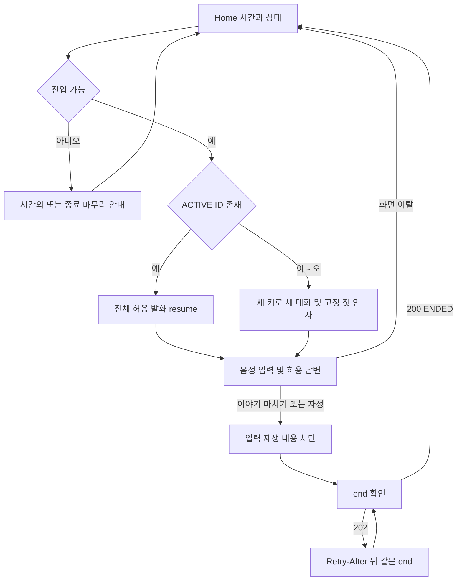

# P0 통합 설계 v3.1

2026-10-03 확정 정책을 반영한 개발 기준 문서입니다. 제품 구현 완료 또는 운영 적용을 의미하지 않습니다. 기존 루트 README의 환경·OAuth 구성 설명과 별개로 **P0 제품 범위와 계약은 이 문서 묶음**을 따릅니다. Kakao는 P0에서 제외합니다.

## 읽는 순서

1. [확정 결정 기록](Decision_Record.md)
2. [공통 요구사항](requirements/P0_Common_Spec.md), [Part 1](requirements/P0_Part1.md), [Part 2](requirements/P0_Part2.md)
3. [통합 API 명세](Integrated_API_Spec.md), [OpenAPI 3.0.3](Integrated_OpenAPI.yaml)
4. [통합 ERD·데이터 사전·DDL](Integrated_ERD_Design.md)
5. [전체 다이어그램 HTML](support/Integrated_Visual_Guide.html), [SVG 목록과 원문 해시](support/diagrams/manifest.json)

API는 24개 경로·26개 operation·61개 schema, ERD는 13개 테이블·115개 컬럼입니다. API 담당은 각 operation의 `x-owner`와 명세에 표시합니다. D13/D14 AI 실제 wire·필드별 허용·음성 수치 및 D17 운영값은 아직 외부 확정 대기입니다.

HTML은 다운로드해 브라우저에서 열고, GitHub에서는 각 문서의 Mermaid 또는 SVG를 확인합니다. Mermaid 원문 32개와 렌더된 SVG의 연결은 manifest로 검증합니다. 아래 도식은 별도 FE 전달서에서 공통 참고 도식만 옮긴 것입니다.

## 저장소 게시 범위

요구사항·API·ERD·결정 기록·다이어그램·검증 도구만 게시합니다. Handoff는 별도 전달하며 PDF·ZIP·Jira 작업 보고서·과거 원문은 포함하지 않습니다. OpenAPI의 `x-source-manifest`는 통합 전 원문 파일명과 SHA256 출처 기록이며 현재 요구사항 파일의 해시가 아닙니다.

## 검증 재실행

저장소 루트에서 별도 Python 가상환경에 `PyYAML`, `openapi-spec-validator`, `openapi-schema-validator`, `jsonschema`를 설치한 뒤 실행합니다. 제품 의존성은 변경하지 않습니다.

```sh
python docs/p0/support/validate_contract.py
```

이 검사는 OpenAPI 구조·예시·거부 사례·업무 의미·DB JSON/DTO 대응·문서 링크·32개 Mermaid 원문 해시와 SVG XML을 검증합니다. 실제 HTTP 서버, 브라우저, AI 연동 또는 SVG 재렌더를 실행하지 않습니다. 원문은 배포하지 않으므로 원문 SHA 및 원문 schema 대조는 미실행으로 표시합니다. 원문을 별도로 보유한 경우 `docs/p0/sources/` 아래 원래 파일명으로 두어 비교할 수 있으나 원문을 커밋하지 않습니다. 과거 v2 비교 역시 해당 자료가 없으면 수행되지 않습니다.

DB 검사는 [ERD §12](Integrated_ERD_Design.md)의 독립 임시 DB·트랜잭션 절차에 따라 DDL과 [검증 SQL](support/validate_erd.sql)을 실행합니다. 운영 DB에서 실행하지 않습니다. 기존 v3.1 DB 검증 결과는 ERD에 기록되어 있고, 이번 게시에서는 DDL을 변경하지 않았습니다.

## 대화 종료 확인 도식

<!-- diagram: fe-conversation-lifecycle -->

