# 통합 Mermaid 다이어그램

[전체 API 목차](../Integrated_API_Spec.md) · **담당: 공통 / Part 1·Part 2** · 계약 v3.1 / 문서 분할 2026-10-06

절 번호는 기존 통합 명세의 번호를 유지합니다. 다른 절은 전체 목차에서 찾을 수 있습니다.

## 이 문서에서 찾기

- [13 통합 API 다이어그램](#section-13)
- [13.1 담당과 데이터 경계](#section-13-1)
- [13.2 요청 검사와 공통 오류 우선순위](#section-13-2)
- [13.3 이메일 번호 확인과 일회성 업무 권한](#section-13-3)
- [13.4 로그인·프로필·아이 홈 진입과 로그아웃](#section-13-4)
- [13.5 PIN 설정·확인·잠금과 이메일 재설정](#section-13-5)
- [13.6 비밀번호 재설정과 모든 이전 로그인 무효화](#section-13-6)
- [13.7 새 대화 시작과 화면 재진입 복원](#section-13-7)
- [13.8 음성 발화 접수와 동기·비동기 결과](#section-13-8)
- [13.9 발화 중복 키와 응답 유실 복구](#section-13-9)
- [13.10 수동·자정 종료와 기존 세션의 종료 확인](#section-13-10)
- [13.11 임시 응답 음성의 시간·권한·수명 검사](#section-13-11)
- [13.12 텍스트·요약·음성의 개별 공개 허용](#section-13-12)
- [13.13 보호자 목록 검색과 전체 발화 이어 읽기](#section-13-13)
- [13.14 26개 API 동작과 도식 매핑](#section-13-14)

## 13. 통합 API 다이어그램

Part 1과 Part 2를 연결하는 13개 Mermaid 다이어그램이다. OpenAPI3.0.3(문서 v3.1.0)의 담당, 권한, 대화 시작·종료, AI 처리, 종료 복구 흐름을 설명한다. 마지막 표는 26개 API 동작을 각 도식에 연결한다.

공통 전제: 요청 구조, 요청 제한, 로그인, 소유권 검사를 통과해야 업무를 처리한다. 아이용 내용과 음성을 전달하기 직전에도 현재 시간, 세션, 대화 상태와 연결을 다시 확인한다. 도식은 필드별 required/null 규칙이나 오류 스키마를 대신하지 않는다. FE 적용과 남은 AI·운영 연동 사항은 FE·BE 인계서(별도 전달)를 함께 확인한다.

### 13.1. 담당과 데이터 경계

<!-- diagram: api-integrated-ownership -->
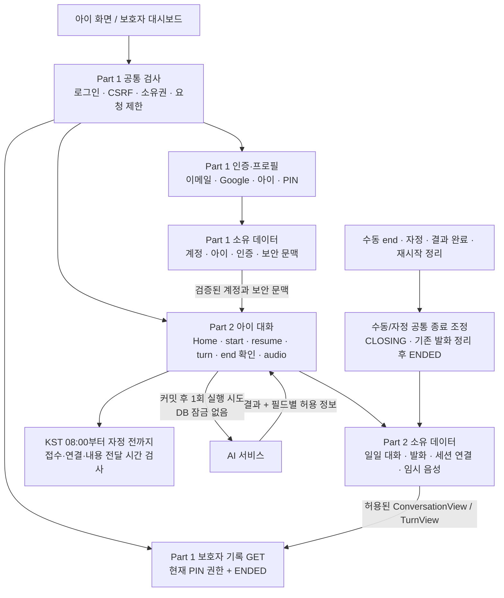

같은 conversations 경로도 GET은 Part 1 보호자 기록, POST는 Part 2 아이 대화 시작이다. 아이 대화에는 보호자 PIN을 요구하지 않는다. 파트 간 새 HTTP 서비스를 추가하지 않으며 AI가 backend DB를 직접 읽고 쓰지 않는다. 화면 이탈은 대화 종료나 기록 삭제가 아니다.

연결: API §2, §3.1, ERD 담당표 · FE·BE 인계서(별도 전달).

### 13.2. 요청 검사와 공통 오류 우선순위

<!-- diagram: api-integrated-request-checks -->
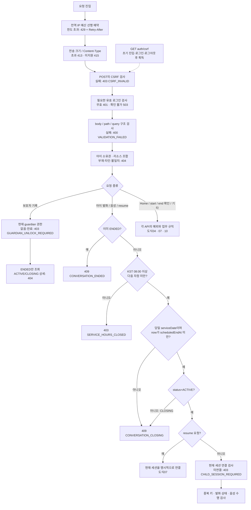

아이 내용 접근의 업무 검사 순서는 **ENDED 409 → 이용 시간 외 403 → CLOSING 또는 지난 일자409 → 미연결 403**이다. 다음 날 08시가 되어도 전날 대화가 다시 열리지 않는다. Home과 보호자 기록은 대화 이용 시간 제한 대상이 아니며, POST/end는 내용 없는 수동 종료·종료 확인에 한해 시간 외 예외를 적용한다. start의 기존 키와 새 키 분기는 도식07을 따른다.

이메일 인증의 PIN_SETUP/PIN_RESET은 입력 목적 또는 challenge를 식별한 뒤 유효 로그인을 강제한다. 타인 리소스의 상태를 먼저 검사해 409로 노출하지 않는다. 별도 인증 예산도 업무 전에 예약하며 앞서 커밋한 IP 예산을 후속 실패로 되돌리지 않는다.

연결: API §3, §3.2, §6.1, §8, §9 · FE·BE 인계서(별도 전달).

### 13.3. 이메일 번호 확인과 일회성 업무 권한

<!-- diagram: api-integrated-email-verification -->
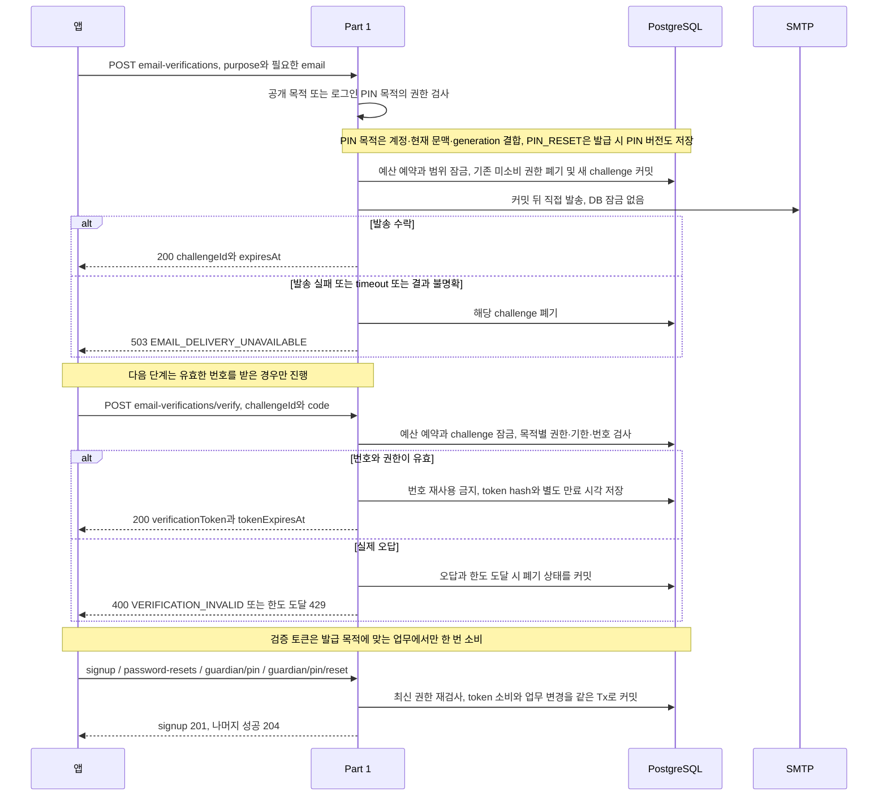

SIGNUP/RESET_PASSWORD는 공개 목적이고 PIN_SETUP/PIN_RESET은 유효 로그인이 필요하다. 두 PIN 목적은 현재 계정·securityContextId·setup_generation에 결합하며 PIN_RESET은 현재 pin_version이 발급 snapshot과 일치해야 한다. 실제 PIN challenge의 계정·문맥·폐기·generation/version 오류는 403이며 만료·소비 오류보다 먼저 판정한다. 목적·번호·토큰 검증 실패는 계약에 따라 400이다.

가입의 추가 동의·보호자 정보 수집은 P0에서 제외한다. signup 201은 자동 로그인을 포함하지 않는다. 번호/토큰 각 600초, 재발급 60초, 실제 오답 5회는 기존 기술 기준을 재사용하며 D-17 운영 검증은 남아 있다. 공개 목적 decoy는 사용 가능한 번호나 토큰을 만들지 않는다. 토큰 원문을 URL, query, localStorage, 일반 로그에 넣지 않는다.

연결: API §4.1\~4.3, §6.2\~6.4, §6.8, §6.11, §6.14 · FE·BE 인계서(별도 전달).

### 13.4. 로그인·프로필·아이 홈 진입과 로그아웃

<!-- diagram: api-integrated-login-entry -->
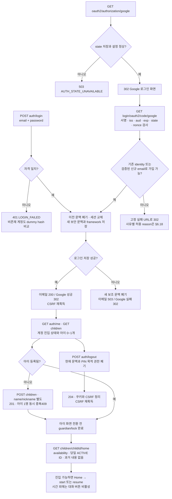

일반 로그인에는 서비스 차원의 idle/absolute 상한을 두지 않고, 쿠키는 365일로 유효한 사용 시 갱신한다. 이 설정이 logout·세션 폐기·비밀번호 변경을 무시하는 뜻은 아니다. 유효한 framework 세션과 DB 보안 문맥이 모두 필요하며 DB 행만으로 로그인을 복원하지 않는다.

Google 기존 identity는 이메일이 달라도 같은 identity로 식별하며 계정 이메일을 자동 변경하거나 이메일만으로 다른 identity에 연결하지 않는다. 신규 가입은 검증된 email을 요구하고, 추가 동의·보호자 정보 및 별도 가입 정보 보완 화면은 P0에 넣지 않는다. OAuth 콜백의 인증·계정·세션 저장 실패는 허용된 고정 실패 URL로 302이며, 허용 URL 설정 자체가 없으면 503이다. URL에는 토큰이나 내부 오류 원인을 넣지 않는다.

연결: API §6.1, §6.5\~6.10, §6.17\~6.18, §7.1 · FE·BE 인계서(별도 전달).

### 13.5. PIN 설정·확인·잠금과 이메일 재설정

<!-- diagram: api-integrated-guardian-access -->
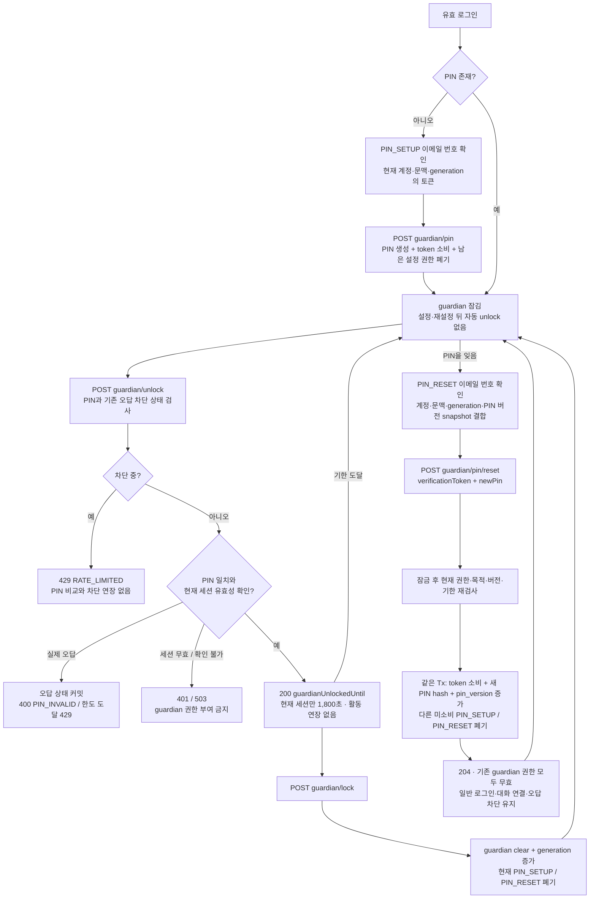

PIN_RESET은 PIN_SETUP 토큰으로 대신할 수 없다. PIN이 없으면 409 PIN_NOT_SET, 토큰 누락/null은 400이다. 실제 PIN_RESET의 계정·문맥·generation·PIN 버전·폐기 불일치는 403 PIN_RESET_AUTHORIZATION_REQUIRED, 그 밖의 목적·해시·기한·소비 검증 실패는 400이다. 성공 토큰은 consumed로 남기고 같은 토큰에 폐기 상태를 덧붙이지 않는다. hash 저장이나 DB 변경 실패 시 전체 업무를 롤백한다.

PIN 재설정은 일반 로그인과 당일 대화 연결을 유지하며 자동 unlock을 하지 않는다. 오답 차단과 요청 예산도 유지하는 기술 기준을 적용한다. 오답 차단 중에도 PIN_RESET 이메일 인증은 별도 이메일/IP 제한 안에서 가능하다. 응답 유실 시 새 PIN으로 unlock을 확인하되 남아 있는 차단을 준수한다. guardian/lock은 현재 PIN 목적 권한도 폐기하므로 재인증 화면에서 무조건 호출하지 않는다.

연결: API §3.1\~3.2, §6.11\~6.14 · FE·BE 인계서(별도 전달).

### 13.6. 비밀번호 재설정과 모든 이전 로그인 무효화

<!-- diagram: api-integrated-password-reset -->
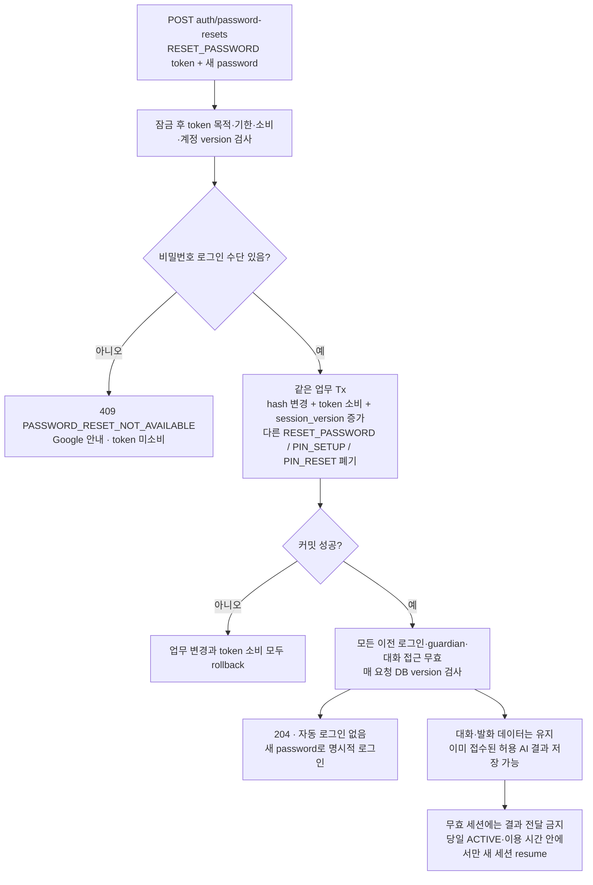

본인 확인 전에 계정 존재나 Google-only 여부를 구분해 알려주지 않는다. 물리 세션 삭제가 늦어져도 DB version 검사로 이전 접근을 거부한다. 비밀번호 재설정은 저장된 대화를 삭제하지 않지만, 새 로그인으로 전날 대화나 종료 복구 권한을 얻을 수는 없다. PIN 재설정이 일반 로그인을 유지하는 규칙과 구분한다.

연결: API §6.8, §3.1, §8.1 · FE·BE 인계서(별도 전달).

### 13.7. 새 대화 시작과 화면 재진입 복원

<!-- diagram: api-integrated-start-resume -->
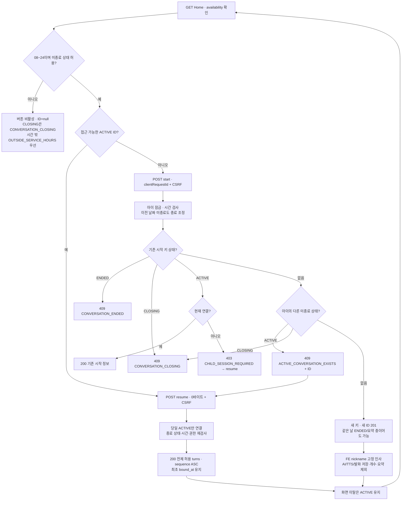

대화는 KST08\~24 동안 같은 날 여러 번 가능하며 ACTIVE/CLOSING은 아이당 하나다. ENDED 키 재전송은409, 새 대화는 새 키다. serviceDate/scheduledEndAt은 대화별 불변이고, 이전 날짜 미종료도 정리 전 새 시작을 막는다. ACTIVE는 새 유효 세션도 resume할 수 있으나 CLOSING은 새 연결·내용이 없다. 응답 직전 상태·시간·권한을 재검사한다.

연결: API §7.1\~7.3, §8 · FE·BE 인계서(별도 전달).

### 13.8. 음성 발화 접수와 동기·비동기 결과

<!-- diagram: api-integrated-voice-async -->
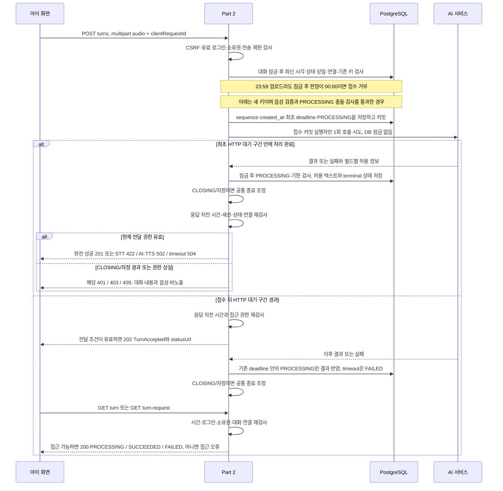

| 결과 | 저장 상태 | 아직 응답하지 않은 최초 POST | 이미 202를 보낸 뒤 |
| --- | --- | --- | --- |
| 정상 완료 | SUCCEEDED, errorCode=null | 201 ChildTurnResult | 접근 가능한 상태 GET은 200 SUCCEEDED |
| STT 무음·인식할 말 없음 | FAILED, STT_NO_SPEECH | 422 ApiError | 접근 가능한 상태 GET은 200 FAILED |
| AI 또는 TTS 실패 | FAILED, AI_UPSTREAM_FAILED | 502 ApiError | 접근 가능한 상태 GET은 200 FAILED |
| 전체 처리 기한 초과 | FAILED, AI_TIMEOUT | 504 ApiError | 접근 가능한 상태 GET은 200 FAILED |

TTS 실패에서도 저장·표시가 모두 허용된 childText/replyText는 보존하며 audio=null, topicSuggestions=[]이다. 최초 오류 응답에는 ApiError만 넣고 보존 텍스트는 허용 시간의 상태 GET으로 읽는다. 파일 손상·미지원 415와 용량 초과 413을 STT 무음으로 바꾸지 않는다.

이미 보낸 202를 나중에 422/502/504로 바꾸지 않는다. 종료 경계 전 접수 작업은 최초 deadline까지 저장할 수 있지만 CLOSING/자정 뒤 아이에게 내용을 전달하지 않는다. 성공은 `now < deadline`인 PROCESSING에만 반영하고 늦은 결과가 terminal 상태를 덮어쓰지 못한다. 접수 커밋 뒤 호출 전 중단되면 기한 후 FAILED로 정리하며 자동 재호출하지 않는다. MIME·대기시간·deadline 수치는 D-13/D-14 연동 대기다.

연결: API §7.4\~7.6, §8.1 · FE·BE 인계서(별도 전달).

### 13.9. 발화 중복 키와 응답 유실 복구

<!-- diagram: api-integrated-idempotency-recovery -->
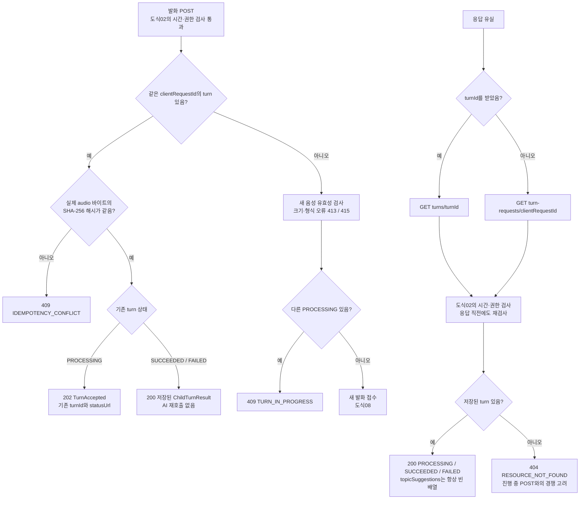

기존 키/해시를 새 PROCESSING 충돌보다 먼저 검사한다. 해시는 실제 파일 바이트의 SHA-256을 소문자 64자리 hex로 저장하며 multipart boundary, 파일명, clientRequestId를 제외한다. Content-Type만 믿지 않고 실제 파일을 디코딩해 검사한다. 전송량 제한은 중복 요청에도 적용한다.

동일 업로드 재시도에는 같은 키와 같은 파일을 보존하고 다시 녹음한 발화는 새 키를 쓴다. requestId는 서버 추적 ID이며 복구 키는 clientRequestId다. GET 404만으로 진행 중인 POST가 미접수라고 단정하지 않는다. 기존 결과도 CLOSING 또는 자정 이후 시간·상태 검사를 우회해 읽을 수 없다.

연결: API §7.4\~7.6, §8, §9 · FE·BE 인계서(별도 전달).

### 13.10. 수동·자정 종료와 기존 세션의 종료 확인

<!-- diagram: api-integrated-end-recovery -->
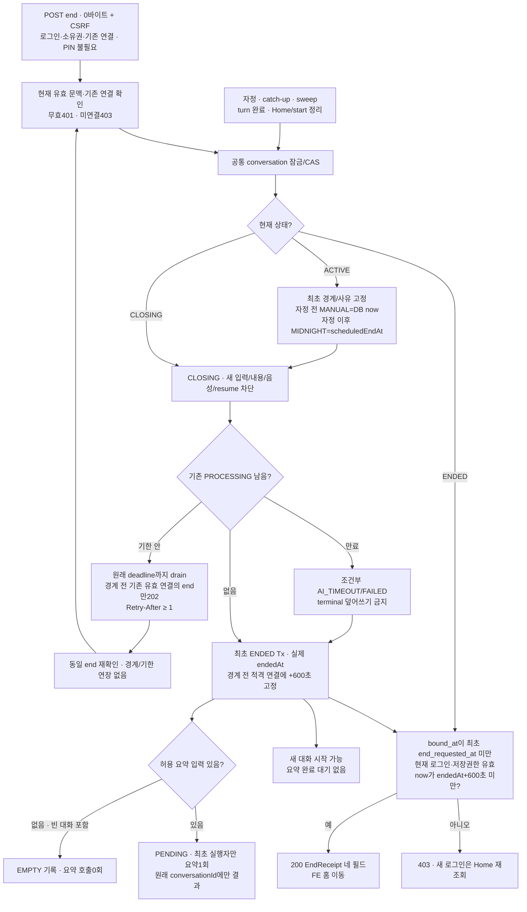

수동/자정 종료 최초 경계에서 CLOSING으로 입력·내용·음성을 차단한다. endedAt은 기존 발화 정리 후 실제 시각이며 경계보다 늦을 수 있다. 최초 endRequestedAt/endReason은 재요청과 자정 도달로 바꾸지 않는다. 처리 중 발화가 없으면 바로 ENDED로 확정할 수 있다.

복구 대상은 `bound_at<end_requested_at`의 기존 유효 연결이며 CLOSING202와 ENDED200 확인정보만 제공한다. 로그인 무효401, 미적격/새 로그인/기한 equality403. 반복 요청은 경계·복구기한 연장 또는 요약 재호출을 하지 않는다. 새 로그인은 Home 재조회로 현재 진입 가능 상태를 확인한다. 시간 밖에는 종료 완료를 추정하지 않고 시간외 안내 후 opensAt부터 재확인한다. 요약 crash 후 PENDING 재실행은 없고 기한 후 FAILED로 정리한다.

연결: API §7.7, §8, §8.1 · FE·BE 인계서(별도 전달).

### 13.11. 임시 응답 음성의 시간·권한·수명 검사

<!-- diagram: api-integrated-temporary-audio -->
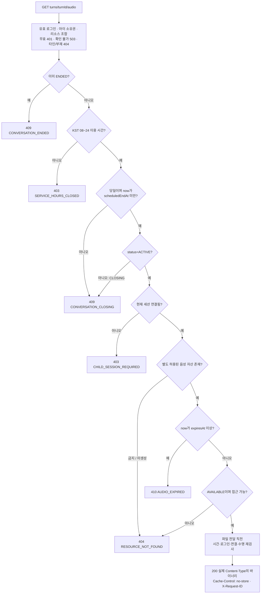

텍스트 허용만으로 음성 허용을 추정하지 않는다. 파일 삭제가 늦어도 자정·대화 종료·세션 무효·음성 만료부터 접근을 거부한다. 이미 전달한 바이트를 회수할 수는 없으므로 FE도 수동 종료 접수 및 자정에 재생을 중단하고 Blob과 화면의 대화 데이터를 정리한다. 화면 정리가 서버 기록 삭제를 뜻하지는 않는다.

만료 음성을 위해 AI/TTS를 재호출하지 않는다. 보호자 기록과 EndReceipt에는 음성 URL이 없다. 구체 MIME·codec·최대 크기·TEMP_AUDIO_TTL·410 판정용 메타데이터 수명은 D-13/D-14 및 운영 연동 사항이며 Range/206 지원을 추가로 약속하지 않는다.

연결: API §7.8, §8, §5.4 · FE·BE 인계서(별도 전달).

### 13.12. 텍스트·요약·음성의 개별 공개 허용

<!-- diagram: api-integrated-visibility -->
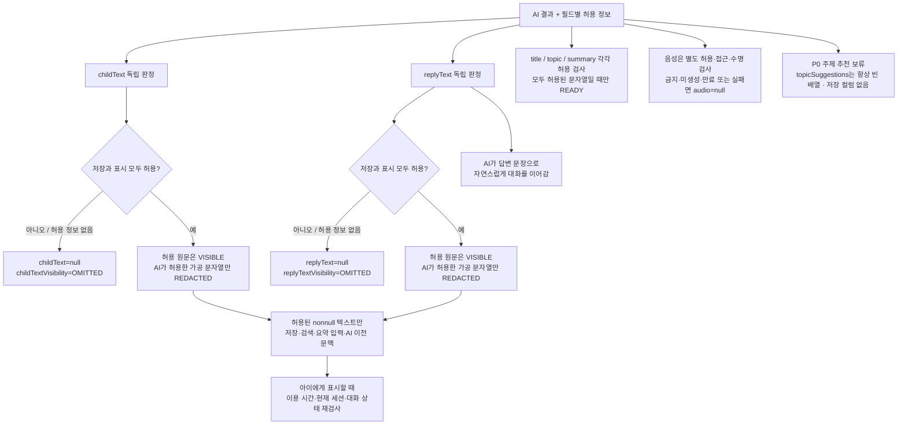

한쪽이 OMITTED여도 반대쪽 허용 텍스트는 유지한다. PROCESSING은 두 텍스트·completedAt·errorCode가 null이고 두 visibility는 OMITTED다. TTS 실패의 FAILED에도 허용된 텍스트가 남으며 보호자 검색·요약 입력에서 실패 상태만으로 제외하지 않는다. 금지 원문과 허용 정보가 없는 텍스트를 DB·로그·검색·요약·이전 AI 문맥에 남기지 않는다.

주제 추천 보류는 ConversationView의 요약용 topic을 없애는 결정이 아니다. title/topic/summary는 허용 입력으로 생성하고 출력도 각각 검사한다. audio와 topicSuggestions는 발화 POST/GET의 wrapper 필드이며 공유 TurnView에 넣지 않는다. resume은 TurnView 전체만 반환하고 보호자 기록에는 audio·추천을 추가하지 않는다. AI wire와 문자열 한도는 D-13/D-14 연동 대기다.

연결: API §5.2\~5.5, §7.4\~7.8, §11 · FE·BE 인계서(별도 전달).

### 13.13. 보호자 목록 검색과 전체 발화 이어 읽기

<!-- diagram: api-integrated-record-pagination -->
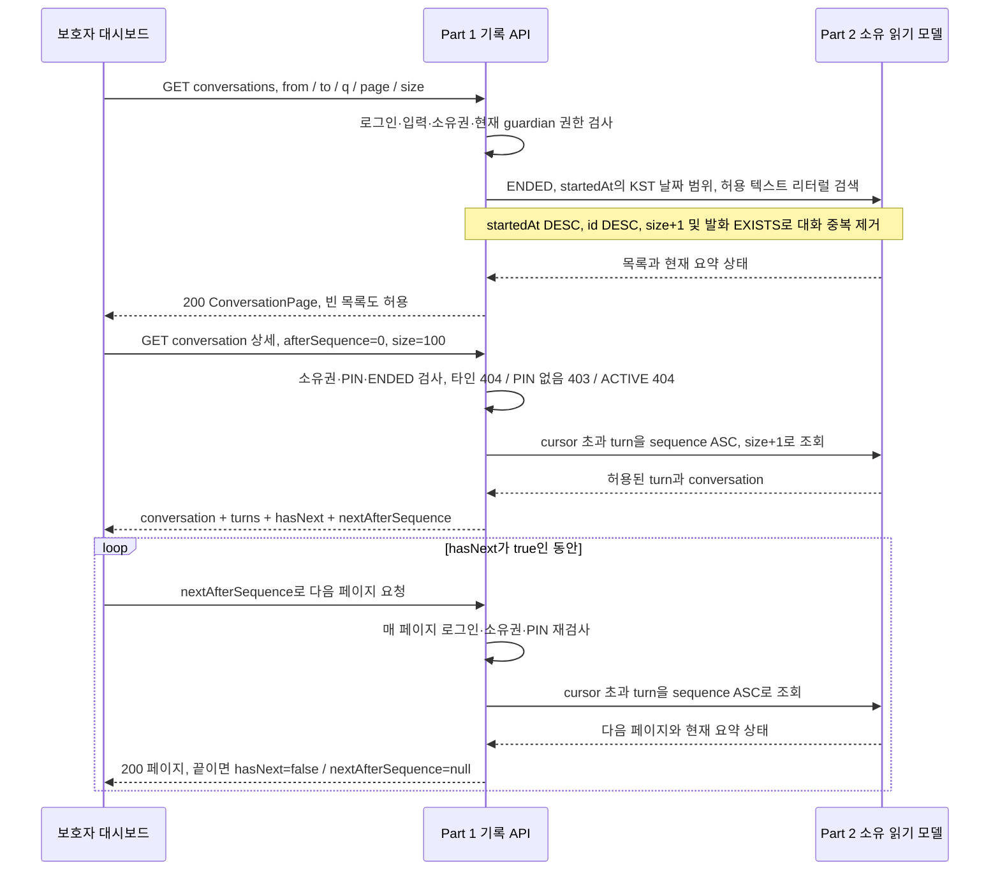

보호자 기록은 ENDED만 대상으로 하며 아이 대화의 00\~08 제한은 적용하지 않는다. 수동/자정 경계 후 기존 발화가 처리 중이면 CLOSING이므로 목록에서 제외한다. 빈 대화도 EMPTY 기록으로 남긴다. 종료가 끝났다면 요약 PENDING/FAILED/EMPTY도 기록 조회를 막지 않는다. 날짜는 startedAt의 KST 날짜, 즉 serviceDate를 기준으로 하므로 새벽에 종료된 대화도 전날 기록에 속한다.

목록은 기본 page=0, size=20, 최대 100개다. 상세는 기본·최대 100턴을 cursor로 이어 읽으며 sequence의 빈 번호를 건너뛴다. q는 trim 후 최대 100자이고 `%`, `_`, escape 문자도 리터럴로 검색한다. 잘못된 날짜 범위나 page×size overflow는 400이다. 빈 상세 페이지는 hasNext=false, nextAfterSequence=null이다. 종료 발화는 불변이지만 요약은 페이지 사이에 완료될 수 있다. 비공개 내용의 일치 개수·스니펫·음성을 반환하지 않는다.

연결: API §6.15\~6.16, §5.4\~5.5, §8 · FE·BE 인계서(별도 전달).

### 13.14. 26개 API 동작과 도식 매핑

각 operation의 실제 처리 또는 응답 복구가 나타난 주 도식과 보조 도식이다. 기존 operationId 26개를 유지하며 경로는 OAuth를 제외하고 `/api/v1`부터 표기한다.

| 담당 | operationId | Method / 경로 | 주 도식 | 보조 도식 |
| --- | --- | --- | --- | --- |
| Part 1 | getCsrf | GET /api/v1/auth/csrf | 02 요청 검사 | 04 로그인 진입 |
| Part 1 | issueEmailVerification | POST /api/v1/auth/email-verifications | 03 이메일 검증 | 05 PIN |
| Part 1 | verifyEmailCode | POST /api/v1/auth/email-verifications/verify | 03 이메일 검증 | 05 PIN |
| Part 1 | signup | POST /api/v1/auth/signup | 03 이메일 검증 | 04 로그인 진입 |
| Part 1 | login | POST /api/v1/auth/login | 04 로그인 진입 | 06 비밀번호 재설정 |
| Part 1 | getCurrentAccount | GET /api/v1/auth/me | 04 로그인 진입 | 05 PIN |
| Part 1 | logout | POST /api/v1/auth/logout | 04 로그인 진입 | 08 응답 직전 권한 |
| Part 1 | resetPassword | POST /api/v1/auth/password-resets | 06 비밀번호 재설정 | 03 이메일 검증 |
| Part 1 | listChildren | GET /api/v1/children | 04 로그인 진입 | 01 담당 |
| Part 1 | createChild | POST /api/v1/children | 04 로그인 진입 | 01 담당 |
| Part 1 | setupGuardianPin | POST /api/v1/guardian/pin | 05 PIN | 03 이메일 검증 |
| Part 1 | unlockGuardian | POST /api/v1/guardian/unlock | 05 PIN | 13 보호자 기록 |
| Part 1 | lockGuardian | POST /api/v1/guardian/lock | 05 PIN | 04 로그인 진입 |
| Part 1 | resetGuardianPin | POST /api/v1/guardian/pin/reset | 05 이메일 PIN 재설정 | 03 이메일 검증 |
| Part 1 | listChildConversations | GET /api/v1/children/{childId}/conversations | 13 보호자 기록 | 12 공개 허용 |
| Part 1 | getChildConversation | GET /api/v1/children/{childId}/conversations/{conversationId} | 13 보호자 기록 | 12 공개 허용 |
| Part 1 | startGoogleLogin | GET /oauth2/authorization/google | 04 로그인 진입 | 02 요청 검사 |
| Part 1 | completeGoogleLogin | GET /login/oauth2/code/google | 04 로그인 진입 | 02 요청 검사 |
| Part 2 | getChildHome | GET /api/v1/children/{childId}/home | 07 대화 시작·종료·복원 | 04 로그인 진입 |
| Part 2 | startChildConversation | POST /api/v1/children/{childId}/conversations | 07 대화 시작·종료·복원 | 02 시간·권한 검사 |
| Part 2 | resumeChildConversation | POST /api/v1/children/{childId}/conversations/{conversationId}/resume | 07 대화 시작·종료·복원 | 12 공개 허용 |
| Part 2 | submitVoiceTurn | POST /api/v1/children/{childId}/conversations/{conversationId}/turns | 08 음성 비동기 | 09 중복·복구, 12 공개 허용 |
| Part 2 | getVoiceTurn | GET /api/v1/children/{childId}/conversations/{conversationId}/turns/{turnId} | 09 중복·복구 | 08 음성 비동기, 12 공개 허용 |
| Part 2 | getVoiceTurnByRequestId | GET /api/v1/children/{childId}/conversations/{conversationId}/turn-requests/{clientRequestId} | 09 중복·복구 | 08 음성 비동기, 12 공개 허용 |
| Part 2 | endChildConversation | POST /api/v1/children/{childId}/conversations/{conversationId}/end | 10 수동/자정 종료·복구 | 02 시간 외 예외 |
| Part 2 | getTemporaryTurnAudio | GET /api/v1/children/{childId}/conversations/{conversationId}/turns/{turnId}/audio | 11 임시 음성 | 02 시간·권한 검사, 12 공개 허용 |

반영 범위: 수동/자정 종료·CLOSING·같은 날 새 대화·미종료1개, FE 고정 첫 인사·이름/애칭 분리·빈 EMPTY 기록, 기존 세션들의 종료 후 600초 확인, 전체 resume, 보호자 100턴 cursor, 이메일 PIN 재설정, OAuth 실패 처리, STT/TTS 실패 매핑, 빈 주제 추천 배열을 최종 계약으로 적용했다. D-13/D-14의 AI 실제 연동·수치와 D-17 운영 조건은 남아 있으며 도식 작성이 서버 구현이나 통합 시험 완료를 의미하지 않는다.
