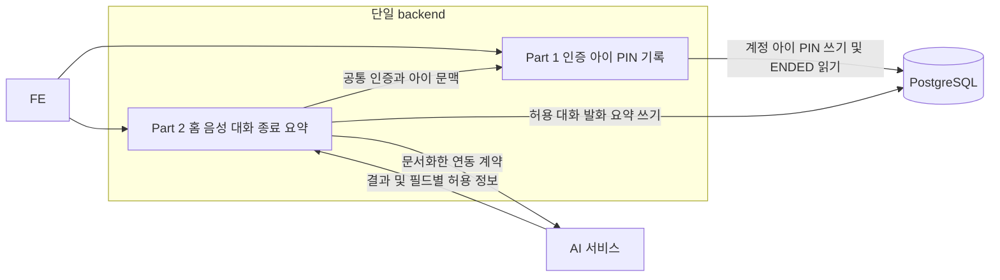
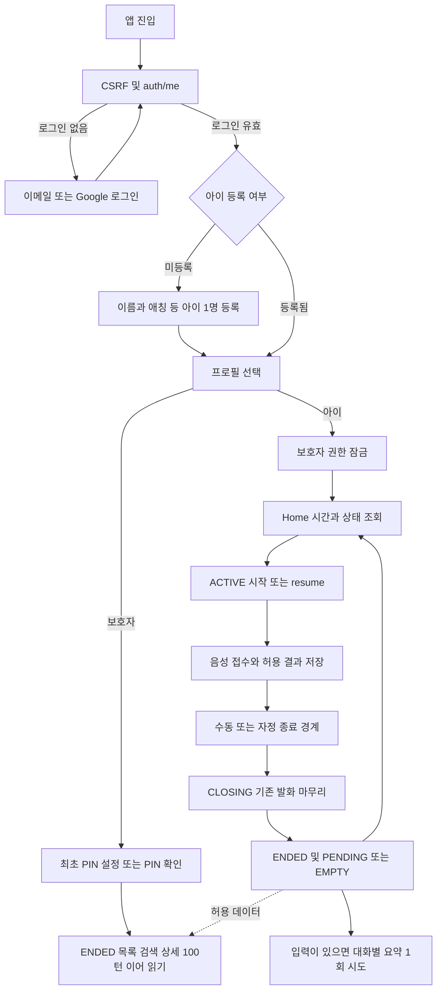
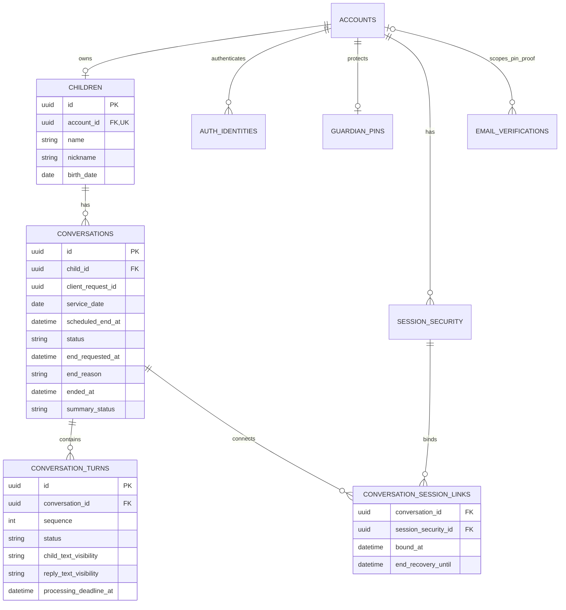
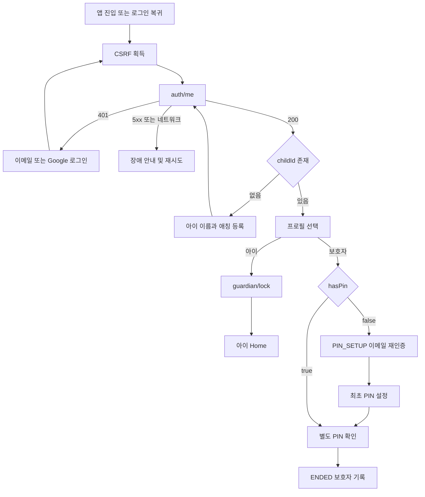

# DodamDodam P0 공통 요구사항·API 계약

2026-10-03 KST · v3.1 · F-01\~F-08 반영 · 구현·실제 통합 시험은 별도

이 문서는 현재 구현에 사용하는 공통 요구사항이다. [확정 정책](../Decision_Record.md), [통합 API](../Integrated_API_Spec.md), [OpenAPI](../Integrated_OpenAPI.yaml), [통합 ERD](../Integrated_ERD_Design.md)를 함께 적용한다. 승인된 후속 결정이 이전 원문보다 우선하며 기존 원본 파일은 변경하지 않는다. 기술 수치 중 D13·D14 AI 계약과 D17 운영값은 자료 대기다.

## 적용 범위와 책임

| 구분 | P0 계약 |
| --- | --- |
| 계정 | 이메일 인증번호·가입·로그인·비밀번호 재설정, Google 로그인. 가입 후 별도 로그인. 휴대전화 인증·Kakao·rememberMe 없음 |
| 아이 | 계정당 아이 1명 등록·조회. 이름과 애칭을 별도 입력·저장. 아이/보호자 프로필 선택, 수정·삭제·다자녀 없음 |
| 아이 화면 | Home·음성 대화·이야기 마치기. KST 08:00 이상 다음 00:00 미만. 화면 이탈은 종료가 아니며 기존 ACTIVE를 유지 |
| 종료 | 수동/자정 경계부터 새 입력·아이 내용 접근 차단 → 기접수 발화를 원래 deadline까지 마무리 → ENDED → 홈. ENDED 뒤 같은 날 새 ID로 새 대화 가능; 요약 완료는 기다리지 않음 |
| 보호자 | 최초 PIN 설정·확인·잠금·이메일 PIN 재설정. ENDED의 날짜별 목록·제목·주제·요약·전체 내용·키워드 검색 |
| 첫 인사 | FE 고정 문구, 애칭 사용. AI·TTS·발화 저장·요약 입력·발화 수에서 제외 |
| 제외 | 동의·추가 보호자 정보 수집·필수 동의 단계, 문자/선택지 입력·추천 버튼, 사진·실제 놀이·보상·꾸미기·감정 분석·알림·리포트 내보내기·보호자 음성 다시 듣기 |

동의 API·테이블·가입 완료 플래그는 P0에 추가하지 않는다. 법적 보호자 확인이 완료됐다고 표시하지 않는다. Home의 PLAY는 COMING_SOON이며 학습 메뉴는 없다. 별도 승인 절차·담당자·일정을 이 문서로 새로 부여하지 않는다.

| 영역 | 책임 | 공유 경계 |
| --- | --- | --- |
| 계정·로그인·CSRF·PIN | Part 1 | 공통 인증·아이 소유권·현재 세션 보호자 권한 함수 |
| 아이 프로필 | Part 1 | ChildView·내부 ChildContext에 name과 nickname 제공 |
| Home·대화·발화·음성·종료·요약 | Part 2 | 허용 텍스트 읽기 모델·상태·정렬·세션별 연결/종료 복구 |
| 보호자 기록·검색 | Part 1 | Part 2의 ENDED 저장 모델 읽기, 인덱스 변경은 Part 2와 조정 |
| STT·LLM·TTS·요약·필드별 허용 | AI 팀, 연결은 Part 2 | 실제 wire는 D13·D14 자료로 매핑. AI가 업무 DB에 직접 접근하지 않음 |
| 녹음·화면·재생·첫 인사 | FE | 서버 상태에 따른 입력/내용 차단, 결과 표시·재시도 |

단일 backend·단일 PostgreSQL이며 내부 파트 사이에 추가 HTTP 서비스를 만들지 않는다. 계정·아이 삭제/CASCADE 정책과 별도 검색 서버·메시지 브로커를 P0 요구사항으로 추가하지 않는다.

<!-- diagram: req-common-architecture -->


## 공통 HTTP·입력·응답

| 항목 | 적용 규칙 |
| --- | --- |
| 경로·형식 | `/api/v1`, UTF-8 JSON. OAuth는 framework GET 경로, 음성 POST는 multipart, 음성 GET은 binary |
| 인증 | HttpOnly 세션 쿠키·JSESSIONID·Spring Session JDBC 기준. FE는 credentials 포함. 운영 Secure·Path=/·host-only, 실제 origin/SameSite/CORS는 D17 |
| CSRF | 공개 인증 포함 모든 POST에 `X-XSRF-TOKEN`. 최초 진입·로그인·로그아웃 후 재획득. OAuth는 state/nonce |
| 성공 | JSON은 `{data:...}`, 201+Location·204 본문 없음·202 진행 중. CSRF 응답·OAuth 302·음성 binary만 예외 |
| 오류 | `{error:{code,message,requestId,fields}}`; fields는 `{field,reason}` 배열, 없으면 `[]`. 시작 충돌 오류만 `activeConversationId` 추가 |
| 헤더 | 성공·실패·204·302·binary 모두 `Cache-Control:no-store`, `X-Request-ID`. 429 및 end 202는 초 단위 `Retry-After` 최소 1 |
| body 없는 POST | logout·lock·resume·end는 0바이트. `{}` 포함 어떤 본문도 400. Content-Type 없는 0바이트 허용 |
| 검증 | 미정의 JSON/multipart 필드 400. 현재 요청 DTO는 null 불허. 일반 필수 누락·UUID·날짜·enum·범위 오류 400; PIN_SETUP token 부재의 별도 403 유지 |
| ID | 업무 ID와 clientRequestId는 UUID. 서버 requestId는 추적용으로 중복키와 별개 |
| 문자열 | name·nickname·관심사·q trim. 이메일 trim+전체 lower, ASCII 유효 이메일 최대 254자. 비밀번호·PIN·번호·token은 trim/숫자 변환/정규화/절단 금지 |
| 전송·비밀번호 | Part 1 JSON 16,384 UTF-8 바이트 기술 기준 유지. 새 비밀번호 15\~128 Unicode 코드포인트; 로그인 기존 비밀번호에 생성 길이를 소급하지 않음. PIN은 ASCII 숫자 4자리 문자열 |
| 시각 | DB timestamptz, JSON `YYYY-MM-DDTHH:mm:ss+09:00`, 날짜 `YYYY-MM-DD`. KST 변환은 같은 순간을 표현하며 임의 9시간 가산 금지 |
| 로그 | 비밀번호·PIN·code·token·원본 음성·금지 텍스트·raw session ID·내부 binding 미기록. error.message/fields에도 금지 원문을 복사하지 않음 |

전역 요청량 예약 뒤 전송 크기/Content-Type → CSRF → 로그인 → 구조 → 소유권·리소스 조합 → 보호자 확인(해당 API) → 업무 상태를 검사한다. 타인 리소스·잘못된 child/conversation/turn 조합은 404다. 아이 내용의 세부 상태·시간 우선순위는 통합 API를 따르며 응답의 실제 error.code로 분기한다. 조회와 긴 요청 모두 응답 직전 권한·시각·상태를 다시 검사한다.

## 공통 객체와 NULL 규칙

| 객체 | 필드·의미 |
| --- | --- |
| AccountView | accountId, email, childId(null 가능), hasPin, guardianUnlockedUntil(null 가능). 비밀번호·PIN·token 없음 |
| ChildView | childId, name, nickname, birthDate, gender, interests, characterId, createdAt |
| ChildContext | childId, name, nickname, birthDate, interests, characterId, createdAt. 소유권 검사 후 내부 제공; AI로 전체 복사 금지 |
| ConversationView | conversationId, childId, status(ACTIVE/CLOSING/ENDED), startedAt, endRequestedAt, endReason(MANUAL/MIDNIGHT/null), endedAt, title, topic, summary, summaryStatus |
| TurnView | turnId, sequence, status(PROCESSING/SUCCEEDED/FAILED), childText, childTextVisibility, replyText, replyTextVisibility, createdAt, completedAt, errorCode |
| EndPendingReceipt | conversationId, status=CLOSING. end 202, 다른 필드·내용 없음 |
| EndReceipt | conversationId, status=ENDED, endedAt, summaryStatus. end 200, 네 필드만 |
| 목록 Page | items, page(0 이상), size(1\~100), hasNext |
| 보호자 상세 | conversation, turns, hasNext, nextAfterSequence. 기본·최대 100턴, 종료 페이지 cursor=null |

응답에 명시된 null 필드는 생략하지 않는다. ConversationView의 endRequestedAt/endReason은 ACTIVE에서 null, CLOSING/ENDED에서 필수 값이다. endedAt은 ACTIVE/CLOSING에서 null, ENDED에서 필수이며 `endedAt >= endRequestedAt >= startedAt`이다. ACTIVE/CLOSING의 요약은 NOT_STARTED, title/topic/summary는 null. ENDED 최초 전이에서 PENDING 또는 EMPTY를 정하고 READY/FAILED로 진행한다. PENDING/FAILED/EMPTY의 세 요약 필드는 null, READY는 각 필드의 저장·표시 허용과 형식 검사를 모두 통과한 nonnull 문자열이다.

PROCESSING의 두 텍스트·completedAt·errorCode는 null, 두 visibility는 OMITTED다. SUCCEEDED의 completedAt은 필수·errorCode=null, FAILED는 completedAt과 비어 있지 않은 errorCode 필수다. 실패에도 허용 텍스트가 남을 수 있다. clientRequestId는 TurnView에 넣지 않는다. 아이 발화 wrapper만 audio와 topicSuggestions를 가지며 추천은 항상 `[]`다. resume에는 둘 다 없고 보호자 기록·종료 receipt에도 없다.

### 아이 입력과 화면 호칭

- `name`: 필수, trim 후 1\~5 Unicode 코드포인트. 보호자용 정보다.
- `nickname`: 필수, trim 후 1\~20 코드포인트. null·빈 문자열 거부. 아이 화면·Home 인사·대화 첫 인사·AI 기본 호칭이다. 실명 인증·애칭 유일성 규칙 없음.
- birthDate는 유효 날짜이며 KST 오늘 이하. gender는 MALE/FEMALE. interests는 선택 자유 태그 0\~10개, 각 trim 후 1\~30 코드포인트·중복 금지·순서 유지, 생략하면 `[]`다.
- characterId는 `[A-Za-z0-9_-]` 1\~64자이고 지원 목록에 있어야 한다. 실제 목록·기본값·폐기 ID·AI 대응은 자료 대기, `dodam`은 예시다.
- AI의 호칭 논리값은 nickname으로 매핑하며 name을 자동 전송하지 않는다. 실제 wire 필드명은 D13·D14를 따른다.

## 필드별 저장·표시·검색·AI 경계

| visibility | 저장·반환 | 검색·다음 AI 문맥·요약 |
| --- | --- | --- |
| VISIBLE | 저장 AND 표시가 허용된 원문 문자열 | 허용된 nonnull 텍스트만 사용 |
| REDACTED | AI 계약상 저장 AND 표시가 허용된 가공문만. 가공 전 원문 미보관 | 가공문만 사용 |
| OMITTED | 해당 텍스트 null. 부재·실패는 status/errorCode로 구분 | 해당 필드 제외 |

childText와 replyText는 각각 판정한다. 저장만 허용·허용 정보 누락·해석 불가는 OMITTED/null이며 숨은 원문 컬럼으로 보관하지 않는다. 자체 가공으로 REDACTED를 만들어내지 않는다. title/topic/summary도 각각 허용을 검사하며 음성은 별도 허용이 필요하다. 금지 원문은 DB·검색·일반 로그·오류 메시지·요약 입력으로 우회하지 않는다. D13·D14 실제 허용 계약이 없는 상태는 실제 아동 데이터 연동 완료가 아니다.

## 전체 기능 연결

<!-- diagram: req-common-product-flow -->


## 대화 시간·시작·종료·복구

KST 08:00 포함·다음 자정 미포함이다. 아이당 미종료 대화(ACTIVE 또는 CLOSING)는 최대 하나다. 화면 이탈·새로고침은 end를 호출하지 않고, 서비스 시간 안의 당일 ACTIVE를 resume한다. 첫 인사는 FE 고정 템플릿이며 새 AI 작업·발화 행을 만들지 않는다.

| 상황 | 계약 |
| --- | --- |
| Home | 시간 밖에도 조회 가능. availability 8필드: timeZone, serverTime, serviceDate, opensAt, closesAt, canEnter, reason, nextOpensAt |
| 00\~08 | canEnter=false, reason=OUTSIDE_SERVICE_HOURS, nextOpensAt=당일 08시. activeConversationId=null |
| 서비스 시간·미종료 CLOSING | canEnter=false, reason=CONVERSATION_CLOSING, nextOpensAt=null, activeConversationId=null. 완료시각을 추정하지 않음 |
| 정상 진입 | canEnter=true, reason/nextOpensAt=null. activeConversationId는 접근 가능한 당일 ACTIVE만. TALK은 canEnter에 따라 AVAILABLE/UNAVAILABLE, PLAY는 COMING_SOON |
| 새 시작 | 기존 ACTIVE면 409 ACTIVE_CONVERSATION_EXISTS와 ID→resume, CLOSING이면 409 CONVERSATION_CLOSING. 지난 날짜 미종료도 먼저 정리. ENDED 이후 새 clientRequestId로 같은 날 새 대화 가능 |
| 시작 재전송 | 같은 키·접근 가능한 ACTIVE·현재 연결이면 200, 미연결이면 403→resume. 같은 키의 ENDED는 409 CONVERSATION_ENDED, CLOSING은 409 CONVERSATION_CLOSING. 새 대화를 만들지 않음 |
| 수동 종료 | 연결된 현재 세션의 body 0바이트 end. 잠금 후 DB 시각을 최초 경계로 고정하고 새 입력·아이 내용·음성·resume 차단 |
| 자정 종료 | scheduled_end_at이 경계. 자정 후 최초 관측은 MIDNIGHT. 먼저 확정된 MANUAL 경계를 자정/중복 end가 덮어쓰지 않음 |
| CLOSING | 기접수 PROCESSING만 원래 deadline까지 처리. 기존 허용 결과 저장은 가능하며 아이에게 내용 반환 불가. 새 연결 생성 금지 |
| end 진행 중 | 202 `{data:{conversationId,status:"CLOSING"}}`, Retry-After 최소 1. 별도 poll 경로 없이 동일 end 재확인 |
| end 완료 | 200 네 필드 EndReceipt 후 홈. 요약 PENDING이어도 새 대화 가능. 발화가 없으면 EMPTY 기록 유지·요약 AI 호출 없음 |
| 종료 복구 | `bound_at < end_requested_at`인 현재 유효 연결만 CLOSING 확인 및 실제 endedAt부터 600초 미만 ENDED 확인. 수동·자정 동일. 새 로그인·중복 요청은 복구권한/기한을 만들거나 늘리지 않음 |

이용시간 외 Home은 OUTSIDE_SERVICE_HOURS를 우선한다. 종료 receipt 확인은 내용 없는 별도 예외이며 PIN 불필요다. 종료 복구권한이 없는 새 로그인은 Home을 다시 읽어 현재 진입 가능 상태를 확인한다. 시간 밖에는 종료 완료를 추정하지 않고 시간외 안내 후 opensAt부터 재확인한다. `closingConversationId`를 추가하지 않는다. 모든 아이 내용 API는 CLOSING에 409 CONVERSATION_CLOSING, ENDED에 409 CONVERSATION_ENDED이며 자정 시간 차단 규칙도 적용한다. 종료 경계 후에는 같은 발화 키도 내용 복구 수단이 아니다.

### 원자성·실행 횟수

- 대화 시작은 아이 잠금 및 `(child_id, client_request_id)` UNIQUE와 `status IN ('ACTIVE','CLOSING')`의 child_id 부분 UNIQUE로 보호한다. `(child_id, service_date)` UNIQUE는 사용하지 않는다.
- 음성 접수와 종료는 동일 conversation 잠금/조건부 갱신으로 직렬화한다. 종료가 먼저면 접수 거부, 발화 접수가 먼저면 원래 deadline까지 마무리한다. AI 호출 동안 DB 잠금을 유지하지 않는다.
- 음성 중복키는 `(conversation_id, client_request_id)`, 순서는 `(conversation_id, sequence)` UNIQUE. 대화당 PROCESSING 1개. 실제 audio 파트 바이트 SHA-256 소문자 64 hex로 동일 파일을 판정한다.
- 최초 발화 접수 커밋 실행자만 AI 1회 시도. 동일키/조회/resume/재시작은 재실행하지 않는다. PROCESSING이면서 DB now < deadline일 때만 결과 반영, equality부터 FAILED/AI_TIMEOUT. terminal을 늦은 결과가 덮어쓰지 않는다.
- timer·기동 catch-up·sweep·turn terminal·Home/start/end 정리는 같은 종료 조정기를 사용한다. 최초 ENDED 전이에서 endedAt·적격 연결 복구기한·PENDING/EMPTY를 함께 확정하며 요약은 대화당 최대 1회 시도다.
- 외부 AI의 정확히 한 번 실행을 보장한다고 주장하지 않는다. 접수 후 호출 전 crash·응답 유실에도 무조건 재호출하지 않고 기한 후 실패 처리한다. 요약도 PENDING 및 원래 기한 안에서만 READY, 실패는 허용 발화·ENDED를 유지한다.

## 통합 ERD의 공통 관계

아래는 핵심 관계다. 전체 물리 DDL·인덱스·CHECK·migration은 [통합 ERD](../Integrated_ERD_Design.md)를 따른다. datetime의 물리 타입은 timestamptz다. PIN 목적은 계정·security context·generation에 결합하고 PIN_RESET은 PIN 버전도 결합한다.

<!-- diagram: req-common-erd -->


기존 데이터는 nickname nullable 추가→name 복사 backfill→검증→NOT NULL 순서다. 기존 ENDED의 MIDNIGHT/end_requested_at=scheduled_end_at backfill은 v2 데이터 전제가 실제로 맞을 때만 적용하며 불일치 데이터는 중단·분류한다. 임의 시각을 만들지 않는다.

## 진입·PIN·세션 무효화

`GET auth/me`는 AccountView의 childId·hasPin·guardianUnlockedUntil로 화면을 나눈다. childId=null이면 등록, hasPin=false이면 보호자 진입에서 PIN_SETUP, 유효 권한이 없으면 unlock이다. 네트워크/5xx를 401로 바꾸지 않는다. 아이 모드에는 PIN이 필요 없고 보호자 영역 이탈 시 lock한다. lock 실패에도 UI를 잠그고 후속 서버 판정을 따른다.

<!-- diagram: req-common-entry -->


일반 로그인은 별도 idle/absolute 서비스 상한 없음·expires_at=null 기준이며 쿠키 365일 유효 사용 갱신, rememberMe 미도입이다. 실제 세션 존재·principal/context 일치·미폐기·계정 버전은 항상 검사하며 저장소 확인 불가이면 503이다. 보호자 권한은 현재 세션 PIN 성공부터 최대 1,800초, 활동 연장 없음. DB session_security의 guardian 시각·PIN 버전·generation이 권한 원본이며 늦은 framework 세션 값으로 복구하지 않는다.

| 사건 | 로그인·PIN 권한 | 아이 대화 연결 |
| --- | --- | --- |
| 새로고침 | 실제 세션·각 권한 기한 검사 | 접근 가능한 ACTIVE 유지 또는 resume |
| guardian/lock | 로그인 유지, 현재 guardian 해제·generation 증가·현재 미소비 PIN_SETUP/PIN_RESET 폐기 | ACTIVE 연결 유지 |
| 로그아웃·세션 교체/만료 | 이전 문맥·PIN 권한 무효 | 이전 연결과 종료 복구 무효. 새 로그인은 ACTIVE만 resume |
| 비밀번호 재설정 | 계정 session_version 증가, 모든 이전 로그인/PIN 권한 무효 | 이전 접근 차단, 접수 AI의 허용 결과 저장은 완료 가능 |
| PIN 재설정 | 로그인 유지·pin_version 증가·모든 기존 guardian 무효·승자 외 미소비 PIN 권한 폐기. 자동 unlock 없음 | ACTIVE 연결 유지 |

최초 PIN은 로그인+PIN 미설정+현재 계정/세션에 결합된 PIN_SETUP 일회성 이메일 증명이 필요하다. 재설정은 PIN_RESET 이메일 발급→번호 검증→`{newPin,verificationToken}` 204이며 Google-only도 기존 PIN이 있으면 같다. token 소비·PIN 변경·버전 증가·다른 미소비 권한 폐기를 한 트랜잭션에서 처리하고 승자 token은 소비만 한다. 기존 오답·차단·요청량 예산은 유지한다. PIN_SETUP token 누락 403, PIN_RESET 누락/null 400; 목적/해시/만료/소비 오류 400, 실제 PIN 목적 권한 결합 불일치 403이다.

## 보호자 기록·검색·오류

ENDED만 목록·검색·상세에 포함하며 ACTIVE/CLOSING은 제외한다. 발화 없는 EMPTY 기록도 남긴다. 목록은 `page=0,size=20` 기본·최대 100, `startedAt DESC,conversationId DESC`; 날짜는 startedAt KST 기준, to 다음날 00시 미만이다. 같은 날 여러 종료 기록을 ID로 구별한다. q는 trim 후 최대 100자·빈 값은 필터 없음, 내부 공백과 `%`, `_`, `!`도 리터럴로 검색하며 대화당 한 건만 반환한다.

상세는 `afterSequence=0,size=100` 기본·최대, sequence ASC·size+1 조회다. 다음 요청은 nextAfterSequence, 마지막은 hasNext=false/nextAfterSequence=null이다. 모든 페이지에 소유권·PIN 검사, 무효면 이전 화면 내용도 숨긴다. 요약 PENDING/FAILED/EMPTY에도 허용 발화를 읽을 수 있다. 동시 추가 시 목록 OFFSET의 snapshot 안정성을 보장하지 않으며 요약은 페이지 사이에 바뀔 수 있다.

| HTTP·code | 의미 |
| --- | --- |
| 400 VALIDATION_FAILED / VERIFICATION_INVALID | 입력 / 인증번호·token 목적·해시·기한·소비 오류 |
| 401 AUTHENTICATION_REQUIRED / LOGIN_FAILED | 로그인 필요 / 자격 증명 실패 |
| 403 CSRF_INVALID / GUARDIAN_UNLOCK_REQUIRED | CSRF / 현재 PIN 권한 필요 |
| 403 PIN_SETUP_AUTHORIZATION_REQUIRED / PIN_RESET_AUTHORIZATION_REQUIRED | 해당 PIN 증명의 계정·현재 문맥·generation·폐기 등 권한 결합 오류 |
| 403 CHILD_SESSION_REQUIRED / SERVICE_HOURS_CLOSED | 대화 연결·종료 복구 없음 / 시간외 내용 접근 |
| 404 RESOURCE_NOT_FOUND | 없음·타인 리소스·잘못된 리소스 조합 |
| 409 CHILD_LIMIT_REACHED / PIN_ALREADY_SET / PIN_NOT_SET | 아이 1명 / 최초 PIN 중복 / reset 대상 PIN 없음 |
| 409 ACTIVE_CONVERSATION_EXISTS / CONVERSATION_CLOSING / CONVERSATION_ENDED | 기존 ACTIVE / 종료 마무리 / 종료 완료 대상에 금지된 아이 요청 |
| 409 TURN_IN_PROGRESS / IDEMPOTENCY_CONFLICT | 다른 발화 처리 중 / 같은 키의 다른 파일 |
| 413 AUDIO_TOO_LARGE / 415 AUDIO_FORMAT_UNSUPPORTED | 음성 용량 / 실제 디코딩 형식 제한 |
| 422 STT_NO_SPEECH | 최초 동기 무음, 저장 상태 FAILED |
| 429 RATE_LIMITED | Retry-After까지 제한 |
| 502 AI_UPSTREAM_FAILED / 504 AI_TIMEOUT | 최초 동기 AI·TTS 실패 / 전체 기한 초과 |
| 503 AUTH_STATE_UNAVAILABLE / EMAIL_DELIVERY_UNAVAILABLE | 세션·OAuth 상태 / 이메일 일시 장애 |

이미 202로 접수된 발화의 실패는 권한·시간이 유효할 때 GET 200 안의 FAILED다. TTS 실패는 전체 FAILED, 허용 텍스트만 유지·audio=null·추천 `[]`다. 임시 음성 GET은 별도 허용과 ACTIVE·연결·시간·AVAILABLE·만료 전을 모두 요구하며 금지/미생성 404·기존 자산 만료 410 AUDIO_EXPIRED, 재생성 없음이다.

## 공유 예시·검증 기준

다음은 HTTP 응답이 아닌 단독 TurnView DTO의 가상 예시이며 처리 간격은 한도값이 아니다. 실제 발화 GET 응답은 `{data:{turn,audio,topicSuggestions}}`이고 아래 TurnView 자체에는 음성·추천·중복키를 넣지 않는다.

<!-- json-example: TurnView -->
```json
{
  "turnId": "55555555-5555-4555-8555-555555555555",
  "sequence": 1,
  "status": "SUCCEEDED",
  "childText": "오늘 친구랑 놀았어.",
  "childTextVisibility": "VISIBLE",
  "replyText": "어떤 놀이를 했니?",
  "replyTextVisibility": "VISIBLE",
  "createdAt": "2026-10-03T14:01:00+09:00",
  "completedAt": "2026-10-03T14:01:03+09:00",
  "errorCode": null
}
```

<!-- json-example: TurnView -->
```json
{
  "turnId": "66666666-6666-4666-8666-666666666666",
  "sequence": 2,
  "status": "FAILED",
  "childText": null,
  "childTextVisibility": "OMITTED",
  "replyText": null,
  "replyTextVisibility": "OMITTED",
  "createdAt": "2026-10-03T14:02:00+09:00",
  "completedAt": "2026-10-03T14:02:30+09:00",
  "errorCode": "AI_TIMEOUT"
}
```

<!-- json-example: TurnView -->
```json
{
  "turnId": "77777777-7777-4777-8777-777777777777",
  "sequence": 3,
  "status": "SUCCEEDED",
  "childText": null,
  "childTextVisibility": "OMITTED",
  "replyText": "잠시 쉬었다가 다시 이야기해도 괜찮아.",
  "replyTextVisibility": "VISIBLE",
  "createdAt": "2026-10-03T14:03:00+09:00",
  "completedAt": "2026-10-03T14:03:04+09:00",
  "errorCode": null
}
```

- 08시/자정·수동 종료와 발화 접수 경합, 원래 deadline 경계, CLOSING 중 내용 차단, ENDED 후 같은 날 새 ID와 이전 요약 분리를 확인한다.
- 복수 기존 연결의 CLOSING/ENDED 확인, 새 로그인 거부, endedAt+600초 equality 거부, 중복 end가 경계·기한·요약 횟수를 바꾸지 않는지 확인한다.
- 빈 종료 기록 EMPTY·요약 미호출, 첫 인사 AI/TTS/저장/요약/발화 수 제외, nickname 표시·실명 자동 전송 금지를 확인한다.
- 요청/권한·PIN 목적·동시 소비·폐기, 필드별 허용, 정상·실패·비공개 검색, ENDED 100턴 이후 전체 조회를 확인한다.
- API별 작업 ID·operationId·전체 경로·권한·입력·성공/실패 예시·경합·데이터·검증 사례를 통합 API/OpenAPI에 유지한다.

실제 AI schema·MIME/codec·용량/길이·텍스트 한도·단계/전체 기한·임시 음성 TTL·허용 정보는 D13·D14 대기다. 실제 환경·보관·메일·키·정리 작업은 D17 대기이며 초기 기술 기준을 운영 확정값으로 표시하지 않는다.
