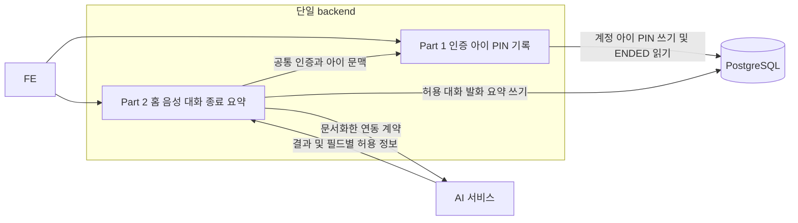
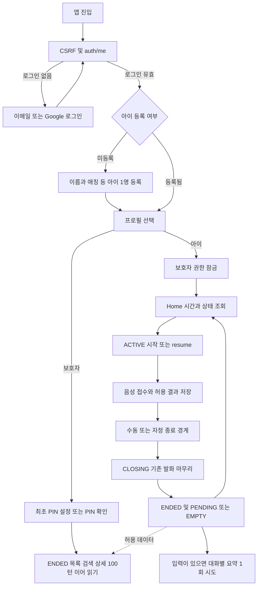
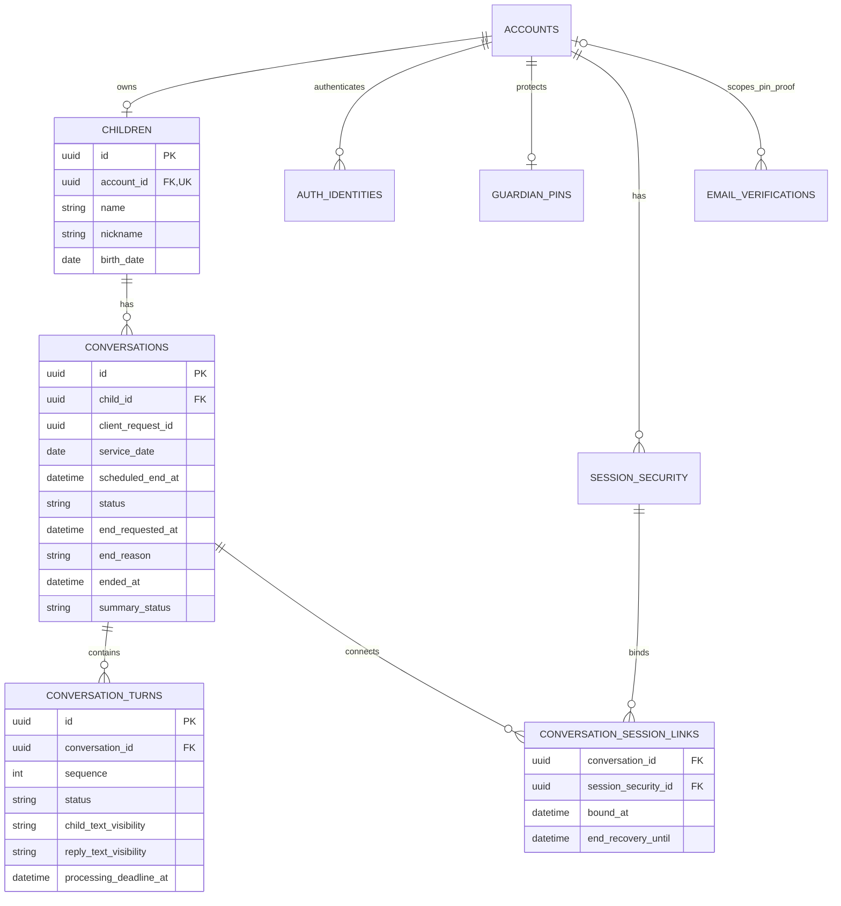
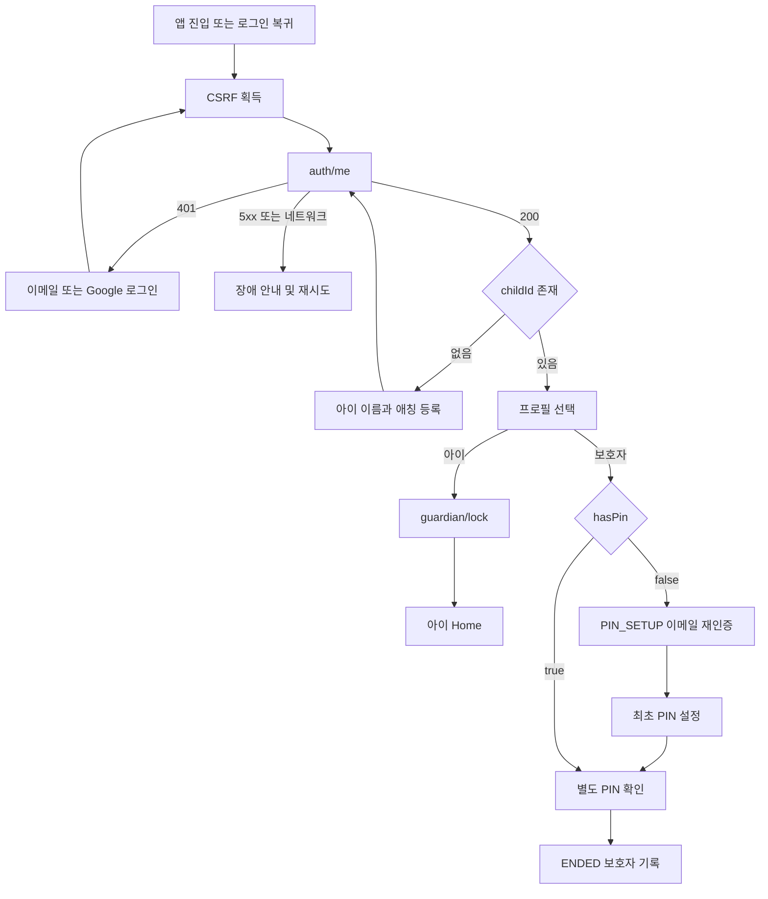

# DodamDodam P0 공통 요구사항

계약 v3.1 · 문서 정리 2026-10-06 · 구현·실제 통합 시험은 별도

## 범위와 문서 역할

P0 포함·제외 범위와 D/F 확정 정책은 [결정 기록](../Decision_Record.md)을 기준으로 합니다. 이 문서는 파트 간 책임·개발 계약의 위치·공통 인수 기준을 안내합니다.

단일 backend·단일 PostgreSQL을 사용합니다. 내부 파트 사이의 별도 HTTP 서비스, 계정·아이 삭제/CASCADE, 별도 검색 서버·메시지 브로커를 P0 요구사항으로 추가하지 않습니다. AI가 업무 DB에 직접 접근하지 않습니다. 스플래시·온보딩·마이크 권한 화면은 FE 책임이며 화면별 API를 추가하지 않습니다. Home의 PLAY는 COMING_SOON이고 학습 메뉴는 없습니다. 휴대전화 인증·rememberMe·보호자 음성 다시 듣기도 P0에서 제외합니다.

## 책임과 공유 경계

| 영역 | 책임 | 공유 경계 |
| --- | --- | --- |
| 계정·로그인·CSRF·PIN | Part 1 | 공통 인증·아이 소유권·현재 세션 보호자 권한 함수 |
| 아이 프로필 | Part 1 | ChildView·내부 ChildContext에 name과 nickname 제공 |
| Home·대화·발화·음성·종료·요약 | Part 2 | 허용 텍스트 읽기 모델·상태·정렬·세션별 연결/종료 복구 |
| 보호자 기록·검색 | Part 1 | Part 2의 ENDED 저장 모델 읽기, 인덱스 변경은 Part 2와 조정 |
| STT·LLM·TTS·요약·필드별 허용 | AI 팀, 연결은 Part 2 | 실제 wire는 D13·D14 자료로 매핑. AI가 업무 DB에 직접 접근하지 않음 |
| 녹음·화면·재생·첫 인사 | FE | 서버 상태에 따른 입력/내용 차단, 결과 표시·재시도 |

## 개발 계약 찾아가기

| 확인할 내용 | 기준 위치 |
| --- | --- |
| 담당별 작업 | [Part 1](P0_Part1.md), [Part 2](P0_Part2.md) |
| 경로·담당·권한과 operationId | [API 개요](../api/00-overview.md#section-2) |
| HTTP·입력 정규화·세션·공유 응답·공개 허용 | [공통 API](../api/01-common.md), [요청 공통 규칙](../Integrated_API_Spec.md#section-4) |
| 아이 입력·AI 호칭·캐릭터 | [아이 프로필](../api/03-children.md), [Home](../api/06-conversations.md#section-7-2) |
| 시간·시작·종료·복구·원자성 | [대화 규칙](../api/06-conversations.md#section-8) |
| 음성·AI·중복 키·필드별 허용 | [음성 API](../api/07-voice.md) |
| 보호자 권한·기록·검색 | [PIN](../api/04-guardian.md), [기록](../api/05-records.md) |
| 오류·수치·AI/운영 미정 항목 | [오류·검증](../api/08-errors-and-validation.md) |
| 전체 필드·NULL·정상/실패 JSON | [기능별 명세·스키마 목차](../Integrated_API_Spec.md), [OpenAPI](../Integrated_OpenAPI.yaml) |
| 테이블·제약·migration·DB 검증 | [통합 ERD](../Integrated_ERD_Design.md) |

## 공통 인수 기준

- 08시/자정·수동 종료와 발화 접수 경합, 원래 deadline 경계, CLOSING 중 내용 차단, ENDED 후 같은 날 새 ID와 이전 요약 분리를 확인한다.
- 복수 기존 연결의 CLOSING/ENDED 확인, 새 로그인 거부, endedAt+600초 equality 거부, 중복 end가 경계·기한·요약 횟수를 바꾸지 않는지 확인한다.
- 빈 종료 기록 EMPTY·요약 미호출, 첫 인사 AI/TTS/저장/요약/발화 수 제외, nickname 표시·실명 자동 전송 금지를 확인한다.
- 요청/권한·PIN 목적·동시 소비·폐기, 필드별 허용, 정상·실패·비공개 검색, ENDED 100턴 이후 전체 조회를 확인한다.
- API별 작업 ID·operationId·전체 경로·권한·입력·성공/실패 예시·경합·데이터·검증 사례를 통합 API/OpenAPI에 유지한다.

실제 AI schema·MIME/codec·용량/길이·텍스트 한도·단계/전체 기한·임시 음성 TTL·허용 정보는 D13·D14 대기다. 실제 환경·보관·메일·키·정리 작업은 D17 대기이며 초기 기술 기준을 운영 확정값으로 표시하지 않는다.

## 전체 흐름과 관계

### 담당 구조

<!-- diagram: req-common-architecture -->

### 제품 흐름

<!-- diagram: req-common-product-flow -->

### 핵심 데이터 관계

<!-- diagram: req-common-erd -->

### 로그인·프로필 진입

<!-- diagram: req-common-entry -->

