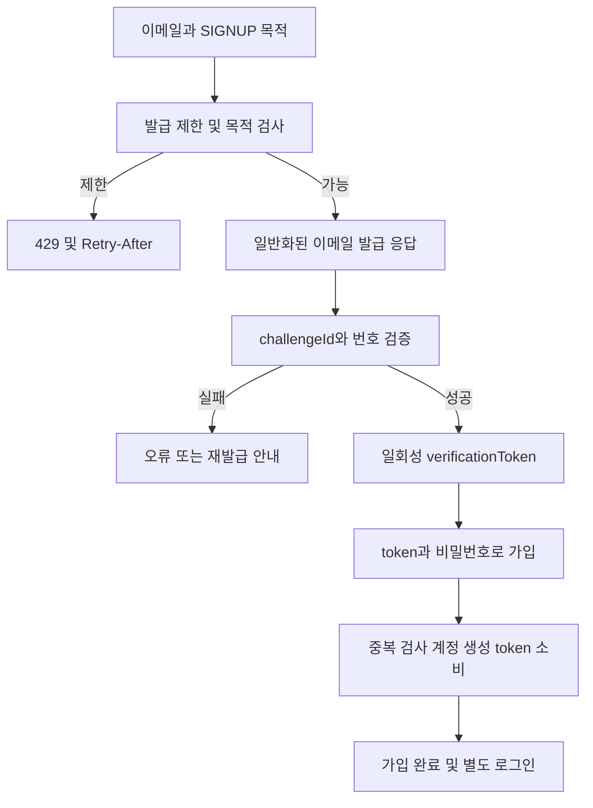
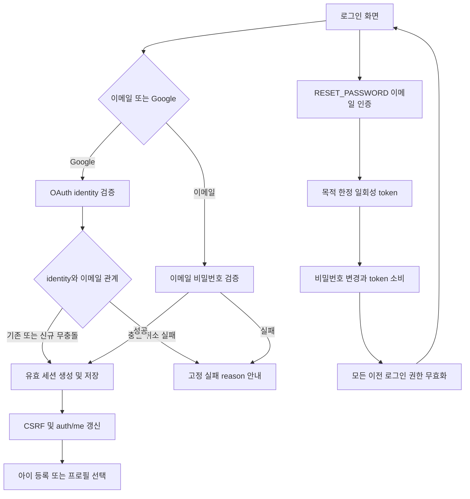
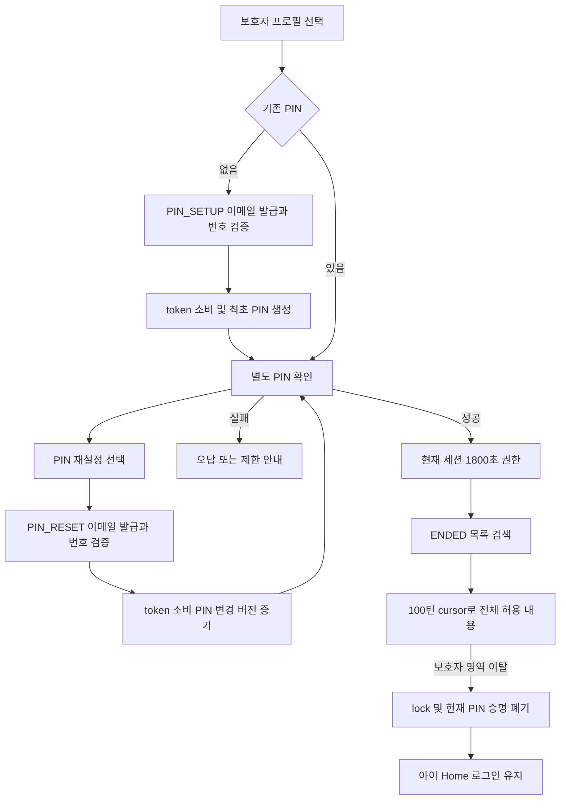
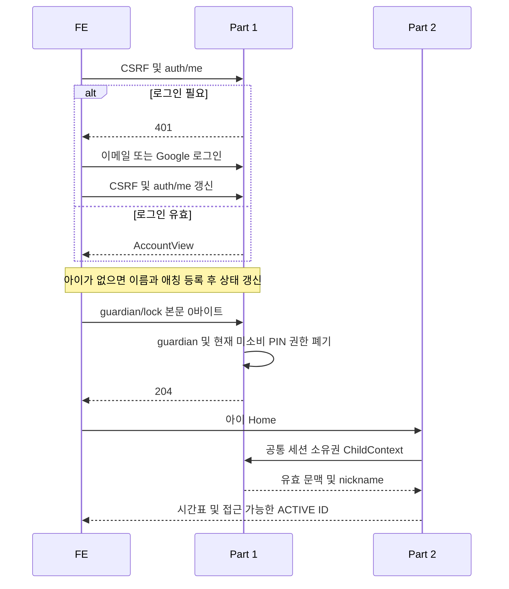

# DodamDodam P0 Part 1 — 계정·아이·PIN·보호자 기록

계약 v3.1 · 문서 정리 2026-10-06 · 구현·실제 통합 시험은 별도

[공통 요구사항](P0_Common_Spec.md)과 [확정 정책](../Decision_Record.md)을 적용합니다. 이 문서는 작업 책임과 인수 기준을 관리하고 상세 계약은 아래 링크에서 한 번만 관리합니다.

## 담당 범위

| 작업 | 구현 책임 | 확인할 산출물 |
| --- | --- | --- |
| A-01 가입·이메일 인증 | 목적별 인증번호 발급/검증·재발급·만료·시도 제한·1회 token 소비, 최소 이메일 가입 | 상태 전이·API·계정/인증 DDL·경합 사례 |
| A-02 로그인·세션 | 이메일/Google 로그인·auth/me·세션 유지·로그아웃·CSRF·공통 권한 | identity 충돌·세션 무효화·오류 계약 |
| A-03 비밀번호 재설정 | RESET_PASSWORD 이메일 증명·token 소비·비밀번호 변경·전체 이전 로그인 폐기 | 성공 204·목적/기한/재사용 실패 |
| A-04 아이·프로필 | 아이 1명의 이름·애칭·생일·성별·관심사·캐릭터 등록/조회 | ChildView·ChildContext·소유권 함수·nickname migration |
| A-05 보호자 PIN | 4자리 최초 설정·확인·잠금·PIN_RESET 이메일 재인증 | 세션 한정 1,800초·버전 무효화·동시 소비 |
| A-06 기록·검색 | ENDED 날짜별 목록·제목/주제/요약·전체 발화·키워드 검색 | 같은 날 복수 기록·EMPTY·100턴 cursor·허용 텍스트 |

스플래시·온보딩·마이크 권한 화면은 FE 책임이다. 별도 화면별 API를 만들지 않는다. Part 2의 대화·발화·요약 저장 모델을 중복 생성하거나 결과를 다시 저장하지 않는다. 휴대전화 인증·Kakao·rememberMe·다자녀·프로필 수정/삭제·동의/추가 보호자 정보·대시보드·감정 분석·알림·리포트 내보내기는 P0 제외다. 가입 동의 플래그/테이블·필수 보완 화면을 추가하거나 법적 보호자 확인을 완료했다고 표시하지 않는다.

## 상세 계약 찾아가기

| 업무 | 기준 위치 |
| --- | --- |
| A-01·A-02·A-03 가입·세션·비밀번호 | [인증 API](../api/02-auth.md) |
| A-04 아이·이름·애칭·ChildContext | [아이 프로필](../api/03-children.md), [공통 내부 함수](../api/01-common.md#section-3-1) |
| A-05 PIN·이메일 재인증·권한 무효화 | [PIN API](../api/04-guardian.md), [공통 권한](../api/01-common.md) |
| A-06 날짜·검색·정렬·100턴 cursor | [보호자 기록](../api/05-records.md) |
| 입력·성공/실패·JSON 스키마 | [API 목차](../Integrated_API_Spec.md), [OpenAPI](../Integrated_OpenAPI.yaml) |
| DB·제약·데이터 이관 | [통합 ERD](../Integrated_ERD_Design.md) |
| 공통 보안·오류·제한 수치 | [공통 API](../api/01-common.md), [오류·검증](../api/08-errors-and-validation.md) |

## 인수 기준

- [ ] 정상 가입·별도 로그인·Google 신규/기존/취소/이메일 충돌, OAuth 저장 실패를 확인한다.
- [ ] 번호/token 만료·재발급·목적 교차·동시 소비·계정/세션/generation/PIN 버전·lock 경합을 확인한다.
- [ ] name 1\~5·nickname 1\~20 경계·각 필수값·공백·null·동시 아이 등록·타인 소유권을 확인한다.
- [ ] PIN 1,800초 equality·활동 미연장·reset 후 모든 이전 guardian 무효·로그인/ACTIVE 유지·오답/차단 유지·별도 unlock을 확인한다.
- [ ] 비밀번호 변경·logout·세션 교체 뒤 이전 연결/복구 권한이 결과를 노출하지 않는지 확인한다.
- [ ] 같은 날 복수 ENDED·EMPTY·PENDING/FAILED 기록, ACTIVE/CLOSING 제외, 100턴 이후 cursor·검색·비공개 텍스트 제외를 확인한다.
- [ ] API/OpenAPI/ERD·FE 예시의 필드·NULL·코드와 Part 2 공유 읽기 모델을 대조한다.

남은 자료는 D13·D14 실제 AI·캐릭터 카탈로그 및 D17 운영 환경·보관·메일·키·실측 제한이다. PIN 재설정·가입 동의 범위·전체 기록 cursor는 이미 정해진 계약이며 재승인 항목으로 되돌리지 않는다.

## 담당 흐름

### 가입·이메일 증명

<!-- diagram: req-part1-signup -->

### 로그인·비밀번호 재설정

<!-- diagram: req-part1-login-reset -->

### PIN·보호자 기록

<!-- diagram: req-part1-pin-records -->

### Part 1·Part 2 진입 연결

<!-- diagram: req-part1-entry-contract -->

