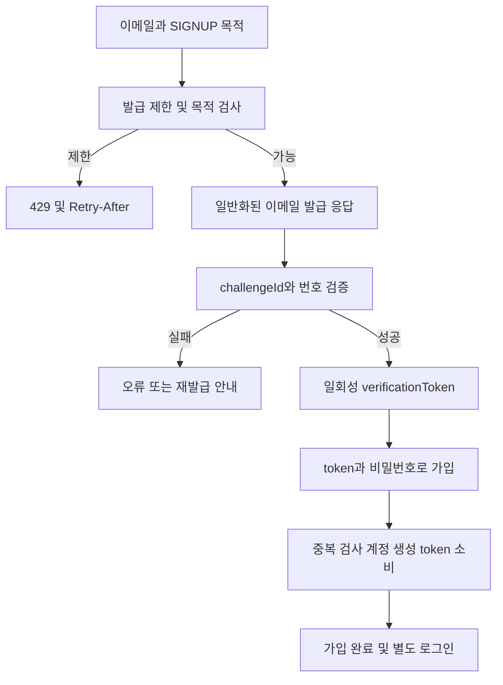
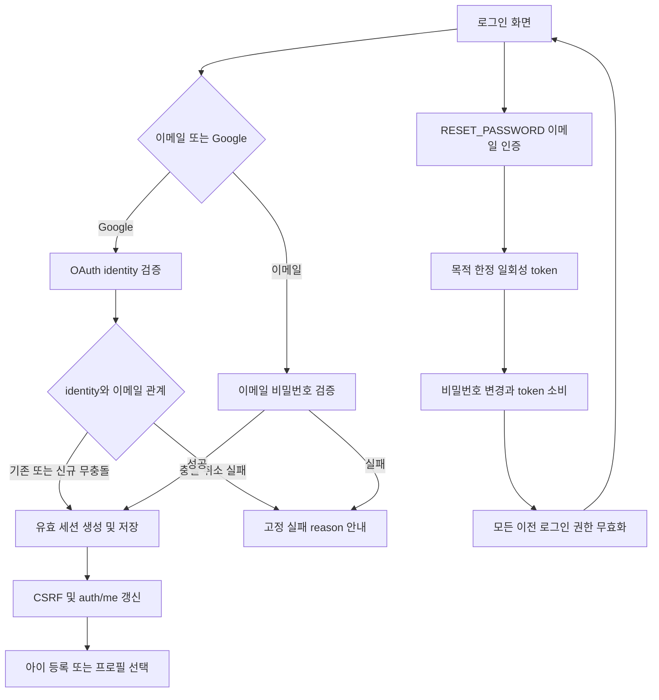
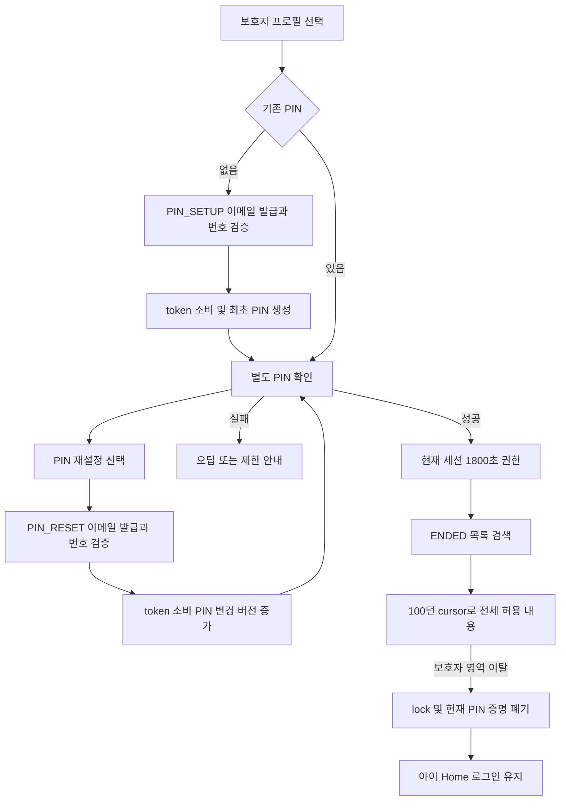
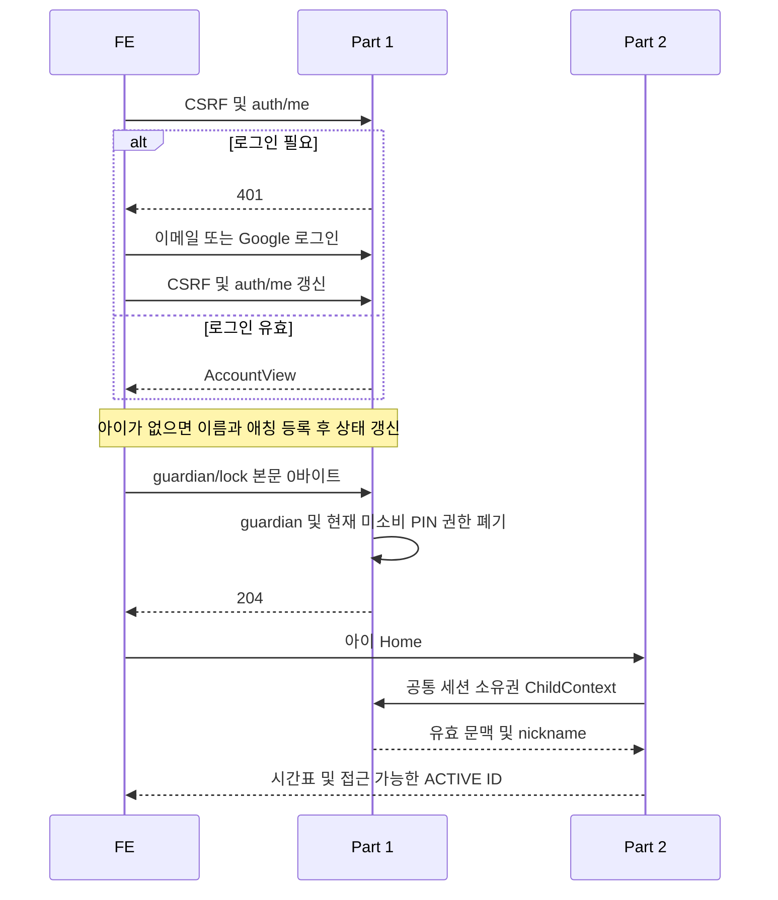

# DodamDodam P0 Part 1 — 계정·아이·PIN·보호자 기록

2026-10-03 KST · v3.1 · 현재 구현용 요구사항 · 구현·통합 시험은 별도

[공통 요구사항](P0_Common_Spec.md), [확정 정책](../Decision_Record.md), [통합 API](../Integrated_API_Spec.md), [OpenAPI](../Integrated_OpenAPI.yaml), [통합 ERD](../Integrated_ERD_Design.md)를 기준으로 한다. 승인된 F-01\~F-08과 유지된 D01\~D18 결정을 본문에 반영했다. 담당자·일정은 임의 배정하지 않는다.

## 담당 범위

| 작업 | 구현 책임 | 확인할 산출물 |
| --- | --- | --- |
| A-01 가입·이메일 인증 | 목적별 인증번호 발급/검증·재발급·만료·시도 제한·1회 token 소비, 최소 이메일 가입 | 상태 전이·API·계정/인증 DDL·경합 사례 |
| A-02 로그인·세션 | 이메일/Google 로그인·auth/me·세션 유지·로그아웃·CSRF·공통 권한 | identity 충돌·세션 무효화·오류 계약 |
| A-03 비밀번호 재설정 | RESET_PASSWORD 이메일 증명·token 소비·비밀번호 변경·전체 이전 로그인 폐기 | 성공 204·목적/기한/재사용 실패 |
| A-04 아이·프로필 | 아이 1명의 이름·애칭·생일·성별·관심사·캐릭터 등록/조회 | ChildView·ChildContext·소유권 함수·nickname migration |
| A-05 보호자 PIN | 4자리 최초 설정·확인·잠금·PIN_RESET 이메일 재인증 | 세션 한정 1,800초·버전 무효화·동시 소비 |
| A-06 기록·검색 | ENDED 날짜별 목록·제목/주제/요약·전체 발화·키워드 검색 | 같은 날 복수 기록·EMPTY·100턴 cursor·허용 텍스트 |

스플래시·온보딩·마이크 권한 화면은 FE 책임이다. 별도 화면별 API를 만들지 않는다. Part 2의 대화·발화·요약 저장 모델을 중복 생성하거나 결과를 다시 저장하지 않는다. 휴대전화 인증·Kakao·rememberMe·다자녀·프로필 수정/삭제·동의/추가 보호자 정보·대시보드·감정 분석·알림·리포트 내보내기는 P0 제외다. 가입 동의 플래그/테이블·필수 보완 화면을 추가하거나 법적 보호자 확인을 완료했다고 표시하지 않는다.

## API 목록

아래 경로는 `/api/v1` 기준이며 모든 POST는 공개 인증도 CSRF를 요구한다. G=로그인, O=아이 소유권·리소스 연결, P=현재 세션 PIN 확인, V=해당 목적 검증 token이다. 전체 필드·오류·헤더는 통합 OpenAPI가 기준이다.

| 메서드·경로 | 입력·반환 | 권한·성공 |
| --- | --- | --- |
| GET /auth/csrf | CSRF token, 공통 data envelope 예외 | 공개·200 |
| POST /auth/email-verifications | purpose, 공개 목적은 email 필수 → challengeId/expiresAt | SIGNUP/RESET_PASSWORD 공개, PIN_SETUP/PIN_RESET G·200 |
| POST /auth/email-verifications/verify | challengeId, code → verificationToken/tokenExpiresAt | PIN 목적은 발급 계정·현재 세션 결합·200 |
| POST /auth/signup | SIGNUP verificationToken, password 두 필드 → accountId | V·201, 가입 후 별도 로그인 |
| POST /auth/login | email, password → AccountView·세션 | 공개·200 |
| GET /auth/me | accountId/email/childId/hasPin/guardianUnlockedUntil | G·200, 비로그인 401 |
| POST /auth/logout | 본문 0바이트, 현재 문맥·PIN 권한 폐기 | G·204 |
| POST /auth/password-resets | RESET_PASSWORD verificationToken, newPassword | V·204 |
| GET /children | ChildView의 data.items, 없음은 빈 배열 | G·200 |
| POST /children | name, nickname, birthDate, gender, characterId, 선택 interests | G·201+Location |
| POST /guardian/pin | pin, PIN_SETUP verificationToken, 기존 PIN 덮어쓰기 금지 | G+V·204, 자동 unlock 없음 |
| POST /guardian/unlock | pin → guardianUnlockedUntil | G·200 |
| POST /guardian/lock | 본문 0바이트, 현재 guardian·미소비 PIN 목적 증명 폐기 | G·204 |
| POST /guardian/pin/reset | newPin, PIN_RESET verificationToken | G+V·204, 새 PIN 별도 unlock |
| GET /children/{childId}/conversations | from/to/q/page/size → ENDED Page | G+O+P·200 |
| GET /children/{childId}/conversations/{conversationId} | afterSequence/size → ENDED 상세 및 다음 cursor | G+O+P·200 |

Google은 `/oauth2/authorization/google` 및 `/login/oauth2/code/google` GET 302를 사용하며 콜백을 별도 JSON 로그인 API로 복제하지 않는다. logout·lock은 `{}`도 보내지 않는 0바이트 본문이다. 요청 미정의 필드 400, 현재 DTO는 명시적 null을 허용하지 않는다.

## 가입·입력·로그인

| 입력·상태 | 계약 |
| --- | --- |
| 이메일 | trim+전체 lower, ASCII 유효 이메일·최대 254자. Gmail 점이나 +suffix를 제거하지 않음 |
| 새 비밀번호 | 가입·비밀번호 재설정은 15\~128 Unicode 코드포인트. trim·Unicode 정규화·절단 금지, 단독 surrogate 거부 |
| 로그인 비밀번호 | 기존 문자열 검증, 새 생성 15\~128 길이를 소급하지 않음. Part 1 JSON 16,384 UTF-8 바이트 기술 기준 |
| PIN·이메일 번호 | PIN ASCII 숫자 4자리, 번호 6자리 문자열. 선행 0 보존·숫자 변환 금지 |
| 검증 token | challengeId.secret 형식·secret의 UTF-8 SHA-256 상수시간 비교. 원문을 DB·URL·query·localStorage·로그에 저장하지 않음 |
| 가입 | token의 정규화된 이메일 사용, 중복 확인·계정 생성·token 소비 한 트랜잭션. 계정 ID 반환 후 별도 로그인 |
| 계정 열거 방지 | 공개 발급 200은 계정 존재 증거가 아님. decoy·일반화 안내, 비존재 로그인 dummy hash 비교 유지 |

번호 확인과 token 발급은 원자적으로 한 번만 수행한다. 최신 목적의 재발급은 이전 미소비 번호/token을 폐기한다. token 검사·소비와 가입/비밀번호/PIN 업무 변경은 같은 트랜잭션이며 외부 메일 호출 중 업무 row 잠금을 유지하지 않는다. TTL·오답 한도·재발급 간격·전역 예산은 통합 명세의 초기 기술 기준과 D17 실제 운영값을 구분한다.

<!-- diagram: req-part1-signup -->

Google 식별자는 검증된 provider/issuer/subject이며 이메일로 자동 계정 연결하지 않는다. 서명·iss·aud·exp·state·nonce와 canonical issuer를 검사한다. 신규 identity와 이메일 무충돌 조건이면 계정+identity를 원자 생성한다. UNIQUE 경합은 동일 identity 승자만 재조회한다. 기존 identity 이메일이 달라도 accounts.email을 자동 변경하지 않는다.

OAuth 취소 OAUTH_CANCELLED, 검증 이메일 부재 OAUTH_PROFILE_INCOMPLETE, 다른 identity의 동일 이메일 ACCOUNT_LINK_REQUIRED, 기타 인증/세션 저장 실패 OAUTH_LOGIN_FAILED를 고정 실패 URL reason으로 안내한다. 시작 상태 저장 실패 503 AUTH_STATE_UNAVAILABLE, callback 실패는 허용된 고정 실패 URL 302이며 URL 설정 자체가 없으면 503이다. 비밀·상세 인프라 오류를 URL에 넣지 않는다. 신규 가입에 동의/추가정보 보완을 요구하지 않는다.

<!-- diagram: req-part1-login-reset -->

Google-only는 유효 RESET_PASSWORD token을 검증한 뒤 409 PASSWORD_RESET_NOT_AVAILABLE로 Google 로그인을 안내한다. 업무 실패 rollback으로 token을 소비하지 않고 기존 만료를 유지하며 새 password 수단·identity 연결·로그인 권한을 생성하지 않는다. 이메일 발급 응답만으로 비밀번호 존재를 추측하지 않는다.

## 아이 이름·애칭과 데이터 제공

| 필드 | 등록 규칙·사용처 |
| --- | --- |
| name | 필수 trim 후 1\~5 Unicode 코드포인트. 보호자용 아이 이름 |
| nickname | 필수 trim 후 1\~20 코드포인트. null/빈 값 거부. 아이 화면·인사·AI 호칭 기본값, 별도 유일성/실명 인증 없음 |
| birthDate | 유효 YYYY-MM-DD·KST 오늘 이하, 최저 연령 추가 없음 |
| gender | MALE 또는 FEMALE |
| interests | 선택 자유 태그 0\~10개·각 trim 후 1\~30 코드포인트·중복 거부·순서 유지. 생략 `[]`, 저장 text[] |
| characterId | 영문/숫자/_/- 1\~64자·지원 목록 검증. 실제 카탈로그·기본값·폐기 ID·AI 대응은 자료 대기 |

ChildView·CreateChildRequest·Home.child·내부 ChildContext에 nickname을 반영한다. ChildContext의 name이 존재한다는 이유로 AI에 자동 전송하지 않으며 Part 2는 nickname을 실제 AI 호칭 필드로 매핑한다. 기존 데이터 migration은 nullable nickname 추가→name 복사→길이/빈 값 검증→NOT NULL. 이관 목적으로 name과 nickname을 이후에도 동기화하거나 수정 API를 새로 추가하지 않는다.

children.account_id UNIQUE로 동시 2명 등록을 막는다. 등록 완료 후 FE가 auth/me를 갱신한다. 등록 Location은 생성 리소스 식별자이며 이 요구사항이 새 단건 GET·수정·삭제 API를 추가하는 근거는 아니다.

## PIN·세션·무효화

일반 로그인은 서비스 idle/absolute 상한 없이 유지하는 D04 계약이며 expires_at=null·쿠키 365일 유효 사용 갱신·rememberMe 미도입이다. 실제 framework 세션·principal/context/계정 일치·미폐기·session_version 검사는 매 요청 수행한다. 저장소 확인 불가 503, 쿠키 수명이 영구 로그인 보장은 아니다. 로그인은 DB 문맥 생성과 framework 세션 저장 모두 성공 후 200이며 일부 실패 시 새 문맥을 폐기하고 옛 폐기 권한을 복구하지 않는다.

보호자 권한은 현재 세션 PIN 성공부터 최대 1,800초·활동 연장 없음이다. session_security의 시각·pin_version·generation이 원본이며 늦은 serialized session 값으로 덮어쓰지 않는다. 보호자 전체 영역 이탈 시 lock하고 내부 이동마다 잠그는 새 정책을 추가하지 않는다.

| 단계 | PIN_SETUP | PIN_RESET |
| --- | --- | --- |
| 대상 | 유효 로그인·PIN 미설정 | 유효 로그인·기존 PIN. Google-only도 가능 |
| 이메일 발급 | 현재 계정 이메일 사용 | 현재 계정 이메일 사용, PIN 없으면 409 PIN_NOT_SET |
| 권한 결합 | 계정·현재 security context·setup_generation·이메일 | 동일 조건+발급 당시 pin_version |
| 최종 입력 | pin, verificationToken. token 부재 403, 명시적 null 400 | newPin, verificationToken. token 부재/null 400 |
| 성공 | token 소비+최초 PIN 생성, 204 | token 소비+PIN 변경+pin_version 증가+다른 미소비 PIN 권한 폐기, 204 |
| 성공 후 | 별도 unlock 필요 | 로그인·ACTIVE 연결 유지, 모든 이전 guardian 무효·별도 새 PIN unlock |

발급 email을 생략하면 서버 현재 이메일을 사용한다. 입력하면 정규화된 현재 계정 이메일과 같아야 하며 null 불가다. accounts → session_security → guardian_pins → challenge 순으로 잠근다. 현재 이메일과 challenge 이메일은 같은 정규화 문자열로 비교하며 FE가 해시/binding 필드를 제출하지 않는다.

잘못된 목적·해시·만료·소비는 400 VERIFICATION_INVALID다. 실제 해당 PIN 목적의 계정·현재 문맥·generation·폐기·PIN 버전 결합 불일치는 403 PIN_SETUP_AUTHORIZATION_REQUIRED 또는 PIN_RESET_AUTHORIZATION_REQUIRED이며 만료·소비 오류보다 우선한다. 최초 설정에서 기존 PIN은 409 PIN_ALREADY_SET이다. reset 승자 token은 token_consumed_at만 기록하고 invalidated_at을 함께 넣지 않는다. 오답·차단·요청량 예산은 reset으로 초기화하지 않는다.

lock은 현재 guardian을 해제하고 generation 증가·미소비 PIN_SETUP/PIN_RESET 폐기, 로그인·ACTIVE 연결 유지다. logout·세션 교체·만료는 이전 연결/종료 복구까지 무효화한다. password reset은 계정 session_version 증가로 모든 이전 로그인 무효화다. PIN reset은 로그인 유지·계정 모든 기존 guardian 무효화다. 늦은 AI 저장은 가능하지만 무효 세션으로 결과 반환 불가다.

<!-- diagram: req-part1-pin-records -->

## 기록·검색·Part 2 연결

목록·검색·상세는 ENDED만 포함하고 ACTIVE/CLOSING은 제외한다. 수동 종료 뒤 같은 날짜에 여러 대화가 있을 수 있으며 모두 별도 conversationId로 표시한다. 발화 없는 EMPTY도 유지하고 요약 완료를 기다리지 않는다. 제목/주제/요약이 null인 EMPTY·PENDING·FAILED를 상태 안내로 표현하며 AI 제목을 임의 생성하지 않는다.

| 조회 | 계약 |
| --- | --- |
| 목록 | from/to는 KST startedAt 날짜·양 끝 날짜 포함, from>to 400. page=0,size=20 기본·최대 100, startedAt DESC/id DESC |
| 검색 | q trim 후 최대 100자·빈 값은 필터 없음. 제목/주제/요약 및 허용 child/reply 텍스트 부분 일치·영문 대소문자 무시. `%`, `_`, `!` 리터럴 escaping, EXISTS로 대화당 1건 |
| 상세 | afterSequence=0,size=100 기본·최대. sequence ASC·size+1. 다음은 nextAfterSequence, 끝은 hasNext=false/cursor=null. 순번 공백 허용·임의 전체 길이 절단 금지 |
| 권한 | 로그인→아이/대화 소유 관계→PIN. 타인 404, 유효 소유자의 PIN 만료 403. 모든 페이지 재검사, 대상이 ACTIVE/CLOSING이면 보호자 상세 404 |
| 공개 | VISIBLE/REDACTED 문자열만 표시·검색. OMITTED=null. 보호자 음성·topicSuggestions 없음 |

ConversationView에는 endRequestedAt/endReason이 포함되며 endRequestedAt/endReason/endedAt은 ENDED에서 값이 있어야 한다. startedAt 날짜를 기준으로 하므로 자정 뒤 마무리돼도 원래 날짜 기록이다. READY는 세 요약 필드 모두 허용된 문자열, 그 외 세 필드는 null이다. 상세 페이지 사이에 요약은 완료될 수 있고 목록 OFFSET은 동시 추가의 snapshot 안정성을 보장하지 않는다.

| 제공/수신 | 내부 계약 |
| --- | --- |
| requireAuthenticatedSession | accountId/securityContextId. 실제 세션·DB 폐기/버전 검사·확인 불가 503 |
| requireChildAccess | 세션 accountId와 childId 소유권, 요청 body accountId 불신 |
| getChildContext | 소유권 검사 뒤 childId/name/nickname/birthDate/interests/characterId/createdAt. createdAt은 Home joinedAt |
| requireGuardianAccess | 현재 세션 until>now·현재 pin_version. 기록 API에만 추가, 아이 화면에 PIN 강제 금지 |
| Part 2 읽기 모델 | ConversationView/TurnView의 허용 필드·상태·NULL·정렬. Part 1이 조회/검색, 인덱스 migration은 Part 2 |

<!-- diagram: req-part1-entry-contract -->

## ERD·제약·검증

accounts의 이메일 UNIQUE·password_hash/계정 버전, auth_identities의 UNIQUE(provider,issuer,subject), children.account_id UNIQUE, guardian_pins의 계정당 1개·hash/PIN 버전, session_security의 guardian 기한/generation·폐기, email_verifications의 목적/hash/기한/소비/폐기/PIN 결합을 통합 ERD와 맞춘다. PIN_SETUP/PIN_RESET은 계정·문맥 결합을 요구하고 가입 전 목적은 계정 FK를 필수로 만들지 않는다. 동의 테이블·rememberMe 별도 저장 모델은 추가하지 않는다.

제한 예약은 통합 API의 IP 선행 별도 커밋과 나머지 키 정렬·짧은 트랜잭션을 유지한다. 차단 요청으로 차단 기한을 연장하지 않으며 Retry-After는 실제 적용 제한의 최늦은 해제까지 올림한 초·최소 1이다. PIN 성공 시각은 잠금 대기 전 Tx 시각이 아니라 해시 비교와 유효 세션 재검사 뒤 DB 시각을 사용한다.

- [ ] 정상 가입·별도 로그인·Google 신규/기존/취소/이메일 충돌, OAuth 저장 실패를 확인한다.
- [ ] 번호/token 만료·재발급·목적 교차·동시 소비·계정/세션/generation/PIN 버전·lock 경합을 확인한다.
- [ ] name 1\~5·nickname 1\~20 경계·각 필수값·공백·null·동시 아이 등록·타인 소유권을 확인한다.
- [ ] PIN 1,800초 equality·활동 미연장·reset 후 모든 이전 guardian 무효·로그인/ACTIVE 유지·오답/차단 유지·별도 unlock을 확인한다.
- [ ] 비밀번호 변경·logout·세션 교체 뒤 이전 연결/복구 권한이 결과를 노출하지 않는지 확인한다.
- [ ] 같은 날 복수 ENDED·EMPTY·PENDING/FAILED 기록, ACTIVE/CLOSING 제외, 100턴 이후 cursor·검색·비공개 텍스트 제외를 확인한다.
- [ ] API/OpenAPI/ERD·FE 예시의 필드·NULL·코드와 Part 2 공유 읽기 모델을 대조한다.

남은 자료는 D13·D14 실제 AI·캐릭터 카탈로그 및 D17 운영 환경·보관·메일·키·실측 제한이다. PIN 재설정·가입 동의 범위·전체 기록 cursor는 이미 정해진 계약이며 재승인 항목으로 되돌리지 않는다.
