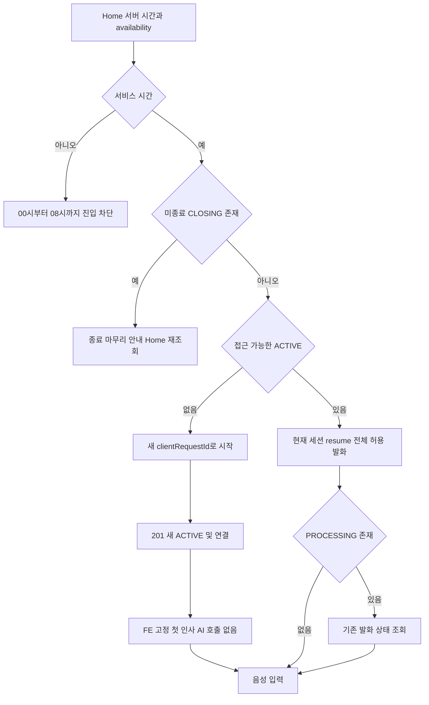
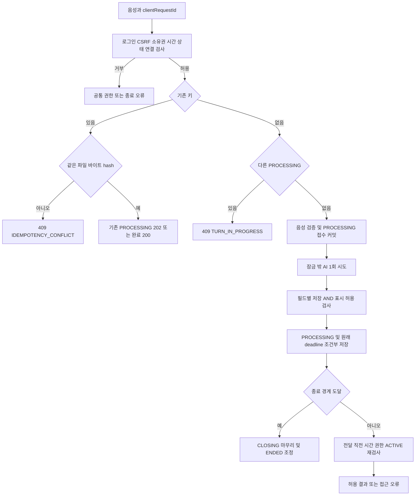
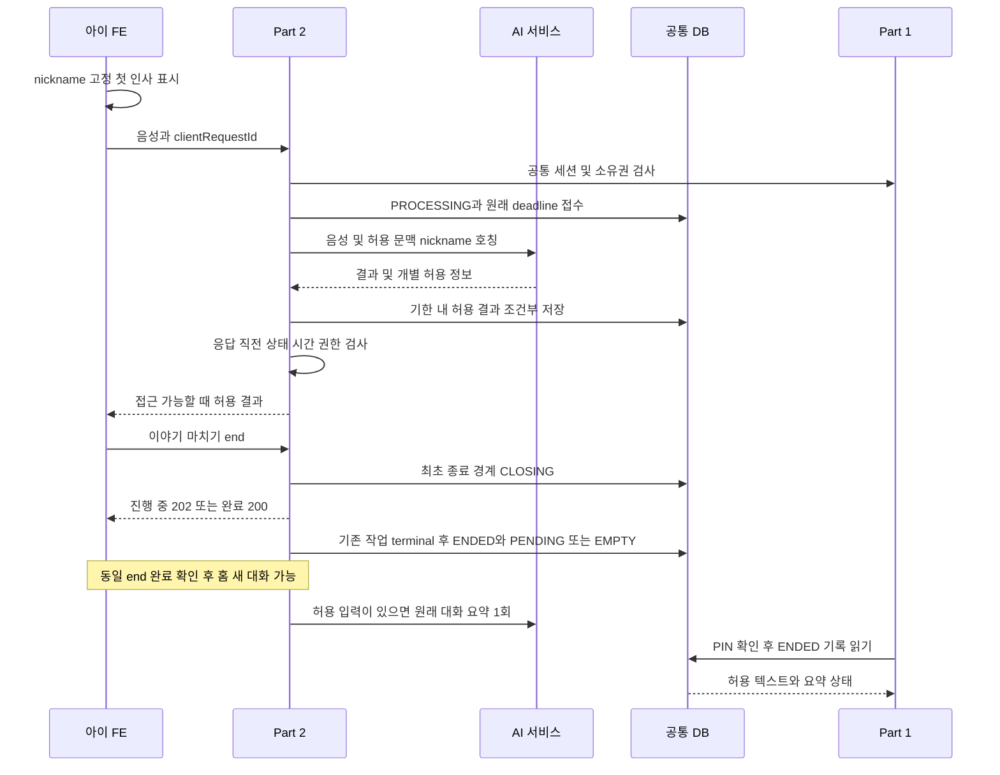
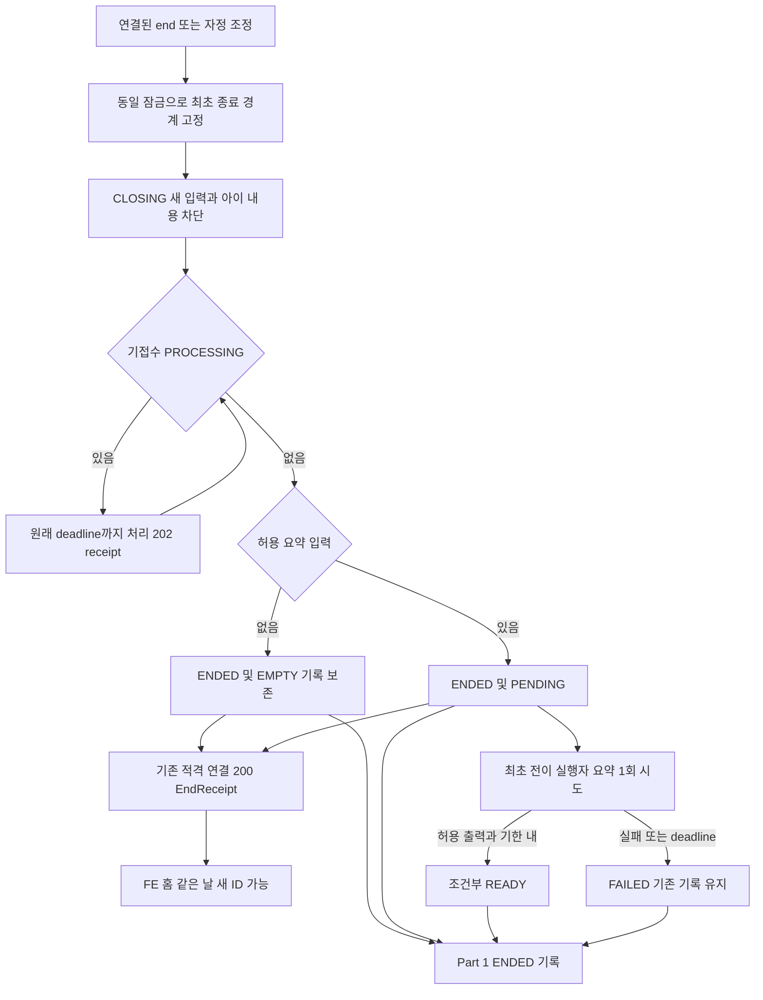

# DodamDodam P0 Part 2 — Home·음성 대화·종료·요약

2026-10-03 KST · v3.1 · 현재 구현용 요구사항 · 구현·실제 AI 통합 시험은 별도

[공통 요구사항](P0_Common_Spec.md), [확정 정책](../Decision_Record.md), [통합 API](../Integrated_API_Spec.md), [OpenAPI](../Integrated_OpenAPI.yaml), [통합 ERD](../Integrated_ERD_Design.md)를 적용한다. 실제 BE↔AI wire와 음성·기한·허용 수치는 AI 전달서(별도 전달)의 D13·D14 자료 대기이며 임의로 확정하지 않는다.

## 담당 범위

Part 2는 아이 Home, 음성 대화의 수명, AI 연동, 허용 결과 저장, 임시 음성, 수동/자정 종료와 요약을 맡는다. STT·LLM·TTS 엔진·안전 판정은 AI 팀, 기록 목록/검색은 Part 1이다. backend 내부는 단일 애플리케이션·DB이며 공통 인증/아이 소유권 함수를 재사용한다. AI가 업무 DB를 직접 읽거나 쓰지 않는다.

| 작업 | 구현 책임 | 공유 산출물 |
| --- | --- | --- |
| B-01 아이 Home | 최소 프로필·nickname 인사·joinedAt·daysTogether·메뉴·서버 이용시간·접근 가능한 ACTIVE ID | ChildHome, availability |
| B-02 시작·이어하기·종료 | 아이당 미종료 1개·당일 ACTIVE 복원·수동/자정 CLOSING·ENDED·기존 연결 receipt | 상태 전이·시작 중복키·세션 연결·경계/복구 |
| B-03 음성·AI | multipart 음성만 접수, STT/생성/TTS 연결·필드별 허용·인증된 임시 음성 GET | 실제 AI 매핑·발화 결과·실패 코드 |
| B-04 저장·요약 | 발화 순서·성공/실패·허용 텍스트, 최초 ENDED 후 대화별 요약 최대 1회 | ConversationView/TurnView·NULL·검색 가능한 읽기 모델 |
| B-05 실패·복구 | 파일 바이트 해시·응답 유실 조회·원래 deadline·재시작 정리·late callback | 중복·경합·202/실패·기한 경계 사례 |

텍스트/버튼 선택 발화·추천 UI·추천 생성/저장·사진·실제 놀이·보상·꾸미기·감정 분석·알림·보호자 음성 다시 듣기는 제외한다. 기존 안전 결과를 우회하지 않는다. 초기 인사는 FE 고정 템플릿이며 BE의 새 발화·AI 호출·TTS·요약 입력·발화 수로 만들지 않는다.

## API 목록과 권한

경로는 `/api/v1/children/{childId}` 기준이며 `D=/conversations/{conversationId}`다. 모든 요청은 로그인·아이 소유권·리소스 연결을 검사하고 POST는 CSRF가 필요하다. 아이 화면에는 보호자 PIN을 요구하지 않는다.

| 메서드·경로 | 결과·접근 조건 |
| --- | --- |
| GET /home | 200 ChildHome. 시간 밖에도 조회. 과거 내용 없음·대화 생성 없음 |
| POST /conversations | `{clientRequestId}`. 신규 201+Location, 연결된 같은 ACTIVE 키는 200. 서비스 시간·미종료 규칙 적용 |
| POST D/resume | body 0바이트. 당일 ACTIVE·서비스 시간에 현재 유효 세션 연결, 200 전체 허용 turns·processingTurnId |
| POST D/turns | multipart audio/clientRequestId 두 필드. 현재 연결·ACTIVE·서비스 시간. 최초 성공 201, 중복 완료 200, 처리 중 202 |
| GET D/turns/{turnId} | 현재 연결·ACTIVE·서비스 시간. 200 ChildTurnResult, PROCESSING/FAILED도 조회 성공 200 |
| GET D/turn-requests/{clientRequestId} | turnId를 모르는 응답 유실 복구. 동일 접근·결과 계약 |
| GET D/turns/{turnId}/audio | 현재 연결·ACTIVE·서비스 시간·별도 음성 허용·만료 전, 200 바이너리 |
| POST D/end | body 0바이트. 수동 종료 접수/기존 종료 재확인. 적격 기존 연결·복구, 202 EndPendingReceipt 또는 200 EndReceipt |

resume/end는 `{}`도 거부한다. start/resume에는 serviceDate·scheduledEndAt, 보호자 ConversationView에는 endRequestedAt·endReason이 포함된다. 아이 resume은 전체 turns를 sequence ASC로 반환하고 cursor·audio·topicSuggestions를 추가하지 않는다. 발화 wrapper는 turn/audio/topicSuggestions이며 추천은 모든 상태에서 `[]`다.

## Home·아이 문맥·첫 인사

Home.child는 childId/name/nickname/characterId, Home.greeting은 서버 고정 템플릿을 nickname 기준으로 제공한다. joinedAt=children.createdAt, daysTogether=KST 오늘−등록일+1이다. FE 대화 화면의 첫 인사는 별도의 고정 문구이며 예시 `“{nickname}, 오늘 만나서 반가워!”`처럼 조사 오류를 피하는 템플릿을 사용할 수 있다. AI 요청·TTS·발화 저장·요약·발화 수에 포함하지 않는다. 새로고침으로 가짜 발화가 늘어나지 않는다.

name은 보호자용 1\~5, nickname은 필수 1\~20 Unicode 코드포인트·trim 후 검증이며 null/빈 문자열 불가다. 내부 ChildContext에는 둘 다 있지만 AI 기본 호칭은 nickname이다. name을 자동 전송하지 않는다. 실제 AI 필드명·최소 아이 문맥은 D13·D14로 확인한다. 관심사는 자유 태그 0\~10개·각 1\~30 코드포인트, 실제 캐릭터 카탈로그는 자료 대기다.

availability는 timeZone/serverTime/serviceDate/opensAt/closesAt/canEnter/reason/nextOpensAt의 8필드다. 서버 KST 기준으로 opensAt=당일 08시, closesAt=다음 자정이다.

| 상황 | Home·시작 처리 |
| --- | --- |
| 00\~08 | false/OUTSIDE_SERVICE_HOURS/nextOpensAt=당일 08시, activeConversationId=null |
| 서비스 시간·CLOSING 존재 | false/CONVERSATION_CLOSING/nextOpensAt=null, activeConversationId=null |
| 서비스 시간·진입 가능 | true/reason=null/nextOpensAt=null, activeConversationId는 접근 가능한 당일 ACTIVE 또는 null |
| 메뉴 | TALK은 canEnter에 따라 AVAILABLE/UNAVAILABLE, PLAY는 COMING_SOON, 이 순서 각 1개. 학습 없음 |

새 `closingConversationId`는 추가하지 않는다. 시간 밖은 OUTSIDE_SERVICE_HOURS가 우선이며 자정 후 ACTIVE 행이 남아 있어도 아이 내용은 차단한다. 새 로그인은 종료 receipt 복구권한을 얻지 못하므로 Home 재조회로 현재 진입 가능 상태를 확인한다. 시간 밖에는 종료 완료를 추정하지 않고 시간외 안내 후 opensAt부터 재확인한다.

<!-- diagram: req-part2-home-start -->


## 시작·이탈·같은 날 새 대화

아이당 ACTIVE/CLOSING을 합쳐 하나만 허용한다. `(child_id,service_date)` UNIQUE는 제거하고 `(child_id,client_request_id)` 유지 및 미종료 부분 UNIQUE를 사용한다. 지난 날짜 미종료도 원래 처리기한에 맞춰 정리하기 전 새 행을 만들지 않는다. 임의로 deadline을 줄여 새 대화를 만들지 않는다.

| 시작 요청 | 결과 |
| --- | --- |
| 같은 키·당일 ACTIVE·현재 연결 | 200 기존 시작 정보. PROCESSING이어도 가능 |
| 같은 키·당일 ACTIVE·미연결 | 403 CHILD_SESSION_REQUIRED, Home 확인 후 명시 resume |
| 같은 키·CLOSING | 409 CONVERSATION_CLOSING |
| 같은 키·ENDED | 409 CONVERSATION_ENDED, 현재 다른 대화와 무관하게 키 재사용 금지 |
| 새 키·다른 ACTIVE | 409 ACTIVE_CONVERSATION_EXISTS와 error.activeConversationId, resume으로 복원 |
| 새 키·CLOSING | 409 CONVERSATION_CLOSING, ENDED까지 기다림 |
| 새 키·미종료 없음 | 서비스 시간에 201 새 ID·새 연결. 같은 날 ENDED가 있어도 허용 |

화면 이탈·새로고침·재진입은 end를 보내지 않는다. 같은 당일 ACTIVE 전체 허용 발화·순서를 복원하며 새로운 로그인도 ACTIVE일 때만 resume 연결이 가능하다. ENDED 이후 새 대화는 새 키, 전송 재시도는 기존 키다. 요약 PENDING은 새 대화 생성의 차단 조건이 아니며 결과는 원래 conversationId에만 저장한다.

## 수동·자정 종료와 receipt

대화 상태는 ACTIVE → CLOSING → ENDED다. 처리 중 발화가 없으면 짧은 트랜잭션 안에서 ENDED까지 확정 가능하다. 종료 버튼은 `POST D/end`, 화면 이탈은 end 호출 없음이다. FE는 이야기 마치기 요청 즉시 추가 입력을 막고, 서버 종료 확인 후 홈으로 간다. 응답이 유실되면 실패한 종료를 완료로 단정하지 않고 동일 end로 상태를 복구한다.

| 저장 상태 | 필드·제약 |
| --- | --- |
| ACTIVE | end_requested_at/end_reason/ended_at=null, summary_status=NOT_STARTED |
| CLOSING | end_requested_at·end_reason 필수, ended_at=null, summary_status=NOT_STARTED |
| ENDED | 세 종료 필드 필수, ended_at >= end_requested_at >= started_at. summary_status=PENDING/READY/FAILED/EMPTY |
| MANUAL | conversation 잠금 후 DB 시각을 경계로 기록하며 scheduled_end_at 미만 |
| MIDNIGHT | 경계=scheduled_end_at. 자정 이후 최초 종료 관측이면 MIDNIGHT |

첫 종료 경계를 고정한다. 중복 end·자정이 기존 MANUAL 경계를 덮어쓰지 않는다. 발화 접수와 end는 같은 conversation 잠금/조건부 갱신으로 직렬화한다. 종료가 먼저면 접수 거부, 발화가 먼저면 그 발화만 원래 deadline까지 마무리한다. CLOSING에는 새 연결·새 입력·resume·발화 POST/GET·음성 접근을 막으며 기존 허용 결과의 저장만 가능하다. 동기 AI 응답도 전송 직전 CLOSING/시간/권한을 다시 검사해 내용이 새어 나가지 않게 한다.

적격 연결은 `bound_at < end_requested_at`이고 현재 로그인이 유효해야 한다. 수동·자정 모두 적용하며 종료 요청자 한 세션으로 제한하지 않는다. CLOSING을 확인하는 응답에는 복구 TTL을 종료 전에 소모시키지 않는다. ENDED 확정 때 적격 연결에 실제 endedAt+600초를 기록한다. 로그인 무효가 항상 우선하며 정확히 기한과 같아지면 거부한다.

```json
{
  "data": {
    "conversationId": "33333333-3333-4333-8333-333333333333",
    "status": "CLOSING"
  }
}
```

위는 end 202이며 Retry-After는 최소 1초다. 별도 poll 경로 없이 동일 end를 재확인한다. 완료되면 아래 200 네 필드만 반환한다.

```json
{
  "data": {
    "conversationId": "33333333-3333-4333-8333-333333333333",
    "status": "ENDED",
    "endedAt": "2026-10-03T14:10:03+09:00",
    "summaryStatus": "PENDING"
  }
}
```

EndReceipt의 endedAt은 불변이며 summaryStatus만 바뀔 수 있다. 새 로그인·새 연결·재요청·요약 완료·쿠키 갱신으로 권한이나 600초 기한을 늘리지 않는다. 확인 응답에는 과거 텍스트·음성·요약 본문이 없고 PIN 불필요다. 복구권한 없거나 만료 403 CHILD_SESSION_REQUIRED, 로그인 무효 401이다.

## 음성 접수·AI·실패

FE는 녹음·권한·재생을 담당하고 같은 녹음 재전송에는 같은 키와 동일 파일 바이트, 새 녹음에는 새 키를 보낸다. `audio` 파트 원본 바이트의 SHA-256 소문자 64자리 hex만 해시로 사용하며 파일명·boundary·MIME·clientRequestId를 섞거나 재인코딩하지 않는다. 실제 디코딩으로 형식·길이 등을 검사하고 Content-Type만 믿지 않는다.

1. 로그인·CSRF·소유권·리소스·시간·ACTIVE·현재 연결을 먼저 검사한다. 종료된 기존 키로 결과를 조회할 수 없다.
2. 동일 키면 같은 hash의 저장 상태만 반환하며 다른 hash는 409 IDEMPOTENCY_CONFLICT다. 새 키에만 PROCESSING 존재 검사로 409 TURN_IN_PROGRESS를 적용한다.
3. 새 발화는 순번·PROCESSING·created_at·processing_deadline_at을 짧은 트랜잭션으로 저장한다. 최초 접수 커밋 실행자만 잠금 밖에서 AI 1회 시도다.
4. 허용 필드만 현재 PROCESSING 및 DB now < deadline 조건으로 저장한다. equality/초과는 FAILED/AI_TIMEOUT, 늦은 결과가 terminal을 덮어쓰지 않는다.
5. AI 호출 전 crash·응답 유실·재시작·중복 요청·상태 GET은 자동 재실행 계기가 아니다. 기한이 지나면 조건부 실패로 정리한다. 이는 외부 AI의 정확히 한 번 실행 보장이 아니다.

<!-- diagram: req-part2-voice-flow -->


| 상황 | 최초 동기 HTTP | 저장·후속 조회 |
| --- | --- | --- |
| 완전 성공 | 201 | SUCCEEDED·개별 허용 텍스트·허용 유효 음성 |
| 대기 구간 미완료 | 202 TurnAccepted | statusUrl로 조회, GET 200 PROCESSING/SUCCEEDED/FAILED |
| STT 무음 | 422 STT_NO_SPEECH | FAILED, 새 녹음은 새 키 |
| AI 생성·TTS 실패 | 502 AI_UPSTREAM_FAILED | 전체 FAILED, 허용 텍스트만 유지·audio=null·추천 `[]` |
| 전체 deadline 경계/초과 | 504 AI_TIMEOUT | FAILED, 늦은 성공 거부 |
| 이미 202 후 실패 | 기존 202 유지 | 권한·시간·ACTIVE 유효 시 GET 200의 FAILED |

최초 422/502/504는 error envelope이며 성공 data를 혼합하지 않는다. CLOSING/자정 이후에는 허용 결과가 저장돼도 아이에게 전달하지 않는다. 종료 후에는 PIN 보호자 ENDED 경로에서 허용 텍스트를 읽는다.

## 필드별 허용·임시 음성·AI 문맥

childText/replyText 각각 저장 AND 표시 허용을 검사한다. VISIBLE은 허용 원문, REDACTED는 계약상 허용 가공문, OMITTED는 null이다. 허용 정보가 누락되거나 저장만 허용이면 원문을 남기지 않는다. title/topic/summary에도 개별 허용 검사, 음성에는 별도 허용이 필요하다. 금지 원문을 DB·검색·오류·일반 로그·다음 AI 문맥에 넣지 않는다.

AI 입력의 논리 정보는 requestId/conversationId/turnId·음성·locale·최소 아이 문맥·허용 이전 텍스트·작업 기한이다. nickname을 호칭에 사용하며 실명 name·계정 이메일·비밀번호·PIN·쿠키·내부 세션 문맥은 자동 전달하지 않는다. 실제 schema와 endpoint는 D13·D14가 확정돼야 매핑할 수 있다. FE API DTO를 그대로 AI wire라고 선언하지 않는다. 추천 생성이나 초기 인사 요청은 없다.

임시 음성은 인증된 `GET D/turns/{turnId}/audio`로만 제공한다. 별도 허용·AVAILABLE·현재 연결·ACTIVE·시간·now<expiresAt 모두 필요하다. 금지/미생성 404, 기존 자산 만료 410 AUDIO_EXPIRED이며 물리 삭제 지연에도 재생은 차단한다. 만료·실패를 AI/TTS 재생성으로 복구하지 않는다. 보호자 기록·end receipt에는 음성이 없다. FE는 수동/자정 경계·로그아웃·권한 무효 시 받은 오디오 재생도 중지한다.

<!-- diagram: req-part2-ai-record-contract -->


## 종료 조정기·요약·DB

timer·기동 catch-up·sweep·turn terminal·Home/start/end의 필요한 정리는 같은 conversation 잠금/조건부 갱신을 쓴다. 최초 경계 고정과 새 입력 차단 뒤 기접수 작업만 마무리하며 terminal이 모두 확정되면 ENDED다. 빈 대화도 삭제하지 않고 EMPTY 기록으로 남긴다. 허용 요약 입력이 없으면 요약 AI를 호출하지 않는다. 첫 인사는 요약 입력이 아니다.

허용 입력이 있으면 최초 ENDED 전이에서 PENDING을 접수한 실행자만 DB 잠금 밖에서 요약 최대 1회 시도다. FAILED 발화의 허용 텍스트도 입력 가능하다. 성공은 현재 PENDING·원래 summary deadline 미만·세 출력의 허용/형식 통과일 때 READY다. 실패/기한 초과는 FAILED·세 필드 null, 기존 ENDED/발화 유지다. 요약 PENDING 상태에서 같은 날 새 대화가 가능하며 각각의 conversationId로 결과를 분리한다.

<!-- diagram: req-part2-end-summary -->


| 저장 대상 | 핵심 필드·제약 |
| --- | --- |
| conversations | child_id/client_request_id UNIQUE, service_date·scheduled_end_at, ACTIVE/CLOSING/ENDED, end_requested_at/end_reason/ended_at 상태 CHECK, 요약 상태·기한 |
| 미종료 제약 | child_id WHERE status IN ('ACTIVE','CLOSING') 부분 UNIQUE. 날짜별 UNIQUE 없음 |
| conversation_turns | conversation_id/client_request_id UNIQUE, conversation_id/sequence UNIQUE, 대화당 PROCESSING 부분 UNIQUE, SHA-256 request_hash·상태/시각/기한·텍스트별 visibility CHECK |
| 세션별 연결 | 현재 securityContext·conversation·bound_at·end_recovery_until. 종료 경계 전 연결만 복구, 한 승자 제한 없음 |
| 임시 음성 | 허용·참조·MIME·created/expires·상태/정리. 접근 차단은 물리 삭제보다 먼저 |
| 읽기 인덱스 | Part 1 소유권·날짜·startedAt DESC/id DESC·허용 텍스트 검색에 필요한 인덱스 |

기존 데이터 이관은 실제 DB를 보고 검사한다. v2 ENDED가 모두 자정 종료였다는 전제가 맞을 때만 MIDNIGHT와 scheduled_end_at을 backfill하고 불일치는 중단·분류한다. deadline·endedAt을 임의로 만들어 제약을 통과시키지 않는다. 문서 DDL을 기존 DB에 그대로 실행하지 않는다.

## Part 1·FE·AI 인계와 인수 기준

Part 1에 정상/실패/비공개 TurnView, ConversationView endRequestedAt/endReason·NULL·정렬·요약 상태·검색 허용 범위를 제공한다. Part 1은 ENDED만 목록/검색·상세로 반환하며 같은 날 여러 기록과 EMPTY를 보존한다. 상세는 100턴 cursor로 전체를 읽고 아이 resume의 전체 반환과 구분한다. 제공받는 ChildContext·세션·소유권 함수를 재사용하며 아이·대화·발화 FK 조합을 서버에서 검사한다.

- [ ] 07:59:59/08:00:00/23:59:59/00:00:00 경계, 탭 복귀·재로그인·당일 ACTIVE 전체 resume을 확인한다.
- [ ] 수동 종료와 새 발화 경합의 두 순서, end 202→200, 원래 deadline 유지, CLOSING 새 입력/연결/내용 차단을 확인한다.
- [ ] ENDED 후 같은 날 새 ID·새 키, 이전 요약 PENDING과 새 대화 분리, CLOSING 중 새 시작 거부를 확인한다.
- [ ] 빈 대화 EMPTY 기록·요약 미호출, 첫 인사 AI/TTS/저장/요약/발화 수 제외·nickname 사용을 확인한다.
- [ ] 두 탭·여러 서버 시작/종료 경합·처리 실패·재시작·late callback에 중복 행/AI 실행/요약 시도가 없는지 확인한다.
- [ ] 복수 기존 유효 연결만 CLOSING 확인 및 endedAt+600초 미만 receipt, 새 로그인·정확한 만료 equality·경계 재설정 거부를 확인한다.
- [ ] 동일 파일/동일 키·다른 파일·202 이후 FAILED·STT 무음·TTS 전체 실패·별도 음성 허용과 404/410을 확인한다.
- [ ] 응답 직전 수동 종료·자정·로그아웃·password reset으로 무효화돼도 허용 저장과 아이 결과 전달을 분리한다.
- [ ] 실제 FE 녹음→BE 디코딩→AI→브라우저 재생, D13·D14 형식/시간/용량/허용 계약과 D17 운영·보관을 별도 시험한다.

이 요구사항 정리는 제품 코드·DB migration 실행·실제 통합 시험 완료를 뜻하지 않는다. 남은 자료를 임의 0/무제한/가상 endpoint로 채우지 않는다.
