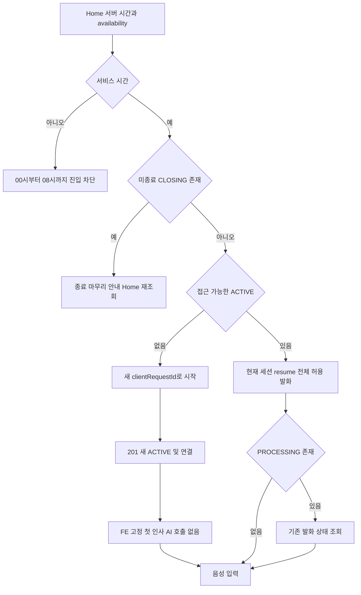
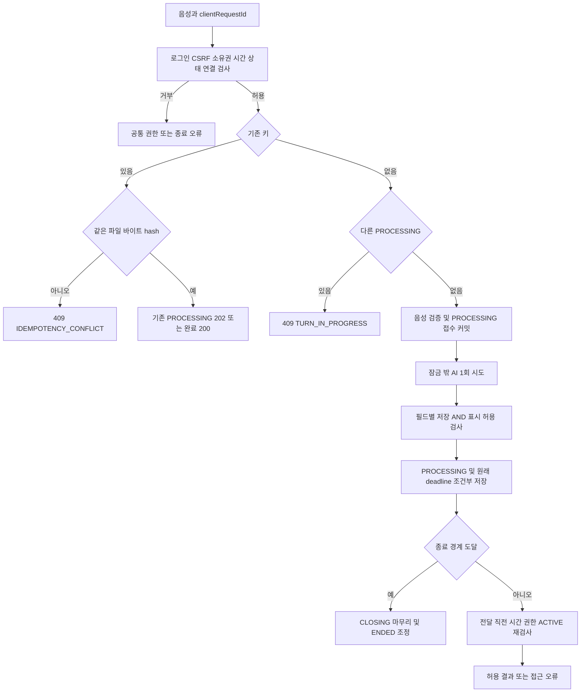
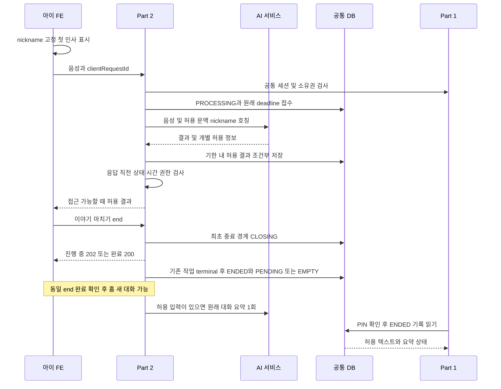
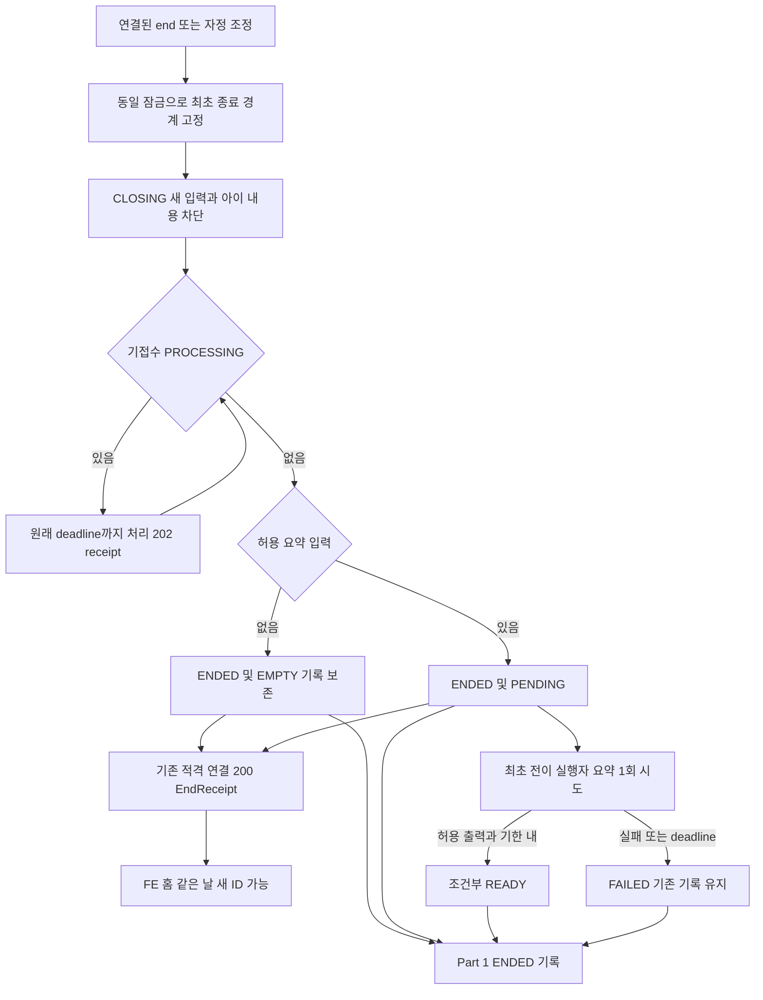

# DodamDodam P0 Part 2 — Home·음성 대화·종료·요약

계약 v3.1 · 문서 정리 2026-10-06 · 구현·실제 통합 시험은 별도

[공통 요구사항](P0_Common_Spec.md)과 [확정 정책](../Decision_Record.md)을 적용합니다. 이 문서는 작업 책임과 인수 기준을 관리하고 상세 계약은 아래 링크에서 한 번만 관리합니다.

## 담당 범위

Part 2는 아이 Home, 음성 대화의 수명, AI 연동, 허용 결과 저장, 임시 음성, 수동/자정 종료와 요약을 맡는다. STT·LLM·TTS 엔진·안전 판정은 AI 팀, 기록 목록/검색은 Part 1이다. backend 내부는 단일 애플리케이션·DB이며 공통 인증/아이 소유권 함수를 재사용한다. AI가 업무 DB를 직접 읽거나 쓰지 않는다.

| 작업 | 구현 책임 | 공유 산출물 |
| --- | --- | --- |
| B-01 아이 Home | 최소 프로필·nickname 인사·joinedAt·daysTogether·메뉴·서버 이용시간·접근 가능한 ACTIVE ID | ChildHome, availability |
| B-02 시작·이어하기·종료 | 아이당 미종료 1개·당일 ACTIVE 복원·수동/자정 CLOSING·ENDED·기존 연결 receipt | 상태 전이·시작 중복키·세션 연결·경계/복구 |
| B-03 음성·AI | multipart 음성만 접수, STT/생성/TTS 연결·필드별 허용·인증된 임시 음성 GET | 실제 AI 매핑·발화 결과·실패 코드 |
| B-04 저장·요약 | 발화 순서·성공/실패·허용 텍스트, 최초 ENDED 후 대화별 요약 최대 1회 | ConversationView/TurnView·NULL·검색 가능한 읽기 모델 |
| B-05 실패·복구 | 파일 바이트 해시·응답 유실 조회·원래 deadline·재시작 정리·late callback | 중복·경합·202/실패·기한 경계 사례 |

텍스트/버튼 선택 발화·추천 UI·추천 생성/저장·사진·실제 놀이·보상·꾸미기·감정 분석·알림·보호자 음성 다시 듣기는 제외한다. 기존 안전 결과를 우회하지 않는다. 초기 인사는 FE 고정 템플릿이며 BE의 새 발화·AI 호출·TTS·요약 입력·발화 수로 만들지 않는다.

## 상세 계약 찾아가기

| 업무 | 기준 위치 |
| --- | --- |
| B-01 Home·아이 문맥·고정 첫 인사 | [Home API](../api/06-conversations.md#section-7-2) |
| B-02 시작·resume·수동/자정 종료·receipt | [대화 API와 상태 규칙](../api/06-conversations.md) |
| B-03·B-05 음성·중복·응답 유실·기한·재시작 | [음성 API](../api/07-voice.md) |
| B-04 허용 결과·요약·읽기 모델 | [공유 응답](../api/01-common.md#section-5), [종료 규칙](../api/06-conversations.md#section-8-3), [ERD](../Integrated_ERD_Design.md) |
| Part 1·FE·AI 연계와 실제 AI 자료 | [공통 함수](../api/01-common.md#section-3-1), [AI·인수 기준](../api/08-errors-and-validation.md#section-11) |
| 입력·성공/실패·JSON 스키마 | [API 목차](../Integrated_API_Spec.md), [OpenAPI](../Integrated_OpenAPI.yaml) |
| DB·제약·데이터 이관 | [통합 ERD](../Integrated_ERD_Design.md) |
| 공통 보안·오류·제한 수치 | [공통 API](../api/01-common.md), [오류·검증](../api/08-errors-and-validation.md) |

## 인수 기준

- [ ] 07:59:59/08:00:00/23:59:59/00:00:00 경계, 탭 복귀·재로그인·당일 ACTIVE 전체 resume을 확인한다.
- [ ] 수동 종료와 새 발화 경합의 두 순서, end 202→200, 원래 deadline 유지, CLOSING 새 입력/연결/내용 차단을 확인한다.
- [ ] ENDED 후 같은 날 새 ID·새 키, 이전 요약 PENDING과 새 대화 분리, CLOSING 중 새 시작 거부를 확인한다.
- [ ] 빈 대화 EMPTY 기록·요약 미호출, 첫 인사 AI/TTS/저장/요약/발화 수 제외·nickname 사용을 확인한다.
- [ ] 두 탭·여러 서버 시작/종료 경합·처리 실패·재시작·late callback에 중복 행/AI 실행/요약 시도가 없는지 확인한다.
- [ ] 복수 기존 유효 연결만 CLOSING 확인 및 endedAt+600초 미만 receipt, 새 로그인·정확한 만료 equality·경계 재설정 거부를 확인한다.
- [ ] 동일 파일/동일 키·다른 파일·202 이후 FAILED·STT 무음·TTS 전체 실패·별도 음성 허용과 404/410을 확인한다.
- [ ] 응답 직전 수동 종료·자정·로그아웃·password reset으로 무효화돼도 허용 저장과 아이 결과 전달을 분리한다.
- [ ] 실제 FE 녹음→BE 디코딩→AI→브라우저 재생, D13·D14 형식/시간/용량/허용 계약과 D17 운영·보관을 별도 시험한다.

이 요구사항 정리는 제품 코드·DB migration 실행·실제 통합 시험 완료를 뜻하지 않는다. 남은 자료를 임의 0/무제한/가상 endpoint로 채우지 않는다.

## 담당 흐름

### Home·대화 시작

<!-- diagram: req-part2-home-start -->

### 음성 처리·응답 복구

<!-- diagram: req-part2-voice-flow -->

### 허용 텍스트·AI·기록 연결

<!-- diagram: req-part2-ai-record-contract -->

### 종료·요약

<!-- diagram: req-part2-end-summary -->

